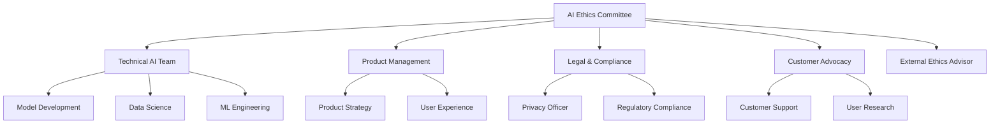

# AI Ethics Framework
## Financy Responsible AI Development & Deployment Standards

**Version**: 1.0  
**Last Updated**: 2025-10-19  
**Target Audience**: AI/ML engineers, product managers, ethical review board, and leadership  

---

## Overview

This document establishes the ethical framework for AI development and deployment within the Financy platform. Our commitment to responsible AI ensures that our AI systems are fair, transparent, accountable, and beneficial to users while respecting privacy and human autonomy in financial decision-making.

### AI Ethics Principles
1. **Fairness & Non-Discrimination**: AI systems must treat all users equitably regardless of demographics
2. **Transparency & Explainability**: Users should understand how AI affects their financial data
3. **Privacy & Data Protection**: Personal financial data must be protected and used responsibly
4. **Human Agency & Oversight**: Users maintain control over AI-assisted financial decisions
5. **Reliability & Safety**: AI systems must be robust and fail safely
6. **Accountability & Governance**: Clear responsibility for AI system outcomes

---

## Ethical AI Governance

### AI Ethics Committee Structure


### Governance Framework
```typescript
interface AIEthicsGovernance {
  committee_structure: CommitteeStructure;
  review_processes: ReviewProcess[];
  decision_framework: DecisionFramework;
  monitoring_system: MonitoringSystem;
  reporting_requirements: ReportingRequirements;
}

const AI_ETHICS_GOVERNANCE: AIEthicsGovernance = {
  committee_structure: {
    ai_ethics_committee: {
      composition: [
        { role: 'Chair', background: 'AI Ethics Expert', term: '2 years' },
        { role: 'Technical Lead', background: 'ML Engineering', term: '1 year' },
        { role: 'Product Representative', background: 'Product Management', term: '1 year' },
        { role: 'Legal Counsel', background: 'AI Law & Compliance', term: '2 years' },
        { role: 'Customer Advocate', background: 'User Research', term: '1 year' },
        { role: 'External Advisor', background: 'AI Ethics Academia', term: '2 years' }
      ],
      meeting_frequency: 'monthly',
      quorum_requirements: '50% + 1',
      decision_making: 'consensus_with_chair_tiebreaker'
    },
    technical_review_board: {
      composition: [
        'Senior ML Engineer',
        'Data Scientist',
        'Security Engineer',
        'QA Engineer'
      ],
      responsibilities: [
        'Technical feasibility assessment',
        'Bias detection and mitigation',
        'Model performance evaluation',
        'Security and privacy review'
      ]
    }
  },
  review_processes: [
    {
      process_name: 'ai_project_approval',
      trigger: 'new_ai_initiative',
      stages: [
        {
          stage: 'ethical_impact_assessment',
          reviewers: ['ethics_committee'],
          criteria: [
            'potential_harm_assessment',
            'fairness_considerations',
            'transparency_requirements',
            'user_consent_mechanisms'
          ],
          deliverables: ['ethics_impact_report'],
          timeline: '2 weeks'
        },
        {
          stage: 'technical_review',
          reviewers: ['technical_review_board'],
          criteria: [
            'data_quality_assessment',
            'model_architecture_review',
            'bias_testing_plan',
            'performance_benchmarks'
          ],
          deliverables: ['technical_feasibility_report'],
          timeline: '1 week'
        },
        {
          stage: 'legal_compliance_review',
          reviewers: ['legal_team'],
          criteria: [
            'regulatory_compliance',
            'privacy_law_adherence',
            'terms_of_service_alignment',
            'liability_considerations'
          ],
          deliverables: ['legal_compliance_report'],
          timeline: '1 week'
        },
        {
          stage: 'final_approval',
          reviewers: ['ethics_committee_chair', 'cto', 'cpo'],
          criteria: [
            'alignment_with_company_values',
            'risk_mitigation_adequacy',
            'resource_allocation_justification',
            'success_metrics_definition'
          ],
          deliverables: ['project_approval_decision'],
          timeline: '3 days'
        }
      ]
    },
    {
      process_name: 'model_deployment_review',
      trigger: 'pre_production_deployment',
      stages: [
        {
          stage: 'bias_audit',
          reviewers: ['bias_testing_team'],
          criteria: [
            'demographic_parity_testing',
            'equalized_odds_assessment',
            'individual_fairness_validation',
            'intersectional_bias_analysis'
          ],
          deliverables: ['bias_audit_report'],
          timeline: '1 week'
        },
        {
          stage: 'explainability_validation',
          reviewers: ['explainability_team'],
          criteria: [
            'model_interpretability_testing',
            'explanation_quality_assessment',
            'user_comprehension_validation',
            'explanation_consistency_check'
          ],
          deliverables: ['explainability_report'],
          timeline: '1 week'
        },
        {
          stage: 'safety_assessment',
          reviewers: ['safety_team'],
          criteria: [
            'adversarial_robustness_testing',
            'failure_mode_analysis',
            'graceful_degradation_validation',
            'monitoring_system_readiness'
          ],
          deliverables: ['safety_assessment_report'],
          timeline: '1 week'
        }
      ]
    }
  ],
  decision_framework: {
    ethical_decision_matrix: {
      factors: [
        {
          factor: 'user_benefit',
          weight: 0.3,
          criteria: [
            'improved_financial_outcomes',
            'time_saving',
            'reduced_cognitive_load',
            'enhanced_insights'
          ]
        },
        {
          factor: 'potential_harm',
          weight: 0.25,
          criteria: [
            'financial_decision_bias',
            'privacy_risks',
            'discrimination_potential',
            'over_reliance_risk'
          ]
        },
        {
          factor: 'fairness',
          weight: 0.2,
          criteria: [
            'demographic_parity',
            'equal_opportunity',
            'treatment_equality',
            'outcome_equity'
          ]
        },
        {
          factor: 'transparency',
          weight: 0.15,
          criteria: [
            'explainability_level',
            'user_understanding',
            'decision_auditability',
            'process_visibility'
          ]
        },
        {
          factor: 'technical_feasibility',
          weight: 0.1,
          criteria: [
            'implementation_complexity',
            'resource_requirements',
            'maintenance_burden',
            'scalability_considerations'
          ]
        }
      ],
      scoring_system: 'five_point_scale',
      approval_threshold: 3.5,
      veto_conditions: [
        'potential_harm_score < 2',
        'fairness_score < 3',
        'legal_compliance_failed'
      ]
    }
  },
  monitoring_system: {
    continuous_monitoring: {
      bias_monitoring: {
        frequency: 'daily',
        metrics: [
          'demographic_parity_difference',
          'equalized_odds_difference',
          'calibration_by_group'
        ],
        alert_thresholds: {
          warning: 0.05,
          critical: 0.1
        }
      },
      performance_monitoring: {
        frequency: 'real_time',
        metrics: [
          'model_accuracy',
          'prediction_confidence',
          'feature_drift',
          'concept_drift'
        ],
        alert_thresholds: {
          accuracy_degradation: 0.02,
          confidence_drop: 0.1,
          drift_detection: 0.05
        }
      },
      user_feedback_monitoring: {
        frequency: 'weekly',
        metrics: [
          'user_satisfaction_with_ai',
          'explanation_helpfulness',
          'trust_indicators',
          'feature_adoption_by_demographics'
        ],
        analysis: 'trend_analysis_with_demographic_breakdown'
      }
    },
    periodic_audits: {
      comprehensive_bias_audit: {
        frequency: 'quarterly',
        scope: 'all_ai_models',
        methodology: 'third_party_audit',
        reporting: 'public_transparency_report'
      },
      fairness_assessment: {
        frequency: 'semi_annually',
        scope: 'user_outcome_analysis',
        methodology: 'longitudinal_study',
        reporting: 'internal_ethics_committee'
      }
    }
  },
  reporting_requirements: {
    internal_reporting: {
      ethics_committee_reports: {
        frequency: 'monthly',
        recipients: ['ceo', 'cto', 'cpo', 'legal_team'],
        content: [
          'ethics_review_summary',
          'bias_monitoring_results',
          'user_feedback_analysis',
          'policy_recommendations'
        ]
      },
      technical_performance_reports: {
        frequency: 'weekly',
        recipients: ['engineering_team', 'product_team'],
        content: [
          'model_performance_metrics',
          'bias_detection_results',
          'system_reliability_indicators',
          'improvement_recommendations'
        ]
      }
    },
    external_reporting: {
      transparency_reports: {
        frequency: 'annually',
        audience: 'public',
        content: [
          'ai_systems_overview',
          'fairness_assessment_results',
          'bias_mitigation_efforts',
          'user_control_mechanisms',
          'continuous_improvement_initiatives'
        ]
      },
      regulatory_reports: {
        frequency: 'as_required',
        audience: 'financial_regulators',
        content: [
          'ai_decision_making_processes',
          'risk_management_procedures',
          'consumer_protection_measures',
          'audit_results'
        ]
      }
    }
  }
};
```

---

## Fairness & Bias Mitigation

### Bias Detection Framework
```typescript
interface BiasMitigationFramework {
  bias_types: BiasType[];
  detection_methods: DetectionMethod[];
  mitigation_strategies: MitigationStrategy[];
  evaluation_metrics: EvaluationMetric[];
}

const BIAS_MITIGATION: BiasMitigationFramework = {
  bias_types: [
    {
      type: 'historical_bias',
      description: 'Bias present in historical financial data',
      examples: [
        'Historical gender discrimination in credit decisions',
        'Racial bias in loan approval patterns',
        'Age-based insurance premium disparities'
      ],
      detection_approach: 'historical_data_analysis',
      mitigation_priority: 'high'
    },
    {
      type: 'representation_bias',
      description: 'Underrepresentation of certain groups in training data',
      examples: [
        'Limited data from rural areas',
        'Underrepresentation of certain age groups',
        'Insufficient data from specific income brackets'
      ],
      detection_approach: 'data_distribution_analysis',
      mitigation_priority: 'high'
    },
    {
      type: 'measurement_bias',
      description: 'Bias in how data is collected or labeled',
      examples: [
        'Inconsistent transaction categorization',
        'Biased manual labeling of expenses',
        'Platform-specific behavior patterns'
      ],
      detection_approach: 'data_quality_assessment',
      mitigation_priority: 'medium'
    },
    {
      type: 'aggregation_bias',
      description: 'Bias from assuming one model fits all subgroups',
      examples: [
        'Single model for different cultural spending patterns',
        'Universal categorization across age groups',
        'One-size-fits-all budgeting recommendations'
      ],
      detection_approach: 'subgroup_performance_analysis',
      mitigation_priority: 'medium'
    },
    {
      type: 'algorithmic_bias',
      description: 'Bias introduced by the algorithm itself',
      examples: [
        'Feature selection bias',
        'Optimization bias toward majority groups',
        'Regularization effects on minority groups'
      ],
      detection_approach: 'algorithmic_audit',
      mitigation_priority: 'high'
    }
  ],
  detection_methods: [
    {
      method: 'demographic_parity_testing',
      description: 'Compare AI outcomes across demographic groups',
      implementation: {
        metrics: ['selection_rate', 'approval_rate', 'recommendation_rate'],
        groups: ['gender', 'age_bracket', 'income_level', 'geographic_region'],
        frequency: 'daily',
        threshold: 0.05 // 5% maximum difference
      },
      automated: true,
      alerting: 'real_time'
    },
    {
      method: 'equalized_odds_assessment',
      description: 'Ensure equal true positive and false positive rates',
      implementation: {
        metrics: ['true_positive_rate', 'false_positive_rate'],
        stratification: 'by_protected_attributes',
        evaluation: 'confusion_matrix_analysis',
        threshold: 0.1 // 10% maximum difference
      },
      automated: true,
      alerting: 'daily'
    },
    {
      method: 'individual_fairness_validation',
      description: 'Similar individuals receive similar treatment',
      implementation: {
        similarity_metrics: ['financial_profile_similarity', 'behavior_similarity'],
        outcome_metrics: ['recommendation_similarity', 'service_quality'],
        analysis: 'nearest_neighbor_comparison',
        sample_size: 1000
      },
      automated: false,
      frequency: 'weekly'
    },
    {
      method: 'intersectional_bias_analysis',
      description: 'Detect bias affecting multiple protected attributes',
      implementation: {
        group_combinations: [
          ['gender', 'age'],
          ['income', 'region'],
          ['gender', 'income'],
          ['age', 'region']
        ],
        analysis_depth: 'two_way_interactions',
        statistical_tests: ['chi_square', 'anova'],
        correction: 'bonferroni'
      },
      automated: false,
      frequency: 'monthly'
    }
  ],
  mitigation_strategies: [
    {
      strategy: 'data_preprocessing',
      techniques: [
        {
          name: 'resampling',
          description: 'Balance representation across groups',
          methods: ['oversampling', 'undersampling', 'smote'],
          effectiveness: 'high_for_representation_bias',
          implementation_complexity: 'low'
        },
        {
          name: 'data_augmentation',
          description: 'Synthetically increase underrepresented groups',
          methods: ['gans', 'variational_autoencoders', 'rule_based_generation'],
          effectiveness: 'medium_for_representation_bias',
          implementation_complexity: 'high'
        },
        {
          name: 'feature_selection',
          description: 'Remove or transform biased features',
          methods: ['correlation_analysis', 'mutual_information', 'fairness_aware_selection'],
          effectiveness: 'medium_for_various_bias_types',
          implementation_complexity: 'medium'
        }
      ]
    },
    {
      strategy: 'algorithmic_modifications',
      techniques: [
        {
          name: 'fairness_constraints',
          description: 'Add fairness constraints to optimization',
          methods: ['demographic_parity_constraint', 'equalized_odds_constraint'],
          effectiveness: 'high_for_algorithmic_bias',
          implementation_complexity: 'medium'
        },
        {
          name: 'adversarial_debiasing',
          description: 'Use adversarial networks to remove bias',
          methods: ['adversarial_training', 'domain_adaptation'],
          effectiveness: 'high_for_representation_bias',
          implementation_complexity: 'high'
        },
        {
          name: 'multi_task_learning',
          description: 'Learn fairness and accuracy simultaneously',
          methods: ['joint_optimization', 'pareto_optimization'],
          effectiveness: 'medium_for_various_bias_types',
          implementation_complexity: 'high'
        }
      ]
    },
    {
      strategy: 'post_processing',
      techniques: [
        {
          name: 'threshold_optimization',
          description: 'Adjust decision thresholds per group',
          methods: ['group_specific_thresholds', 'calibration_adjustment'],
          effectiveness: 'medium_for_outcome_bias',
          implementation_complexity: 'low'
        },
        {
          name: 'outcome_redistribution',
          description: 'Adjust final outcomes to ensure fairness',
          methods: ['quota_based_adjustment', 'ranking_adjustment'],
          effectiveness: 'high_for_outcome_bias',
          implementation_complexity: 'medium'
        }
      ]
    }
  ],
  evaluation_metrics: [
    {
      metric: 'demographic_parity',
      formula: 'P(Y_hat = 1 | A = 0) = P(Y_hat = 1 | A = 1)',
      interpretation: 'Equal positive prediction rates across groups',
      target_value: 1.0,
      acceptable_range: [0.95, 1.05],
      monitoring_frequency: 'daily'
    },
    {
      metric: 'equalized_odds',
      formula: 'P(Y_hat = 1 | Y = y, A = 0) = P(Y_hat = 1 | Y = y, A = 1) for y ∈ {0, 1}',
      interpretation: 'Equal true positive and false positive rates',
      target_value: 1.0,
      acceptable_range: [0.9, 1.1],
      monitoring_frequency: 'daily'
    },
    {
      metric: 'individual_fairness',
      formula: 'd(f(x1), f(x2)) ≤ L × d(x1, x2)',
      interpretation: 'Similar individuals get similar outcomes',
      target_value: 'lipschitz_constant < 1.0',
      acceptable_range: 'context_dependent',
      monitoring_frequency: 'weekly'
    },
    {
      metric: 'counterfactual_fairness',
      formula: 'P(Y_hat_A=a | X=x, A=a) = P(Y_hat_A=a\' | X=x, A=a) for a ≠ a\'',
      interpretation: 'Predictions unchanged in counterfactual world',
      target_value: 1.0,
      acceptable_range: [0.95, 1.05],
      monitoring_frequency: 'monthly'
    }
  ]
};
```

### Bias Testing Implementation
```typescript
class BiasTesting {
  private dataAnalyzer: DataAnalyzer;
  private statisticalTester: StatisticalTester;
  private reportGenerator: ReportGenerator;
  
  constructor() {
    this.dataAnalyzer = new DataAnalyzer();
    this.statisticalTester = new StatisticalTester();
    this.reportGenerator = new ReportGenerator();
  }
  
  async runComprehensiveBiasAudit(
    model: MLModel,
    testData: Dataset,
    protectedAttributes: string[]
  ): Promise<BiasAuditReport> {
    
    const auditResults: BiasAuditResult[] = [];
    
    // 1. Demographic Parity Testing
    const demographicParityResults = await this.testDemographicParity(
      model, testData, protectedAttributes
    );
    auditResults.push(demographicParityResults);
    
    // 2. Equalized Odds Testing
    const equalizedOddsResults = await this.testEqualizedOdds(
      model, testData, protectedAttributes
    );
    auditResults.push(equalizedOddsResults);
    
    // 3. Individual Fairness Testing
    const individualFairnessResults = await this.testIndividualFairness(
      model, testData
    );
    auditResults.push(individualFairnessResults);
    
    // 4. Intersectional Bias Testing
    const intersectionalResults = await this.testIntersectionalBias(
      model, testData, protectedAttributes
    );
    auditResults.push(intersectionalResults);
    
    // 5. Generate Comprehensive Report
    const report = await this.reportGenerator.generateBiasReport(auditResults);
    
    // 6. Generate Recommendations
    const recommendations = await this.generateMitigationRecommendations(auditResults);
    
    return {
      audit_id: generateUUID(),
      timestamp: new Date(),
      model_version: model.version,
      test_data_size: testData.size,
      protected_attributes: protectedAttributes,
      results: auditResults,
      overall_bias_score: this.calculateOverallBiasScore(auditResults),
      recommendations,
      report
    };
  }
  
  private async testDemographicParity(
    model: MLModel,
    testData: Dataset,
    protectedAttributes: string[]
  ): Promise<BiasAuditResult> {
    
    const results: GroupComparisonResult[] = [];
    
    for (const attribute of protectedAttributes) {
      const groups = testData.getUniqueValues(attribute);
      const baselineGroup = groups[0]; // Typically majority group
      
      for (const group of groups.slice(1)) {
        const baselineRate = await this.calculatePositivePredictionRate(
          model, testData.filterBy(attribute, baselineGroup)
        );
        
        const groupRate = await this.calculatePositivePredictionRate(
          model, testData.filterBy(attribute, group)
        );
        
        const parityRatio = groupRate / baselineRate;
        const parityDifference = Math.abs(groupRate - baselineRate);
        
        const statisticalSignificance = await this.statisticalTester.testSignificance(
          baselineRate, groupRate, testData.filterBy(attribute, baselineGroup).size,
          testData.filterBy(attribute, group).size
        );
        
        results.push({
          protected_attribute: attribute,
          baseline_group: baselineGroup,
          comparison_group: group,
          baseline_rate: baselineRate,
          group_rate: groupRate,
          parity_ratio: parityRatio,
          parity_difference: parityDifference,
          statistical_significance: statisticalSignificance,
          passes_threshold: parityDifference <= 0.05, // 5% threshold
          severity: this.categorizeViolationSeverity(parityDifference)
        });
      }
    }
    
    return {
      test_name: 'demographic_parity',
      test_description: 'Equal positive prediction rates across protected groups',
      results,
      overall_pass: results.every(r => r.passes_threshold),
      max_violation: Math.max(...results.map(r => r.parity_difference)),
      recommendations: this.generateDemographicParityRecommendations(results)
    };
  }
  
  private async testEqualizedOdds(
    model: MLModel,
    testData: Dataset,
    protectedAttributes: string[]
  ): Promise<BiasAuditResult> {
    
    const results: EqualizedOddsResult[] = [];
    
    for (const attribute of protectedAttributes) {
      const groups = testData.getUniqueValues(attribute);
      const baselineGroup = groups[0];
      
      for (const group of groups.slice(1)) {
        // Calculate TPR and FPR for each group
        const baselineTPR = await this.calculateTruePositiveRate(
          model, testData.filterBy(attribute, baselineGroup)
        );
        const baselineFPR = await this.calculateFalsePositiveRate(
          model, testData.filterBy(attribute, baselineGroup)
        );
        
        const groupTPR = await this.calculateTruePositiveRate(
          model, testData.filterBy(attribute, group)
        );
        const groupFPR = await this.calculateFalsePositiveRate(
          model, testData.filterBy(attribute, group)
        );
        
        const tprDifference = Math.abs(groupTPR - baselineTPR);
        const fprDifference = Math.abs(groupFPR - baselineFPR);
        
        results.push({
          protected_attribute: attribute,
          baseline_group: baselineGroup,
          comparison_group: group,
          baseline_tpr: baselineTPR,
          group_tpr: groupTPR,
          tpr_difference: tprDifference,
          baseline_fpr: baselineFPR,
          group_fpr: groupFPR,
          fpr_difference: fprDifference,
          passes_threshold: tprDifference <= 0.1 && fprDifference <= 0.1, // 10% threshold
          severity: Math.max(
            this.categorizeViolationSeverity(tprDifference),
            this.categorizeViolationSeverity(fprDifference)
          )
        });
      }
    }
    
    return {
      test_name: 'equalized_odds',
      test_description: 'Equal true positive and false positive rates across groups',
      results,
      overall_pass: results.every(r => r.passes_threshold),
      max_tpr_violation: Math.max(...results.map(r => r.tpr_difference)),
      max_fpr_violation: Math.max(...results.map(r => r.fpr_difference)),
      recommendations: this.generateEqualizedOddsRecommendations(results)
    };
  }
  
  private async testIndividualFairness(
    model: MLModel,
    testData: Dataset
  ): Promise<BiasAuditResult> {
    
    const sampleSize = Math.min(1000, testData.size);
    const randomSample = testData.randomSample(sampleSize);
    const lipschitzViolations: IndividualFairnessViolation[] = [];
    
    for (let i = 0; i < randomSample.size; i++) {
      const individual1 = randomSample.getRow(i);
      
      // Find similar individuals
      const similarIndividuals = randomSample.findSimilar(individual1, {
        similarityThreshold: 0.9,
        maxResults: 10
      });
      
      const prediction1 = await model.predict(individual1);
      
      for (const individual2 of similarIndividuals) {
        const prediction2 = await model.predict(individual2);
        const inputSimilarity = this.calculateSimilarity(individual1, individual2);
        const outputSimilarity = this.calculateSimilarity(prediction1, prediction2);
        
        // Check Lipschitz condition
        const lipschitzConstant = outputSimilarity / inputSimilarity;
        
        if (lipschitzConstant > 1.0) { // Violation threshold
          lipschitzViolations.push({
            individual1_id: individual1.id,
            individual2_id: individual2.id,
            input_similarity: inputSimilarity,
            output_similarity: outputSimilarity,
            lipschitz_constant: lipschitzConstant,
            severity: this.categorizeViolationSeverity(lipschitzConstant - 1.0)
          });
        }
      }
    }
    
    const violationRate = lipschitzViolations.length / (sampleSize * 10); // Approximate
    
    return {
      test_name: 'individual_fairness',
      test_description: 'Similar individuals receive similar treatment',
      sample_size: sampleSize,
      violations: lipschitzViolations,
      violation_rate: violationRate,
      passes_threshold: violationRate <= 0.05, // 5% violation rate threshold
      average_lipschitz_constant: lipschitzViolations.reduce(
        (sum, v) => sum + v.lipschitz_constant, 0
      ) / lipschitzViolations.length,
      recommendations: this.generateIndividualFairnessRecommendations(lipschitzViolations)
    };
  }
  
  private categorizeViolationSeverity(violationMagnitude: number): 'low' | 'medium' | 'high' | 'critical' {
    if (violationMagnitude <= 0.02) return 'low';
    if (violationMagnitude <= 0.05) return 'medium';
    if (violationMagnitude <= 0.1) return 'high';
    return 'critical';
  }
}
```

---

## Transparency & Explainability

### AI Explainability Framework
```typescript
interface ExplainabilityFramework {
  explanation_types: ExplanationType[];
  model_interpretability: ModelInterpretability;
  user_interfaces: UserInterface[];
  explanation_validation: ExplanationValidation;
}

const EXPLAINABILITY_FRAMEWORK: ExplainabilityFramework = {
  explanation_types: [
    {
      type: 'global_explanations',
      description: 'Overall model behavior and decision patterns',
      techniques: [
        'feature_importance_analysis',
        'model_behavior_visualization',
        'decision_boundary_analysis',
        'representative_examples'
      ],
      target_audience: ['data_scientists', 'product_managers', 'auditors'],
      update_frequency: 'monthly',
      delivery_method: 'technical_reports'
    },
    {
      type: 'local_explanations',
      description: 'Specific decision explanations for individual cases',
      techniques: [
        'lime_explanations',
        'shap_values',
        'counterfactual_examples',
        'feature_attribution'
      ],
      target_audience: ['end_users', 'customer_support'],
      update_frequency: 'real_time',
      delivery_method: 'in_app_interfaces'
    },
    {
      type: 'contrastive_explanations',
      description: 'Why one outcome instead of another',
      techniques: [
        'counterfactual_generation',
        'minimal_sufficient_explanations',
        'anchoring_explanations',
        'what_if_analysis'
      ],
      target_audience: ['end_users', 'customer_support'],
      update_frequency: 'on_demand',
      delivery_method: 'interactive_interfaces'
    },
    {
      type: 'example_based_explanations',
      description: 'Similar cases and their outcomes',
      techniques: [
        'nearest_neighbor_examples',
        'prototypical_examples',
        'influential_instance_identification',
        'case_based_reasoning'
      ],
      target_audience: ['end_users'],
      update_frequency: 'real_time',
      delivery_method: 'contextual_help'
    }
  ],
  model_interpretability: {
    inherently_interpretable_models: {
      linear_models: {
        interpretability_level: 'high',
        explanation_method: 'coefficient_analysis',
        use_cases: ['simple_categorization', 'baseline_models'],
        limitations: ['non_linear_relationships', 'feature_interactions']
      },
      decision_trees: {
        interpretability_level: 'high',
        explanation_method: 'path_analysis',
        use_cases: ['rule_based_categorization', 'simple_decisions'],
        limitations: ['overfitting', 'instability']
      },
      rule_based_systems: {
        interpretability_level: 'very_high',
        explanation_method: 'rule_tracing',
        use_cases: ['policy_enforcement', 'compliance_checks'],
        limitations: ['complexity_scaling', 'maintenance_burden']
      }
    },
    post_hoc_explanations: {
      model_agnostic_methods: {
        lime: {
          applicability: 'tabular_text_image_data',
          explanation_type: 'local_feature_importance',
          computational_cost: 'medium',
          reliability: 'medium'
        },
        shap: {
          applicability: 'any_ml_model',
          explanation_type: 'unified_feature_attribution',
          computational_cost: 'high',
          reliability: 'high'
        },
        permutation_importance: {
          applicability: 'any_ml_model',
          explanation_type: 'global_feature_importance',
          computational_cost: 'low',
          reliability: 'medium'
        }
      },
      model_specific_methods: {
        neural_network_methods: [
          'gradient_based_attribution',
          'layer_wise_relevance_propagation',
          'attention_visualization',
          'concept_activation_vectors'
        ],
        tree_based_methods: [
          'tree_shap',
          'feature_importance',
          'path_analysis',
          'leaf_statistics'
        ]
      }
    }
  },
  user_interfaces: [
    {
      interface_type: 'transaction_categorization_explanation',
      target_users: ['end_users'],
      explanation_components: [
        {
          component: 'confidence_indicator',
          description: 'Visual indicator of AI confidence level',
          design: 'progress_bar_with_color_coding',
          thresholds: {
            high_confidence: 0.8,
            medium_confidence: 0.6,
            low_confidence: 0.4
          }
        },
        {
          component: 'key_factors',
          description: 'Top factors influencing categorization',
          design: 'ranked_list_with_importance_scores',
          max_factors: 5,
          factor_types: ['merchant_name', 'amount_range', 'description_keywords', 'timing_patterns']
        },
        {
          component: 'similar_transactions',
          description: 'Examples of similar categorized transactions',
          design: 'card_layout_with_highlighting',
          max_examples: 3,
          similarity_threshold: 0.8
        },
        {
          component: 'what_if_scenarios',
          description: 'How changes would affect categorization',
          design: 'interactive_sliders_and_dropdowns',
          modifiable_fields: ['amount', 'merchant_type', 'description']
        }
      ],
      accessibility: {
        screen_reader_support: true,
        high_contrast_mode: true,
        simplified_language_option: true,
        multi_language_support: ['english', 'portuguese', 'spanish']
      }
    },
    {
      interface_type: 'spending_insights_explanation',
      target_users: ['end_users'],
      explanation_components: [
        {
          component: 'insight_reasoning',
          description: 'Why this insight was generated',
          design: 'expandable_text_with_data_visualization',
          reasoning_depth: 'three_levels'
        },
        {
          component: 'data_sources',
          description: 'What data was used for the insight',
          design: 'timeline_with_data_points',
          privacy_controls: 'data_minimization_explanation'
        },
        {
          component: 'confidence_and_limitations',
          description: 'Reliability and limitations of the insight',
          design: 'warning_indicators_with_explanations',
          uncertainty_quantification: true
        }
      ]
    }
  ],
  explanation_validation: {
    user_comprehension_testing: {
      methodology: 'ab_testing_with_comprehension_surveys',
      metrics: [
        'explanation_helpfulness_rating',
        'user_confidence_in_understanding',
        'decision_satisfaction',
        'trust_indicators'
      ],
      frequency: 'quarterly',
      sample_size: 500
    },
    explanation_consistency: {
      methodology: 'automated_consistency_checking',
      checks: [
        'similar_input_similar_explanation',
        'temporal_stability',
        'model_update_explanation_drift',
        'cross_feature_consistency'
      ],
      frequency: 'daily',
      alert_thresholds: {
        consistency_drop: 0.1,
        explanation_drift: 0.15
      }
    },
    explanation_accuracy: {
      methodology: 'ground_truth_comparison',
      validation_approaches: [
        'expert_annotation_comparison',
        'synthetic_data_validation',
        'adversarial_explanation_testing',
        'human_ai_agreement_analysis'
      ],
      frequency: 'monthly',
      accuracy_threshold: 0.85
    }
  }
};
```

This comprehensive AI ethics framework establishes clear guidelines for responsible AI development and deployment, ensuring fairness, transparency, and accountability in all AI systems within the Financy platform.