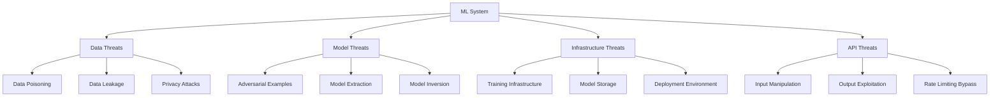

# Model Security Framework
## Financy AI/ML Security & Adversarial Protection Standards

**Version**: 1.0  
**Last Updated**: 2025-10-19  
**Target Audience**: AI/ML engineers, security engineers, and DevSecOps teams  

---

## Overview

This document establishes comprehensive security measures for AI/ML models within the Financy platform. Our model security framework protects against adversarial attacks, ensures model integrity, prevents data poisoning, and maintains the confidentiality of sensitive financial data used in AI processing.

### Model Security Objectives
1. **Adversarial Robustness**: Protect models from malicious input manipulation
2. **Model Integrity**: Ensure models haven't been tampered with or corrupted
3. **Data Privacy**: Protect sensitive financial data in AI pipelines
4. **Model Confidentiality**: Prevent model extraction and intellectual property theft
5. **Supply Chain Security**: Secure the entire ML pipeline from data to deployment

---

## Threat Model & Attack Vectors

### AI/ML Threat Landscape


### Comprehensive Threat Assessment
```typescript
interface MLThreatModel {
  threat_categories: ThreatCategory[];
  attack_vectors: AttackVector[];
  threat_actors: ThreatActor[];
  risk_assessment: RiskAssessment;
}

const ML_THREAT_MODEL: MLThreatModel = {
  threat_categories: [
    {
      category: 'adversarial_attacks',
      description: 'Malicious inputs designed to fool AI models',
      subcategories: [
        {
          name: 'evasion_attacks',
          description: 'Modify inputs to cause misclassification',
          examples: [
            'Adversarial transaction descriptions',
            'Manipulated receipt images',
            'Crafted voice recordings',
            'Modified financial amounts'
          ],
          impact: 'incorrect_categorization_or_fraud_detection',
          likelihood: 'medium',
          severity: 'high'
        },
        {
          name: 'poisoning_attacks',
          description: 'Corrupt training data to degrade model performance',
          examples: [
            'Injecting mislabeled transactions',
            'Biased training examples',
            'Backdoor triggers in data',
            'Label flipping attacks'
          ],
          impact: 'systematic_model_degradation',
          likelihood: 'low',
          severity: 'critical'
        },
        {
          name: 'model_extraction',
          description: 'Steal model parameters or functionality',
          examples: [
            'Query-based model copying',
            'Parameter extraction through APIs',
            'Gradient-based attacks',
            'Membership inference'
          ],
          impact: 'intellectual_property_theft',
          likelihood: 'medium',
          severity: 'high'
        }
      ]
    },
    {
      category: 'privacy_attacks',
      description: 'Extract sensitive information from AI models',
      subcategories: [
        {
          name: 'membership_inference',
          description: 'Determine if specific data was used in training',
          examples: [
            'Identify if user transactions were in training set',
            'Infer financial behavior patterns',
            'Detect sensitive account information'
          ],
          impact: 'privacy_violation_gdpr_compliance_issues',
          likelihood: 'medium',
          severity: 'high'
        },
        {
          name: 'property_inference',
          description: 'Infer properties of training data',
          examples: [
            'Average income levels of users',
            'Spending pattern distributions',
            'Financial demographic information'
          ],
          impact: 'aggregate_privacy_violation',
          likelihood: 'medium',
          severity: 'medium'
        },
        {
          name: 'model_inversion',
          description: 'Reconstruct training data from model',
          examples: [
            'Reconstruct transaction details',
            'Generate synthetic user profiles',
            'Extract financial patterns'
          ],
          impact: 'severe_privacy_violation',
          likelihood: 'low',
          severity: 'critical'
        }
      ]
    },
    {
      category: 'infrastructure_attacks',
      description: 'Compromise AI/ML infrastructure components',
      subcategories: [
        {
          name: 'supply_chain_attacks',
          description: 'Compromise ML libraries, frameworks, or dependencies',
          examples: [
            'Malicious packages in requirements',
            'Compromised pre-trained models',
            'Backdoored ML frameworks',
            'Tainted datasets'
          ],
          impact: 'system_wide_compromise',
          likelihood: 'medium',
          severity: 'critical'
        },
        {
          name: 'model_serving_attacks',
          description: 'Attack model deployment infrastructure',
          examples: [
            'Container escape in ML serving',
            'API gateway compromise',
            'Model storage tampering',
            'Inference pipeline manipulation'
          ],
          impact: 'service_disruption_data_breach',
          likelihood: 'medium',
          severity: 'high'
        }
      ]
    }
  ],
  attack_vectors: [
    {
      vector: 'malicious_transaction_input',
      description: 'Crafted transaction data to fool categorization',
      attack_phases: [
        'reconnaissance_of_model_behavior',
        'adversarial_example_generation',
        'input_injection_through_api',
        'verification_of_misclassification'
      ],
      detection_difficulty: 'medium',
      automation_potential: 'high',
      required_knowledge: 'model_architecture_understanding'
    },
    {
      vector: 'receipt_image_manipulation',
      description: 'Modified receipt images to bypass OCR and categorization',
      attack_phases: [
        'legitimate_receipt_collection',
        'subtle_image_modification',
        'ocr_evasion_testing',
        'malicious_upload_execution'
      ],
      detection_difficulty: 'high',
      automation_potential: 'medium',
      required_knowledge: 'computer_vision_and_image_processing'
    },
    {
      vector: 'voice_spoofing_attack',
      description: 'Synthetic or manipulated voice for transaction entry',
      attack_phases: [
        'voice_sample_collection',
        'deepfake_generation',
        'whisper_api_bypass',
        'fraudulent_transaction_creation'
      ],
      detection_difficulty: 'high',
      automation_potential: 'medium',
      required_knowledge: 'audio_processing_and_synthesis'
    },
    {
      vector: 'api_abuse_for_model_extraction',
      description: 'Systematic API queries to extract model behavior',
      attack_phases: [
        'api_endpoint_enumeration',
        'query_pattern_design',
        'response_analysis_automation',
        'model_reconstruction'
      ],
      detection_difficulty: 'medium',
      automation_potential: 'high',
      required_knowledge: 'api_security_and_ml_fundamentals'
    }
  ],
  threat_actors: [
    {
      actor: 'financial_fraudsters',
      motivation: 'financial_gain_through_system_manipulation',
      capabilities: ['moderate_technical_skills', 'financial_domain_knowledge'],
      resources: 'medium',
      typical_attacks: ['adversarial_examples', 'api_abuse', 'social_engineering']
    },
    {
      actor: 'competitors',
      motivation: 'intellectual_property_theft',
      capabilities: ['high_technical_skills', 'significant_resources'],
      resources: 'high',
      typical_attacks: ['model_extraction', 'reverse_engineering', 'supply_chain_attacks']
    },
    {
      actor: 'privacy_attackers',
      motivation: 'data_harvesting_for_resale',
      capabilities: ['advanced_ml_knowledge', 'privacy_attack_expertise'],
      resources: 'medium_to_high',
      typical_attacks: ['membership_inference', 'property_inference', 'model_inversion']
    },
    {
      actor: 'malicious_insiders',
      motivation: 'revenge_financial_gain_espionage',
      capabilities: ['insider_access', 'system_knowledge'],
      resources: 'varies',
      typical_attacks: ['data_poisoning', 'model_tampering', 'infrastructure_compromise']
    }
  ],
  risk_assessment: {
    high_risk_scenarios: [
      {
        scenario: 'large_scale_adversarial_transaction_injection',
        impact: 'widespread_categorization_errors_financial_losses',
        probability: 'medium',
        risk_score: 8.5,
        mitigation_priority: 'immediate'
      },
      {
        scenario: 'training_data_poisoning_via_user_feedback',
        impact: 'gradual_model_degradation_biased_decisions',
        probability: 'medium',
        risk_score: 8.0,
        mitigation_priority: 'high'
      },
      {
        scenario: 'voice_deepfake_transaction_fraud',
        impact: 'unauthorized_transactions_user_account_compromise',
        probability: 'low_but_increasing',
        risk_score: 7.5,
        mitigation_priority: 'high'
      }
    ],
    medium_risk_scenarios: [
      {
        scenario: 'membership_inference_privacy_violation',
        impact: 'gdpr_violations_user_privacy_compromise',
        probability: 'medium',
        risk_score: 6.5,
        mitigation_priority: 'medium'
      },
      {
        scenario: 'model_extraction_intellectual_property_theft',
        impact: 'competitive_disadvantage_revenue_loss',
        probability: 'medium',
        risk_score: 6.0,
        mitigation_priority: 'medium'
      }
    ]
  }
};
```

---

## Adversarial Defense Mechanisms

### Adversarial Robustness Framework
```typescript
interface AdversarialDefenseFramework {
  defense_strategies: DefenseStrategy[];
  detection_systems: DetectionSystem[];
  response_mechanisms: ResponseMechanism[];
  evaluation_metrics: RobustnessMetric[];
}

const ADVERSARIAL_DEFENSE: AdversarialDefenseFramework = {
  defense_strategies: [
    {
      strategy: 'adversarial_training',
      description: 'Train models with adversarial examples to improve robustness',
      implementation: {
        adversarial_generation_methods: [
          'fast_gradient_sign_method',
          'projected_gradient_descent',
          'carlini_wagner_attack',
          'deep_fool'
        ],
        training_protocol: {
          adversarial_ratio: 0.3, // 30% adversarial examples in training
          epsilon_schedule: 'progressive_increase',
          attack_budget: 'l_infinity_norm_bounded',
          clean_accuracy_threshold: 0.85
        },
        model_types: ['transaction_categorization', 'fraud_detection', 'ocr_models'],
        retraining_frequency: 'monthly'
      },
      effectiveness: 'high_for_known_attacks',
      computational_overhead: 'high',
      maintenance_burden: 'medium'
    },
    {
      strategy: 'input_preprocessing',
      description: 'Preprocess inputs to remove adversarial perturbations',
      implementation: {
        techniques: [
          {
            name: 'input_quantization',
            description: 'Reduce input precision to remove small perturbations',
            parameters: {
              quantization_levels: 256,
              bit_depth: 8,
              applicable_inputs: ['images', 'audio']
            }
          },
          {
            name: 'gaussian_noise_injection',
            description: 'Add random noise to mask adversarial perturbations',
            parameters: {
              noise_variance: 0.01,
              injection_probability: 0.1,
              applicable_inputs: ['all_numeric_inputs']
            }
          },
          {
            name: 'input_compression',
            description: 'Compress and decompress inputs to remove perturbations',
            parameters: {
              compression_algorithms: ['jpeg', 'mp3', 'text_normalization'],
              quality_levels: [85, 90, 95],
              applicable_inputs: ['images', 'audio', 'text']
            }
          },
          {
            name: 'feature_squeezing',
            description: 'Reduce feature space complexity',
            parameters: {
              color_depth_reduction: true,
              spatial_smoothing: true,
              applicable_inputs: ['images']
            }
          }
        ],
        preprocessing_pipeline: 'parallel_ensemble_approach',
        performance_impact_threshold: 0.05 // 5% accuracy loss maximum
      },
      effectiveness: 'medium_for_various_attacks',
      computational_overhead: 'low',
      maintenance_burden: 'low'
    },
    {
      strategy: 'ensemble_methods',
      description: 'Use multiple models to increase attack difficulty',
      implementation: {
        ensemble_types: [
          {
            type: 'voting_ensemble',
            models: ['random_forest', 'gradient_boosting', 'neural_network'],
            voting_mechanism: 'majority_vote_with_confidence_weighting',
            model_diversity: 'architecture_and_training_data_diversity'
          },
          {
            type: 'adversarial_ensemble',
            models: ['adversarially_trained_model', 'clean_trained_model'],
            combination_strategy: 'weighted_average_with_uncertainty',
            weight_adaptation: 'confidence_based_dynamic_weighting'
          }
        ],
        model_selection_criteria: [
          'accuracy_on_clean_data',
          'robustness_to_adversarial_examples',
          'diversity_of_decision_boundaries',
          'computational_efficiency'
        ],
        ensemble_size: 'three_to_five_models',
        update_mechanism: 'rolling_model_replacement'
      },
      effectiveness: 'high_for_targeted_attacks',
      computational_overhead: 'high',
      maintenance_burden: 'high'
    },
    {
      strategy: 'certified_defenses',
      description: 'Provide mathematical guarantees for robustness',
      implementation: {
        certification_methods: [
          {
            method: 'randomized_smoothing',
            description: 'Add calibrated noise for certified robustness',
            parameters: {
              noise_distribution: 'gaussian',
              certification_radius: 'l2_norm_bounded',
              confidence_level: 0.95
            },
            applicable_models: ['image_classifiers', 'text_classifiers']
          },
          {
            method: 'interval_bound_propagation',
            description: 'Compute provable bounds on model outputs',
            parameters: {
              bound_tightness: 'crown_optimization',
              verification_timeout: 300, // seconds
              batch_verification: true
            },
            applicable_models: ['small_neural_networks']
          }
        ],
        certification_scope: 'critical_financial_decisions',
        performance_trade_offs: 'accuracy_vs_certified_robustness_pareto'
      },
      effectiveness: 'guaranteed_within_bounds',
      computational_overhead: 'very_high',
      maintenance_burden: 'medium'
    }
  ],
  detection_systems: [
    {
      system: 'real_time_anomaly_detection',
      description: 'Detect adversarial inputs during inference',
      components: [
        {
          component: 'statistical_distance_detection',
          metrics: [
            'mahalanobis_distance_from_training_distribution',
            'local_intrinsic_dimensionality',
            'kernel_density_estimation_likelihood'
          ],
          thresholds: {
            warning_threshold: 95, // percentile
            blocking_threshold: 99.5 // percentile
          },
          adaptation: 'sliding_window_threshold_adaptation'
        },
        {
          component: 'prediction_uncertainty_monitoring',
          metrics: [
            'prediction_entropy',
            'ensemble_disagreement',
            'confidence_intervals'
          ],
          uncertainty_quantification: 'bayesian_neural_networks',
          threshold_calibration: 'temperature_scaling'
        },
        {
          component: 'input_reconstruction_error',
          methods: [
            'autoencoder_reconstruction_loss',
            'variational_autoencoder_likelihood',
            'generative_adversarial_network_discriminator'
          ],
          reconstruction_threshold: 'dynamic_based_on_input_type'
        }
      ],
      integration: 'api_gateway_middleware',
      response_time_requirement: 'under_100ms',
      false_positive_tolerance: 0.01 // 1%
    },
    {
      system: 'behavioral_analysis_detection',
      description: 'Detect unusual patterns in user behavior and API usage',
      components: [
        {
          component: 'user_behavior_profiling',
          features: [
            'transaction_timing_patterns',
            'input_method_preferences',
            'error_correction_behavior',
            'feature_usage_patterns'
          ],
          anomaly_detection: 'isolation_forest_with_temporal_features',
          profile_update_frequency: 'weekly'
        },
        {
          component: 'api_usage_pattern_analysis',
          features: [
            'request_frequency_distribution',
            'parameter_value_distributions',
            'error_rate_patterns',
            'response_time_correlations'
          ],
          analysis_window: '24_hours_sliding_window',
          alert_conditions: [
            'sudden_spike_in_error_inducing_requests',
            'systematic_parameter_space_exploration',
            'unusual_temporal_clustering_of_requests'
          ]
        }
      ],
      learning_approach: 'unsupervised_anomaly_detection',
      adaptation_mechanism: 'online_learning_with_concept_drift_detection'
    }
  ],
  response_mechanisms: [
    {
      mechanism: 'graduated_response_system',
      description: 'Escalating responses based on threat severity',
      response_levels: [
        {
          level: 1,
          trigger: 'low_confidence_anomaly_detection',
          actions: [
            'increase_logging_verbosity',
            'request_additional_verification',
            'apply_conservative_model_thresholds'
          ],
          user_impact: 'minimal_slight_delay'
        },
        {
          level: 2,
          trigger: 'medium_confidence_adversarial_input',
          actions: [
            'activate_ensemble_verification',
            'require_alternative_input_method',
            'temporarily_increase_security_measures'
          ],
          user_impact: 'moderate_additional_verification_steps'
        },
        {
          level: 3,
          trigger: 'high_confidence_attack_detection',
          actions: [
            'block_request_temporarily',
            'trigger_security_incident_response',
            'initiate_account_security_review'
          ],
          user_impact: 'significant_temporary_service_restriction'
        },
        {
          level: 4,
          trigger: 'confirmed_coordinated_attack',
          actions: [
            'activate_ddos_protection',
            'implement_rate_limiting_by_source',
            'escalate_to_security_operations_center'
          ],
          user_impact: 'system_wide_protective_measures'
        }
      ],
      escalation_criteria: {
        temporal_clustering: 'multiple_incidents_within_15_minutes',
        spatial_clustering: 'attacks_from_similar_sources',
        pattern_recognition: 'coordinated_attack_signatures'
      },
      de_escalation_mechanism: 'automatic_after_threat_subsides'
    },
    {
      mechanism: 'adaptive_model_switching',
      description: 'Switch to more robust models under attack',
      implementation: {
        model_pool: [
          {
            model_type: 'standard_performance_model',
            usage_condition: 'normal_operation',
            characteristics: 'high_accuracy_moderate_robustness'
          },
          {
            model_type: 'adversarially_trained_model',
            usage_condition: 'suspected_adversarial_activity',
            characteristics: 'moderate_accuracy_high_robustness'
          },
          {
            model_type: 'certified_robust_model',
            usage_condition: 'confirmed_attack_scenario',
            characteristics: 'lower_accuracy_guaranteed_robustness'
          }
        ],
        switching_criteria: {
          threat_level: 'detection_system_confidence_score',
          performance_threshold: 'minimum_acceptable_accuracy',
          switching_latency: 'under_5_seconds'
        },
        fallback_mechanism: 'rule_based_system_if_all_models_compromised'
      }
    }
  ],
  evaluation_metrics: [
    {
      metric: 'adversarial_accuracy',
      description: 'Accuracy on adversarial examples',
      measurement: {
        attack_methods: [
          'fgsm_epsilon_0_01',
          'pgd_epsilon_0_03',
          'carlini_wagner_l2',
          'deepfool_l_infinity'
        ],
        test_frequency: 'weekly',
        minimum_threshold: 0.85, // 85% accuracy on adversarial examples
        reporting: 'automated_dashboard_with_alerts'
      }
    },
    {
      metric: 'certified_robustness_radius',
      description: 'Guaranteed robustness within certified bounds',
      measurement: {
        certification_method: 'randomized_smoothing',
        confidence_level: 0.95,
        minimum_radius: 0.1, // L2 norm
        coverage: 'percentage_of_inputs_with_valid_certificates'
      }
    },
    {
      metric: 'attack_detection_rate',
      description: 'Percentage of adversarial inputs correctly identified',
      measurement: {
        true_positive_rate: 'detected_attacks_over_total_attacks',
        false_positive_rate: 'false_alarms_over_benign_inputs',
        f1_score: 'harmonic_mean_precision_recall',
        target_detection_rate: 0.95 // 95% detection rate
      }
    },
    {
      metric: 'response_time_under_attack',
      description: 'System response time during adversarial conditions',
      measurement: {
        baseline_response_time: 'normal_operation_latency',
        under_attack_response_time: 'latency_during_attack_detection',
        degradation_tolerance: 'maximum_2x_slowdown',
        recovery_time: 'time_to_normal_performance_after_attack'
      }
    }
  ]
};
```

---

## Model Integrity & Supply Chain Security

### Model Integrity Assurance
```typescript
interface ModelIntegrityFramework {
  integrity_verification: IntegrityVerification;
  supply_chain_security: SupplyChainSecurity;
  model_provenance: ModelProvenance;
  secure_deployment: SecureDeployment;
}

const MODEL_INTEGRITY: ModelIntegrityFramework = {
  integrity_verification: {
    cryptographic_signatures: {
      signing_algorithm: 'rsa_4096_with_sha256',
      key_management: 'hardware_security_module',
      signature_verification: {
        frequency: 'every_model_load',
        failure_response: 'reject_model_loading',
        verification_timeout: 30 // seconds
      },
      certificate_chain: 'pki_infrastructure_with_ca_validation'
    },
    model_hashing: {
      hash_algorithm: 'sha256',
      hash_computation: {
        model_parameters: true,
        model_architecture: true,
        metadata: true,
        training_configuration: true
      },
      integrity_checking: {
        frequency: 'hourly_in_production',
        storage_location: 'secure_hash_registry',
        mismatch_response: 'immediate_alert_and_quarantine'
      }
    },
    behavioral_verification: {
      reference_test_suite: {
        test_cases: 'comprehensive_input_output_pairs',
        expected_behaviors: 'deterministic_response_patterns',
        tolerance_levels: 'statistical_significance_thresholds'
      },
      verification_schedule: {
        startup_verification: 'full_test_suite',
        runtime_verification: 'sampling_based_testing',
        post_update_verification: 'comprehensive_regression_testing'
      },
      drift_detection: {
        statistical_tests: ['kolmogorov_smirnov', 'chi_square', 'jensen_shannon_divergence'],
        alert_thresholds: {
          warning: 0.05, // p-value
          critical: 0.01
        },
        response_actions: ['alert_team', 'investigate_root_cause', 'rollback_if_needed']
      }
    }
  },
  supply_chain_security: {
    dependency_management: {
      approved_libraries: {
        tensorflow: {
          versions: ['2.13.0', '2.14.0', '2.15.0'],
          source: 'official_pypi_with_signature_verification',
          security_scanning: 'automated_vulnerability_assessment'
        },
        scikit_learn: {
          versions: ['1.3.0', '1.3.1', '1.3.2'],
          source: 'official_pypi_with_signature_verification',
          security_scanning: 'automated_vulnerability_assessment'
        },
        numpy: {
          versions: ['1.24.3', '1.25.0', '1.25.1'],
          source: 'official_pypi_with_signature_verification',
          security_scanning: 'automated_vulnerability_assessment'
        }
      },
      dependency_scanning: {
        vulnerability_databases: ['nvd', 'github_advisory', 'pyup_safety'],
        scanning_frequency: 'daily',
        severity_thresholds: {
          block_deployment: 'critical_high',
          require_review: 'medium',
          monitor_only: 'low'
        },
        automated_updates: 'security_patches_only'
      },
      software_bill_of_materials: {
        generation: 'automated_during_build',
        format: 'spdx_json',
        storage: 'secure_artifact_registry',
        verification: 'cyclone_dx_compatibility'
      }
    },
    build_pipeline_security: {
      secure_build_environment: {
        build_isolation: 'containerized_builds_with_read_only_filesystem',
        build_reproducibility: 'deterministic_builds_with_fixed_dependencies',
        build_attestation: 'signed_build_metadata_with_provenance'
      },
      code_signing: {
        signing_keys: 'hardware_security_module_managed',
        signing_process: 'automated_in_secure_pipeline',
        verification: 'signature_validation_before_deployment',
        key_rotation: 'annual_key_rotation_schedule'
      },
      artifact_security: {
        container_scanning: {
          base_image_verification: 'only_approved_base_images',
          vulnerability_scanning: 'trivy_grype_clair',
          malware_scanning: 'clamav_integration',
          policy_enforcement: 'admission_controller_policies'
        },
        artifact_storage: {
          registry_security: 'private_registry_with_rbac',
          encryption: 'encryption_at_rest_and_in_transit',
          access_control: 'least_privilege_access',
          audit_logging: 'comprehensive_access_logs'
        }
      }
    },
    third_party_models: {
      model_vetting_process: {
        source_verification: 'official_repositories_only',
        security_assessment: 'automated_and_manual_security_review',
        performance_validation: 'benchmark_testing_on_representative_data',
        license_compliance: 'legal_review_of_licensing_terms'
      },
      model_quarantine: {
        isolation_environment: 'sandboxed_testing_environment',
        testing_duration: 'minimum_30_days',
        approval_process: 'multi_stakeholder_approval',
        monitoring: 'continuous_behavior_monitoring'
      },
      model_customization: {
        fine_tuning_security: 'secure_training_environment',
        data_validation: 'training_data_security_assessment',
        output_validation: 'model_behavior_verification',
        version_control: 'complete_model_lineage_tracking'
      }
    }
  },
  model_provenance: {
    training_lineage: {
      data_provenance: {
        source_tracking: 'complete_data_source_documentation',
        preprocessing_steps: 'versioned_preprocessing_pipeline',
        quality_metrics: 'data_quality_assessment_results',
        access_controls: 'data_access_audit_trail'
      },
      training_process: {
        environment_specification: 'complete_environment_reproduction_info',
        hyperparameter_tracking: 'mlflow_experiment_tracking',
        training_metrics: 'comprehensive_training_telemetry',
        code_version: 'git_commit_hash_and_branch_info'
      },
      model_artifacts: {
        model_serialization: 'secure_model_format_with_metadata',
        checkpoint_management: 'versioned_model_checkpoints',
        evaluation_results: 'comprehensive_model_evaluation_metrics',
        deployment_metadata: 'deployment_configuration_and_runtime_info'
      }
    },
    audit_trail: {
      access_logging: {
        model_access: 'who_accessed_when_for_what_purpose',
        modification_tracking: 'all_model_modifications_logged',
        deployment_tracking: 'deployment_history_with_approvals',
        inference_logging: 'statistical_sampling_of_inference_requests'
      },
      compliance_reporting: {
        regulatory_requirements: ['gdpr_compliance', 'pci_dss_compliance', 'sox_compliance'],
        audit_frequency: 'quarterly_compliance_audits',
        documentation: 'comprehensive_audit_documentation',
        remediation_tracking: 'audit_finding_remediation_status'
      }
    }
  },
  secure_deployment: {
    deployment_hardening: {
      runtime_security: {
        container_security: 'read_only_root_filesystem_non_root_user',
        network_segmentation: 'isolated_network_with_firewall_rules',
        resource_limits: 'cpu_memory_limits_with_monitoring',
        secrets_management: 'external_secrets_manager_integration'
      },
      api_security: {
        authentication: 'oauth2_with_jwt_tokens',
        authorization: 'rbac_with_fine_grained_permissions',
        rate_limiting: 'adaptive_rate_limiting_with_ddos_protection',
        input_validation: 'comprehensive_input_sanitization'
      },
      monitoring_security: {
        security_monitoring: 'siem_integration_with_ml_anomaly_detection',
        performance_monitoring: 'apm_with_security_metrics',
        compliance_monitoring: 'continuous_compliance_assessment',
        incident_response: 'automated_incident_response_playbooks'
      }
    },
    zero_trust_architecture: {
      model_access_control: {
        identity_verification: 'multi_factor_authentication_required',
        network_security: 'never_trust_always_verify',
        data_access: 'principle_of_least_privilege',
        continuous_validation: 'continuous_security_posture_assessment'
      },
      micro_segmentation: {
        model_isolation: 'each_model_in_separate_security_zone',
        data_flow_control: 'strictly_controlled_data_flows',
        lateral_movement_prevention: 'network_segmentation_with_monitoring',
        blast_radius_limitation: 'failure_containment_mechanisms'
      }
    }
  }
};
```

---

## Privacy-Preserving ML Techniques

### Privacy Protection Framework
```typescript
interface PrivacyProtectionFramework {
  differential_privacy: DifferentialPrivacy;
  federated_learning: FederatedLearning;
  secure_multiparty_computation: SecureMultipartyComputation;
  homomorphic_encryption: HomomorphicEncryption;
}

const PRIVACY_PROTECTION: PrivacyProtectionFramework = {
  differential_privacy: {
    implementation_levels: [
      {
        level: 'local_differential_privacy',
        description: 'Privacy protection at data collection point',
        use_cases: [
          'user_spending_pattern_aggregation',
          'category_preference_learning',
          'feature_importance_calculation'
        ],
        mechanisms: [
          {
            mechanism: 'randomized_response',
            privacy_budget: 1.0, // epsilon
            noise_calibration: 'laplace_mechanism',
            utility_preservation: 'high'
          },
          {
            mechanism: 'private_aggregation',
            privacy_budget: 0.5,
            aggregation_function: 'sum_count_average',
            min_group_size: 50
          }
        ],
        privacy_accounting: 'privacy_loss_budget_tracking'
      },
      {
        level: 'global_differential_privacy',
        description: 'Privacy protection during model training',
        use_cases: [
          'transaction_categorization_model_training',
          'fraud_detection_model_training',
          'spending_insight_generation'
        ],
        mechanisms: [
          {
            mechanism: 'dp_sgd',
            privacy_budget: 2.0, // epsilon
            delta: 1e-5,
            noise_multiplier: 1.1,
            max_grad_norm: 1.0,
            batch_size: 256
          },
          {
            mechanism: 'private_aggregation_of_teacher_ensembles',
            privacy_budget: 0.1,
            num_teachers: 100,
            noise_scale: 'adaptive_based_on_consensus'
          }
        ],
        composition_analysis: 'advanced_composition_theorem'
      }
    ],
    privacy_budget_management: {
      budget_allocation: {
        data_preprocessing: 0.5, // epsilon
        model_training: 1.0,
        model_evaluation: 0.3,
        hyperparameter_tuning: 0.2,
        total_budget: 2.0
      },
      budget_tracking: {
        accounting_method: 'rdp_accountant',
        tracking_granularity: 'per_user_per_query',
        budget_enforcement: 'automatic_query_rejection_when_exceeded',
        budget_renewal: 'annual_budget_reset_with_user_consent'
      }
    },
    utility_evaluation: {
      accuracy_metrics: {
        private_model_accuracy: 'accuracy_with_privacy_guarantees',
        utility_loss_measurement: 'accuracy_degradation_vs_baseline',
        acceptable_utility_loss: 0.05 // 5% maximum accuracy loss
      },
      privacy_utility_tradeoff: {
        pareto_frontier_analysis: 'privacy_budget_vs_accuracy_curves',
        optimal_point_selection: 'stakeholder_defined_preferences',
        adaptive_privacy: 'dynamic_privacy_budget_allocation'
      }
    }
  },
  federated_learning: {
    architecture: {
      federation_topology: 'star_topology_with_central_aggregator',
      client_selection: 'random_sampling_with_availability_check',
      aggregation_frequency: 'daily_model_updates',
      convergence_criteria: 'global_loss_stabilization'
    },
    security_mechanisms: {
      secure_aggregation: {
        protocol: 'bonawitz_et_al_secure_aggregation',
        dropout_resilience: 'up_to_50_percent_dropout',
        privacy_guarantee: 'individual_updates_never_revealed',
        communication_rounds: 'minimized_through_compression'
      },
      client_authentication: {
        device_attestation: 'tpm_based_device_identity',
        certificate_management: 'pki_with_short_lived_certificates',
        revocation_mechanism: 'certificate_revocation_list'
      },
      byzantine_robustness: {
        malicious_client_detection: 'statistical_anomaly_detection',
        robust_aggregation: 'trimmed_mean_aggregation',
        reputation_system: 'client_reliability_scoring'
      }
    },
    privacy_enhancements: {
      differential_privacy_in_fl: {
        mechanism: 'user_level_differential_privacy',
        privacy_budget: 1.0, // per user
        noise_addition: 'gaussian_mechanism_on_model_updates',
        composition_over_rounds: 'privacy_amplification_by_sampling'
      },
      model_compression: {
        quantization: 'dynamic_quantization_to_8_bits',
        sparsification: 'top_k_sparsification_with_error_feedback',
        knowledge_distillation: 'teacher_student_compression'
      }
    },
    deployment_considerations: {
      client_requirements: {
        minimum_computational_resources: 'mobile_device_compatible',
        network_requirements: 'intermittent_connectivity_tolerance',
        storage_requirements: 'minimal_local_storage_footprint'
      },
      scalability: {
        max_clients: 10000,
        aggregation_efficiency: 'sub_linear_communication_complexity',
        fault_tolerance: 'graceful_degradation_with_client_failures'
      }
    }
  },
  secure_multiparty_computation: {
    protocols: [
      {
        protocol: 'garbled_circuits',
        use_cases: [
          'privacy_preserving_model_inference',
          'secure_model_evaluation',
          'private_set_intersection_for_fraud_detection'
        ],
        security_model: 'semi_honest_adversary',
        communication_complexity: 'linear_in_circuit_size',
        computational_overhead: 'high_but_acceptable_for_critical_operations'
      },
      {
        protocol: 'secret_sharing',
        use_cases: [
          'distributed_model_training',
          'secure_aggregation',
          'privacy_preserving_analytics'
        ],
        sharing_scheme: 'shamir_secret_sharing',
        threshold_parameter: '2_out_of_3_reconstruction',
        arithmetic_operations: 'addition_multiplication_supported'
      }
    ],
    implementation: {
      framework: 'custom_implementation_with_audited_libraries',
      optimization: 'circuit_optimization_for_financial_operations',
      verification: 'zero_knowledge_proofs_for_correctness',
      performance: 'gpu_acceleration_where_applicable'
    }
  },
  homomorphic_encryption: {
    schemes: [
      {
        scheme: 'partially_homomorphic_paillier',
        operations: ['addition', 'scalar_multiplication'],
        use_cases: [
          'encrypted_transaction_amount_aggregation',
          'privacy_preserving_balance_calculations'
        ],
        key_size: 2048, // bits
        security_level: 112 // bits
      },
      {
        scheme: 'somewhat_homomorphic_bgv',
        operations: ['addition', 'multiplication', 'limited_circuit_depth'],
        use_cases: [
          'encrypted_linear_regression',
          'privacy_preserving_statistical_analysis'
        ],
        parameter_set: 'conservative_security_parameters',
        noise_management: 'bootstrapping_for_deeper_circuits'
      },
      {
        scheme: 'fully_homomorphic_tfhe',
        operations: ['arbitrary_boolean_circuits'],
        use_cases: [
          'encrypted_decision_trees',
          'privacy_preserving_ai_inference'
        ],
        implementation: 'optimized_for_specific_ml_operations',
        performance_considerations: 'specialized_hardware_acceleration'
      }
    ],
    practical_considerations: {
      performance_optimization: {
        circuit_design: 'minimize_multiplicative_depth',
        parallelization: 'simd_operations_where_possible',
        caching: 'precomputed_encryption_of_common_values'
      },
      key_management: {
        key_generation: 'secure_distributed_key_generation',
        key_storage: 'hardware_security_module',
        key_rotation: 'periodic_key_refresh_protocols'
      },
      integration: {
        api_design: 'transparent_encryption_decryption_layer',
        data_format: 'standardized_encrypted_data_formats',
        error_handling: 'graceful_degradation_on_encryption_failures'
      }
    }
  }
};
```

This comprehensive model security framework provides robust protection against adversarial attacks, ensures model integrity throughout the ML pipeline, and implements privacy-preserving techniques to protect sensitive financial data while maintaining AI system functionality.