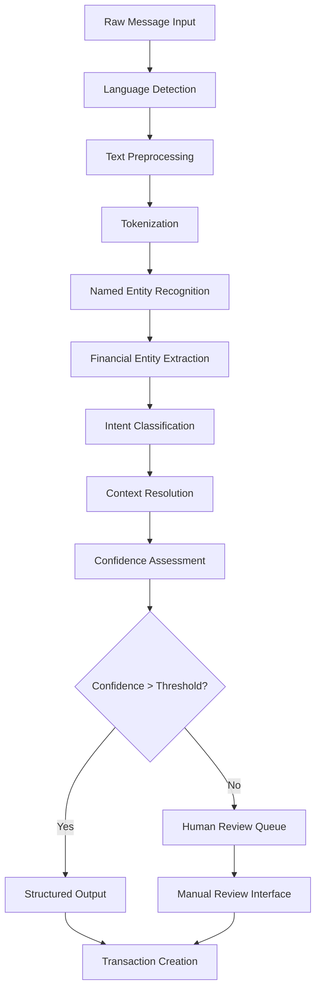

# NLP Processing Pipeline
## Financy Natural Language Processing Specification

**Version**: 1.0  
**Last Updated**: 2025-10-18  
**Scope**: Complete NLP pipeline for financial message processing  

---

## Overview

The Financy NLP processing pipeline transforms natural language financial messages into structured transaction data. The system handles Portuguese and English inputs with high accuracy through a multi-stage processing approach.

### Pipeline Architecture



### Core Design Principles
1. **Multi-Language Support**: Native Portuguese and English processing
2. **Domain Specialization**: Financial domain-specific models and rules
3. **Confidence Scoring**: Every extraction includes confidence metrics
4. **Error Recovery**: Graceful handling of ambiguous or incomplete input
5. **Continuous Learning**: Model improvement through user feedback
6. **Cultural Adaptation**: Brazilian financial culture and terminology

---

## Language Detection and Preprocessing

### Language Detection Service
```typescript
interface LanguageDetector {
  detectLanguage(text: string): Promise<LanguageDetectionResult>;
  getSupportedLanguages(): string[];
}

interface LanguageDetectionResult {
  language: LanguageCode;
  confidence: number;
  alternatives: Array<{language: LanguageCode, confidence: number}>;
  script: string; // Latin, Cyrillic, etc.
}

class FastTextLanguageDetector implements LanguageDetector {
  async detectLanguage(text: string): Promise<LanguageDetectionResult> {
    // Remove financial amounts that could confuse language detection
    const cleanText = this.removeFinancialNumbers(text);
    
    // Use fastText for initial detection
    const result = await this.fastTextModel.predict(cleanText);
    
    // Apply financial domain heuristics
    const refinedResult = this.applyFinancialHeuristics(text, result);
    
    return refinedResult;
  }
  
  private removeFinancialNumbers(text: string): string {
    return text
      .replace(/R\$\s*[\d.,]+/g, '') // Remove Brazilian currency
      .replace(/US\$\s*[\d.,]+/g, '') // Remove US currency
      .replace(/\d+[.,]\d{2}/g, '') // Remove decimal amounts
      .replace(/\b\d+\b/g, ''); // Remove standalone numbers
  }
  
  private applyFinancialHeuristics(
    text: string, 
    result: any
  ): LanguageDetectionResult {
    
    // Portuguese financial terms
    const ptFinancialTerms = [
      'real', 'reais', 'centavo', 'centavos',
      'pago', 'paguei', 'gastei', 'gasto',
      'compra', 'comprei', 'venda', 'vendi',
      'conta', 'fatura', 'boleto', 'pix'
    ];
    
    // English financial terms
    const enFinancialTerms = [
      'dollar', 'dollars', 'cent', 'cents',
      'paid', 'spent', 'buy', 'bought',
      'sell', 'sold', 'bill', 'invoice'
    ];
    
    const ptScore = this.calculateTermScore(text, ptFinancialTerms);
    const enScore = this.calculateTermScore(text, enFinancialTerms);
    
    // Adjust confidence based on domain-specific terms
    if (ptScore > enScore && ptScore > 0.3) {
      return {
        language: 'pt-BR',
        confidence: Math.min(0.95, result.confidence + ptScore * 0.2),
        alternatives: result.alternatives,
        script: 'Latin'
      };
    } else if (enScore > ptScore && enScore > 0.3) {
      return {
        language: 'en-US',
        confidence: Math.min(0.95, result.confidence + enScore * 0.2),
        alternatives: result.alternatives,
        script: 'Latin'
      };
    }
    
    return result;
  }
}
```

### Text Preprocessing Pipeline
```typescript
class FinancialTextPreprocessor {
  async preprocess(text: string, language: LanguageCode): Promise<PreprocessedText> {
    const steps = [
      this.normalizeWhitespace,
      this.fixCommonTypos,
      this.normalizeFinancialTerms,
      this.expandAbbreviations,
      this.normalizeNumbers,
      this.handleEmojis
    ];
    
    let processedText = text;
    const transformations: TextTransformation[] = [];
    
    for (const step of steps) {
      const result = await step(processedText, language);
      processedText = result.text;
      transformations.push(...result.transformations);
    }
    
    return {
      original_text: text,
      processed_text: processedText,
      transformations,
      language
    };
  }
  
  private normalizeFinancialTerms(text: string, language: LanguageCode): ProcessingStep {
    const transformations: TextTransformation[] = [];
    let normalized = text;
    
    if (language === 'pt-BR') {
      // Normalize Brazilian currency expressions
      const patterns = [
        { pattern: /(\d+)\s*real(is)?/gi, replacement: 'R$ $1' },
        { pattern: /(\d+)\s*centavo(s)?/gi, replacement: 'R$ 0.$1' },
        { pattern: /R\$\s*(\d+)[,.](\d{3})[,.](\d{2})/gi, replacement: 'R$ $1$2,$3' },
        { pattern: /(\d+)\s*conto(s)?/gi, replacement: 'R$ $1000' }, // "conto" = 1000 reais
      ];
      
      patterns.forEach(({ pattern, replacement }) => {
        const matches = Array.from(normalized.matchAll(pattern));
        matches.forEach(match => {
          transformations.push({
            type: 'currency_normalization',
            original: match[0],
            replacement: replacement.replace(/\$\d+/g, (m) => match[parseInt(m.slice(1))]),
            position: match.index!
          });
        });
        normalized = normalized.replace(pattern, replacement);
      });
    }
    
    return { text: normalized, transformations };
  }
  
  private fixCommonTypos(text: string, language: LanguageCode): ProcessingStep {
    const transformations: TextTransformation[] = [];
    let corrected = text;
    
    if (language === 'pt-BR') {
      const corrections = [
        { from: /pagei/gi, to: 'paguei' },
        { from: /gasto(?!u)/gi, to: 'gastei' },
        { from: /compro(?!u)/gi, to: 'comprei' },
        { from: /resto(?!urante)/gi, to: 'restaurante' },
        { from: /mercdao/gi, to: 'mercado' },
        { from: /suprmercado/gi, to: 'supermercado' }
      ];
      
      corrections.forEach(({ from, to }) => {
        if (from.test(corrected)) {
          transformations.push({
            type: 'typo_correction',
            original: corrected.match(from)?.[0] || '',
            replacement: to,
            position: corrected.search(from)
          });
          corrected = corrected.replace(from, to);
        }
      });
    }
    
    return { text: corrected, transformations };
  }
}
```

---

## Named Entity Recognition (NER)

### Financial Entity Types
```typescript
enum FinancialEntityType {
  AMOUNT = 'AMOUNT',
  CURRENCY = 'CURRENCY',
  MERCHANT = 'MERCHANT',
  CATEGORY = 'CATEGORY',
  DATE = 'DATE',
  TIME = 'TIME',
  PAYMENT_METHOD = 'PAYMENT_METHOD',
  INSTALLMENT = 'INSTALLMENT',
  SUBSCRIPTION = 'SUBSCRIPTION',
  LOCATION = 'LOCATION',
  PERSON = 'PERSON'
}

interface FinancialEntity {
  type: FinancialEntityType;
  value: string;
  normalized_value: any;
  confidence: number;
  start_position: number;
  end_position: number;
  context: string;
  metadata: EntityMetadata;
}

interface EntityMetadata {
  extraction_method: 'pattern' | 'model' | 'rule';
  source_pattern?: string;
  alternative_values?: string[];
  validation_status: 'valid' | 'uncertain' | 'invalid';
}
```

### Custom NER Model for Financial Domain
```typescript
class FinancialNERService {
  private spacyModel: any;
  private customPatterns: FinancialPatterns;
  
  async extractEntities(
    text: string, 
    language: LanguageCode
  ): Promise<FinancialEntity[]> {
    
    const entities: FinancialEntity[] = [];
    
    // Stage 1: Pattern-based extraction (high precision)
    const patternEntities = await this.extractPatternBasedEntities(text, language);
    entities.push(...patternEntities);
    
    // Stage 2: ML model extraction (broad coverage)
    const modelEntities = await this.extractModelBasedEntities(text, language);
    entities.push(...modelEntities);
    
    // Stage 3: Rule-based post-processing
    const refinedEntities = await this.refineAndValidateEntities(
      entities, 
      text, 
      language
    );
    
    // Stage 4: Conflict resolution and ranking
    return this.resolveEntityConflicts(refinedEntities);
  }
  
  private async extractPatternBasedEntities(
    text: string, 
    language: LanguageCode
  ): Promise<FinancialEntity[]> {
    
    const entities: FinancialEntity[] = [];
    const patterns = this.customPatterns.getPatterns(language);
    
    // Amount extraction patterns
    patterns.amounts.forEach(pattern => {
      const matches = Array.from(text.matchAll(pattern.regex));
      matches.forEach(match => {
        if (match.index !== undefined) {
          entities.push({
            type: FinancialEntityType.AMOUNT,
            value: match[0],
            normalized_value: this.normalizeAmount(match[0], language),
            confidence: pattern.confidence,
            start_position: match.index,
            end_position: match.index + match[0].length,
            context: this.getContext(text, match.index, 20),
            metadata: {
              extraction_method: 'pattern',
              source_pattern: pattern.name,
              validation_status: 'valid'
            }
          });
        }
      });
    });
    
    // Merchant extraction patterns
    patterns.merchants.forEach(pattern => {
      const matches = Array.from(text.matchAll(pattern.regex));
      matches.forEach(match => {
        if (match.index !== undefined) {
          entities.push({
            type: FinancialEntityType.MERCHANT,
            value: match[1] || match[0], // Capture group or full match
            normalized_value: this.normalizeMerchant(match[1] || match[0]),
            confidence: pattern.confidence,
            start_position: match.index,
            end_position: match.index + match[0].length,
            context: this.getContext(text, match.index, 20),
            metadata: {
              extraction_method: 'pattern',
              source_pattern: pattern.name,
              validation_status: 'valid'
            }
          });
        }
      });
    });
    
    return entities;
  }
  
  private normalizeAmount(amountText: string, language: LanguageCode): number {
    // Remove currency symbols and normalize decimal separators
    let normalized = amountText
      .replace(/[R$USD€£¥]/g, '')
      .replace(/\s+/g, '')
      .trim();
    
    if (language === 'pt-BR') {
      // Brazilian format: 1.234.567,89
      if (normalized.includes(',') && normalized.includes('.')) {
        // Has both . and , - . is thousands separator
        normalized = normalized.replace(/\./g, '').replace(',', '.');
      } else if (normalized.includes(',')) {
        // Only comma - could be decimal separator
        const commaIndex = normalized.lastIndexOf(',');
        const afterComma = normalized.slice(commaIndex + 1);
        
        if (afterComma.length === 2) {
          // Decimal separator
          normalized = normalized.replace(',', '.');
        } else {
          // Thousands separator
          normalized = normalized.replace(/,/g, '');
        }
      }
    } else {
      // US format: 1,234,567.89
      if (normalized.includes(',')) {
        normalized = normalized.replace(/,/g, '');
      }
    }
    
    return parseFloat(normalized) || 0;
  }
}
```

### Financial Pattern Library
```typescript
class FinancialPatterns {
  getPatterns(language: LanguageCode): PatternLibrary {
    if (language === 'pt-BR') {
      return this.getPortuguesePatterns();
    } else {
      return this.getEnglishPatterns();
    }
  }
  
  private getPortuguesePatterns(): PatternLibrary {
    return {
      amounts: [
        {
          name: 'brl_currency_with_symbol',
          regex: /R\$\s*(\d{1,3}(?:\.\d{3})*(?:,\d{2})?|\d+(?:,\d{2})?)/gi,
          confidence: 0.95
        },
        {
          name: 'amount_with_reais',
          regex: /(\d+(?:[.,]\d{2})?)\s*reais?/gi,
          confidence: 0.90
        },
        {
          name: 'amount_with_centavos',
          regex: /(\d+)\s*centavos?/gi,
          confidence: 0.85
        },
        {
          name: 'numeric_amount',
          regex: /(?<![\d.,])\d{1,3}(?:\.\d{3})*(?:,\d{2})?(?![\d.,])/gi,
          confidence: 0.70
        }
      ],
      merchants: [
        {
          name: 'restaurant_indicators',
          regex: /(?:no|na|do|da)\s+([A-Za-zÀ-ÿ\s]{2,30})(?:\s+(?:restaurante|lanchonete|pizzaria|bar|café))?/gi,
          confidence: 0.80
        },
        {
          name: 'establishment_types',
          regex: /(supermercado|farmácia|posto|shopping|mercado|padaria)\s+([A-Za-zÀ-ÿ\s]{2,20})/gi,
          confidence: 0.85
        },
        {
          name: 'brand_names',
          regex: /\b(McDonald['']?s|Burger\s+King|Subway|KFC|Starbucks|Carrefour|Pão\s+de\s+Açúcar|Extra|Walmart)\b/gi,
          confidence: 0.95
        }
      ],
      categories: [
        {
          name: 'food_keywords',
          regex: /\b(almoço|jantar|café|lanche|comida|refeição|restaurante|delivery|ifood|uber\s*eats)\b/gi,
          confidence: 0.90
        },
        {
          name: 'transport_keywords',
          regex: /\b(uber|99|taxi|ônibus|metrô|gasolina|combustível|posto|estacionamento)\b/gi,
          confidence: 0.90
        },
        {
          name: 'shopping_keywords',
          regex: /\b(supermercado|mercado|compras|shopping|loja|comprei)\b/gi,
          confidence: 0.85
        }
      ],
      installments: [
        {
          name: 'installment_pattern',
          regex: /(\d+)\s*[x×]\s*(?:de\s*)?R?\$?\s*(\d+(?:[.,]\d{2})?)/gi,
          confidence: 0.95
        },
        {
          name: 'parcela_pattern',
          regex: /parcela\s+(\d+)\s+de\s+(\d+)/gi,
          confidence: 0.90
        },
        {
          name: 'parcelado_pattern',
          regex: /parcelei?\s+em\s+(\d+)x?/gi,
          confidence: 0.85
        }
      ],
      dates: [
        {
          name: 'brazilian_date',
          regex: /\b(\d{1,2})[\/\-](\d{1,2})[\/\-](\d{2,4})\b/gi,
          confidence: 0.90
        },
        {
          name: 'relative_date',
          regex: /\b(hoje|ontem|anteontem|amanhã)\b/gi,
          confidence: 0.95
        },
        {
          name: 'day_of_week',
          regex: /\b(segunda|terça|quarta|quinta|sexta|sábado|domingo)(?:\s*feira)?\b/gi,
          confidence: 0.85
        }
      ],
      payment_methods: [
        {
          name: 'card_payments',
          regex: /\b(cartão|débito|crédito|visa|mastercard|elo)\b/gi,
          confidence: 0.90
        },
        {
          name: 'digital_payments',
          regex: /\b(pix|picpay|paypal|apple\s*pay|google\s*pay)\b/gi,
          confidence: 0.95
        },
        {
          name: 'cash_payments',
          regex: /\b(dinheiro|à\s*vista|cash)\b/gi,
          confidence: 0.90
        }
      ]
    };
  }
  
  private getEnglishPatterns(): PatternLibrary {
    return {
      amounts: [
        {
          name: 'usd_currency_symbol',
          regex: /\$(\d{1,3}(?:,\d{3})*(?:\.\d{2})?|\d+(?:\.\d{2})?)/gi,
          confidence: 0.95
        },
        {
          name: 'amount_with_dollars',
          regex: /(\d+(?:\.\d{2})?)\s*dollars?/gi,
          confidence: 0.90
        },
        {
          name: 'amount_with_cents',
          regex: /(\d+)\s*cents?/gi,
          confidence: 0.85
        }
      ],
      merchants: [
        {
          name: 'at_merchant',
          regex: /\bat\s+([A-Za-z\s]{2,30})/gi,
          confidence: 0.80
        },
        {
          name: 'from_merchant',
          regex: /\bfrom\s+([A-Za-z\s]{2,30})/gi,
          confidence: 0.80
        }
      ],
      categories: [
        {
          name: 'food_keywords',
          regex: /\b(lunch|dinner|breakfast|food|meal|restaurant|delivery|takeout)\b/gi,
          confidence: 0.90
        },
        {
          name: 'transport_keywords',
          regex: /\b(uber|lyft|taxi|bus|train|gas|fuel|parking)\b/gi,
          confidence: 0.90
        }
      ],
      installments: [
        {
          name: 'payment_plan',
          regex: /(\d+)\s*payments?\s*of\s*\$?(\d+(?:\.\d{2})?)/gi,
          confidence: 0.95
        }
      ],
      dates: [
        {
          name: 'us_date',
          regex: /\b(\d{1,2})[\/\-](\d{1,2})[\/\-](\d{2,4})\b/gi,
          confidence: 0.90
        },
        {
          name: 'relative_date',
          regex: /\b(today|yesterday|tomorrow)\b/gi,
          confidence: 0.95
        }
      ],
      payment_methods: [
        {
          name: 'card_payments',
          regex: /\b(card|credit|debit|visa|mastercard|amex)\b/gi,
          confidence: 0.90
        },
        {
          name: 'digital_payments',
          regex: /\b(paypal|apple\s*pay|google\s*pay|venmo)\b/gi,
          confidence: 0.95
        }
      ]
    };
  }
}
```

---

## Intent Classification

### Financial Intent Types
```typescript
enum FinancialIntent {
  EXPENSE_RECORD = 'expense_record',
  INCOME_RECORD = 'income_record',
  TRANSFER_RECORD = 'transfer_record',
  SUBSCRIPTION_INQUIRY = 'subscription_inquiry',
  BALANCE_INQUIRY = 'balance_inquiry',
  CATEGORY_QUESTION = 'category_question',
  BUDGET_QUESTION = 'budget_question',
  SPLIT_REQUEST = 'split_request',
  PAYMENT_REMINDER = 'payment_reminder',
  CORRECTION_REQUEST = 'correction_request',
  HELP_REQUEST = 'help_request',
  GREETING = 'greeting'
}

interface IntentClassificationResult {
  intent: FinancialIntent;
  confidence: number;
  supporting_features: string[];
  alternative_intents: Array<{
    intent: FinancialIntent;
    confidence: number;
  }>;
}
```

### Intent Classification Service
```typescript
class FinancialIntentClassifier {
  private classificationModel: any;
  private featureExtractor: FeatureExtractor;
  
  async classifyIntent(
    text: string,
    entities: FinancialEntity[],
    language: LanguageCode
  ): Promise<IntentClassificationResult> {
    
    // Extract features for classification
    const features = await this.featureExtractor.extract(text, entities, language);
    
    // Rule-based classification (high confidence patterns)
    const ruleBasedResult = this.classifyWithRules(text, entities, language);
    if (ruleBasedResult.confidence > 0.9) {
      return ruleBasedResult;
    }
    
    // ML model classification
    const modelResult = await this.classifyWithModel(features);
    
    // Combine results with confidence scoring
    return this.combineClassificationResults(ruleBasedResult, modelResult);
  }
  
  private classifyWithRules(
    text: string,
    entities: FinancialEntity[],
    language: LanguageCode
  ): IntentClassificationResult {
    
    const hasAmount = entities.some(e => e.type === FinancialEntityType.AMOUNT);
    const hasMerchant = entities.some(e => e.type === FinancialEntityType.MERCHANT);
    const hasInstallment = entities.some(e => e.type === FinancialEntityType.INSTALLMENT);
    
    if (language === 'pt-BR') {
      // Portuguese expense indicators
      const expenseVerbs = /\b(paguei|gastei|comprei|pago|gasto|compro)\b/i;
      const incomeVerbs = /\b(recebi|ganhei|recebo|ganho)\b/i;
      const transferVerbs = /\b(transferi|enviei|mandei)\b/i;
      
      if (expenseVerbs.test(text) && hasAmount) {
        return {
          intent: FinancialIntent.EXPENSE_RECORD,
          confidence: 0.95,
          supporting_features: ['expense_verb', 'amount_present'],
          alternative_intents: []
        };
      }
      
      if (incomeVerbs.test(text) && hasAmount) {
        return {
          intent: FinancialIntent.INCOME_RECORD,
          confidence: 0.95,
          supporting_features: ['income_verb', 'amount_present'],
          alternative_intents: []
        };
      }
      
      if (transferVerbs.test(text) && hasAmount) {
        return {
          intent: FinancialIntent.TRANSFER_RECORD,
          confidence: 0.90,
          supporting_features: ['transfer_verb', 'amount_present'],
          alternative_intents: []
        };
      }
      
      // Installment patterns
      if (hasInstallment && hasAmount) {
        return {
          intent: FinancialIntent.EXPENSE_RECORD,
          confidence: 0.92,
          supporting_features: ['installment_pattern', 'amount_present'],
          alternative_intents: []
        };
      }
      
      // Inquiry patterns
      const balanceInquiry = /\b(quanto|como|está|saldo|gastei|gastamos)\b.*\b(mês|semana|hoje)\b/i;
      if (balanceInquiry.test(text)) {
        return {
          intent: FinancialIntent.BALANCE_INQUIRY,
          confidence: 0.85,
          supporting_features: ['balance_inquiry_pattern'],
          alternative_intents: []
        };
      }
      
    } else {
      // English expense indicators
      const expenseVerbs = /\b(paid|spent|bought|pay|spend|buy)\b/i;
      const incomeVerbs = /\b(received|earned|got|receive|earn|get)\b/i;
      
      if (expenseVerbs.test(text) && hasAmount) {
        return {
          intent: FinancialIntent.EXPENSE_RECORD,
          confidence: 0.95,
          supporting_features: ['expense_verb', 'amount_present'],
          alternative_intents: []
        };
      }
      
      if (incomeVerbs.test(text) && hasAmount) {
        return {
          intent: FinancialIntent.INCOME_RECORD,
          confidence: 0.95,
          supporting_features: ['income_verb', 'amount_present'],
          alternative_intents: []
        };
      }
    }
    
    // Default fallback
    return {
      intent: FinancialIntent.EXPENSE_RECORD,
      confidence: 0.60,
      supporting_features: ['default_assumption'],
      alternative_intents: [
        { intent: FinancialIntent.INCOME_RECORD, confidence: 0.30 },
        { intent: FinancialIntent.HELP_REQUEST, confidence: 0.10 }
      ]
    };
  }
  
  private async classifyWithModel(features: ClassificationFeatures): Promise<IntentClassificationResult> {
    // Transform features to model input format
    const modelInput = this.featuresToVector(features);
    
    // Get prediction from trained model
    const prediction = await this.classificationModel.predict(modelInput);
    
    // Convert model output to classification result
    return this.modelOutputToResult(prediction);
  }
}
```

### Feature Extraction for Classification
```typescript
class FeatureExtractor {
  extract(
    text: string,
    entities: FinancialEntity[],
    language: LanguageCode
  ): ClassificationFeatures {
    
    return {
      // Text features
      text_length: text.length,
      word_count: text.split(/\s+/).length,
      has_question_mark: text.includes('?'),
      has_exclamation: text.includes('!'),
      
      // Entity features
      has_amount: entities.some(e => e.type === FinancialEntityType.AMOUNT),
      has_merchant: entities.some(e => e.type === FinancialEntityType.MERCHANT),
      has_category: entities.some(e => e.type === FinancialEntityType.CATEGORY),
      has_date: entities.some(e => e.type === FinancialEntityType.DATE),
      has_payment_method: entities.some(e => e.type === FinancialEntityType.PAYMENT_METHOD),
      has_installment: entities.some(e => e.type === FinancialEntityType.INSTALLMENT),
      
      // Linguistic features
      verb_tense: this.extractVerbTense(text, language),
      sentiment: this.extractSentiment(text),
      formality: this.extractFormality(text, language),
      
      // Domain-specific features
      transaction_indicators: this.extractTransactionIndicators(text, language),
      amount_context: this.extractAmountContext(text, entities),
      temporal_references: this.extractTemporalReferences(text, language),
      
      // Language-specific features
      language,
      uses_slang: this.detectSlang(text, language),
      uses_abbreviations: this.detectAbbreviations(text, language)
    };
  }
  
  private extractTransactionIndicators(text: string, language: LanguageCode): string[] {
    const indicators: string[] = [];
    
    if (language === 'pt-BR') {
      const patterns = [
        { pattern: /\b(pag|gast|compr)\w*/gi, indicator: 'expense_verb' },
        { pattern: /\b(receb|ganh)\w*/gi, indicator: 'income_verb' },
        { pattern: /\b(transfer|envi|mand)\w*/gi, indicator: 'transfer_verb' },
        { pattern: /\b(parcel|presta[çc])/gi, indicator: 'installment_term' },
        { pattern: /\b(mensalidade|assinatura)/gi, indicator: 'subscription_term' }
      ];
      
      patterns.forEach(({ pattern, indicator }) => {
        if (pattern.test(text)) {
          indicators.push(indicator);
        }
      });
    }
    
    return indicators;
  }
}
```

---

## Context Resolution and Validation

### Context Resolution Service
```typescript
class ContextResolutionService {
  async resolveContext(
    userId: string,
    messageSource: MessageSource,
    extractedEntities: FinancialEntity[],
    intent: FinancialIntent
  ): Promise<ContextResolution> {
    
    // Determine context based on message source
    let contextId = await this.getContextFromSource(userId, messageSource);
    
    // Check for explicit context mentions in message
    const explicitContext = this.extractExplicitContextMention(extractedEntities);
    if (explicitContext) {
      contextId = await this.validateExplicitContext(userId, explicitContext);
    }
    
    // Validate user has access to resolved context
    const hasAccess = await this.validateContextAccess(userId, contextId);
    if (!hasAccess) {
      throw new ContextAccessError(`User ${userId} cannot access context ${contextId}`);
    }
    
    // Get context settings for processing
    const contextSettings = await this.getContextSettings(contextId);
    
    return {
      context_id: contextId,
      context_type: contextSettings.type,
      confidence: explicitContext ? 0.95 : 0.85,
      settings: contextSettings,
      requires_approval: this.checkApprovalRequirement(intent, contextSettings)
    };
  }
  
  private async getContextFromSource(
    userId: string,
    messageSource: MessageSource
  ): Promise<string> {
    
    switch (messageSource.platform) {
      case 'telegram':
        if (messageSource.chat_type === 'private') {
          // Private chat → personal context
          return this.getPersonalContext(userId);
        } else {
          // Group chat → shared context
          return this.getSharedContextForTelegramGroup(messageSource.chat_id);
        }
        
      case 'whatsapp':
        if (messageSource.chat_type === 'individual') {
          return this.getPersonalContext(userId);
        } else {
          return this.getSharedContextForWhatsAppGroup(messageSource.chat_id);
        }
        
      case 'web':
        // Web interface should specify context explicitly
        return messageSource.context_id || this.getPersonalContext(userId);
        
      default:
        return this.getPersonalContext(userId);
    }
  }
}
```

### Entity Validation and Normalization
```typescript
class EntityValidator {
  async validateAndNormalizeEntities(
    entities: FinancialEntity[],
    context: ContextResolution,
    language: LanguageCode
  ): Promise<ValidatedEntities> {
    
    const validated: ValidatedEntities = {
      amount: null,
      currency: null,
      merchant: null,
      category: null,
      date: null,
      payment_method: null,
      installment_info: null,
      validation_errors: []
    };
    
    // Validate and normalize amount
    const amountEntity = entities.find(e => e.type === FinancialEntityType.AMOUNT);
    if (amountEntity) {
      validated.amount = await this.validateAmount(amountEntity, context);
    } else {
      validated.validation_errors.push({
        type: 'missing_required_entity',
        entity_type: 'amount',
        message: 'No amount found in message'
      });
    }
    
    // Validate and normalize currency
    const currencyEntity = entities.find(e => e.type === FinancialEntityType.CURRENCY);
    if (currencyEntity) {
      validated.currency = await this.validateCurrency(currencyEntity, context);
    } else {
      // Use context default currency
      validated.currency = {
        code: context.settings.currency_code,
        confidence: 0.80,
        source: 'context_default'
      };
    }
    
    // Validate merchant
    const merchantEntity = entities.find(e => e.type === FinancialEntityType.MERCHANT);
    if (merchantEntity) {
      validated.merchant = await this.validateMerchant(merchantEntity, context);
    }
    
    // Validate and normalize date
    const dateEntity = entities.find(e => e.type === FinancialEntityType.DATE);
    if (dateEntity) {
      validated.date = await this.validateDate(dateEntity, context);
    } else {
      // Use current date as default
      validated.date = {
        date: new Date(),
        confidence: 0.90,
        source: 'default_current_date'
      };
    }
    
    // Validate category
    const categoryEntity = entities.find(e => e.type === FinancialEntityType.CATEGORY);
    if (categoryEntity) {
      validated.category = await this.validateCategory(categoryEntity, context);
    } else {
      // Auto-categorize based on merchant and other entities
      validated.category = await this.autoCategorize(validated, context, language);
    }
    
    return validated;
  }
  
  private async validateAmount(
    entity: FinancialEntity,
    context: ContextResolution
  ): Promise<ValidatedAmount> {
    
    const amount = entity.normalized_value as number;
    
    // Business rule validations
    if (amount <= 0) {
      throw new ValidationError('Amount must be positive');
    }
    
    if (amount > 1000000) {
      throw new ValidationError('Amount exceeds maximum limit');
    }
    
    // Check for unusual amounts that might need confirmation
    const isUnusual = await this.isUnusualAmount(amount, context);
    
    return {
      amount,
      currency: this.extractCurrencyFromAmount(entity.value),
      confidence: entity.confidence,
      is_unusual: isUnusual,
      requires_confirmation: isUnusual && entity.confidence < 0.85
    };
  }
  
  private async autoCategorize(
    validated: ValidatedEntities,
    context: ContextResolution,
    language: LanguageCode
  ): Promise<ValidatedCategory> {
    
    // Use merchant-based categorization
    if (validated.merchant) {
      const merchantCategory = await this.categorizeMerchant(
        validated.merchant.normalized_name,
        context.context_id
      );
      
      if (merchantCategory) {
        return {
          category_id: merchantCategory.id,
          category_name: merchantCategory.name,
          confidence: 0.85,
          source: 'merchant_based'
        };
      }
    }
    
    // Use amount-based heuristics
    if (validated.amount) {
      const amountCategory = await this.categorizeByAmount(
        validated.amount.amount,
        context.context_id
      );
      
      if (amountCategory) {
        return {
          category_id: amountCategory.id,
          category_name: amountCategory.name,
          confidence: 0.65,
          source: 'amount_heuristic'
        };
      }
    }
    
    // Default to "Other" category
    const defaultCategory = await this.getDefaultCategory(context.context_id);
    return {
      category_id: defaultCategory.id,
      category_name: defaultCategory.name,
      confidence: 0.50,
      source: 'default'
    };
  }
}
```

---

## Confidence Assessment and Quality Control

### Confidence Scoring Framework
```typescript
class ConfidenceAssessment {
  calculateOverallConfidence(
    entities: ValidatedEntities,
    intent: IntentClassificationResult,
    context: ContextResolution
  ): ConfidenceScore {
    
    const weights = {
      amount: 0.30,
      intent: 0.25,
      merchant: 0.20,
      category: 0.15,
      context: 0.10
    };
    
    const scores = {
      amount: entities.amount?.confidence || 0,
      intent: intent.confidence,
      merchant: entities.merchant?.confidence || 0.7, // Default for missing merchant
      category: entities.category?.confidence || 0.5,
      context: context.confidence
    };
    
    // Calculate weighted average
    const weightedScore = Object.keys(weights).reduce((sum, key) => {
      return sum + (scores[key] * weights[key]);
    }, 0);
    
    // Apply penalties for missing critical information
    let penalties = 0;
    if (!entities.amount) penalties += 0.20;
    if (!entities.merchant && intent.intent === FinancialIntent.EXPENSE_RECORD) penalties += 0.10;
    
    // Apply bonuses for high-confidence supporting evidence
    let bonuses = 0;
    if (entities.amount?.confidence > 0.95) bonuses += 0.05;
    if (entities.merchant?.confidence > 0.90) bonuses += 0.05;
    
    const finalScore = Math.max(0, Math.min(1, weightedScore - penalties + bonuses));
    
    return {
      overall_confidence: finalScore,
      component_scores: scores,
      penalties_applied: penalties,
      bonuses_applied: bonuses,
      threshold_met: finalScore >= 0.75,
      recommendation: this.getProcessingRecommendation(finalScore)
    };
  }
  
  private getProcessingRecommendation(confidence: number): ProcessingRecommendation {
    if (confidence >= 0.90) {
      return 'auto_process';
    } else if (confidence >= 0.75) {
      return 'auto_process_with_review';
    } else if (confidence >= 0.60) {
      return 'human_review_recommended';
    } else {
      return 'human_review_required';
    }
  }
}
```

This comprehensive NLP processing pipeline provides robust, accurate, and scalable natural language understanding for financial messages in both Portuguese and English, with sophisticated confidence scoring and quality control mechanisms.