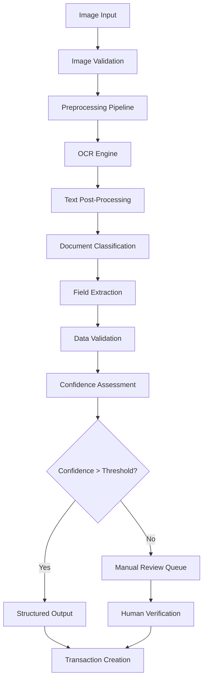

# OCR Processing Service
## Financy Optical Character Recognition Specification

**Version**: 1.0  
**Last Updated**: 2025-10-18  
**Scope**: Complete OCR pipeline for receipt and document processing  

---

## Overview

The Financy OCR Processing Service transforms receipt images and financial documents into structured data. The system handles various document types with intelligent preprocessing, field extraction, and confidence scoring.

### Supported Document Types
- **Receipts**: Restaurant, retail, grocery, gas station receipts
- **Bills**: Utility bills, phone bills, credit card statements
- **Invoices**: Service invoices, professional invoices
- **Bank Statements**: Account statements, transaction summaries
- **Checks**: Personal and business checks
- **Tax Documents**: Tax forms, financial statements

### Processing Pipeline Architecture



---

## Image Preprocessing Pipeline

### Image Validation and Enhancement
```typescript
interface ImageProcessor {
  validateImage(imageBuffer: Buffer): Promise<ImageValidationResult>;
  preprocessImage(imageBuffer: Buffer): Promise<ProcessedImage>;
  enhanceForOCR(image: ProcessedImage): Promise<EnhancedImage>;
}

interface ImageValidationResult {
  is_valid: boolean;
  file_size: number;
  dimensions: { width: number; height: number };
  format: string;
  color_space: string;
  issues: string[];
  recommendations: string[];
}

interface ProcessedImage {
  buffer: Buffer;
  metadata: ImageMetadata;
  transformations: ImageTransformation[];
  quality_score: number;
}

class AdvancedImageProcessor implements ImageProcessor {
  async validateImage(imageBuffer: Buffer): Promise<ImageValidationResult> {
    const metadata = await sharp(imageBuffer).metadata();
    const issues: string[] = [];
    const recommendations: string[] = [];
    
    // Size validation
    if (imageBuffer.length > 10 * 1024 * 1024) { // 10MB
      issues.push('File size exceeds 10MB limit');
    }
    
    if (imageBuffer.length < 10 * 1024) { // 10KB
      issues.push('File size too small, may be corrupted');
    }
    
    // Dimension validation
    if (!metadata.width || !metadata.height) {
      issues.push('Unable to determine image dimensions');
    } else {
      if (metadata.width < 200 || metadata.height < 200) {
        issues.push('Image resolution too low for reliable OCR');
        recommendations.push('Use higher resolution image (minimum 300x300)');
      }
      
      if (metadata.width > 4000 || metadata.height > 4000) {
        recommendations.push('Consider resizing large image for faster processing');
      }
    }
    
    // Format validation
    const supportedFormats = ['jpeg', 'jpg', 'png', 'webp', 'tiff'];
    if (!supportedFormats.includes(metadata.format || '')) {
      issues.push(`Unsupported format: ${metadata.format}`);
      recommendations.push('Convert to JPEG or PNG format');
    }
    
    return {
      is_valid: issues.length === 0,
      file_size: imageBuffer.length,
      dimensions: { 
        width: metadata.width || 0, 
        height: metadata.height || 0 
      },
      format: metadata.format || 'unknown',
      color_space: metadata.space || 'unknown',
      issues,
      recommendations
    };
  }
  
  async preprocessImage(imageBuffer: Buffer): Promise<ProcessedImage> {
    const transformations: ImageTransformation[] = [];
    let processed = sharp(imageBuffer);
    
    // Auto-rotate based on EXIF data
    processed = processed.rotate();
    transformations.push({
      type: 'auto_rotate',
      description: 'Applied EXIF rotation'
    });
    
    // Resize if too large (max 2048px on longest side)
    const metadata = await processed.metadata();
    const maxDimension = Math.max(metadata.width || 0, metadata.height || 0);
    
    if (maxDimension > 2048) {
      const scaleFactor = 2048 / maxDimension;
      processed = processed.resize({
        width: Math.round((metadata.width || 0) * scaleFactor),
        height: Math.round((metadata.height || 0) * scaleFactor),
        fit: 'inside'
      });
      transformations.push({
        type: 'resize',
        description: `Resized to fit 2048px maximum dimension`,
        parameters: { scale_factor: scaleFactor }
      });
    }
    
    // Convert to RGB if needed
    if (metadata.channels && metadata.channels > 3) {
      processed = processed.removeAlpha();
      transformations.push({
        type: 'remove_alpha',
        description: 'Removed alpha channel'
      });
    }
    
    const processedBuffer = await processed
      .jpeg({ quality: 90 })
      .toBuffer();
    
    const qualityScore = await this.calculateImageQuality(processedBuffer);
    
    return {
      buffer: processedBuffer,
      metadata: await this.extractImageMetadata(processedBuffer),
      transformations,
      quality_score: qualityScore
    };
  }
  
  async enhanceForOCR(image: ProcessedImage): Promise<EnhancedImage> {
    let enhanced = sharp(image.buffer);
    const enhancements: ImageEnhancement[] = [];
    
    // Analyze image to determine best enhancement strategy
    const analysis = await this.analyzeImageForOCR(image);
    
    // Apply brightness/contrast adjustment if needed
    if (analysis.brightness < 0.3 || analysis.brightness > 0.8) {
      const brightnessAdjust = analysis.brightness < 0.3 ? 1.2 : 0.8;
      enhanced = enhanced.modulate({
        brightness: brightnessAdjust,
        saturation: 0.9
      });
      enhancements.push({
        type: 'brightness_contrast',
        parameters: { brightness: brightnessAdjust, saturation: 0.9 }
      });
    }
    
    // Apply sharpening for text clarity
    if (analysis.sharpness < 0.7) {
      enhanced = enhanced.sharpen({
        sigma: 1,
        flat: 1,
        jagged: 2
      });
      enhancements.push({
        type: 'sharpen',
        parameters: { sigma: 1, flat: 1, jagged: 2 }
      });
    }
    
    // Apply noise reduction if detected
    if (analysis.noise_level > 0.3) {
      enhanced = enhanced.blur(0.5);
      enhancements.push({
        type: 'noise_reduction',
        parameters: { blur_radius: 0.5 }
      });
    }
    
    // Convert to grayscale for better OCR performance
    enhanced = enhanced.grayscale();
    enhancements.push({
      type: 'grayscale',
      description: 'Converted to grayscale for OCR optimization'
    });
    
    const enhancedBuffer = await enhanced.png().toBuffer();
    
    return {
      buffer: enhancedBuffer,
      original_image: image,
      enhancements,
      ocr_readiness_score: await this.calculateOCRReadiness(enhancedBuffer)
    };
  }
  
  private async analyzeImageForOCR(image: ProcessedImage): Promise<ImageAnalysis> {
    // Use computer vision techniques to analyze image quality
    return {
      brightness: await this.calculateBrightness(image.buffer),
      contrast: await this.calculateContrast(image.buffer),
      sharpness: await this.calculateSharpness(image.buffer),
      noise_level: await this.calculateNoiseLevel(image.buffer),
      text_regions: await this.detectTextRegions(image.buffer)
    };
  }
}
```

### Receipt-Specific Preprocessing
```typescript
class ReceiptImageProcessor extends AdvancedImageProcessor {
  async preprocessReceipt(imageBuffer: Buffer): Promise<ProcessedReceiptImage> {
    // Basic preprocessing
    const processed = await this.preprocessImage(imageBuffer);
    
    // Receipt-specific enhancements
    const receiptEnhanced = await this.enhanceForReceipt(processed);
    
    // Detect and correct receipt orientation
    const orientationCorrected = await this.correctReceiptOrientation(receiptEnhanced);
    
    // Detect receipt boundaries and crop
    const cropped = await this.cropReceiptBoundaries(orientationCorrected);
    
    return {
      ...cropped,
      receipt_type: await this.classifyReceiptType(cropped.buffer),
      layout_analysis: await this.analyzeReceiptLayout(cropped.buffer)
    };
  }
  
  private async enhanceForReceipt(image: ProcessedImage): Promise<EnhancedImage> {
    let enhanced = sharp(image.buffer);
    
    // Increase contrast for receipt text
    enhanced = enhanced.modulate({
      brightness: 1.1,
      saturation: 0.5,
      hue: 0
    });
    
    // Apply adaptive threshold for better text separation
    enhanced = enhanced.threshold(128, {
      greyscale: true
    });
    
    return {
      buffer: await enhanced.png().toBuffer(),
      original_image: image,
      enhancements: [
        { type: 'receipt_contrast', parameters: { brightness: 1.1, saturation: 0.5 } },
        { type: 'adaptive_threshold', parameters: { threshold: 128 } }
      ],
      ocr_readiness_score: 0.9
    };
  }
  
  private async correctReceiptOrientation(image: EnhancedImage): Promise<EnhancedImage> {
    // Detect text orientation using OCR
    const orientations = [0, 90, 180, 270];
    let bestOrientation = 0;
    let bestConfidence = 0;
    
    for (const angle of orientations) {
      const rotated = await sharp(image.buffer)
        .rotate(angle)
        .png()
        .toBuffer();
      
      const ocrResult = await this.quickOCRSample(rotated);
      if (ocrResult.confidence > bestConfidence) {
        bestConfidence = ocrResult.confidence;
        bestOrientation = angle;
      }
    }
    
    if (bestOrientation !== 0) {
      const corrected = await sharp(image.buffer)
        .rotate(bestOrientation)
        .png()
        .toBuffer();
      
      return {
        ...image,
        buffer: corrected,
        enhancements: [
          ...image.enhancements,
          { 
            type: 'orientation_correction', 
            parameters: { rotation_angle: bestOrientation } 
          }
        ]
      };
    }
    
    return image;
  }
}
```

---

## OCR Engine Integration

### Multi-Provider OCR Strategy
```typescript
interface OCRProvider {
  name: string;
  processImage(imageBuffer: Buffer, options: OCROptions): Promise<OCRResult>;
  getSupportedLanguages(): string[];
  getConfidenceThreshold(): number;
  getCostPerRequest(): number;
}

interface OCRResult {
  text: string;
  confidence: number;
  processing_time_ms: number;
  bounding_boxes: TextBoundingBox[];
  language_detected: string;
  provider: string;
  metadata: OCRMetadata;
}

class HybridOCRService {
  private providers: OCRProvider[];
  
  constructor() {
    this.providers = [
      new GoogleVisionOCRProvider(),
      new TesseractOCRProvider(),
      new AWSTextractProvider(),
      new AzureVisionOCRProvider()
    ];
  }
  
  async processImage(
    imageBuffer: Buffer, 
    options: OCRProcessingOptions = {}
  ): Promise<OCRResult> {
    
    // Select optimal provider based on image characteristics and requirements
    const provider = await this.selectOptimalProvider(imageBuffer, options);
    
    try {
      const result = await provider.processImage(imageBuffer, {
        languages: options.languages || ['pt', 'en'],
        confidence_threshold: options.confidence_threshold || 0.7,
        include_bounding_boxes: true,
        output_format: 'structured'
      });
      
      // Post-process and validate result
      return await this.postProcessOCRResult(result, imageBuffer);
      
    } catch (error) {
      // Try fallback provider
      console.warn(`Primary OCR provider failed: ${error.message}`);
      return await this.tryFallbackProvider(imageBuffer, options, provider);
    }
  }
  
  private async selectOptimalProvider(
    imageBuffer: Buffer,
    options: OCRProcessingOptions
  ): Promise<OCRProvider> {
    
    const imageAnalysis = await this.analyzeImageComplexity(imageBuffer);
    
    // Google Vision for complex layouts and high accuracy requirements
    if (imageAnalysis.complexity > 0.7 || options.require_high_accuracy) {
      return this.providers.find(p => p.name === 'google_vision')!;
    }
    
    // Tesseract for cost optimization and simple documents
    if (imageAnalysis.complexity < 0.3 && options.optimize_for_cost) {
      return this.providers.find(p => p.name === 'tesseract')!;
    }
    
    // AWS Textract for structured documents like invoices
    if (imageAnalysis.document_type === 'invoice' || imageAnalysis.has_tables) {
      return this.providers.find(p => p.name === 'aws_textract')!;
    }
    
    // Default to Google Vision for balanced performance
    return this.providers.find(p => p.name === 'google_vision')!;
  }
}
```

### Google Cloud Vision Integration
```typescript
class GoogleVisionOCRProvider implements OCRProvider {
  name = 'google_vision';
  private client: ImageAnnotatorClient;
  
  async processImage(imageBuffer: Buffer, options: OCROptions): Promise<OCRResult> {
    const startTime = Date.now();
    
    const [result] = await this.client.textDetection({
      image: { content: imageBuffer },
      imageContext: {
        languageHints: options.languages || ['pt', 'en']
      }
    });
    
    const textAnnotations = result.textAnnotations || [];
    const fullText = textAnnotations[0]?.description || '';
    
    // Calculate overall confidence
    const confidence = this.calculateOverallConfidence(textAnnotations);
    
    // Extract bounding boxes
    const boundingBoxes = this.extractBoundingBoxes(textAnnotations);
    
    // Detect language
    const detectedLanguage = await this.detectLanguage(fullText);
    
    return {
      text: fullText,
      confidence,
      processing_time_ms: Date.now() - startTime,
      bounding_boxes: boundingBoxes,
      language_detected: detectedLanguage,
      provider: this.name,
      metadata: {
        total_annotations: textAnnotations.length,
        api_response_size: JSON.stringify(result).length,
        image_size: imageBuffer.length
      }
    };
  }
  
  private calculateOverallConfidence(annotations: any[]): number {
    if (annotations.length === 0) return 0;
    
    // Use word-level confidence if available
    const wordConfidences = annotations
      .slice(1) // Skip full text annotation
      .map(annotation => annotation.confidence || 0.8)
      .filter(conf => conf > 0);
    
    if (wordConfidences.length === 0) return 0.8; // Default confidence
    
    // Calculate weighted average based on text length
    const totalLength = annotations
      .slice(1)
      .reduce((sum, ann) => sum + (ann.description?.length || 0), 0);
    
    const weightedSum = annotations
      .slice(1)
      .reduce((sum, ann) => {
        const weight = (ann.description?.length || 0) / totalLength;
        const confidence = ann.confidence || 0.8;
        return sum + (confidence * weight);
      }, 0);
    
    return Math.max(0.1, Math.min(1.0, weightedSum));
  }
}
```

### Tesseract Integration (Cost-Optimized)
```typescript
class TesseractOCRProvider implements OCRProvider {
  name = 'tesseract';
  private tesseractWorker: any;
  
  async processImage(imageBuffer: Buffer, options: OCROptions): Promise<OCRResult> {
    const startTime = Date.now();
    
    // Initialize worker if needed
    if (!this.tesseractWorker) {
      await this.initializeTesseract(options.languages || ['por', 'eng']);
    }
    
    // Process image
    const result = await this.tesseractWorker.recognize(imageBuffer);
    
    return {
      text: result.data.text,
      confidence: result.data.confidence / 100, // Convert to 0-1 scale
      processing_time_ms: Date.now() - startTime,
      bounding_boxes: this.convertTesseractBoundingBoxes(result.data.words),
      language_detected: this.mapTesseractLanguage(result.data.language),
      provider: this.name,
      metadata: {
        tesseract_version: result.data.version,
        page_segmentation_mode: result.data.psm,
        total_words: result.data.words?.length || 0
      }
    };
  }
  
  private async initializeTesseract(languages: string[]): Promise<void> {
    const { createWorker } = await import('tesseract.js');
    this.tesseractWorker = await createWorker(languages.join('+'));
    
    // Optimize for receipt text
    await this.tesseractWorker.setParameters({
      tessedit_char_whitelist: '0123456789ABCDEFGHIJKLMNOPQRSTUVWXYZabcdefghijklmnopqrstuvwxyzÀÁÂÃÄÅÇÈÉÊËÌÍÎÏÑÒÓÔÕÖÙÚÛÜÝàáâãäåçèéêëìíîïñòóôõöùúûüý$.,:-/()',
      tessedit_pageseg_mode: '6' // Uniform block of text
    });
  }
}
```

---

## Document Classification and Field Extraction

### Receipt Type Classification
```typescript
enum ReceiptType {
  RESTAURANT = 'restaurant',
  RETAIL = 'retail',
  GROCERY = 'grocery',
  GAS_STATION = 'gas_station',
  PHARMACY = 'pharmacy',
  UTILITY_BILL = 'utility_bill',
  INVOICE = 'invoice',
  BANK_STATEMENT = 'bank_statement',
  UNKNOWN = 'unknown'
}

class ReceiptClassifier {
  private classificationModel: any;
  private keywordMappings: Map<ReceiptType, string[]>;
  
  constructor() {
    this.keywordMappings = new Map([
      [ReceiptType.RESTAURANT, [
        'restaurante', 'lanchonete', 'pizzaria', 'bar', 'café',
        'restaurant', 'cafe', 'diner', 'bistro', 'food service'
      ]],
      [ReceiptType.RETAIL, [
        'loja', 'magazine', 'shopping', 'varejo',
        'store', 'shop', 'retail', 'department'
      ]],
      [ReceiptType.GROCERY, [
        'supermercado', 'mercado', 'açougue', 'padaria',
        'supermarket', 'grocery', 'market', 'bakery'
      ]],
      [ReceiptType.GAS_STATION, [
        'posto', 'combustível', 'gasolina', 'álcool', 'diesel',
        'gas station', 'fuel', 'gasoline', 'petrol'
      ]],
      [ReceiptType.PHARMACY, [
        'farmácia', 'drogaria', 'medicamento',
        'pharmacy', 'drugstore', 'medicine'
      ]]
    ]);
  }
  
  async classifyReceipt(ocrText: string, imageMetadata?: any): Promise<ReceiptClassificationResult> {
    // Keyword-based classification (fast and reliable)
    const keywordResult = this.classifyByKeywords(ocrText);
    
    // Pattern-based classification
    const patternResult = this.classifyByPatterns(ocrText);
    
    // ML model classification (if available)
    const modelResult = await this.classifyWithModel(ocrText, imageMetadata);
    
    // Combine results with confidence weighting
    return this.combineClassificationResults([
      keywordResult,
      patternResult,
      modelResult
    ]);
  }
  
  private classifyByKeywords(text: string): ReceiptClassificationResult {
    const normalizedText = text.toLowerCase();
    const scores = new Map<ReceiptType, number>();
    
    for (const [receiptType, keywords] of this.keywordMappings) {
      let score = 0;
      for (const keyword of keywords) {
        const occurrences = (normalizedText.match(new RegExp(keyword, 'g')) || []).length;
        score += occurrences * (keyword.length / 10); // Weight by keyword length
      }
      scores.set(receiptType, score);
    }
    
    // Find highest scoring type
    const sortedScores = Array.from(scores.entries())
      .sort(([,a], [,b]) => b - a);
    
    const [topType, topScore] = sortedScores[0];
    const confidence = Math.min(0.95, topScore / 10); // Normalize to 0-1
    
    return {
      receipt_type: topType,
      confidence,
      method: 'keyword_matching',
      supporting_evidence: this.findSupportingKeywords(normalizedText, topType)
    };
  }
  
  private classifyByPatterns(text: string): ReceiptClassificationResult {
    // Restaurant patterns
    if (/mesa\s*\d+|garçom|gorjeta|couvert|tip|table|waiter/i.test(text)) {
      return {
        receipt_type: ReceiptType.RESTAURANT,
        confidence: 0.85,
        method: 'pattern_matching',
        supporting_evidence: ['restaurant_service_patterns']
      };
    }
    
    // Gas station patterns
    if (/litros?|l\b|bomba|bico|fuel|gallons?|pump/i.test(text)) {
      return {
        receipt_type: ReceiptType.GAS_STATION,
        confidence: 0.90,
        method: 'pattern_matching',
        supporting_evidence: ['fuel_quantity_patterns']
      };
    }
    
    // Grocery patterns
    if (/kg\b|gramas?|unidade|peso|weight|quantity/i.test(text)) {
      return {
        receipt_type: ReceiptType.GROCERY,
        confidence: 0.75,
        method: 'pattern_matching',
        supporting_evidence: ['quantity_weight_patterns']
      };
    }
    
    return {
      receipt_type: ReceiptType.UNKNOWN,
      confidence: 0.50,
      method: 'pattern_matching',
      supporting_evidence: []
    };
  }
}
```

### Financial Field Extraction
```typescript
interface ReceiptFieldExtractor {
  extractFields(ocrText: string, receiptType: ReceiptType): Promise<ExtractedReceiptFields>;
}

interface ExtractedReceiptFields {
  merchant_name: FieldExtraction<string>;
  total_amount: FieldExtraction<number>;
  transaction_date: FieldExtraction<Date>;
  transaction_time: FieldExtraction<string>;
  payment_method: FieldExtraction<string>;
  tax_amount: FieldExtraction<number>;
  line_items: FieldExtraction<LineItem[]>;
  receipt_number: FieldExtraction<string>;
  extracted_metadata: ReceiptMetadata;
}

interface FieldExtraction<T> {
  value: T | null;
  confidence: number;
  source_text: string;
  extraction_method: string;
  bounding_box?: BoundingBox;
  alternatives?: Array<{ value: T; confidence: number }>;
}

class BrazilianReceiptExtractor implements ReceiptFieldExtractor {
  async extractFields(ocrText: string, receiptType: ReceiptType): Promise<ExtractedReceiptFields> {
    const lines = ocrText.split('\n').map(line => line.trim()).filter(line => line.length > 0);
    
    return {
      merchant_name: await this.extractMerchantName(lines, receiptType),
      total_amount: await this.extractTotalAmount(lines),
      transaction_date: await this.extractTransactionDate(lines),
      transaction_time: await this.extractTransactionTime(lines),
      payment_method: await this.extractPaymentMethod(lines),
      tax_amount: await this.extractTaxAmount(lines),
      line_items: await this.extractLineItems(lines, receiptType),
      receipt_number: await this.extractReceiptNumber(lines),
      extracted_metadata: {
        total_lines: lines.length,
        extraction_timestamp: new Date(),
        receipt_type: receiptType,
        language_detected: 'pt-BR'
      }
    };
  }
  
  private async extractMerchantName(lines: string[], receiptType: ReceiptType): Promise<FieldExtraction<string>> {
    // Merchant name is typically in the first few lines
    const candidateLines = lines.slice(0, 5);
    
    for (const line of candidateLines) {
      // Skip lines with only numbers, dates, or common receipt words
      if (/^\d+$/.test(line) || 
          /\d{2}\/\d{2}\/\d{4}/.test(line) ||
          /^(cupom|nota|fiscal|recibo)$/i.test(line)) {
        continue;
      }
      
      // Look for merchant name patterns
      if (line.length > 3 && line.length < 50 && /[a-zA-ZÀ-ÿ]/.test(line)) {
        return {
          value: this.cleanMerchantName(line),
          confidence: 0.85,
          source_text: line,
          extraction_method: 'position_based'
        };
      }
    }
    
    return {
      value: null,
      confidence: 0.0,
      source_text: '',
      extraction_method: 'position_based'
    };
  }
  
  private async extractTotalAmount(lines: string[]): Promise<FieldExtraction<number>> {
    const totalPatterns = [
      /total[:\s]*R?\$?\s*(\d{1,3}(?:\.\d{3})*(?:,\d{2})?)/i,
      /valor[:\s]*R?\$?\s*(\d{1,3}(?:\.\d{3})*(?:,\d{2})?)/i,
      /subtotal[:\s]*R?\$?\s*(\d{1,3}(?:\.\d{3})*(?:,\d{2})?)/i,
      /R\$\s*(\d{1,3}(?:\.\d{3})*(?:,\d{2})?)(?=\s*$)/
    ];
    
    // Search from bottom up (totals usually at end)
    const reversedLines = [...lines].reverse();
    
    for (const line of reversedLines) {
      for (const pattern of totalPatterns) {
        const match = line.match(pattern);
        if (match) {
          const amountStr = match[1];
          const amount = this.parseBrazilianAmount(amountStr);
          
          if (amount > 0) {
            return {
              value: amount,
              confidence: 0.90,
              source_text: line,
              extraction_method: 'pattern_matching'
            };
          }
        }
      }
    }
    
    // Fallback: look for any currency amount
    for (const line of reversedLines) {
      const amountMatch = line.match(/R\$\s*(\d{1,3}(?:\.\d{3})*(?:,\d{2})?)/);
      if (amountMatch) {
        const amount = this.parseBrazilianAmount(amountMatch[1]);
        if (amount > 0) {
          return {
            value: amount,
            confidence: 0.70,
            source_text: line,
            extraction_method: 'fallback_pattern'
          };
        }
      }
    }
    
    return {
      value: null,
      confidence: 0.0,
      source_text: '',
      extraction_method: 'pattern_matching'
    };
  }
  
  private async extractTransactionDate(lines: string[]): Promise<FieldExtraction<Date>> {
    const datePatterns = [
      /(\d{1,2})\/(\d{1,2})\/(\d{4})/,
      /(\d{1,2})-(\d{1,2})-(\d{4})/,
      /(\d{4})[-\/](\d{1,2})[-\/](\d{1,2})/
    ];
    
    for (const line of lines.slice(0, 10)) { // Dates usually in first part
      for (const pattern of datePatterns) {
        const match = line.match(pattern);
        if (match) {
          try {
            // Handle Brazilian date format (DD/MM/YYYY)
            const day = parseInt(match[1]);
            const month = parseInt(match[2]);
            const year = parseInt(match[3]);
            
            // Validate date ranges
            if (day >= 1 && day <= 31 && month >= 1 && month <= 12 && year >= 2020 && year <= 2030) {
              const date = new Date(year, month - 1, day);
              
              return {
                value: date,
                confidence: 0.95,
                source_text: line,
                extraction_method: 'pattern_matching'
              };
            }
          } catch (error) {
            continue;
          }
        }
      }
    }
    
    return {
      value: null,
      confidence: 0.0,
      source_text: '',
      extraction_method: 'pattern_matching'
    };
  }
  
  private parseBrazilianAmount(amountStr: string): number {
    // Handle Brazilian currency format: 1.234,56
    let normalized = amountStr.replace(/\./g, '').replace(',', '.');
    return parseFloat(normalized) || 0;
  }
  
  private cleanMerchantName(name: string): string {
    return name
      .replace(/[^\w\sÀ-ÿ]/g, '') // Remove special characters except accents
      .replace(/\s+/g, ' ')        // Normalize whitespace
      .trim()
      .toLowerCase()
      .replace(/\b\w/g, l => l.toUpperCase()); // Title case
  }
}
```

---

## Quality Control and Validation

### OCR Quality Assessment
```typescript
class OCRQualityAssessment {
  async assessQuality(
    ocrResult: OCRResult,
    extractedFields: ExtractedReceiptFields,
    originalImage: Buffer
  ): Promise<QualityAssessment> {
    
    const scores = {
      text_quality: await this.assessTextQuality(ocrResult),
      field_extraction: await this.assessFieldExtraction(extractedFields),
      consistency: await this.assessDataConsistency(extractedFields),
      completeness: await this.assessCompleteness(extractedFields)
    };
    
    const overallScore = this.calculateOverallScore(scores);
    const issues = await this.identifyQualityIssues(scores, extractedFields);
    const recommendations = this.generateRecommendations(issues, scores);
    
    return {
      overall_score: overallScore,
      component_scores: scores,
      quality_issues: issues,
      recommendations,
      requires_manual_review: overallScore < 0.7,
      confidence_level: this.mapScoreToConfidence(overallScore)
    };
  }
  
  private async assessTextQuality(ocrResult: OCRResult): Promise<number> {
    let score = 0;
    
    // Base confidence from OCR provider
    score += ocrResult.confidence * 0.4;
    
    // Text length and structure assessment
    const textLength = ocrResult.text.length;
    if (textLength > 50 && textLength < 5000) {
      score += 0.2; // Good text length
    } else if (textLength < 20) {
      score -= 0.1; // Very short text
    }
    
    // Character distribution assessment
    const alphaRatio = (ocrResult.text.match(/[a-zA-ZÀ-ÿ]/g) || []).length / textLength;
    const numericRatio = (ocrResult.text.match(/\d/g) || []).length / textLength;
    
    if (alphaRatio > 0.3 && numericRatio > 0.1) {
      score += 0.2; // Good mix of letters and numbers
    }
    
    // Line structure assessment
    const lines = ocrResult.text.split('\n').filter(line => line.trim().length > 0);
    if (lines.length > 3 && lines.length < 100) {
      score += 0.2; // Reasonable number of lines
    }
    
    return Math.max(0, Math.min(1, score));
  }
  
  private async assessFieldExtraction(fields: ExtractedReceiptFields): Promise<number> {
    const criticalFields = [
      fields.merchant_name,
      fields.total_amount,
      fields.transaction_date
    ];
    
    let score = 0;
    let extractedCount = 0;
    
    for (const field of criticalFields) {
      if (field.value !== null) {
        extractedCount++;
        score += field.confidence * (1 / criticalFields.length);
      }
    }
    
    // Bonus for extracting all critical fields
    if (extractedCount === criticalFields.length) {
      score += 0.1;
    }
    
    // Penalty for missing critical fields
    if (extractedCount === 0) {
      score = 0.1;
    }
    
    return Math.max(0, Math.min(1, score));
  }
  
  private async assessDataConsistency(fields: ExtractedReceiptFields): Promise<number> {
    let score = 1.0;
    
    // Date consistency check
    if (fields.transaction_date.value) {
      const transactionDate = fields.transaction_date.value;
      const now = new Date();
      const daysDiff = Math.abs((now.getTime() - transactionDate.getTime()) / (1000 * 60 * 60 * 24));
      
      if (daysDiff > 365) {
        score -= 0.3; // Very old or future date
      } else if (daysDiff > 30) {
        score -= 0.1; // Somewhat old date
      }
    }
    
    // Amount consistency check
    if (fields.total_amount.value) {
      const amount = fields.total_amount.value;
      
      if (amount < 0.01 || amount > 100000) {
        score -= 0.3; // Unrealistic amount
      }
      
      // Check if tax amount makes sense relative to total
      if (fields.tax_amount.value) {
        const taxRatio = fields.tax_amount.value / amount;
        if (taxRatio < 0 || taxRatio > 0.5) {
          score -= 0.2; // Unrealistic tax ratio
        }
      }
    }
    
    return Math.max(0, Math.min(1, score));
  }
}
```

### Error Recovery and Fallback
```typescript
class OCRErrorRecovery {
  async handleLowConfidenceResult(
    ocrResult: OCRResult,
    originalImage: Buffer,
    options: OCRProcessingOptions
  ): Promise<OCRRecoveryResult> {
    
    const recoveryStrategies: RecoveryStrategy[] = [
      'image_enhancement',
      'alternative_provider',
      'manual_preprocessing',
      'human_review'
    ];
    
    for (const strategy of recoveryStrategies) {
      const result = await this.attemptRecovery(strategy, ocrResult, originalImage, options);
      
      if (result.success && result.improved_confidence > ocrResult.confidence + 0.15) {
        return result;
      }
    }
    
    // All recovery attempts failed - queue for manual review
    return {
      success: false,
      recovery_strategy: 'human_review',
      improved_confidence: ocrResult.confidence,
      manual_review_required: true,
      error_analysis: await this.analyzeOCRErrors(ocrResult, originalImage)
    };
  }
  
  private async attemptRecovery(
    strategy: RecoveryStrategy,
    ocrResult: OCRResult,
    originalImage: Buffer,
    options: OCRProcessingOptions
  ): Promise<OCRRecoveryResult> {
    
    switch (strategy) {
      case 'image_enhancement':
        return await this.enhanceAndRetry(originalImage, options);
        
      case 'alternative_provider':
        return await this.tryAlternativeProvider(originalImage, options);
        
      case 'manual_preprocessing':
        return await this.manualPreprocessAndRetry(originalImage, options);
        
      case 'human_review':
        return {
          success: false,
          recovery_strategy: strategy,
          improved_confidence: ocrResult.confidence,
          manual_review_required: true
        };
        
      default:
        throw new Error(`Unknown recovery strategy: ${strategy}`);
    }
  }
  
  private async enhanceAndRetry(
    originalImage: Buffer,
    options: OCRProcessingOptions
  ): Promise<OCRRecoveryResult> {
    
    // Apply aggressive image enhancement
    const enhanced = await sharp(originalImage)
      .resize(2048, 2048, { fit: 'inside' })
      .sharpen({ sigma: 2 })
      .modulate({ brightness: 1.2, contrast: 1.3 })
      .threshold(120)
      .png()
      .toBuffer();
    
    // Retry OCR with enhanced image
    const hybridOCR = new HybridOCRService();
    const retryResult = await hybridOCR.processImage(enhanced, {
      ...options,
      confidence_threshold: 0.6 // Lower threshold for retry
    });
    
    return {
      success: retryResult.confidence > 0.7,
      recovery_strategy: 'image_enhancement',
      improved_confidence: retryResult.confidence,
      enhanced_result: retryResult,
      manual_review_required: retryResult.confidence < 0.7
    };
  }
}
```

This comprehensive OCR processing service provides robust, accurate, and cost-effective optical character recognition for various financial documents, with intelligent error recovery and quality assessment mechanisms.