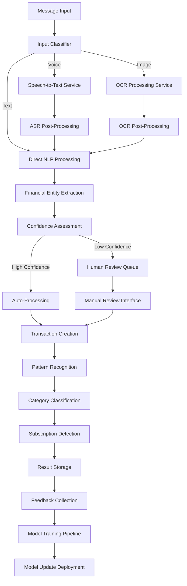

# ADR-004: AI/ML Processing Pipeline

**Status**: Proposed  
**Date**: 2025-10-18  
**Deciders**: Architecture Team, AI/ML Team  
**Technical Story**: Design AI/ML pipeline for multimodal financial data processing  

## Context

Financy requires sophisticated AI/ML processing to extract financial information from:
- Natural language text messages (Portuguese and English)
- Voice messages requiring speech-to-text conversion
- Receipt and bill images requiring OCR processing
- Pattern recognition for subscriptions and recurring payments

### Key Requirements
- **Accuracy**: >85% extraction accuracy for financial entities
- **Latency**: <3 seconds end-to-end processing time
- **Scalability**: Handle 1M+ messages per day at peak
- **Cost Efficiency**: Optimize processing costs per transaction
- **Reliability**: 99.9% processing success rate
- **Multilingual**: Support Portuguese (BR) and English (US) initially
- **Privacy**: Secure handling of sensitive financial data

### Processing Types
1. **Speech-to-Text (ASR)**: Convert voice messages to text
2. **Optical Character Recognition (OCR)**: Extract text from receipt images
3. **Natural Language Processing (NLP)**: Extract financial entities from text
4. **Machine Learning Classification**: Categorize transactions and detect patterns
5. **Pattern Recognition**: Identify subscriptions and installment patterns

## Decision

### Hybrid Cloud + Self-Hosted AI/ML Architecture

#### Core Architecture Principles
1. **Hybrid Approach**: Cloud APIs for core capabilities, custom models for domain-specific tasks
2. **Pipeline Architecture**: Asynchronous processing with error recovery
3. **Confidence Scoring**: All extractions include confidence metrics
4. **Human-in-the-Loop**: Fallback to manual processing for low confidence results
5. **Continuous Learning**: Model improvement through user feedback
6. **Cost Optimization**: Intelligent routing based on complexity and cost

#### Overall Pipeline Architecture



### Service-by-Service Architecture

#### 1. Speech-to-Text Service

**Technology Choice**: OpenAI Whisper API with fallback to Google Cloud Speech-to-Text

```typescript
interface ASRService {
  transcribe(audioBuffer: Buffer, language: LanguageCode): Promise<ASRResult>;
  getBatchTranscription(audioFiles: AudioFile[]): Promise<ASRResult[]>;
}

interface ASRResult {
  transcript: string;
  confidence: number;
  language_detected: LanguageCode;
  processing_time_ms: number;
  word_timestamps?: WordTimestamp[];
  alternatives?: TranscriptAlternative[];
}

interface WordTimestamp {
  word: string;
  start_time: number;
  end_time: number;
  confidence: number;
}

class WhisperASRService implements ASRService {
  async transcribe(
    audioBuffer: Buffer, 
    language: LanguageCode
  ): Promise<ASRResult> {
    // Pre-process audio
    const processedAudio = await this.preprocessAudio(audioBuffer);
    
    // Call Whisper API
    const response = await this.openaiClient.audio.transcriptions.create({
      file: processedAudio,
      model: 'whisper-1',
      language: this.mapLanguageCode(language),
      response_format: 'verbose_json',
      timestamp_granularities: ['word']
    });
    
    // Post-process results
    return this.postProcessASRResult(response);
  }
  
  private async preprocessAudio(audioBuffer: Buffer): Promise<File> {
    // Convert to supported format (MP3, WAV)
    // Apply noise reduction
    // Normalize volume
    // Compress if needed for API limits
    return this.audioProcessor.process(audioBuffer);
  }
  
  private postProcessASRResult(response: any): ASRResult {
    return {
      transcript: response.text,
      confidence: this.calculateConfidence(response),
      language_detected: this.mapLanguageFromResponse(response.language),
      processing_time_ms: Date.now() - this.startTime,
      word_timestamps: response.words?.map(this.mapWordTimestamp),
      alternatives: response.alternative_transcripts
    };
  }
}
```

**Fallback Strategy**:
```typescript
class ASRServiceWithFallback implements ASRService {
  constructor(
    private primaryService: WhisperASRService,
    private fallbackService: GoogleCloudASRService
  ) {}
  
  async transcribe(
    audioBuffer: Buffer, 
    language: LanguageCode
  ): Promise<ASRResult> {
    try {
      // Try primary service (Whisper)
      const result = await this.primaryService.transcribe(audioBuffer, language);
      
      // If confidence is too low, try fallback
      if (result.confidence < 0.7) {
        const fallbackResult = await this.fallbackService.transcribe(
          audioBuffer, 
          language
        );
        
        // Return better result
        return result.confidence > fallbackResult.confidence 
          ? result 
          : fallbackResult;
      }
      
      return result;
    } catch (error) {
      // Fallback on primary service failure
      return this.fallbackService.transcribe(audioBuffer, language);
    }
  }
}
```

#### 2. OCR Processing Service

**Technology Choice**: Google Cloud Vision API with custom preprocessing

```typescript
interface OCRService {
  extractText(imageBuffer: Buffer): Promise<OCRResult>;
  extractReceiptFields(imageBuffer: Buffer): Promise<ReceiptData>;
}

interface OCRResult {
  extracted_text: string;
  confidence: number;
  bounding_boxes: BoundingBox[];
  language_detected: LanguageCode;
  processing_time_ms: number;
}

interface ReceiptData {
  merchant_name?: string;
  total_amount?: Money;
  transaction_date?: Date;
  payment_method?: string;
  line_items: ReceiptLineItem[];
  confidence_scores: Record<string, number>;
}

class VisionAPIService implements OCRService {
  async extractText(imageBuffer: Buffer): Promise<OCRResult> {
    // Preprocess image
    const processedImage = await this.preprocessImage(imageBuffer);
    
    // Call Vision API
    const [result] = await this.visionClient.textDetection(processedImage);
    
    // Post-process results
    return this.postProcessOCRResult(result);
  }
  
  async extractReceiptFields(imageBuffer: Buffer): Promise<ReceiptData> {
    // First extract all text
    const ocrResult = await this.extractText(imageBuffer);
    
    // Apply receipt-specific field extraction
    return this.receiptFieldExtractor.extract(ocrResult.extracted_text);
  }
  
  private async preprocessImage(imageBuffer: Buffer): Promise<Buffer> {
    return this.imageProcessor.pipeline(imageBuffer)
      .resize({ width: 2048, height: 2048, fit: 'inside' })
      .normalize()
      .sharpen()
      .toBuffer();
  }
}

class ReceiptFieldExtractor {
  async extract(text: string): Promise<ReceiptData> {
    const patterns = {
      total: /(?:total|valor|amount)[:|\s]*(?:R\$|USD|\$)?\s*(\d+[.,]\d{2})/i,
      merchant: /^([A-Z\s]+)$/m,
      date: /(\d{1,2}[\/\-]\d{1,2}[\/\-]\d{2,4})/,
      payment: /(?:cartão|card|débito|crédito|cash|dinheiro)/i
    };
    
    return {
      merchant_name: this.extractMerchant(text),
      total_amount: this.extractAmount(text),
      transaction_date: this.extractDate(text),
      payment_method: this.extractPaymentMethod(text),
      line_items: this.extractLineItems(text),
      confidence_scores: this.calculateFieldConfidences(text)
    };
  }
}
```

#### 3. NLP Financial Entity Extraction

**Technology Choice**: Custom spaCy models with financial domain training

```typescript
interface NLPService {
  extractFinancialEntities(text: string, language: LanguageCode): Promise<NLPResult>;
  classifyIntent(text: string): Promise<IntentClassification>;
}

interface NLPResult {
  entities: FinancialEntity[];
  intent: string;
  confidence: number;
  language_detected: LanguageCode;
  processing_time_ms: number;
}

interface FinancialEntity {
  entity_type: EntityType;
  value: any;
  confidence: number;
  start_position: number;
  end_position: number;
  normalized_value?: any;
}

type EntityType = 
  | 'AMOUNT'
  | 'CURRENCY' 
  | 'MERCHANT'
  | 'CATEGORY'
  | 'DATE'
  | 'PAYMENT_METHOD'
  | 'INSTALLMENT'
  | 'SUBSCRIPTION';

class FinancialNLPService implements NLPService {
  private spacyModel: any;
  
  async extractFinancialEntities(
    text: string, 
    language: LanguageCode
  ): Promise<NLPResult> {
    const startTime = Date.now();
    
    // Load appropriate language model
    const model = await this.getLanguageModel(language);
    
    // Process text
    const doc = model(text);
    
    // Extract entities
    const entities = this.extractEntities(doc);
    
    // Classify intent
    const intent = await this.classifyIntent(text);
    
    return {
      entities,
      intent: intent.intent,
      confidence: intent.confidence,
      language_detected: language,
      processing_time_ms: Date.now() - startTime
    };
  }
  
  private extractEntities(doc: any): FinancialEntity[] {
    const entities: FinancialEntity[] = [];
    
    // Extract amounts
    const amounts = this.extractAmounts(doc);
    entities.push(...amounts);
    
    // Extract merchants
    const merchants = this.extractMerchants(doc);
    entities.push(...merchants);
    
    // Extract dates
    const dates = this.extractDates(doc);
    entities.push(...dates);
    
    // Extract categories (using custom patterns)
    const categories = this.extractCategories(doc);
    entities.push(...categories);
    
    return entities;
  }
  
  private extractAmounts(doc: any): FinancialEntity[] {
    const amountPatterns = [
      /R\$\s*(\d+(?:[.,]\d{3})*(?:[.,]\d{2})?)/g,
      /(\d+(?:[.,]\d{3})*(?:[.,]\d{2})?)\s*reais/g,
      /US\$\s*(\d+(?:[.,]\d{3})*(?:[.,]\d{2})?)/g
    ];
    
    const amounts: FinancialEntity[] = [];
    const text = doc.text;
    
    amountPatterns.forEach(pattern => {
      let match;
      while ((match = pattern.exec(text)) !== null) {
        amounts.push({
          entity_type: 'AMOUNT',
          value: this.normalizeAmount(match[1]),
          confidence: 0.9,
          start_position: match.index,
          end_position: match.index + match[0].length,
          normalized_value: this.parseAmount(match[1])
        });
      }
    });
    
    return amounts;
  }
}
```

#### 4. Pattern Recognition Service

**Technology Choice**: Custom machine learning models with scikit-learn

```typescript
interface PatternRecognitionService {
  detectSubscription(transactions: Transaction[]): Promise<SubscriptionPattern[]>;
  detectInstallments(transactions: Transaction[]): Promise<InstallmentPattern[]>;
  detectAnomalies(transactions: Transaction[]): Promise<AnomalyDetection[]>;
}

interface SubscriptionPattern {
  vendor_name: string;
  amount: Money;
  billing_cycle: BillingCycle;
  confidence: number;
  supporting_transactions: Transaction[];
  next_expected_date: Date;
}

class MLPatternRecognitionService implements PatternRecognitionService {
  async detectSubscription(
    transactions: Transaction[]
  ): Promise<SubscriptionPattern[]> {
    // Group transactions by merchant
    const merchantGroups = this.groupByMerchant(transactions);
    
    const patterns: SubscriptionPattern[] = [];
    
    for (const [merchant, txns] of merchantGroups) {
      // Check for recurring patterns
      const pattern = await this.analyzeRecurringPattern(merchant, txns);
      
      if (pattern.confidence > 0.8) {
        patterns.push(pattern);
      }
    }
    
    return patterns;
  }
  
  private async analyzeRecurringPattern(
    merchant: string,
    transactions: Transaction[]
  ): Promise<SubscriptionPattern> {
    // Sort by date
    const sortedTxns = transactions.sort(
      (a, b) => a.transaction_date.getTime() - b.transaction_date.getTime()
    );
    
    // Analyze timing patterns
    const intervals = this.calculateIntervals(sortedTxns);
    const avgInterval = intervals.reduce((a, b) => a + b, 0) / intervals.length;
    
    // Analyze amount consistency
    const amounts = sortedTxns.map(t => t.amount.amount);
    const amountVariance = this.calculateVariance(amounts);
    
    // Determine billing cycle
    const billingCycle = this.determineBillingCycle(avgInterval);
    
    // Calculate confidence
    const confidence = this.calculateSubscriptionConfidence({
      interval_consistency: this.calculateIntervalConsistency(intervals),
      amount_consistency: 1 - (amountVariance / Math.max(...amounts)),
      transaction_count: sortedTxns.length,
      merchant_consistency: this.calculateMerchantConsistency(sortedTxns)
    });
    
    return {
      vendor_name: merchant,
      amount: {
        amount: Math.round(amounts.reduce((a, b) => a + b, 0) / amounts.length * 100) / 100,
        currency: sortedTxns[0].amount.currency
      },
      billing_cycle: billingCycle,
      confidence,
      supporting_transactions: sortedTxns,
      next_expected_date: this.predictNextDate(sortedTxns, billingCycle)
    };
  }
}
```

### Processing Pipeline Orchestration

#### Async Pipeline with Error Recovery

```typescript
class AIProcessingPipeline {
  async processMessage(
    messageId: string,
    inputType: InputType,
    content: Buffer | string,
    contextId: string,
    userId: string
  ): Promise<ProcessingResult> {
    
    const job = await this.createProcessingJob({
      messageId,
      inputType,
      contextId,
      userId,
      status: 'pending'
    });
    
    try {
      // Stage 1: Input Processing
      const processedInput = await this.processInput(inputType, content);
      await this.updateJobStatus(job.id, 'input_processed', { processedInput });
      
      // Stage 2: Entity Extraction
      const extractedEntities = await this.extractEntities(processedInput);
      await this.updateJobStatus(job.id, 'entities_extracted', { extractedEntities });
      
      // Stage 3: Confidence Assessment
      const confidenceScore = this.calculateOverallConfidence(extractedEntities);
      
      if (confidenceScore < 0.7) {
        await this.queueForHumanReview(job.id);
        return { status: 'pending_review', jobId: job.id };
      }
      
      // Stage 4: Transaction Creation
      const transaction = await this.createTransaction(
        extractedEntities,
        contextId,
        userId
      );
      
      await this.updateJobStatus(job.id, 'completed', { 
        transaction, 
        confidenceScore 
      });
      
      // Stage 5: Async Pattern Recognition
      this.queuePatternRecognition(transaction);
      
      return { 
        status: 'completed', 
        transaction, 
        confidence: confidenceScore,
        jobId: job.id 
      };
      
    } catch (error) {
      await this.handleProcessingError(job.id, error);
      throw error;
    }
  }
  
  private async processInput(
    inputType: InputType, 
    content: Buffer | string
  ): Promise<string> {
    switch (inputType) {
      case 'text':
        return content as string;
        
      case 'voice':
        const asrResult = await this.asrService.transcribe(
          content as Buffer, 
          'pt-BR'
        );
        return asrResult.transcript;
        
      case 'image':
        const ocrResult = await this.ocrService.extractText(content as Buffer);
        return ocrResult.extracted_text;
        
      default:
        throw new Error(`Unsupported input type: ${inputType}`);
    }
  }
}
```

#### Batch Processing for Efficiency

```typescript
class BatchProcessor {
  async processBatch(jobs: ProcessingJob[]): Promise<BatchResult> {
    // Group jobs by type for efficient batch processing
    const jobsByType = this.groupJobsByType(jobs);
    
    const results: ProcessingResult[] = [];
    
    // Process OCR jobs in batch
    if (jobsByType.image.length > 0) {
      const ocrResults = await this.ocrService.processBatch(
        jobsByType.image.map(job => job.content)
      );
      results.push(...ocrResults);
    }
    
    // Process ASR jobs in batch
    if (jobsByType.voice.length > 0) {
      const asrResults = await this.asrService.processBatch(
        jobsByType.voice.map(job => job.content)
      );
      results.push(...asrResults);
    }
    
    // Process NLP in batch
    const allTexts = [
      ...jobsByType.text.map(job => job.content),
      ...results.map(r => r.processedText)
    ];
    
    const nlpResults = await this.nlpService.processBatch(allTexts);
    
    return this.mergeBatchResults(jobs, results, nlpResults);
  }
}
```

### Model Training and Improvement

#### Continuous Learning Pipeline

```typescript
class ModelTrainingPipeline {
  async collectTrainingData(): Promise<TrainingDataset> {
    // Collect user corrections
    const corrections = await this.getUserCorrections();
    
    // Collect high-confidence automatic predictions
    const highConfidencePredictions = await this.getHighConfidencePredictions();
    
    // Collect expert annotations
    const expertAnnotations = await this.getExpertAnnotations();
    
    return {
      corrections,
      predictions: highConfidencePredictions,
      annotations: expertAnnotations
    };
  }
  
  async trainModels(dataset: TrainingDataset): Promise<ModelTrainingResult> {
    // Train NLP model
    const nlpModel = await this.trainNLPModel(dataset);
    
    // Train classification model
    const classificationModel = await this.trainClassificationModel(dataset);
    
    // Train pattern recognition model
    const patternModel = await this.trainPatternRecognitionModel(dataset);
    
    // Validate models
    const validationResults = await this.validateModels({
      nlp: nlpModel,
      classification: classificationModel,
      pattern: patternModel
    });
    
    return {
      models: { nlpModel, classificationModel, patternModel },
      validation: validationResults,
      training_metrics: this.calculateTrainingMetrics(dataset)
    };
  }
  
  async deployModels(models: TrainedModels): Promise<DeploymentResult> {
    // A/B test new models against current production models
    const abTestResults = await this.runABTest(models);
    
    if (abTestResults.new_model_performance > abTestResults.current_model_performance) {
      // Gradual rollout
      await this.gradualRollout(models);
      return { status: 'deployed', rollout_percentage: 100 };
    } else {
      return { status: 'rejected', reason: 'Performance degradation detected' };
    }
  }
}
```

## Cost Optimization Strategies

### Intelligent Processing Routing

```typescript
class CostOptimizedProcessor {
  async processWithCostOptimization(
    input: ProcessingInput
  ): Promise<ProcessingResult> {
    // Analyze input complexity
    const complexity = this.analyzeComplexity(input);
    
    // Route based on cost-benefit analysis
    if (complexity.isSimple && complexity.confidence > 0.9) {
      // Use fast, cheap local processing
      return this.localProcessor.process(input);
    } else if (complexity.isStandard) {
      // Use cloud APIs with cost optimization
      return this.cloudProcessor.processOptimized(input);
    } else {
      // Use premium processing for complex cases
      return this.premiumProcessor.process(input);
    }
  }
  
  private analyzeComplexity(input: ProcessingInput): ComplexityAnalysis {
    return {
      isSimple: this.isSimpleText(input),
      isStandard: this.isStandardInput(input),
      confidence: this.estimateConfidence(input),
      estimatedCost: this.estimateProcessingCost(input)
    };
  }
}
```

### Usage-Based Processing Tiers

```typescript
interface ProcessingTier {
  name: string;
  costPerRequest: number;
  accuracy: number;
  latency: number;
  features: string[];
}

const processingTiers: ProcessingTier[] = [
  {
    name: 'basic',
    costPerRequest: 0.001,
    accuracy: 0.85,
    latency: 1000,
    features: ['text_extraction', 'basic_classification']
  },
  {
    name: 'standard',
    costPerRequest: 0.01,
    accuracy: 0.92,
    latency: 2000,
    features: ['advanced_nlp', 'multi_language', 'confidence_scoring']
  },
  {
    name: 'premium',
    costPerRequest: 0.05,
    accuracy: 0.97,
    latency: 5000,
    features: ['expert_review', 'custom_models', 'real_time_training']
  }
];
```

## Implementation Plan

### Phase 1: Core Pipeline (Weeks 1-4)
- Set up basic ASR integration with Whisper
- Implement OCR service with Google Vision API
- Create basic NLP entity extraction
- Build processing job queue system

### Phase 2: Intelligence Layer (Weeks 5-8)
- Implement pattern recognition for subscriptions
- Add advanced entity extraction and classification
- Build confidence scoring system
- Create human review interface

### Phase 3: Optimization (Weeks 9-12)
- Implement cost optimization routing
- Add batch processing capabilities
- Build A/B testing framework
- Optimize for latency and accuracy

### Phase 4: Continuous Learning (Weeks 13-16)
- Implement model training pipeline
- Add user feedback collection
- Build automated model evaluation
- Deploy continuous improvement system

## Success Metrics

### Accuracy Metrics
- **Entity Extraction**: >85% accuracy for amounts, merchants, dates
- **Intent Classification**: >90% accuracy for expense vs. income
- **Pattern Recognition**: >80% accuracy for subscription detection
- **Overall Pipeline**: >88% end-to-end accuracy

### Performance Metrics
- **Latency**: <3 seconds for 95% of requests
- **Throughput**: 1000+ requests per minute
- **Availability**: 99.9% uptime for AI services
- **Cost Efficiency**: <$0.02 per processed message

### Business Metrics
- **User Satisfaction**: >4.5/5 for AI processing quality
- **Manual Review Rate**: <15% of processed messages
- **Processing Success Rate**: >95% successful extractions
- **Model Improvement**: 5% accuracy improvement per quarter

## Related ADRs
- [ADR-001: Technology Stack](./adr-001-technology-stack.md)
- [ADR-002: Database Schema](./adr-002-database-schema.md)
- [ADR-005: Security Architecture](./adr-005-security-architecture.md)