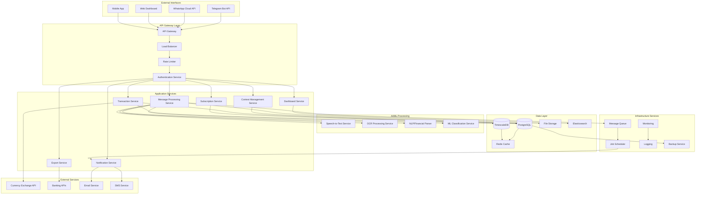
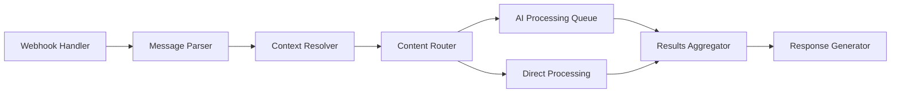
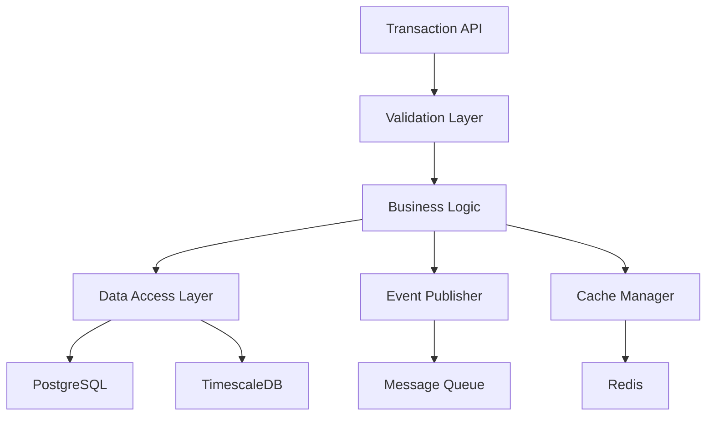
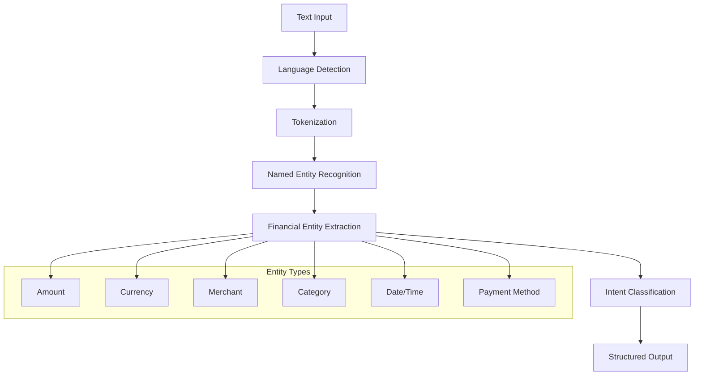
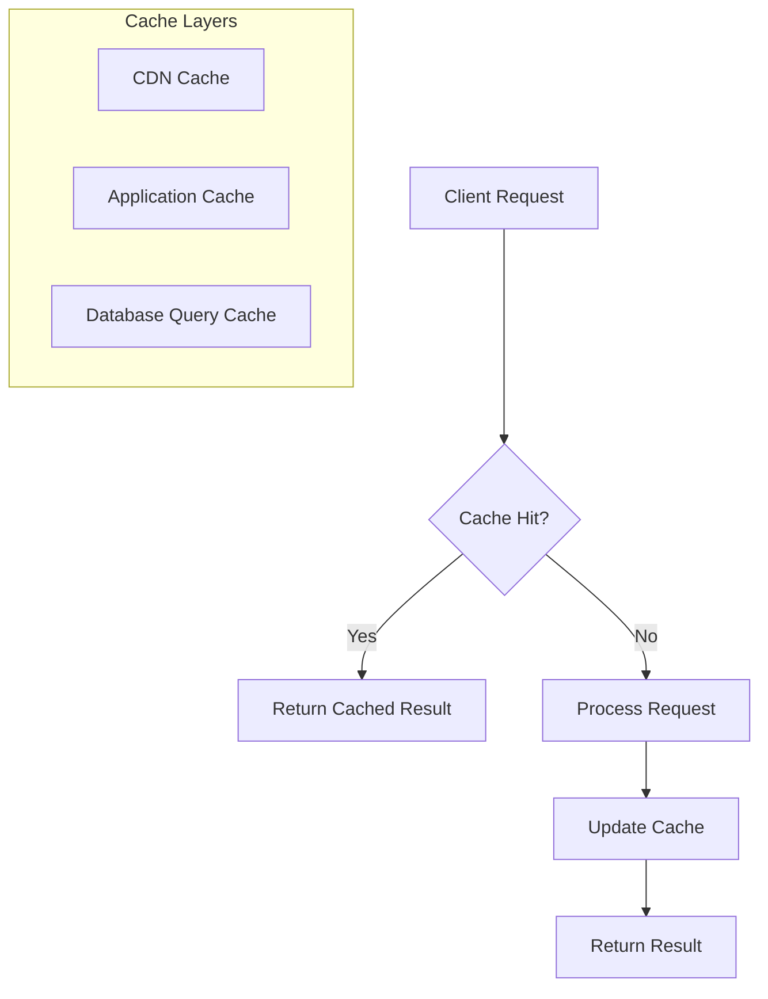

# High-Level Architecture
## Financy System Architecture Overview

**Version**: 1.0  
**Last Updated**: 2025-10-18  
**Scope**: Complete system architecture from messaging interfaces to data storage  

---

## Architecture Overview

### System Boundaries & Core Principles

#### Design Principles
1. **Context-First Architecture**: All data and operations organized around financial contexts
2. **Multi-Tenant by Design**: Complete isolation between users and contexts
3. **Event-Driven Processing**: Asynchronous message processing with event sourcing
4. **Microservices Architecture**: Loosely coupled services with clear boundaries
5. **API-First Design**: All functionality exposed through well-defined APIs
6. **Cloud-Native**: Built for cloud deployment with horizontal scaling capabilities

#### Key Quality Attributes
- **Scalability**: Handle 100K+ concurrent users with sub-second response times
- **Reliability**: 99.9% uptime with graceful degradation
- **Security**: End-to-end encryption with zero-trust architecture
- **Maintainability**: Clear service boundaries with comprehensive observability
- **Performance**: <3s message processing, <2s dashboard loading

---

## System Architecture Diagram



---

## Service Architecture Details

### API Gateway Layer

#### API Gateway
**Purpose**: Single entry point for all client requests
**Responsibilities**:
- Request routing to appropriate services
- Protocol translation (HTTP, WebSocket, Webhook)
- API versioning and backward compatibility
- Request/response transformation
- Cross-cutting concerns (CORS, compression)

**Technology Stack**: 
- **Primary**: Kong Gateway or AWS API Gateway
- **Alternative**: Envoy Proxy with custom control plane

#### Load Balancer
**Purpose**: Distribute traffic across service instances
**Responsibilities**:
- Health checking and failover
- SSL termination
- Geographic routing
- Traffic shaping and circuit breaking

#### Rate Limiter
**Purpose**: Protect services from abuse and ensure fair usage
**Responsibilities**:
- Per-user and per-API rate limiting
- Burst handling with token bucket algorithm
- Dynamic rate adjustment based on system load
- Premium user tier management

#### Authentication Service
**Purpose**: Centralized authentication and authorization
**Responsibilities**:
- JWT token generation and validation
- Multi-factor authentication
- OAuth integration (Telegram, WhatsApp, Google)
- Session management and revocation
- Context-based permission validation

**Data Flow**:
```
Client Request → API Gateway → Authentication Service → Target Service
                    ↓
               [JWT Token Validation]
                    ↓
               [Context Permission Check]
                    ↓
               [Request Forwarding with User Context]
```

---

### Application Services

#### Message Processing Service
**Purpose**: Handle incoming messages from messaging platforms
**Responsibilities**:
- Webhook endpoint management
- Message format standardization
- Content extraction and validation
- Context resolution and routing
- Asynchronous processing coordination

**Service Interface**:
```typescript
interface MessageProcessingService {
  processIncomingMessage(webhookData: WebhookPayload): Promise<ProcessingResult>
  retryFailedMessage(messageId: string): Promise<ProcessingResult>
  getProcessingStatus(messageId: string): Promise<ProcessingStatus>
}
```

**Internal Architecture**:


#### Context Management Service
**Purpose**: Manage financial contexts and user permissions
**Responsibilities**:
- Context creation and lifecycle management
- Member invitation and permission management
- Context settings and configuration
- Multi-tenant data isolation
- Context archival and deletion

**Core Entities**:
```typescript
interface Context {
  id: string
  name: string
  type: 'personal' | 'family' | 'project' | 'travel'
  owner_id: string
  settings: ContextSettings
  members: ContextMember[]
  created_at: Date
  archived_at?: Date
}

interface ContextMember {
  user_id: string
  role: 'owner' | 'admin' | 'editor' | 'viewer'
  permissions: Permission[]
  joined_at: Date
}
```

#### Transaction Service
**Purpose**: Core financial transaction management
**Responsibilities**:
- Transaction CRUD operations
- Category management and classification
- Multi-currency handling
- Transaction validation and enrichment
- Historical data management

**Service Architecture**:


#### Subscription Service
**Purpose**: Manage recurring payments and subscriptions
**Responsibilities**:
- Subscription detection and classification
- Recurring payment scheduling
- Subscription lifecycle management
- Usage analytics and optimization suggestions
- Renewal notifications

#### Notification Service
**Purpose**: Handle all user notifications and alerts
**Responsibilities**:
- Multi-channel notification delivery
- Notification preferences management
- Template management and localization
- Delivery tracking and retry logic
- Notification scheduling

---

### AI/ML Processing Layer

#### Speech-to-Text Service
**Purpose**: Convert voice messages to text
**Technology**: OpenAI Whisper or Google Cloud Speech-to-Text
**Responsibilities**:
- Audio preprocessing and noise reduction
- Multi-language transcription (Portuguese, English)
- Confidence scoring and error handling
- Regional accent adaptation

**Processing Pipeline**:


#### OCR Processing Service
**Purpose**: Extract text from receipt and document images
**Technology**: Google Vision API with custom preprocessing
**Responsibilities**:
- Image preprocessing and enhancement
- Text extraction and field recognition
- Receipt-specific field extraction
- Multi-language OCR support

#### NLP/Financial Parser
**Purpose**: Extract financial information from natural language
**Technology**: Custom NLP models with spaCy/Transformers
**Responsibilities**:
- Financial entity extraction (amounts, dates, merchants)
- Intent classification and context understanding
- Multi-language support (Portuguese, English)
- Confidence scoring and ambiguity resolution

**Extraction Pipeline**:


#### ML Classification Service
**Purpose**: Intelligent categorization and pattern recognition
**Technology**: Scikit-learn with custom financial models
**Responsibilities**:
- Transaction categorization
- Subscription pattern detection
- Anomaly detection
- Spending pattern analysis

---

### Data Architecture

#### Primary Database (PostgreSQL)
**Purpose**: Primary transactional data storage
**Schema Design**:
- **Multi-tenant**: All tables include context_id for isolation
- **Audit Trail**: Full change tracking with temporal tables
- **Referential Integrity**: Strong consistency with foreign keys
- **Performance**: Optimized indexes for common query patterns

**Key Tables**:
```sql
-- Core entities
contexts
users
context_members
transactions
categories
subscriptions
notifications

-- Audit and metadata
audit_log
processing_jobs
system_events
```

#### Time-Series Database (TimescaleDB)
**Purpose**: High-performance analytics and time-series data
**Use Cases**:
- Transaction time-series analysis
- Spending trend calculations
- Real-time dashboard metrics
- Historical aggregations

#### Cache Layer (Redis)
**Purpose**: High-performance caching and session storage
**Cache Strategies**:
- **Session Data**: User authentication and context information
- **Query Results**: Frequently accessed financial summaries
- **AI Results**: NLP and OCR processing results
- **Rate Limiting**: Token bucket counters

#### File Storage (S3-compatible)
**Purpose**: Receipt images and document storage
**Organization**:
```
/financy-storage/
├── receipts/
│   ├── {context_id}/
│   │   └── {transaction_id}/
│   │       ├── original.jpg
│   │       ├── processed.jpg
│   │       └── metadata.json
├── exports/
│   ├── {user_id}/
│   │   └── {export_id}.{format}
└── temp/
    └── {processing_id}/
```

#### Search Engine (Elasticsearch)
**Purpose**: Full-text search and analytics
**Indexed Data**:
- Transaction descriptions and metadata
- Receipt OCR text content
- User-generated notes and comments
- Category and tag information

---

## Deployment Architecture

### Cloud Infrastructure

#### Container Orchestration
**Platform**: Kubernetes (EKS/GKE)
**Benefits**:
- Automatic scaling and load balancing
- Rolling deployments with zero downtime
- Health checking and self-healing
- Resource optimization and cost management

#### Service Mesh
**Technology**: Istio or Linkerd
**Capabilities**:
- Service-to-service encryption
- Traffic management and circuit breaking
- Observability and distributed tracing
- Security policy enforcement

#### Infrastructure as Code
**Technology**: Terraform with Helm charts
**Components**:
- Cloud resource provisioning
- Kubernetes cluster configuration
- Application deployment manifests
- Environment-specific configurations

### Environment Strategy

#### Development Environment
- **Purpose**: Individual developer testing
- **Scale**: Single instance per service
- **Data**: Synthetic test data
- **AI Services**: Mock implementations

#### Staging Environment
- **Purpose**: Integration testing and QA
- **Scale**: Reduced production replica
- **Data**: Anonymized production data subset
- **AI Services**: Full integration with test keys

#### Production Environment
- **Purpose**: Live user traffic
- **Scale**: Auto-scaling based on demand
- **Data**: Live user data with full security
- **AI Services**: Production APIs with monitoring

---

## Scalability Architecture

### Horizontal Scaling Strategy

#### Stateless Services
- All application services designed as stateless
- Session state stored in Redis cluster
- Database connections through connection pooling
- Auto-scaling based on CPU, memory, and custom metrics

#### Database Scaling
- **Read Replicas**: Multiple read-only replicas for analytics
- **Sharding Strategy**: Context-based sharding for large datasets
- **Connection Pooling**: PgBouncer for efficient connection management
- **Query Optimization**: Automatic query analysis and optimization

#### Message Queue Scaling
- **Horizontal Partitioning**: Topic-based message distribution
- **Consumer Groups**: Parallel processing with guaranteed delivery
- **Dead Letter Queues**: Failed message handling and retry logic
- **Backpressure Management**: Dynamic throttling during high load

### Performance Optimization

#### Caching Strategy


#### CDN Strategy
- **Static Assets**: JavaScript, CSS, images served from CDN
- **API Responses**: Cacheable API responses with appropriate TTLs
- **Geographic Distribution**: Global edge locations for reduced latency
- **Cache Invalidation**: Event-driven cache purging

---

## Security Architecture

### Zero-Trust Network Model
- **Service-to-Service**: mTLS encryption for all internal communication
- **Network Segmentation**: Microsegmentation with network policies
- **Identity Verification**: Every request authenticated and authorized
- **Principle of Least Privilege**: Minimal required permissions only

### Data Protection
- **Encryption at Rest**: AES-256 encryption for all stored data
- **Encryption in Transit**: TLS 1.3 for all network communication
- **Key Management**: AWS KMS or Google Cloud KMS for key rotation
- **Data Masking**: PII redaction in logs and non-production environments

### API Security
- **Authentication**: JWT tokens with short expiration
- **Authorization**: Role-based access control (RBAC)
- **Rate Limiting**: Per-user and per-endpoint rate limits
- **Input Validation**: Comprehensive input sanitization and validation

---

## Disaster Recovery & Business Continuity

### Backup Strategy
- **Database Backups**: Automated daily backups with point-in-time recovery
- **File Storage**: Cross-region replication with versioning
- **Configuration**: Infrastructure and application configuration in version control
- **Testing**: Monthly backup restoration testing

### High Availability
- **Multi-AZ Deployment**: Services distributed across availability zones
- **Database Clustering**: Primary-replica setup with automatic failover
- **Load Balancing**: Health checks with automatic traffic rerouting
- **Circuit Breakers**: Failure isolation and graceful degradation

### Monitoring & Alerting
- **Health Checks**: Comprehensive service health monitoring
- **Performance Metrics**: Real-time performance and resource monitoring
- **Error Tracking**: Automatic error detection and alerting
- **Business Metrics**: Key performance indicator monitoring

This high-level architecture provides a scalable, secure, and maintainable foundation for the Financy platform, supporting both current requirements and future growth.