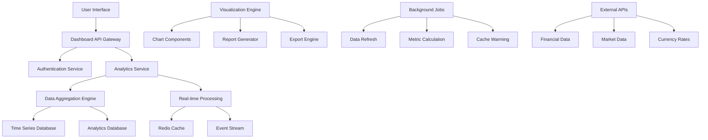

# Analytics Dashboard
## Financy Business Intelligence & Data Visualization Platform

**Version**: 1.0  
**Last Updated**: 2025-10-19  
**Scope**: Complete dashboard architecture, visualization components, and analytics framework  

---

## Overview

Financy's analytics dashboard provides comprehensive business intelligence capabilities for both users and internal teams. The platform delivers real-time insights, interactive visualizations, and actionable financial intelligence through modern, responsive interfaces.

### Key Components
1. **User Dashboards**: Personal financial insights and context-specific analytics
2. **Admin Dashboards**: Platform metrics, user behavior, and business intelligence
3. **Real-time Analytics**: Live data streaming and instant metric updates
4. **Custom Reports**: Ad-hoc analysis and automated report generation
5. **Data Export**: Flexible data extraction and sharing capabilities

---

## Dashboard Architecture

### System Architecture


### Technology Stack
```typescript
interface DashboardTechStack {
  frontend: FrontendStack;
  backend: BackendStack;
  data: DataStack;
  visualization: VisualizationStack;
  infrastructure: InfrastructureStack;
}

const DASHBOARD_TECH_STACK: DashboardTechStack = {
  frontend: {
    framework: 'React 18',
    ui_library: 'Mantine UI',
    state_management: 'Zustand',
    charts: 'Recharts + D3.js',
    build_tool: 'Vite',
    testing: 'Jest + React Testing Library'
  },
  backend: {
    framework: 'NestJS',
    api_design: 'GraphQL + REST',
    caching: 'Redis',
    session_management: 'JWT + Refresh Tokens',
    validation: 'Joi + Class Validator'
  },
  data: {
    primary_db: 'PostgreSQL',
    analytics_db: 'ClickHouse',
    time_series: 'TimescaleDB',
    search: 'Elasticsearch',
    streaming: 'Apache Kafka'
  },
  visualization: {
    charting_library: 'Recharts',
    advanced_viz: 'D3.js',
    report_engine: 'React-PDF',
    export_formats: ['PDF', 'Excel', 'CSV', 'JSON'],
    real_time: 'WebSocket + Server-Sent Events'
  },
  infrastructure: {
    hosting: 'AWS',
    cdn: 'CloudFront',
    monitoring: 'DataDog',
    error_tracking: 'Sentry',
    performance: 'New Relic'
  }
};
```

### Dashboard Types & Permissions
```typescript
interface DashboardConfiguration {
  dashboard_type: DashboardType;
  access_level: AccessLevel;
  user_roles: UserRole[];
  data_scope: DataScope;
  refresh_intervals: RefreshInterval[];
  customization_level: CustomizationLevel;
}

type DashboardType = 
  | 'personal_overview'
  | 'context_analytics'
  | 'budget_tracking'
  | 'investment_portfolio'
  | 'admin_platform'
  | 'operations_monitoring'
  | 'financial_reporting'
  | 'user_engagement'
  | 'security_monitoring';

type AccessLevel = 'public' | 'authenticated' | 'context_member' | 'admin' | 'super_admin';
type UserRole = 'viewer' | 'analyst' | 'manager' | 'admin';
type DataScope = 'personal' | 'context' | 'tenant' | 'platform' | 'global';
type CustomizationLevel = 'none' | 'layout' | 'widgets' | 'full';

const DASHBOARD_CONFIGURATIONS: Record<DashboardType, DashboardConfiguration> = {
  personal_overview: {
    dashboard_type: 'personal_overview',
    access_level: 'authenticated',
    user_roles: ['viewer'],
    data_scope: 'personal',
    refresh_intervals: ['real_time', '5min', '15min', 'hourly'],
    customization_level: 'layout'
  },
  context_analytics: {
    dashboard_type: 'context_analytics',
    access_level: 'context_member',
    user_roles: ['viewer', 'analyst'],
    data_scope: 'context',
    refresh_intervals: ['real_time', '5min', '15min', 'hourly'],
    customization_level: 'widgets'
  },
  admin_platform: {
    dashboard_type: 'admin_platform',
    access_level: 'admin',
    user_roles: ['admin'],
    data_scope: 'platform',
    refresh_intervals: ['real_time', '1min', '5min'],
    customization_level: 'full'
  },
  operations_monitoring: {
    dashboard_type: 'operations_monitoring',
    access_level: 'admin',
    user_roles: ['admin', 'manager'],
    data_scope: 'global',
    refresh_intervals: ['real_time', '30sec', '1min'],
    customization_level: 'full'
  }
};
```

---

## User Dashboard Components

### Personal Financial Overview
```typescript
interface PersonalDashboard {
  user_id: string;
  layout: DashboardLayout;
  widgets: DashboardWidget[];
  preferences: DashboardPreferences;
  last_updated: Date;
}

interface DashboardWidget {
  widget_id: string;
  widget_type: WidgetType;
  title: string;
  position: WidgetPosition;
  size: WidgetSize;
  data_source: DataSource;
  configuration: WidgetConfiguration;
  permissions: WidgetPermissions;
}

type WidgetType = 
  | 'spending_summary'
  | 'budget_progress'
  | 'category_breakdown'
  | 'spending_trends'
  | 'recent_transactions'
  | 'subscription_tracker'
  | 'goal_progress'
  | 'cash_flow_chart'
  | 'expense_heatmap'
  | 'comparative_analysis'
  | 'ai_insights'
  | 'quick_actions';

const PERSONAL_DASHBOARD_WIDGETS: DashboardWidget[] = [
  {
    widget_id: 'spending_summary_001',
    widget_type: 'spending_summary',
    title: 'Monthly Spending Summary',
    position: { row: 1, col: 1 },
    size: { width: 6, height: 4 },
    data_source: {
      type: 'aggregated_transactions',
      time_range: 'current_month',
      grouping: 'category',
      filters: ['user_contexts']
    },
    configuration: {
      chart_type: 'donut',
      currency_display: 'context_default',
      show_percentages: true,
      color_scheme: 'financy_primary',
      animation_enabled: true,
      interactive: true
    },
    permissions: {
      can_export: true,
      can_customize: true,
      can_share: false
    }
  },
  {
    widget_id: 'budget_progress_001',
    widget_type: 'budget_progress',
    title: 'Budget Progress',
    position: { row: 1, col: 7 },
    size: { width: 6, height: 4 },
    data_source: {
      type: 'budget_tracking',
      time_range: 'current_month',
      include_projections: true
    },
    configuration: {
      chart_type: 'progress_bars',
      show_variance: true,
      alert_thresholds: [80, 95, 100],
      projection_enabled: true
    },
    permissions: {
      can_export: true,
      can_customize: true,
      can_share: true
    }
  },
  {
    widget_id: 'spending_trends_001',
    widget_type: 'spending_trends',
    title: 'Spending Trends (Last 6 Months)',
    position: { row: 5, col: 1 },
    size: { width: 12, height: 6 },
    data_source: {
      type: 'time_series_spending',
      time_range: 'last_6_months',
      granularity: 'monthly',
      include_forecast: true
    },
    configuration: {
      chart_type: 'line_with_area',
      show_trend_lines: true,
      show_anomalies: true,
      forecast_periods: 2,
      interactive_zoom: true
    },
    permissions: {
      can_export: true,
      can_customize: true,
      can_share: true
    }
  },
  {
    widget_id: 'ai_insights_001',
    widget_type: 'ai_insights',
    title: 'Financial Insights',
    position: { row: 11, col: 1 },
    size: { width: 6, height: 4 },
    data_source: {
      type: 'ai_generated_insights',
      analysis_period: 'last_30_days',
      insight_types: ['spending_patterns', 'budget_recommendations', 'savings_opportunities']
    },
    configuration: {
      display_type: 'card_carousel',
      max_insights: 5,
      confidence_threshold: 0.7,
      auto_refresh: true
    },
    permissions: {
      can_export: false,
      can_customize: false,
      can_share: false
    }
  }
];
```

### Context Analytics Dashboard
```typescript
interface ContextAnalyticsDashboard {
  context_id: string;
  context_type: 'personal' | 'family' | 'project' | 'travel';
  member_count: number;
  analytics_widgets: ContextWidget[];
  collaboration_features: CollaborationFeature[];
  sharing_settings: SharingSettings;
}

interface ContextWidget extends DashboardWidget {
  multi_user_data: boolean;
  split_analysis: boolean;
  member_permissions: Record<string, WidgetPermission>;
}

const CONTEXT_ANALYTICS_WIDGETS: ContextWidget[] = [
  {
    widget_id: 'context_overview_001',
    widget_type: 'spending_summary',
    title: 'Context Spending Overview',
    position: { row: 1, col: 1 },
    size: { width: 8, height: 5 },
    data_source: {
      type: 'context_transactions',
      time_range: 'current_month',
      include_all_members: true,
      currency: 'context_default'
    },
    configuration: {
      chart_type: 'treemap',
      show_member_breakdown: true,
      drill_down_enabled: true,
      comparative_period: 'previous_month'
    },
    permissions: {
      can_export: true,
      can_customize: true,
      can_share: true
    },
    multi_user_data: true,
    split_analysis: true,
    member_permissions: {
      'owner': 'full_access',
      'admin': 'view_and_edit',
      'member': 'view_only'
    }
  },
  {
    widget_id: 'member_contributions_001',
    widget_type: 'comparative_analysis',
    title: 'Member Contributions',
    position: { row: 1, col: 9 },
    size: { width: 4, height: 5 },
    data_source: {
      type: 'member_spending_analysis',
      time_range: 'current_month',
      comparison_metric: 'total_spending'
    },
    configuration: {
      chart_type: 'horizontal_bar',
      show_percentages: true,
      show_trends: true,
      member_anonymization: false
    },
    permissions: {
      can_export: true,
      can_customize: false,
      can_share: false
    },
    multi_user_data: true,
    split_analysis: true,
    member_permissions: {
      'owner': 'full_access',
      'admin': 'view_and_edit',
      'member': 'view_anonymized'
    }
  },
  {
    widget_id: 'expense_splits_001',
    widget_type: 'expense_heatmap',
    title: 'Expense Split Analysis',
    position: { row: 6, col: 1 },
    size: { width: 12, height: 6 },
    data_source: {
      type: 'split_transactions',
      time_range: 'last_3_months',
      include_pending_splits: true
    },
    configuration: {
      chart_type: 'split_flow_diagram',
      show_pending_approvals: true,
      member_color_coding: true,
      interactive_filters: true
    },
    permissions: {
      can_export: true,
      can_customize: true,
      can_share: true
    },
    multi_user_data: true,
    split_analysis: true,
    member_permissions: {
      'owner': 'full_access',
      'admin': 'full_access',
      'member': 'view_own_splits'
    }
  }
];
```

---

## Data Aggregation & Processing

### Real-Time Analytics Engine
```typescript
interface AnalyticsEngine {
  data_sources: DataSource[];
  processing_pipelines: ProcessingPipeline[];
  aggregation_rules: AggregationRule[];
  caching_strategy: CachingStrategy;
  performance_optimization: PerformanceConfig;
}

interface ProcessingPipeline {
  pipeline_id: string;
  name: string;
  input_sources: string[];
  processing_steps: ProcessingStep[];
  output_destinations: string[];
  schedule: ProcessingSchedule;
  error_handling: ErrorHandlingConfig;
}

interface ProcessingStep {
  step_id: string;
  step_type: 'filter' | 'transform' | 'aggregate' | 'enrich' | 'validate';
  configuration: StepConfiguration;
  performance_requirements: PerformanceRequirements;
}

const ANALYTICS_PIPELINES: ProcessingPipeline[] = [
  {
    pipeline_id: 'real_time_spending_aggregation',
    name: 'Real-time Spending Aggregation',
    input_sources: ['transaction_stream', 'split_updates'],
    processing_steps: [
      {
        step_id: 'currency_normalization',
        step_type: 'transform',
        configuration: {
          operation: 'currency_conversion',
          target_currency: 'context_default',
          exchange_rate_source: 'real_time_rates'
        },
        performance_requirements: {
          max_latency_ms: 100,
          throughput_per_second: 1000
        }
      },
      {
        step_id: 'category_aggregation',
        step_type: 'aggregate',
        configuration: {
          group_by: ['context_id', 'category_id', 'user_id'],
          aggregations: ['sum', 'count', 'avg'],
          time_windows: ['1h', '1d', '1w', '1m']
        },
        performance_requirements: {
          max_latency_ms: 200,
          throughput_per_second: 500
        }
      },
      {
        step_id: 'budget_comparison',
        step_type: 'enrich',
        configuration: {
          lookup_source: 'budget_settings',
          comparison_metrics: ['percentage_used', 'remaining_amount', 'projected_overspend'],
          alert_thresholds: [75, 90, 100]
        },
        performance_requirements: {
          max_latency_ms: 150,
          throughput_per_second: 300
        }
      }
    ],
    output_destinations: ['analytics_cache', 'dashboard_api', 'notification_triggers'],
    schedule: {
      type: 'continuous_streaming',
      batch_size: 100,
      max_delay_ms: 1000
    },
    error_handling: {
      retry_policy: {
        max_attempts: 3,
        backoff_strategy: 'exponential'
      },
      dead_letter_queue: 'failed_analytics_processing',
      monitoring_alerts: true
    }
  },
  {
    pipeline_id: 'daily_insights_generation',
    name: 'Daily AI Insights Generation',
    input_sources: ['transactions', 'spending_patterns', 'user_behavior'],
    processing_steps: [
      {
        step_id: 'pattern_analysis',
        step_type: 'transform',
        configuration: {
          analysis_type: 'spending_pattern_detection',
          lookback_period: '30d',
          minimum_confidence: 0.7
        },
        performance_requirements: {
          max_latency_ms: 30000,
          throughput_per_second: 10
        }
      },
      {
        step_id: 'insight_generation',
        step_type: 'enrich',
        configuration: {
          ai_model: 'financial_insights_v2',
          insight_types: ['anomalies', 'trends', 'recommendations'],
          personalization_level: 'high'
        },
        performance_requirements: {
          max_latency_ms: 60000,
          throughput_per_second: 5
        }
      },
      {
        step_id: 'relevance_scoring',
        step_type: 'filter',
        configuration: {
          scoring_algorithm: 'user_engagement_based',
          minimum_relevance_score: 0.6,
          max_insights_per_user: 5
        },
        performance_requirements: {
          max_latency_ms: 5000,
          throughput_per_second: 50
        }
      }
    ],
    output_destinations: ['insights_cache', 'notification_queue'],
    schedule: {
      type: 'cron',
      expression: '0 6 * * *', // Daily at 6 AM
      timezone: 'America/Sao_Paulo'
    },
    error_handling: {
      retry_policy: {
        max_attempts: 2,
        backoff_strategy: 'fixed',
        delay_ms: 300000
      },
      fallback_strategy: 'use_previous_insights',
      monitoring_alerts: true
    }
  }
];
```

### Data Aggregation Rules
```typescript
interface AggregationRule {
  rule_id: string;
  name: string;
  source_table: string;
  target_table: string;
  aggregation_type: AggregationType;
  grouping_columns: string[];
  aggregation_columns: AggregationColumn[];
  time_partitioning: TimePartitioning;
  refresh_strategy: RefreshStrategy;
}

interface AggregationColumn {
  source_column: string;
  target_column: string;
  aggregation_function: 'sum' | 'count' | 'avg' | 'min' | 'max' | 'stddev' | 'percentile';
  filter_conditions?: FilterCondition[];
}

const AGGREGATION_RULES: AggregationRule[] = [
  {
    rule_id: 'daily_spending_by_context',
    name: 'Daily Spending Aggregation by Context',
    source_table: 'transactions',
    target_table: 'daily_spending_summary',
    aggregation_type: 'time_series',
    grouping_columns: ['context_id', 'category_id', 'date_trunc(day, transaction_date)'],
    aggregation_columns: [
      {
        source_column: 'amount_in_context_currency',
        target_column: 'total_amount',
        aggregation_function: 'sum'
      },
      {
        source_column: 'id',
        target_column: 'transaction_count',
        aggregation_function: 'count'
      },
      {
        source_column: 'amount_in_context_currency',
        target_column: 'average_amount',
        aggregation_function: 'avg'
      }
    ],
    time_partitioning: {
      column: 'transaction_date',
      granularity: 'daily',
      retention_period: '2_years'
    },
    refresh_strategy: {
      type: 'incremental',
      trigger: 'transaction_insert',
      delay_minutes: 5
    }
  },
  {
    rule_id: 'monthly_category_trends',
    name: 'Monthly Category Spending Trends',
    source_table: 'daily_spending_summary',
    target_table: 'monthly_category_trends',
    aggregation_type: 'rolling_window',
    grouping_columns: ['context_id', 'category_id', 'date_trunc(month, day)'],
    aggregation_columns: [
      {
        source_column: 'total_amount',
        target_column: 'monthly_total',
        aggregation_function: 'sum'
      },
      {
        source_column: 'transaction_count',
        target_column: 'monthly_transactions',
        aggregation_function: 'sum'
      },
      {
        source_column: 'total_amount',
        target_column: 'daily_variance',
        aggregation_function: 'stddev'
      }
    ],
    time_partitioning: {
      column: 'month',
      granularity: 'monthly',
      retention_period: '5_years'
    },
    refresh_strategy: {
      type: 'batch',
      schedule: '0 2 1 * *', // First day of month at 2 AM
      full_refresh_frequency: 'quarterly'
    }
  },
  {
    rule_id: 'user_engagement_metrics',
    name: 'User Engagement Metrics',
    source_table: 'user_activity_events',
    target_table: 'user_engagement_summary',
    aggregation_type: 'behavioral',
    grouping_columns: ['user_id', 'date_trunc(week, event_timestamp)'],
    aggregation_columns: [
      {
        source_column: 'event_type',
        target_column: 'sessions_count',
        aggregation_function: 'count',
        filter_conditions: [{ column: 'event_type', operator: '=', value: 'session_start' }]
      },
      {
        source_column: 'event_type',
        target_column: 'transactions_added',
        aggregation_function: 'count',
        filter_conditions: [{ column: 'event_type', operator: '=', value: 'transaction_created' }]
      },
      {
        source_column: 'session_duration_minutes',
        target_column: 'avg_session_duration',
        aggregation_function: 'avg'
      }
    ],
    time_partitioning: {
      column: 'week',
      granularity: 'weekly',
      retention_period: '1_year'
    },
    refresh_strategy: {
      type: 'incremental',
      trigger: 'activity_event_insert',
      delay_minutes: 30
    }
  }
];
```

---

## Visualization Components

### Chart Component Library
```typescript
interface ChartComponent {
  component_id: string;
  chart_type: ChartType;
  data_requirements: DataRequirement[];
  configuration_options: ConfigurationOption[];
  interaction_capabilities: InteractionCapability[];
  export_formats: ExportFormat[];
  performance_characteristics: PerformanceCharacteristics;
}

type ChartType = 
  | 'line_chart'
  | 'area_chart'
  | 'bar_chart'
  | 'pie_chart'
  | 'donut_chart'
  | 'treemap'
  | 'heatmap'
  | 'scatter_plot'
  | 'candlestick'
  | 'funnel_chart'
  | 'sankey_diagram'
  | 'geographic_map'
  | 'gauge_chart'
  | 'waterfall_chart';

const CHART_COMPONENTS: ChartComponent[] = [
  {
    component_id: 'spending_trends_line',
    chart_type: 'line_chart',
    data_requirements: [
      {
        field: 'date',
        type: 'datetime',
        required: true,
        description: 'Transaction date or aggregation period'
      },
      {
        field: 'amount',
        type: 'number',
        required: true,
        description: 'Spending amount in normalized currency'
      },
      {
        field: 'category',
        type: 'string',
        required: false,
        description: 'Category for multi-series display'
      }
    ],
    configuration_options: [
      {
        option: 'show_trend_line',
        type: 'boolean',
        default_value: true,
        description: 'Display trend line overlay'
      },
      {
        option: 'time_granularity',
        type: 'enum',
        possible_values: ['daily', 'weekly', 'monthly'],
        default_value: 'daily',
        description: 'Time axis granularity'
      },
      {
        option: 'smooth_curve',
        type: 'boolean',
        default_value: false,
        description: 'Use smooth curves instead of straight lines'
      },
      {
        option: 'fill_area',
        type: 'boolean',
        default_value: false,
        description: 'Fill area under the line'
      }
    ],
    interaction_capabilities: [
      'zoom_and_pan',
      'hover_tooltips',
      'click_drill_down',
      'brush_selection',
      'legend_toggle'
    ],
    export_formats: ['PNG', 'SVG', 'PDF', 'CSV'],
    performance_characteristics: {
      max_data_points: 10000,
      render_time_ms: 500,
      memory_usage_mb: 50,
      update_frequency: 'real_time'
    }
  },
  {
    component_id: 'category_breakdown_treemap',
    chart_type: 'treemap',
    data_requirements: [
      {
        field: 'category',
        type: 'string',
        required: true,
        description: 'Category name'
      },
      {
        field: 'amount',
        type: 'number',
        required: true,
        description: 'Category total amount'
      },
      {
        field: 'subcategory',
        type: 'string',
        required: false,
        description: 'Subcategory for hierarchical display'
      },
      {
        field: 'percentage',
        type: 'number',
        required: false,
        description: 'Percentage of total spending'
      }
    ],
    configuration_options: [
      {
        option: 'hierarchical_levels',
        type: 'number',
        default_value: 2,
        description: 'Number of hierarchy levels to display'
      },
      {
        option: 'color_scheme',
        type: 'enum',
        possible_values: ['category_based', 'amount_based', 'custom'],
        default_value: 'category_based',
        description: 'Coloring strategy'
      },
      {
        option: 'label_threshold',
        type: 'number',
        default_value: 5,
        description: 'Minimum percentage to show labels'
      }
    ],
    interaction_capabilities: [
      'hover_tooltips',
      'click_drill_down',
      'zoom_in_out',
      'breadcrumb_navigation'
    ],
    export_formats: ['PNG', 'SVG', 'PDF'],
    performance_characteristics: {
      max_data_points: 1000,
      render_time_ms: 300,
      memory_usage_mb: 30,
      update_frequency: 'on_demand'
    }
  },
  {
    component_id: 'budget_progress_gauge',
    chart_type: 'gauge_chart',
    data_requirements: [
      {
        field: 'current_amount',
        type: 'number',
        required: true,
        description: 'Current spending amount'
      },
      {
        field: 'budget_amount',
        type: 'number',
        required: true,
        description: 'Total budget amount'
      },
      {
        field: 'period_progress',
        type: 'number',
        required: false,
        description: 'Percentage of time period elapsed'
      }
    ],
    configuration_options: [
      {
        option: 'warning_threshold',
        type: 'number',
        default_value: 80,
        description: 'Warning threshold percentage'
      },
      {
        option: 'danger_threshold',
        type: 'number',
        default_value: 95,
        description: 'Danger threshold percentage'
      },
      {
        option: 'show_projection',
        type: 'boolean',
        default_value: true,
        description: 'Show projected end-of-period spending'
      }
    ],
    interaction_capabilities: [
      'hover_tooltips',
      'click_details'
    ],
    export_formats: ['PNG', 'SVG'],
    performance_characteristics: {
      max_data_points: 1,
      render_time_ms: 100,
      memory_usage_mb: 5,
      update_frequency: 'real_time'
    }
  }
];
```

### Interactive Dashboard Builder
```typescript
interface DashboardBuilder {
  available_widgets: WidgetDefinition[];
  layout_templates: LayoutTemplate[];
  customization_options: CustomizationOption[];
  sharing_capabilities: SharingCapability[];
}

interface WidgetDefinition {
  widget_type: WidgetType;
  display_name: string;
  description: string;
  category: WidgetCategory;
  data_sources: string[];
  configuration_schema: JSONSchema;
  preview_image: string;
  complexity_level: 'basic' | 'intermediate' | 'advanced';
}

interface LayoutTemplate {
  template_id: string;
  name: string;
  description: string;
  target_audience: string[];
  grid_layout: GridLayout;
  predefined_widgets: PredefineWidget[];
  customization_allowed: boolean;
}

const DASHBOARD_WIDGET_LIBRARY: WidgetDefinition[] = [
  {
    widget_type: 'spending_summary',
    display_name: 'Spending Summary',
    description: 'Overview of spending by category with visual breakdown',
    category: 'financial_overview',
    data_sources: ['transactions', 'categories'],
    configuration_schema: {
      type: 'object',
      properties: {
        time_period: {
          type: 'string',
          enum: ['current_month', 'last_month', 'current_year', 'custom'],
          default: 'current_month'
        },
        chart_type: {
          type: 'string',
          enum: ['pie', 'donut', 'treemap', 'bar'],
          default: 'donut'
        },
        show_subcategories: {
          type: 'boolean',
          default: false
        },
        currency_display: {
          type: 'string',
          enum: ['original', 'context_default', 'user_preferred'],
          default: 'context_default'
        }
      }
    },
    preview_image: '/images/widgets/spending-summary-preview.png',
    complexity_level: 'basic'
  },
  {
    widget_type: 'ai_insights',
    display_name: 'AI Financial Insights',
    description: 'Personalized insights and recommendations powered by AI',
    category: 'intelligence',
    data_sources: ['ai_insights', 'user_behavior', 'transactions'],
    configuration_schema: {
      type: 'object',
      properties: {
        insight_types: {
          type: 'array',
          items: {
            type: 'string',
            enum: ['spending_patterns', 'budget_recommendations', 'anomaly_detection', 'savings_opportunities']
          },
          default: ['spending_patterns', 'budget_recommendations']
        },
        confidence_threshold: {
          type: 'number',
          minimum: 0.5,
          maximum: 1.0,
          default: 0.7
        },
        max_insights: {
          type: 'integer',
          minimum: 1,
          maximum: 10,
          default: 5
        },
        auto_refresh: {
          type: 'boolean',
          default: true
        }
      }
    },
    preview_image: '/images/widgets/ai-insights-preview.png',
    complexity_level: 'advanced'
  }
];

const LAYOUT_TEMPLATES: LayoutTemplate[] = [
  {
    template_id: 'personal_basic',
    name: 'Personal Finance Basics',
    description: 'Essential widgets for personal financial tracking',
    target_audience: ['new_users', 'basic_tracking'],
    grid_layout: {
      columns: 12,
      rows: 8,
      gap: 16,
      responsive_breakpoints: {
        mobile: { columns: 1 },
        tablet: { columns: 6 },
        desktop: { columns: 12 }
      }
    },
    predefined_widgets: [
      {
        widget_type: 'spending_summary',
        position: { row: 1, col: 1, width: 6, height: 3 },
        configuration: {
          time_period: 'current_month',
          chart_type: 'donut'
        }
      },
      {
        widget_type: 'budget_progress',
        position: { row: 1, col: 7, width: 6, height: 3 },
        configuration: {
          show_projections: true
        }
      },
      {
        widget_type: 'recent_transactions',
        position: { row: 4, col: 1, width: 12, height: 4 },
        configuration: {
          transaction_count: 10,
          show_categories: true
        }
      }
    ],
    customization_allowed: true
  },
  {
    template_id: 'context_collaborative',
    name: 'Collaborative Context Analytics',
    description: 'Multi-user analytics for shared financial contexts',
    target_audience: ['context_admins', 'family_managers'],
    grid_layout: {
      columns: 12,
      rows: 12,
      gap: 16,
      responsive_breakpoints: {
        mobile: { columns: 1 },
        tablet: { columns: 6 },
        desktop: { columns: 12 }
      }
    },
    predefined_widgets: [
      {
        widget_type: 'context_overview',
        position: { row: 1, col: 1, width: 8, height: 4 },
        configuration: {
          show_member_breakdown: true,
          time_period: 'current_month'
        }
      },
      {
        widget_type: 'member_contributions',
        position: { row: 1, col: 9, width: 4, height: 4 },
        configuration: {
          comparison_metric: 'total_spending',
          show_trends: true
        }
      },
      {
        widget_type: 'expense_splits',
        position: { row: 5, col: 1, width: 12, height: 4 },
        configuration: {
          show_pending_approvals: true,
          time_period: 'last_3_months'
        }
      },
      {
        widget_type: 'category_trends',
        position: { row: 9, col: 1, width: 8, height: 4 },
        configuration: {
          time_period: 'last_6_months',
          show_forecasts: true
        }
      },
      {
        widget_type: 'quick_actions',
        position: { row: 9, col: 9, width: 4, height: 4 },
        configuration: {
          actions: ['add_expense', 'split_transaction', 'export_data', 'invite_member']
        }
      }
    ],
    customization_allowed: true
  }
];
```

This comprehensive analytics dashboard documentation provides Financy with powerful business intelligence capabilities, enabling both users and administrators to gain deep insights into financial data through interactive visualizations and real-time analytics.