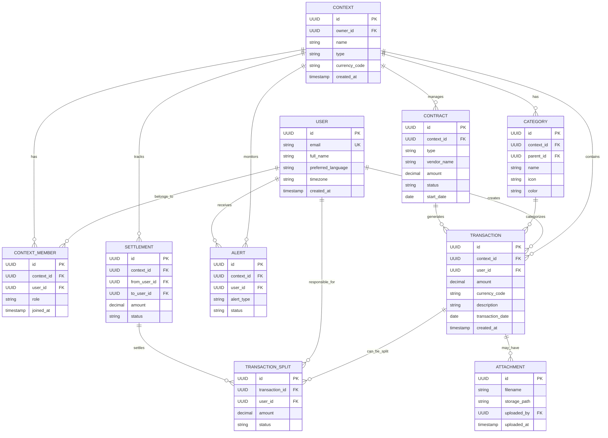

# Canonical Data Model
## Financy Core Data Entities and Relationships

**Version**: 1.0  
**Last Updated**: 2025-10-18  
**Scope**: Complete data model specification for all core business entities  

---

## Overview

The Financy canonical data model defines the authoritative structure for all financial data within the system. This model serves as the single source of truth for data contracts across all services and provides a foundation for data consistency, validation, and evolution.

### Design Principles
1. **Context-Centric**: All financial data is organized around contexts (personal, family, project)
2. **Immutable Financial Records**: Core transaction data is append-only with audit trails
3. **Multi-Currency Native**: Built-in support for currency conversion and global usage
4. **Event-Driven**: Data changes trigger events for real-time processing
5. **Extensible**: JSON metadata fields allow evolution without schema changes

---

## Core Entity Definitions

### User Entity

```typescript
interface User {
  // Identity
  id: UUID;
  email: string;
  phone_number?: string;
  
  // Platform Integration
  telegram_user_id?: number;
  whatsapp_user_id?: string;
  
  // Profile
  full_name?: string;
  preferred_language: LanguageCode; // ISO 639-1
  timezone: string; // IANA timezone
  
  // Preferences
  default_currency: CurrencyCode; // ISO 4217
  notification_preferences: NotificationPreferences;
  
  // Audit
  created_at: DateTime;
  updated_at: DateTime;
  deactivated_at?: DateTime;
}

interface NotificationPreferences {
  email_enabled: boolean;
  push_enabled: boolean;
  sms_enabled: boolean;
  quiet_hours: {
    start: string; // HH:MM format
    end: string;   // HH:MM format
    timezone: string;
  };
  frequency: {
    daily_summary: boolean;
    weekly_summary: boolean;
    monthly_summary: boolean;
    payment_reminders: boolean;
    budget_alerts: boolean;
  };
}

type LanguageCode = 'pt-BR' | 'en-US' | 'es-MX';
type CurrencyCode = 'BRL' | 'USD' | 'EUR' | 'MXN' | string; // ISO 4217
```

### Context Entity

```typescript
interface Context {
  // Identity
  id: UUID;
  name: string;
  type: ContextType;
  
  // Ownership
  owner_id: UUID; // Reference to User.id
  
  // Configuration
  currency_code: CurrencyCode;
  timezone: string;
  settings: ContextSettings;
  
  // Lifecycle
  created_at: DateTime;
  updated_at: DateTime;
  archived_at?: DateTime;
}

type ContextType = 'personal' | 'family' | 'project' | 'travel';

interface ContextSettings {
  // Sharing and Permissions
  default_member_role: MemberRole;
  require_approval_for_expenses: boolean;
  expense_approval_threshold?: Money;
  
  // Categorization
  auto_categorization_enabled: boolean;
  custom_categories_enabled: boolean;
  
  // Notifications
  member_notification_on_expense: boolean;
  daily_summary_enabled: boolean;
  budget_alerts_enabled: boolean;
  
  // Splitting Rules
  default_split_method: SplitMethod;
  split_rules: SplitRule[];
  
  // Integration
  calendar_integration_enabled: boolean;
  export_schedule?: ExportSchedule;
  
  // Metadata (extensible)
  metadata: Record<string, any>;
}

interface SplitRule {
  condition: SplitCondition;
  method: SplitMethod;
  parameters: Record<string, any>;
}

interface SplitCondition {
  category_ids?: UUID[];
  amount_range?: {
    min?: Money;
    max?: Money;
  };
  user_ids?: UUID[];
  merchant_patterns?: string[];
}

type SplitMethod = 'equal' | 'proportional' | 'custom' | 'percentage';
```

### Context Membership

```typescript
interface ContextMember {
  // Identity
  id: UUID;
  context_id: UUID;
  user_id: UUID;
  
  // Authorization
  role: MemberRole;
  permissions: Permission[];
  
  // Lifecycle
  joined_at: DateTime;
  left_at?: DateTime;
  
  // Member-specific settings
  notification_preferences?: NotificationPreferences;
  display_name?: string;
}

type MemberRole = 'owner' | 'admin' | 'editor' | 'viewer';

type Permission = 
  | 'create_transactions'
  | 'edit_transactions'
  | 'delete_transactions'
  | 'manage_categories'
  | 'manage_budgets'
  | 'invite_members'
  | 'manage_members'
  | 'export_data'
  | 'manage_settings';
```

### Transaction Entity

```typescript
interface Transaction {
  // Identity
  id: UUID;
  context_id: UUID;
  user_id: UUID; // User who created the transaction
  
  // Financial Data
  amount: Money;
  currency_code: CurrencyCode;
  amount_in_context_currency: Money;
  exchange_rate?: ExchangeRate;
  
  // Transaction Details
  description: string;
  merchant_name?: string;
  category_id?: UUID;
  tags: string[];
  notes?: string;
  
  // Temporal Information
  transaction_date: Date;
  transaction_time?: Time;
  
  // Processing Metadata
  input_method: InputMethod;
  confidence_score?: number; // 0.0 to 1.0
  processing_metadata: ProcessingMetadata;
  
  // Attachments
  receipt_attachments: Attachment[];
  
  // Status
  status: TransactionStatus;
  
  // Audit
  created_at: DateTime;
  updated_at: DateTime;
  deleted_at?: DateTime;
}

interface Money {
  amount: number; // Decimal precision to 2 places
  currency: CurrencyCode;
}

interface ExchangeRate {
  from_currency: CurrencyCode;
  to_currency: CurrencyCode;
  rate: number;
  rate_date: Date;
  provider: string; // 'ecb', 'fixer', 'xe', etc.
}

type InputMethod = 'text' | 'voice' | 'image' | 'manual' | 'import';

interface ProcessingMetadata {
  // Original input
  raw_input?: string;
  input_language?: LanguageCode;
  
  // AI/ML Processing
  nlp_confidence?: number;
  ocr_confidence?: number;
  asr_confidence?: number;
  
  // Extraction details
  extracted_entities: ExtractedEntity[];
  
  // Corrections
  user_corrections: UserCorrection[];
  
  // Platform-specific
  telegram_message_id?: number;
  whatsapp_message_id?: string;
  
  // Error handling
  processing_errors: ProcessingError[];
  retry_count: number;
}

interface ExtractedEntity {
  entity_type: EntityType;
  value: any;
  confidence: number;
  start_position?: number;
  end_position?: number;
  source: 'nlp' | 'ocr' | 'asr' | 'manual';
}

type EntityType = 
  | 'amount'
  | 'currency'
  | 'merchant'
  | 'category'
  | 'date'
  | 'time'
  | 'payment_method'
  | 'location';

interface UserCorrection {
  field: string;
  original_value: any;
  corrected_value: any;
  corrected_at: DateTime;
}

interface ProcessingError {
  error_type: string;
  error_message: string;
  occurred_at: DateTime;
  resolved: boolean;
}

type TransactionStatus = 'pending' | 'confirmed' | 'disputed' | 'cancelled';
```

### Category Entity

```typescript
interface Category {
  // Identity
  id: UUID;
  context_id: UUID;
  
  // Hierarchy
  parent_id?: UUID;
  name: string;
  full_path: string; // e.g., "Food & Dining > Restaurants"
  
  // Display
  icon: string; // Unicode emoji or icon identifier
  color: string; // Hex color code
  
  // Classification
  is_system: boolean; // System-defined vs user-defined
  is_income: boolean; // Income vs expense category
  
  // Rules
  auto_classification_rules: ClassificationRule[];
  
  // Statistics (computed)
  transaction_count: number;
  total_amount: Money;
  last_used_at?: DateTime;
  
  // Audit
  created_at: DateTime;
  updated_at: DateTime;
}

interface ClassificationRule {
  rule_type: 'keyword' | 'merchant' | 'amount_range' | 'pattern';
  pattern: string;
  confidence_weight: number;
  enabled: boolean;
}
```

### Contract Entity (Subscriptions & Installments)

```typescript
interface Contract {
  // Identity
  id: UUID;
  context_id: UUID;
  type: ContractType;
  
  // Contract Details
  vendor_name: string;
  description: string;
  category_id?: UUID;
  
  // Financial Terms
  amount: Money;
  currency_code: CurrencyCode;
  
  // Subscription Fields
  billing_cycle?: BillingCycle;
  billing_day?: number; // Day of month/week
  
  // Installment Fields
  total_installments?: number;
  remaining_installments?: number;
  installment_number?: number;
  
  // Schedule
  start_date: Date;
  end_date?: Date;
  next_billing_date?: Date;
  
  // Detection and Confidence
  detection_method: DetectionMethod;
  detection_confidence: number;
  
  // Status
  status: ContractStatus;
  
  // Linked Transactions
  transaction_ids: UUID[];
  
  // Metadata
  metadata: ContractMetadata;
  
  // Audit
  created_at: DateTime;
  updated_at: DateTime;
}

type ContractType = 'subscription' | 'installment';
type BillingCycle = 'weekly' | 'monthly' | 'quarterly' | 'yearly';
type DetectionMethod = 'automatic' | 'manual' | 'imported';
type ContractStatus = 'active' | 'paused' | 'cancelled' | 'completed' | 'defaulted';

interface ContractMetadata {
  // Subscription-specific
  plan_name?: string;
  subscriber_count?: number;
  free_trial_end?: Date;
  
  // Installment-specific
  interest_rate?: number;
  principal_amount?: Money;
  early_payoff_amount?: Money;
  
  // External references
  external_subscription_id?: string;
  external_contract_number?: string;
  
  // User preferences
  auto_renew?: boolean;
  renewal_notification_days?: number;
  
  // Provider information
  provider_contact?: string;
  provider_website?: string;
  
  // Cancellation info
  cancellation_method?: string;
  cancellation_deadline?: Date;
}
```

### Transaction Split Entity

```typescript
interface TransactionSplit {
  // Identity
  id: UUID;
  transaction_id: UUID;
  user_id: UUID;
  
  // Split Details
  amount: Money;
  currency_code: CurrencyCode;
  split_method: SplitMethod;
  percentage?: number; // For percentage-based splits
  
  // Status
  status: SplitStatus;
  
  // Settlement
  settlement_id?: UUID;
  paid_at?: DateTime;
  payment_method?: string;
  payment_reference?: string;
  
  // Audit
  created_at: DateTime;
  updated_at: DateTime;
}

type SplitStatus = 'pending' | 'confirmed' | 'paid' | 'disputed' | 'waived';
```

### Settlement Entity

```typescript
interface Settlement {
  // Identity
  id: UUID;
  context_id: UUID;
  
  // Parties
  from_user_id: UUID;
  to_user_id: UUID;
  
  // Financial Details
  amount: Money;
  currency_code: CurrencyCode;
  
  // Settlement Details
  settlement_method: SettlementMethod;
  reference_number?: string;
  notes?: string;
  
  // Linked Splits
  split_ids: UUID[];
  
  // Status and Timing
  status: SettlementStatus;
  settlement_date?: Date;
  confirmed_at?: DateTime;
  
  // Audit
  created_at: DateTime;
  updated_at: DateTime;
}

type SettlementMethod = 'pix' | 'bank_transfer' | 'cash' | 'credit_card' | 'other';
type SettlementStatus = 'pending' | 'confirmed' | 'completed' | 'failed' | 'cancelled';
```

### Alert Entity

```typescript
interface Alert {
  // Identity
  id: UUID;
  context_id: UUID;
  user_id?: UUID; // null for context-wide alerts
  
  // Alert Definition
  alert_type: AlertType;
  title: string;
  message: string;
  severity: AlertSeverity;
  
  // Triggering Conditions
  trigger_conditions: TriggerCondition[];
  
  // Scheduling
  schedule: AlertSchedule;
  
  // Delivery
  delivery_channels: DeliveryChannel[];
  delivery_preferences: DeliveryPreferences;
  
  // Status
  status: AlertStatus;
  last_triggered_at?: DateTime;
  trigger_count: number;
  
  // Audit
  created_at: DateTime;
  updated_at: DateTime;
  disabled_at?: DateTime;
}

type AlertType = 
  | 'budget_exceeded'
  | 'spending_threshold'
  | 'payment_due'
  | 'subscription_renewal'
  | 'unusual_activity'
  | 'settlement_pending'
  | 'category_target'
  | 'savings_goal';

type AlertSeverity = 'info' | 'warning' | 'critical';

interface TriggerCondition {
  condition_type: string;
  parameters: Record<string, any>;
  threshold_value?: number;
  comparison_operator: '>' | '<' | '>=' | '<=' | '=' | '!=';
}

interface AlertSchedule {
  frequency: 'once' | 'daily' | 'weekly' | 'monthly';
  specific_days?: number[]; // For weekly/monthly
  time_of_day?: string; // HH:MM format
  timezone: string;
  max_occurrences?: number;
}

type DeliveryChannel = 'push' | 'email' | 'sms' | 'telegram' | 'whatsapp';

interface DeliveryPreferences {
  immediate: boolean;
  batch_delay_minutes?: number;
  quiet_hours_respected: boolean;
  escalation_rules?: EscalationRule[];
}

interface EscalationRule {
  delay_minutes: number;
  escalate_to_channels: DeliveryChannel[];
  escalate_to_users?: UUID[];
}

type AlertStatus = 'active' | 'paused' | 'expired' | 'disabled';
```

### Attachment Entity

```typescript
interface Attachment {
  // Identity
  id: UUID;
  
  // File Information
  filename: string;
  file_size: number; // bytes
  mime_type: string;
  
  // Storage
  storage_provider: string; // 's3', 'gcp', etc.
  storage_path: string;
  storage_bucket: string;
  
  // Processing
  processing_status: ProcessingStatus;
  extracted_text?: string;
  ocr_confidence?: number;
  
  // Security
  encryption_key_id?: string;
  access_level: AccessLevel;
  
  // Metadata
  metadata: AttachmentMetadata;
  
  // Audit
  uploaded_by: UUID;
  uploaded_at: DateTime;
  deleted_at?: DateTime;
}

type ProcessingStatus = 'pending' | 'processing' | 'completed' | 'failed';
type AccessLevel = 'private' | 'context' | 'public';

interface AttachmentMetadata {
  // Image-specific
  width?: number;
  height?: number;
  
  // Receipt-specific
  receipt_type?: 'restaurant' | 'retail' | 'gas' | 'grocery' | 'service' | 'other';
  extracted_fields?: ExtractedReceiptField[];
  
  // User-provided
  description?: string;
  tags?: string[];
}

interface ExtractedReceiptField {
  field_name: string;
  field_value: string;
  confidence: number;
  bounding_box?: BoundingBox;
}

interface BoundingBox {
  x: number;
  y: number;
  width: number;
  height: number;
}
```

---

## Data Relationships

### Entity Relationship Diagram



### Key Relationships

#### One-to-Many Relationships
- **User → Context Memberships**: A user can belong to multiple contexts
- **Context → Transactions**: A context contains many transactions
- **Context → Categories**: Each context has its own category structure
- **Transaction → Splits**: A transaction can be split among multiple users
- **User → Transaction Splits**: A user can have many split obligations

#### Many-to-Many Relationships
- **Users ↔ Contexts**: Through context_members table with roles
- **Transactions ↔ Attachments**: Transactions can have multiple attachments
- **Contracts ↔ Transactions**: Subscriptions/installments link to multiple transactions

#### Hierarchical Relationships
- **Categories**: Self-referencing hierarchy with parent_id
- **Users**: Settlement relationships between users in same context

---

## Data Validation Rules

### Business Rules

#### User Validation
```typescript
const userValidation = {
  email: {
    required: true,
    format: 'email',
    unique: true
  },
  preferred_language: {
    enum: ['pt-BR', 'en-US', 'es-MX']
  },
  timezone: {
    format: 'timezone' // IANA timezone format
  }
};
```

#### Transaction Validation
```typescript
const transactionValidation = {
  amount: {
    required: true,
    type: 'decimal',
    min: 0.01,
    max: 999999.99,
    not_zero: true
  },
  currency_code: {
    required: true,
    format: 'iso4217', // ISO 4217 currency codes
    length: 3
  },
  description: {
    required: true,
    min_length: 1,
    max_length: 500,
    trim: true
  },
  transaction_date: {
    required: true,
    type: 'date',
    not_future: true, // Cannot be more than 1 day in future
    not_too_old: true // Cannot be more than 10 years in past
  },
  confidence_score: {
    type: 'decimal',
    min: 0.0,
    max: 1.0
  }
};
```

#### Context Validation
```typescript
const contextValidation = {
  name: {
    required: true,
    min_length: 1,
    max_length: 100,
    unique_per_user: true
  },
  type: {
    required: true,
    enum: ['personal', 'family', 'project', 'travel']
  },
  currency_code: {
    required: true,
    format: 'iso4217'
  }
};
```

### Data Integrity Constraints

#### Referential Integrity
- All foreign keys must reference existing records
- Cascade deletes for dependent data (e.g., transaction splits when transaction deleted)
- Prevent deletion of referenced entities (e.g., cannot delete category with transactions)

#### Business Logic Constraints
- Transaction splits must sum to transaction total amount
- Context members cannot have duplicate user IDs
- Personal contexts can only have one member (the owner)
- Settlement amounts must be positive
- Contract end dates must be after start dates

#### Data Quality Rules
- All monetary amounts stored with exactly 2 decimal places
- Currency codes must be valid ISO 4217 codes
- Dates cannot be in invalid ranges (e.g., transaction_date not more than 1 day in future)
- Text fields must be trimmed and non-empty when required
- Email addresses must be valid format and unique

---

## Data Evolution Strategy

### Versioning Approach
- **Backwards Compatible Changes**: Add new optional fields, expand enums
- **Breaking Changes**: Require migration and version bump
- **Deprecation Policy**: 6-month deprecation notice for removed fields

### Schema Migration Pattern
```typescript
interface MigrationScript {
  version: string;
  description: string;
  up: () => Promise<void>;
  down: () => Promise<void>;
  validation: () => Promise<boolean>;
}

// Example migration
const migration_2025_10_18_001: MigrationScript = {
  version: '2025.10.18.001',
  description: 'Add merchant_category field to transactions',
  up: async () => {
    await db.schema.alterTable('transactions', (table) => {
      table.string('merchant_category').nullable();
    });
  },
  down: async () => {
    await db.schema.alterTable('transactions', (table) => {
      table.dropColumn('merchant_category');
    });
  },
  validation: async () => {
    const hasColumn = await db.schema.hasColumn('transactions', 'merchant_category');
    return hasColumn;
  }
};
```

### Extensibility Patterns
- **JSON Metadata Fields**: Allow extension without schema changes
- **Feature Flags**: Enable gradual rollout of new data structures
- **API Versioning**: Maintain multiple API versions during transitions
- **Data Validation**: Runtime validation ensures data quality during evolution

This canonical data model provides the foundation for all data operations within Financy, ensuring consistency, integrity, and scalability across the entire platform.