# Entity Relationship Diagram & Data Dictionary
## Financy Database Schema Documentation

**Version**: 1.0  
**Last Updated**: 2025-10-18  
**Scope**: Complete database schema with relationships, constraints, and data definitions  

---

## Entity Relationship Diagram

### High-Level ERD

```mermaid
erDiagram
    %% Core Identity Entities
    USERS {
        uuid id PK
        varchar email UK "Unique email address"
        varchar phone_number "Phone number for SMS notifications"
        bigint telegram_user_id UK "Telegram user ID"
        varchar whatsapp_user_id UK "WhatsApp user ID"
        varchar full_name "User's full name"
        varchar preferred_language "ISO 639-1 language code"
        varchar timezone "IANA timezone identifier"
        varchar default_currency "ISO 4217 currency code"
        jsonb notification_preferences "User notification settings"
        timestamptz created_at "Account creation timestamp"
        timestamptz updated_at "Last profile update"
        timestamptz deactivated_at "Account deactivation timestamp"
    }

    CONTEXTS {
        uuid id PK
        varchar name "Context display name"
        varchar type "Context type: personal|family|project|travel"
        uuid owner_id FK "Reference to users.id"
        varchar currency_code "Default currency for context"
        varchar timezone "Context timezone"
        jsonb settings "Context configuration and preferences"
        timestamptz created_at "Context creation timestamp"
        timestamptz updated_at "Last settings update"
        timestamptz archived_at "Context archival timestamp"
    }

    CONTEXT_MEMBERS {
        uuid id PK
        uuid context_id FK "Reference to contexts.id"
        uuid user_id FK "Reference to users.id"
        varchar role "Member role: owner|admin|editor|viewer"
        jsonb permissions "Specific permissions array"
        jsonb member_settings "Member-specific preferences"
        timestamptz joined_at "Membership start timestamp"
        timestamptz left_at "Membership end timestamp"
    }

    %% Financial Core Entities
    CATEGORIES {
        uuid id PK
        uuid context_id FK "Reference to contexts.id"
        uuid parent_id FK "Self-reference for hierarchy"
        varchar name "Category name"
        varchar full_path "Complete hierarchical path"
        varchar icon "Unicode emoji or icon identifier"
        varchar color "Hex color code"
        boolean is_system "System-defined category flag"
        boolean is_income "Income vs expense category"
        jsonb auto_rules "Auto-classification rules"
        integer transaction_count "Computed transaction count"
        decimal total_amount "Computed total amount"
        timestamptz last_used_at "Last transaction timestamp"
        timestamptz created_at "Category creation timestamp"
        timestamptz updated_at "Last modification timestamp"
    }

    TRANSACTIONS {
        uuid id PK
        uuid context_id FK "Reference to contexts.id"
        uuid user_id FK "Transaction creator reference"
        uuid category_id FK "Reference to categories.id"
        decimal amount "Transaction amount (2 decimal places)"
        varchar currency_code "ISO 4217 currency code"
        decimal amount_in_context_currency "Amount in context currency"
        decimal exchange_rate "Currency conversion rate"
        varchar exchange_rate_provider "Rate provider (ecb, xe, etc.)"
        date exchange_rate_date "Rate date for conversion"
        text description "Transaction description"
        varchar merchant_name "Merchant or vendor name"
        text notes "User-added notes"
        varchar_array tags "User-defined tags"
        date transaction_date "Transaction date"
        time transaction_time "Transaction time (optional)"
        varchar input_method "Input method: text|voice|image|manual|import"
        decimal confidence_score "AI processing confidence (0.0-1.0)"
        jsonb processing_metadata "AI/ML processing details"
        varchar status "Transaction status: pending|confirmed|disputed|cancelled"
        timestamptz created_at "Record creation timestamp"
        timestamptz updated_at "Last modification timestamp"
        timestamptz deleted_at "Soft deletion timestamp"
    }

    CONTRACTS {
        uuid id PK
        uuid context_id FK "Reference to contexts.id"
        uuid category_id FK "Reference to categories.id"
        varchar type "Contract type: subscription|installment"
        varchar vendor_name "Service provider name"
        text description "Contract description"
        decimal amount "Contract amount per billing cycle"
        varchar currency_code "ISO 4217 currency code"
        varchar billing_cycle "Cycle: weekly|monthly|quarterly|yearly"
        integer billing_day "Day of month/week for billing"
        integer total_installments "Total installment count"
        integer remaining_installments "Remaining installment count"
        integer current_installment "Current installment number"
        date start_date "Contract start date"
        date end_date "Contract end date (optional)"
        date next_billing_date "Next expected billing date"
        varchar detection_method "Detection: automatic|manual|imported"
        decimal detection_confidence "AI detection confidence"
        varchar status "Status: active|paused|cancelled|completed|defaulted"
        jsonb metadata "Contract-specific metadata"
        timestamptz created_at "Record creation timestamp"
        timestamptz updated_at "Last modification timestamp"
    }

    CONTRACT_TRANSACTIONS {
        uuid id PK
        uuid contract_id FK "Reference to contracts.id"
        uuid transaction_id FK "Reference to transactions.id"
        varchar relationship_type "Type: billing|setup|cancellation|adjustment"
        timestamptz linked_at "Link creation timestamp"
    }

    %% Collaborative Finance Entities
    TRANSACTION_SPLITS {
        uuid id PK
        uuid transaction_id FK "Reference to transactions.id"
        uuid user_id FK "User responsible for split"
        decimal amount "Split amount"
        varchar currency_code "Split currency"
        varchar split_method "Method: equal|amount|percentage|custom"
        decimal percentage "Percentage for percentage splits"
        varchar status "Status: pending|confirmed|paid|disputed|waived"
        uuid settlement_id FK "Reference to settlements.id (optional)"
        timestamptz paid_at "Payment completion timestamp"
        varchar payment_method "Payment method used"
        varchar payment_reference "Payment reference/confirmation"
        timestamptz created_at "Split creation timestamp"
        timestamptz updated_at "Last status update"
    }

    SETTLEMENTS {
        uuid id PK
        uuid context_id FK "Reference to contexts.id"
        uuid from_user_id FK "Payer user reference"
        uuid to_user_id FK "Payee user reference"
        decimal amount "Settlement amount"
        varchar currency_code "Settlement currency"
        varchar settlement_method "Method: pix|bank_transfer|cash|credit_card|other"
        varchar reference_number "Payment reference number"
        text notes "Settlement notes"
        varchar status "Status: pending|confirmed|completed|failed|cancelled"
        date settlement_date "Planned settlement date"
        timestamptz confirmed_at "Confirmation timestamp"
        timestamptz created_at "Settlement request timestamp"
        timestamptz updated_at "Last status update"
    }

    %% Notification and Alert Entities
    ALERTS {
        uuid id PK
        uuid context_id FK "Reference to contexts.id"
        uuid user_id FK "Alert recipient (null for context-wide)"
        varchar alert_type "Type: budget_exceeded|payment_due|subscription_renewal|etc"
        varchar title "Alert title"
        text message "Alert message content"
        varchar severity "Severity: info|warning|critical"
        jsonb trigger_conditions "Conditions that trigger alert"
        jsonb schedule "Alert scheduling configuration"
        varchar_array delivery_channels "Channels: push|email|sms|telegram|whatsapp"
        jsonb delivery_preferences "Delivery timing and escalation"
        varchar status "Status: active|paused|expired|disabled"
        timestamptz last_triggered_at "Last trigger timestamp"
        integer trigger_count "Number of times triggered"
        timestamptz created_at "Alert creation timestamp"
        timestamptz updated_at "Last configuration update"
        timestamptz disabled_at "Alert disable timestamp"
    }

    ALERT_DELIVERIES {
        uuid id PK
        uuid alert_id FK "Reference to alerts.id"
        uuid user_id FK "Delivery recipient"
        varchar delivery_channel "Channel used for delivery"
        varchar delivery_status "Status: pending|sent|delivered|failed|read"
        text delivery_response "Provider response/error"
        timestamptz sent_at "Delivery attempt timestamp"
        timestamptz delivered_at "Successful delivery timestamp"
        timestamptz read_at "User read timestamp"
        timestamptz created_at "Delivery record creation"
    }

    %% File and Attachment Entities
    ATTACHMENTS {
        uuid id PK
        uuid transaction_id FK "Reference to transactions.id (optional)"
        varchar filename "Original filename"
        integer file_size "File size in bytes"
        varchar mime_type "MIME type"
        varchar storage_provider "Provider: s3|gcp|azure"
        varchar storage_path "File path in storage"
        varchar storage_bucket "Storage bucket name"
        varchar processing_status "Status: pending|processing|completed|failed"
        text extracted_text "OCR extracted text"
        decimal ocr_confidence "OCR confidence score"
        varchar encryption_key_id "Encryption key reference"
        varchar access_level "Access: private|context|public"
        jsonb metadata "File-specific metadata"
        uuid uploaded_by FK "Reference to users.id"
        timestamptz uploaded_at "Upload timestamp"
        timestamptz processed_at "Processing completion timestamp"
        timestamptz deleted_at "Soft deletion timestamp"
    }

    %% Audit and Processing Entities
    AUDIT_LOG {
        uuid id PK
        varchar table_name "Target table name"
        uuid record_id "Target record ID"
        uuid context_id FK "Context for operation (optional)"
        uuid user_id FK "User performing operation"
        varchar operation "Operation: INSERT|UPDATE|DELETE"
        jsonb old_values "Previous values (for UPDATE/DELETE)"
        jsonb new_values "New values (for INSERT/UPDATE)"
        varchar_array changed_fields "List of changed field names"
        inet ip_address "Client IP address"
        text user_agent "Client user agent"
        varchar session_id "User session identifier"
        timestamptz created_at "Audit record timestamp"
    }

    PROCESSING_JOBS {
        uuid id PK
        uuid user_id FK "Reference to users.id"
        uuid context_id FK "Reference to contexts.id (optional)"
        varchar message_id "External message ID"
        varchar platform "Platform: telegram|whatsapp|web"
        varchar input_type "Type: text|voice|image"
        text input_content "Original input content"
        varchar processing_status "Status: pending|processing|completed|failed|retrying"
        jsonb extracted_data "AI extracted information"
        jsonb confidence_scores "Confidence metrics"
        text error_message "Error details for failures"
        integer retry_count "Number of retry attempts"
        timestamptz created_at "Job creation timestamp"
        timestamptz started_at "Processing start timestamp"
        timestamptz completed_at "Processing completion timestamp"
    }

    %% Entity Relationships
    USERS ||--o{ CONTEXT_MEMBERS : "belongs to"
    CONTEXTS ||--o{ CONTEXT_MEMBERS : "has members"
    CONTEXTS ||--o{ TRANSACTIONS : "contains"
    CONTEXTS ||--o{ CATEGORIES : "organizes"
    CONTEXTS ||--o{ CONTRACTS : "manages"
    CONTEXTS ||--o{ ALERTS : "monitors"
    CONTEXTS ||--o{ SETTLEMENTS : "tracks"

    USERS ||--o{ TRANSACTIONS : "creates"
    USERS ||--o{ TRANSACTION_SPLITS : "responsible for"
    USERS ||--o{ SETTLEMENTS : "participates in"
    USERS ||--o{ ATTACHMENTS : "uploads"
    USERS ||--o{ ALERT_DELIVERIES : "receives"
    USERS ||--o{ AUDIT_LOG : "performs actions"
    USERS ||--o{ PROCESSING_JOBS : "initiates"

    CATEGORIES ||--o{ TRANSACTIONS : "categorizes"
    CATEGORIES ||--o{ CONTRACTS : "classifies"
    CATEGORIES ||--o{ CATEGORIES : "parent-child hierarchy"

    TRANSACTIONS ||--o{ TRANSACTION_SPLITS : "can be split"
    TRANSACTIONS ||--o{ ATTACHMENTS : "may have attachments"
    TRANSACTIONS ||--o{ CONTRACT_TRANSACTIONS : "linked to contracts"

    CONTRACTS ||--o{ CONTRACT_TRANSACTIONS : "generates transactions"

    SETTLEMENTS ||--o{ TRANSACTION_SPLITS : "settles splits"

    ALERTS ||--o{ ALERT_DELIVERIES : "delivered via"
```



---

## Detailed Data Dictionary

### Core Identity Tables

#### USERS Table
| Column | Type | Constraints | Description | Example |
|--------|------|-------------|-------------|---------|
| `id` | UUID | PRIMARY KEY, DEFAULT gen_random_uuid() | Unique user identifier | `550e8400-e29b-41d4-a716-446655440000` |
| `email` | VARCHAR(255) | UNIQUE, NOT NULL | User email address | `maria.silva@gmail.com` |
| `phone_number` | VARCHAR(20) | NULLABLE | Phone number for SMS | `+5511999887766` |
| `telegram_user_id` | BIGINT | UNIQUE, NULLABLE | Telegram user ID | `123456789` |
| `whatsapp_user_id` | VARCHAR(100) | UNIQUE, NULLABLE | WhatsApp user ID | `5511999887766@c.us` |
| `full_name` | VARCHAR(255) | NULLABLE | User's full name | `Maria Silva Santos` |
| `preferred_language` | VARCHAR(5) | DEFAULT 'pt-BR' | ISO 639-1 language code | `pt-BR`, `en-US` |
| `timezone` | VARCHAR(50) | DEFAULT 'America/Sao_Paulo' | IANA timezone | `America/Sao_Paulo` |
| `default_currency` | VARCHAR(3) | DEFAULT 'BRL' | ISO 4217 currency | `BRL`, `USD`, `EUR` |
| `notification_preferences` | JSONB | DEFAULT '{}' | User notification settings | See JSON schema below |
| `created_at` | TIMESTAMPTZ | DEFAULT NOW() | Account creation timestamp | `2025-10-18T10:30:00Z` |
| `updated_at` | TIMESTAMPTZ | DEFAULT NOW() | Last profile update | `2025-10-18T15:45:00Z` |
| `deactivated_at` | TIMESTAMPTZ | NULLABLE | Account deactivation | `NULL` (active) |

**Notification Preferences JSON Schema**:
```json
{
  "email_enabled": true,
  "push_enabled": true,
  "sms_enabled": false,
  "quiet_hours": {
    "start": "22:00",
    "end": "07:00",
    "timezone": "America/Sao_Paulo"
  },
  "frequency": {
    "daily_summary": true,
    "weekly_summary": true,
    "monthly_summary": false,
    "payment_reminders": true,
    "budget_alerts": true
  }
}
```

#### CONTEXTS Table
| Column | Type | Constraints | Description | Example |
|--------|------|-------------|-------------|---------|
| `id` | UUID | PRIMARY KEY | Unique context identifier | `789e1234-e29b-41d4-a716-446655440001` |
| `name` | VARCHAR(255) | NOT NULL | Context display name | `Família Santos`, `Viagem Europa` |
| `type` | VARCHAR(20) | CHECK IN ('personal','family','project','travel') | Context type | `family` |
| `owner_id` | UUID | NOT NULL, REFERENCES users(id) | Context owner | `550e8400-e29b-41d4-a716-446655440000` |
| `currency_code` | VARCHAR(3) | DEFAULT 'BRL' | Default currency | `BRL`, `USD` |
| `timezone` | VARCHAR(50) | DEFAULT 'America/Sao_Paulo' | Context timezone | `America/Sao_Paulo` |
| `settings` | JSONB | DEFAULT '{}' | Context configuration | See JSON schema below |
| `created_at` | TIMESTAMPTZ | DEFAULT NOW() | Creation timestamp | `2025-10-18T10:30:00Z` |
| `updated_at` | TIMESTAMPTZ | DEFAULT NOW() | Last update timestamp | `2025-10-18T15:45:00Z` |
| `archived_at` | TIMESTAMPTZ | NULLABLE | Archival timestamp | `NULL` (active) |

**Context Settings JSON Schema**:
```json
{
  "default_member_role": "editor",
  "require_approval_for_expenses": false,
  "expense_approval_threshold": {
    "amount": 1000.00,
    "currency": "BRL"
  },
  "auto_categorization_enabled": true,
  "custom_categories_enabled": true,
  "member_notification_on_expense": true,
  "daily_summary_enabled": false,
  "budget_alerts_enabled": true,
  "default_split_method": "equal",
  "split_rules": [
    {
      "condition": {
        "category_ids": ["grocery"],
        "amount_range": {"min": 50.00}
      },
      "method": "equal",
      "parameters": {}
    }
  ]
}
```

### Financial Core Tables

#### TRANSACTIONS Table
| Column | Type | Constraints | Description | Example |
|--------|------|-------------|-------------|---------|
| `id` | UUID | PRIMARY KEY | Unique transaction ID | `abc12345-e29b-41d4-a716-446655440002` |
| `context_id` | UUID | NOT NULL, REFERENCES contexts(id) | Context reference | `789e1234-e29b-41d4-a716-446655440001` |
| `user_id` | UUID | NOT NULL, REFERENCES users(id) | Creator reference | `550e8400-e29b-41d4-a716-446655440000` |
| `category_id` | UUID | NULLABLE, REFERENCES categories(id) | Category reference | `def67890-e29b-41d4-a716-446655440003` |
| `amount` | DECIMAL(15,2) | NOT NULL, CHECK (amount != 0) | Transaction amount | `45.50`, `-1200.00` |
| `currency_code` | VARCHAR(3) | NOT NULL | ISO currency code | `BRL`, `USD` |
| `amount_in_context_currency` | DECIMAL(15,2) | NOT NULL | Converted amount | `45.50` |
| `exchange_rate` | DECIMAL(10,6) | NULLABLE | Conversion rate | `5.123456` |
| `exchange_rate_provider` | VARCHAR(50) | NULLABLE | Rate provider | `ecb`, `xe.com` |
| `exchange_rate_date` | DATE | NULLABLE | Rate date | `2025-10-18` |
| `description` | TEXT | NOT NULL | Transaction description | `Almoço no restaurante japonês` |
| `merchant_name` | VARCHAR(255) | NULLABLE | Merchant name | `Sushi Bar Yamamoto` |
| `notes` | TEXT | NULLABLE | User notes | `Almoço de negócios com cliente` |
| `tags` | VARCHAR[] | DEFAULT '{}' | User tags | `{business, lunch, client}` |
| `transaction_date` | DATE | NOT NULL | Transaction date | `2025-10-18` |
| `transaction_time` | TIME | NULLABLE | Transaction time | `12:30:00` |
| `input_method` | VARCHAR(20) | CHECK IN ('text','voice','image','manual','import') | Input method | `voice` |
| `confidence_score` | DECIMAL(3,2) | CHECK (0.0 <= confidence_score <= 1.0) | AI confidence | `0.92` |
| `processing_metadata` | JSONB | DEFAULT '{}' | Processing details | See JSON schema below |
| `status` | VARCHAR(20) | DEFAULT 'confirmed' | Transaction status | `confirmed` |
| `created_at` | TIMESTAMPTZ | DEFAULT NOW() | Creation timestamp | `2025-10-18T12:35:00Z` |
| `updated_at` | TIMESTAMPTZ | DEFAULT NOW() | Update timestamp | `2025-10-18T12:35:00Z` |
| `deleted_at` | TIMESTAMPTZ | NULLABLE | Soft delete timestamp | `NULL` |

**Processing Metadata JSON Schema**:
```json
{
  "raw_input": "Almocei no japonês gastei 45 reais e 50 centavos",
  "input_language": "pt-BR",
  "nlp_confidence": 0.94,
  "ocr_confidence": null,
  "asr_confidence": 0.89,
  "extracted_entities": [
    {
      "entity_type": "amount",
      "value": "45.50",
      "confidence": 0.95,
      "start_position": 25,
      "end_position": 46
    },
    {
      "entity_type": "merchant",
      "value": "japonês",
      "confidence": 0.85,
      "start_position": 13,
      "end_position": 20
    }
  ],
  "user_corrections": [],
  "telegram_message_id": 12345,
  "processing_errors": [],
  "retry_count": 0
}
```

#### CATEGORIES Table
| Column | Type | Constraints | Description | Example |
|--------|------|-------------|-------------|---------|
| `id` | UUID | PRIMARY KEY | Unique category ID | `def67890-e29b-41d4-a716-446655440003` |
| `context_id` | UUID | NOT NULL, REFERENCES contexts(id) | Context reference | `789e1234-e29b-41d4-a716-446655440001` |
| `parent_id` | UUID | NULLABLE, REFERENCES categories(id) | Parent category | `parent123-e29b-41d4-a716-446655440004` |
| `name` | VARCHAR(255) | NOT NULL | Category name | `Restaurantes` |
| `full_path` | VARCHAR(500) | NOT NULL | Hierarchical path | `Alimentação > Restaurantes` |
| `icon` | VARCHAR(50) | DEFAULT '🏷️' | Category icon | `🍽️`, `🏠`, `🚗` |
| `color` | VARCHAR(7) | CHECK color ~* '^#[0-9A-Fa-f]{6}$' | Hex color | `#FF5733` |
| `is_system` | BOOLEAN | DEFAULT FALSE | System category flag | `false` |
| `is_income` | BOOLEAN | DEFAULT FALSE | Income category flag | `false` |
| `auto_rules` | JSONB | DEFAULT '[]' | Auto-classification | See JSON schema below |
| `transaction_count` | INTEGER | DEFAULT 0 | Transaction count | `145` |
| `total_amount` | DECIMAL(15,2) | DEFAULT 0.00 | Total amount | `2847.50` |
| `last_used_at` | TIMESTAMPTZ | NULLABLE | Last usage | `2025-10-18T12:35:00Z` |
| `created_at` | TIMESTAMPTZ | DEFAULT NOW() | Creation timestamp | `2025-10-18T10:00:00Z` |
| `updated_at` | TIMESTAMPTZ | DEFAULT NOW() | Update timestamp | `2025-10-18T10:00:00Z` |

**Auto-Classification Rules JSON Schema**:
```json
[
  {
    "rule_type": "keyword",
    "pattern": "restaurante|lanchonete|café|bar",
    "confidence_weight": 0.8,
    "enabled": true
  },
  {
    "rule_type": "merchant",
    "pattern": "McDonald's|Burger King|Subway",
    "confidence_weight": 0.9,
    "enabled": true
  },
  {
    "rule_type": "amount_range",
    "pattern": "10.00-200.00",
    "confidence_weight": 0.3,
    "enabled": true
  }
]
```

### Relationship Tables

#### CONTEXT_MEMBERS Table
| Column | Type | Constraints | Description | Example |
|--------|------|-------------|-------------|---------|
| `id` | UUID | PRIMARY KEY | Unique membership ID | `member01-e29b-41d4-a716-446655440005` |
| `context_id` | UUID | NOT NULL, REFERENCES contexts(id) | Context reference | `789e1234-e29b-41d4-a716-446655440001` |
| `user_id` | UUID | NOT NULL, REFERENCES users(id) | User reference | `550e8400-e29b-41d4-a716-446655440000` |
| `role` | VARCHAR(20) | CHECK IN ('owner','admin','editor','viewer') | Member role | `editor` |
| `permissions` | JSONB | DEFAULT '[]' | Specific permissions | `["create_transactions","edit_transactions"]` |
| `member_settings` | JSONB | DEFAULT '{}' | Member preferences | See JSON schema below |
| `joined_at` | TIMESTAMPTZ | DEFAULT NOW() | Join timestamp | `2025-10-18T10:30:00Z` |
| `left_at` | TIMESTAMPTZ | NULLABLE | Leave timestamp | `NULL` (active) |

**Unique Constraint**: `UNIQUE(context_id, user_id)` - One membership per user per context

**Member Settings JSON Schema**:
```json
{
  "notification_preferences": {
    "new_expense_notification": true,
    "settlement_reminders": true,
    "budget_alerts": false
  },
  "display_name": "Maria",
  "expense_approval_required": false,
  "preferred_split_method": "equal"
}
```

#### TRANSACTION_SPLITS Table
| Column | Type | Constraints | Description | Example |
|--------|------|-------------|-------------|---------|
| `id` | UUID | PRIMARY KEY | Unique split ID | `split001-e29b-41d4-a716-446655440006` |
| `transaction_id` | UUID | NOT NULL, REFERENCES transactions(id) | Transaction reference | `abc12345-e29b-41d4-a716-446655440002` |
| `user_id` | UUID | NOT NULL, REFERENCES users(id) | Responsible user | `550e8400-e29b-41d4-a716-446655440000` |
| `amount` | DECIMAL(15,2) | NOT NULL, CHECK (amount >= 0) | Split amount | `22.75` |
| `currency_code` | VARCHAR(3) | NOT NULL | Split currency | `BRL` |
| `split_method` | VARCHAR(20) | CHECK IN ('equal','amount','percentage','custom') | Split method | `equal` |
| `percentage` | DECIMAL(5,2) | NULLABLE, CHECK (0 <= percentage <= 100) | Percentage share | `50.00` |
| `status` | VARCHAR(20) | DEFAULT 'pending' | Split status | `confirmed` |
| `settlement_id` | UUID | NULLABLE, REFERENCES settlements(id) | Settlement reference | `NULL` |
| `paid_at` | TIMESTAMPTZ | NULLABLE | Payment timestamp | `2025-10-20T14:30:00Z` |
| `payment_method` | VARCHAR(50) | NULLABLE | Payment method | `PIX`, `Cash` |
| `payment_reference` | VARCHAR(100) | NULLABLE | Payment reference | `PIX-12345678` |
| `created_at` | TIMESTAMPTZ | DEFAULT NOW() | Creation timestamp | `2025-10-18T12:35:00Z` |
| `updated_at` | TIMESTAMPTZ | DEFAULT NOW() | Update timestamp | `2025-10-20T14:30:00Z` |

### Index Specifications

#### Performance Indexes
```sql
-- High-traffic query indexes
CREATE INDEX idx_transactions_context_date 
    ON transactions(context_id, transaction_date DESC) 
    WHERE deleted_at IS NULL;

CREATE INDEX idx_transactions_user_date 
    ON transactions(user_id, transaction_date DESC) 
    WHERE deleted_at IS NULL;

CREATE INDEX idx_transactions_category 
    ON transactions(category_id) 
    WHERE deleted_at IS NULL AND category_id IS NOT NULL;

CREATE INDEX idx_transactions_amount 
    ON transactions(context_id, amount DESC) 
    WHERE deleted_at IS NULL;

-- Context membership indexes
CREATE INDEX idx_context_members_context 
    ON context_members(context_id) 
    WHERE left_at IS NULL;

CREATE INDEX idx_context_members_user 
    ON context_members(user_id) 
    WHERE left_at IS NULL;

-- Contract tracking indexes
CREATE INDEX idx_contracts_context_status 
    ON contracts(context_id, status) 
    WHERE status IN ('active', 'paused');

CREATE INDEX idx_contracts_next_billing 
    ON contracts(next_billing_date) 
    WHERE status = 'active' AND next_billing_date IS NOT NULL;

-- Split and settlement indexes
CREATE INDEX idx_transaction_splits_transaction 
    ON transaction_splits(transaction_id);

CREATE INDEX idx_transaction_splits_user_status 
    ON transaction_splits(user_id, status) 
    WHERE status IN ('pending', 'confirmed');

CREATE INDEX idx_settlements_context_status 
    ON settlements(context_id, status) 
    WHERE status IN ('pending', 'confirmed');

-- Alert and notification indexes
CREATE INDEX idx_alerts_context_status 
    ON alerts(context_id, status) 
    WHERE status = 'active';

CREATE INDEX idx_alert_deliveries_user_status 
    ON alert_deliveries(user_id, delivery_status) 
    WHERE delivery_status IN ('pending', 'sent');

-- Audit and processing indexes
CREATE INDEX idx_audit_log_record 
    ON audit_log(table_name, record_id, created_at DESC);

CREATE INDEX idx_audit_log_user_context 
    ON audit_log(user_id, context_id, created_at DESC) 
    WHERE context_id IS NOT NULL;

CREATE INDEX idx_processing_jobs_user_status 
    ON processing_jobs(user_id, processing_status) 
    WHERE processing_status IN ('pending', 'processing', 'retrying');
```

#### Unique Constraints
```sql
-- Prevent duplicate memberships
ALTER TABLE context_members 
    ADD CONSTRAINT uk_context_members_unique 
    UNIQUE (context_id, user_id);

-- Prevent duplicate contract-transaction links
ALTER TABLE contract_transactions 
    ADD CONSTRAINT uk_contract_transactions_unique 
    UNIQUE (contract_id, transaction_id);

-- Ensure unique platform user IDs
ALTER TABLE users 
    ADD CONSTRAINT uk_users_telegram 
    UNIQUE (telegram_user_id);

ALTER TABLE users 
    ADD CONSTRAINT uk_users_whatsapp 
    UNIQUE (whatsapp_user_id);
```

#### Check Constraints
```sql
-- Business rule constraints
ALTER TABLE transactions 
    ADD CONSTRAINT chk_transaction_amount_not_zero 
    CHECK (amount != 0);

ALTER TABLE transactions 
    ADD CONSTRAINT chk_confidence_score_range 
    CHECK (confidence_score IS NULL OR (confidence_score >= 0 AND confidence_score <= 1));

ALTER TABLE categories 
    ADD CONSTRAINT chk_color_format 
    CHECK (color IS NULL OR color ~ '^#[0-9A-Fa-f]{6}$');

ALTER TABLE context_members 
    ADD CONSTRAINT chk_membership_dates 
    CHECK (left_at IS NULL OR left_at > joined_at);

ALTER TABLE transaction_splits 
    ADD CONSTRAINT chk_split_amount_positive 
    CHECK (amount >= 0);

ALTER TABLE transaction_splits 
    ADD CONSTRAINT chk_percentage_range 
    CHECK (percentage IS NULL OR (percentage >= 0 AND percentage <= 100));

ALTER TABLE settlements 
    ADD CONSTRAINT chk_settlement_different_users 
    CHECK (from_user_id != to_user_id);

ALTER TABLE settlements 
    ADD CONSTRAINT chk_settlement_amount_positive 
    CHECK (amount > 0);
```

### Data Constraints and Business Rules

#### Referential Integrity Rules
1. **Cascade Deletes**: Context deletion cascades to all related data
2. **Restrict Deletes**: User deletion restricted if active context memberships exist
3. **Soft Deletes**: Transactions use soft deletion to maintain audit trail
4. **Orphan Prevention**: Categories cannot be deleted if transactions reference them

#### Data Validation Rules
1. **Currency Codes**: Must be valid ISO 4217 three-letter codes
2. **Email Addresses**: Must pass email format validation
3. **Phone Numbers**: Must include country code for international support
4. **Amounts**: Cannot be zero, must have exactly 2 decimal places
5. **Dates**: Transaction dates cannot be more than 1 day in future or 10 years in past

#### Business Logic Constraints
1. **Context Ownership**: Each context must have exactly one owner
2. **Personal Contexts**: Can have only one member (the owner)
3. **Split Totals**: Transaction splits must sum to transaction total
4. **Settlement Logic**: Settlement amount must not exceed owed amount
5. **Contract Dates**: End dates must be after start dates

This comprehensive ERD and data dictionary provides the complete foundation for implementing the Financy database schema with proper relationships, constraints, and business rule enforcement.