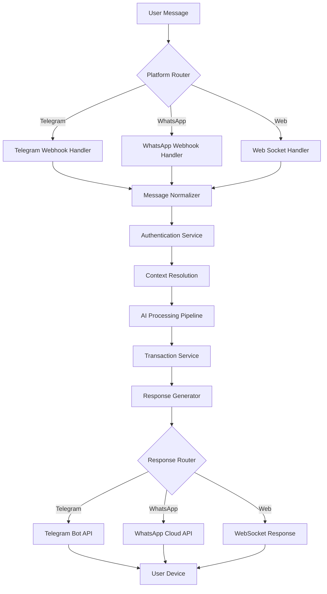

# Messaging Platform Integrations
## Financy Platform Integration Specifications

**Version**: 1.0  
**Last Updated**: 2025-10-18  
**Scope**: Complete integration specifications for Telegram and WhatsApp platforms  

---

## Overview

Financy integrates with messaging platforms to provide seamless financial tracking through natural conversation. The platform supports multiple messaging channels with unified processing and consistent user experience.

### Supported Platforms
1. **Telegram Bot API** (MVP Launch)
2. **WhatsApp Cloud API** (Phase 2)
3. **WhatsApp Business API** (Enterprise)
4. **Discord Bot** (Future consideration)
5. **Slack App** (Business use cases)

### Integration Architecture



---

## Telegram Bot Integration

### Bot Configuration and Setup
```typescript
interface TelegramBotConfig {
  bot_token: string;
  webhook_url: string;
  webhook_secret: string;
  allowed_updates: string[];
  max_connections: number;
  rate_limit: RateLimit;
}

interface RateLimit {
  requests_per_second: number;
  burst_limit: number;
  timeout_duration_ms: number;
}

class TelegramBotService {
  private bot: TelegramBot;
  private webhookHandler: TelegramWebhookHandler;
  
  constructor(private config: TelegramBotConfig) {
    this.bot = new TelegramBot(config.bot_token, {
      webHook: {
        port: process.env.WEBHOOK_PORT || 8443,
        host: '0.0.0.0'
      }
    });
    
    this.webhookHandler = new TelegramWebhookHandler(this.bot);
  }
  
  async initialize(): Promise<void> {
    // Set webhook
    await this.bot.setWebHook(this.config.webhook_url, {
      allowed_updates: this.config.allowed_updates,
      secret_token: this.config.webhook_secret,
      max_connections: this.config.max_connections
    });
    
    // Set bot commands
    await this.setBotCommands();
    
    // Configure bot description
    await this.setBotDescription();
    
    console.log('Telegram bot initialized successfully');
  }
  
  private async setBotCommands(): Promise<void> {
    const commands = [
      { command: 'start', description: 'Iniciar o bot e criar conta' },
      { command: 'help', description: 'Mostrar ajuda e comandos disponíveis' },
      { command: 'resumo', description: 'Ver resumo financeiro do mês' },
      { command: 'contextos', description: 'Listar contextos financeiros' },
      { command: 'orcamento', description: 'Ver status do orçamento' },
      { command: 'configurar', description: 'Configurações do bot' },
      { command: 'exportar', description: 'Exportar dados financeiros' }
    ];
    
    await this.bot.setMyCommands(commands, {
      language_code: 'pt'
    });
    
    // English commands
    const englishCommands = [
      { command: 'start', description: 'Start the bot and create account' },
      { command: 'help', description: 'Show help and available commands' },
      { command: 'summary', description: 'View monthly financial summary' },
      { command: 'contexts', description: 'List financial contexts' },
      { command: 'budget', description: 'View budget status' },
      { command: 'settings', description: 'Bot settings' },
      { command: 'export', description: 'Export financial data' }
    ];
    
    await this.bot.setMyCommands(englishCommands, {
      language_code: 'en'
    });
  }
}
```

### Webhook Message Processing
```typescript
interface TelegramMessage {
  message_id: number;
  from: TelegramUser;
  chat: TelegramChat;
  date: number;
  text?: string;
  voice?: TelegramVoice;
  photo?: TelegramPhoto[];
  document?: TelegramDocument;
  caption?: string;
}

interface TelegramUser {
  id: number;
  is_bot: boolean;
  first_name: string;
  last_name?: string;
  username?: string;
  language_code?: string;
}

interface TelegramChat {
  id: number;
  type: 'private' | 'group' | 'supergroup' | 'channel';
  title?: string;
  username?: string;
  first_name?: string;
  last_name?: string;
}

class TelegramWebhookHandler {
  constructor(private bot: TelegramBot) {}
  
  async handleUpdate(update: TelegramUpdate): Promise<void> {
    try {
      // Validate webhook signature
      await this.validateWebhookSignature(update);
      
      // Route different update types
      if (update.message) {
        await this.handleMessage(update.message);
      } else if (update.callback_query) {
        await this.handleCallbackQuery(update.callback_query);
      } else if (update.inline_query) {
        await this.handleInlineQuery(update.inline_query);
      }
      
    } catch (error) {
      console.error('Error handling Telegram update:', error);
      await this.sendErrorResponse(update);
    }
  }
  
  private async handleMessage(message: TelegramMessage): Promise<void> {
    // Normalize message for internal processing
    const normalizedMessage = await this.normalizeMessage(message);
    
    // Check rate limits
    await this.checkRateLimit(message.from.id);
    
    // Authenticate user
    const user = await this.authenticateUser(message.from);
    
    // Resolve context (personal vs group)
    const context = await this.resolveContext(message.chat, user.id);
    
    // Process message content
    const processingResult = await this.processMessageContent(
      normalizedMessage,
      user,
      context
    );
    
    // Send response
    await this.sendResponse(message.chat.id, processingResult);
  }
  
  private async normalizeMessage(message: TelegramMessage): Promise<NormalizedMessage> {
    let content: MessageContent;
    let contentType: ContentType;
    
    if (message.text) {
      content = { text: message.text };
      contentType = 'text';
    } else if (message.voice) {
      const voiceFile = await this.downloadVoiceFile(message.voice.file_id);
      content = { audio: voiceFile };
      contentType = 'voice';
    } else if (message.photo) {
      const photoFile = await this.downloadPhotoFile(message.photo);
      content = { image: photoFile };
      contentType = 'image';
    } else {
      throw new Error('Unsupported message type');
    }
    
    return {
      content,
      content_type: contentType,
      platform: 'telegram',
      platform_message_id: message.message_id.toString(),
      timestamp: new Date(message.date * 1000),
      user_info: {
        platform_user_id: message.from.id.toString(),
        username: message.from.username,
        display_name: `${message.from.first_name} ${message.from.last_name || ''}`.trim(),
        language_code: message.from.language_code || 'pt'
      },
      chat_info: {
        platform_chat_id: message.chat.id.toString(),
        chat_type: message.chat.type,
        chat_title: message.chat.title
      }
    };
  }
  
  private async downloadVoiceFile(fileId: string): Promise<Buffer> {
    try {
      const fileInfo = await this.bot.getFile(fileId);
      const fileUrl = `https://api.telegram.org/file/bot${this.bot.token}/${fileInfo.file_path}`;
      
      const response = await fetch(fileUrl);
      if (!response.ok) {
        throw new Error(`Failed to download voice file: ${response.statusText}`);
      }
      
      return Buffer.from(await response.arrayBuffer());
    } catch (error) {
      console.error('Error downloading voice file:', error);
      throw new Error('Failed to download voice message');
    }
  }
  
  private async downloadPhotoFile(photos: TelegramPhoto[]): Promise<Buffer> {
    // Choose highest resolution photo
    const photo = photos.reduce((prev, current) => 
      (prev.file_size || 0) > (current.file_size || 0) ? prev : current
    );
    
    try {
      const fileInfo = await this.bot.getFile(photo.file_id);
      const fileUrl = `https://api.telegram.org/file/bot${this.bot.token}/${fileInfo.file_path}`;
      
      const response = await fetch(fileUrl);
      if (!response.ok) {
        throw new Error(`Failed to download photo: ${response.statusText}`);
      }
      
      return Buffer.from(await response.arrayBuffer());
    } catch (error) {
      console.error('Error downloading photo:', error);
      throw new Error('Failed to download photo');
    }
  }
}
```

### Telegram Response Generation
```typescript
class TelegramResponseGenerator {
  constructor(private bot: TelegramBot) {}
  
  async sendTransactionConfirmation(
    chatId: number,
    transaction: Transaction,
    processingResult: ProcessingResult
  ): Promise<void> {
    
    const message = this.buildConfirmationMessage(transaction, processingResult);
    const keyboard = this.buildConfirmationKeyboard(transaction.id);
    
    await this.bot.sendMessage(chatId, message, {
      parse_mode: 'HTML',
      reply_markup: keyboard
    });
  }
  
  private buildConfirmationMessage(
    transaction: Transaction,
    result: ProcessingResult
  ): string {
    const amount = this.formatCurrency(
      transaction.amount_in_context_currency,
      transaction.currency_code
    );
    
    const confidence = Math.round(result.confidence * 100);
    
    let message = `✅ <b>Transação registrada!</b>\n\n`;
    message += `💰 <b>Valor:</b> ${amount}\n`;
    message += `🏪 <b>Local:</b> ${transaction.merchant_name || 'Não identificado'}\n`;
    message += `📂 <b>Categoria:</b> ${result.category?.name || 'A categorizar'}\n`;
    message += `📅 <b>Data:</b> ${this.formatDate(transaction.transaction_date)}\n`;
    
    if (result.confidence < 0.9) {
      message += `\n⚠️ <i>Confiança: ${confidence}% - Verifique os dados</i>`;
    }
    
    return message;
  }
  
  private buildConfirmationKeyboard(transactionId: string): InlineKeyboardMarkup {
    return {
      inline_keyboard: [
        [
          {
            text: '✏️ Editar',
            callback_data: `edit_transaction:${transactionId}`
          },
          {
            text: '🗑️ Excluir',
            callback_data: `delete_transaction:${transactionId}`
          }
        ],
        [
          {
            text: '📊 Ver Resumo',
            callback_data: 'show_summary'
          }
        ]
      ]
    };
  }
  
  async sendErrorMessage(chatId: number, error: ProcessingError): Promise<void> {
    let message: string;
    
    switch (error.type) {
      case 'parsing_failed':
        message = '❌ Não consegui entender a mensagem. Pode tentar de novo?\n\n';
        message += '💡 <b>Exemplos:</b>\n';
        message += '• "Paguei R$45 no restaurante"\n';
        message += '• "Gasolina R$95 no posto"\n';
        message += '• "Supermercado R$180"';
        break;
        
      case 'amount_missing':
        message = '❌ Não encontrei o valor da transação.\n\n';
        message += 'Por favor, inclua o valor. Exemplo: "R$25 no café"';
        break;
        
      case 'context_access_denied':
        message = '🚫 Você não tem permissão para este contexto financeiro.';
        break;
        
      default:
        message = '❌ Ops! Algo deu errado. Tente novamente em alguns instantes.';
    }
    
    await this.bot.sendMessage(chatId, message, {
      parse_mode: 'HTML'
    });
  }
  
  async sendHelpMessage(chatId: number, userLanguage: string = 'pt'): Promise<void> {
    const message = userLanguage === 'pt' ? this.getPortugueseHelp() : this.getEnglishHelp();
    
    await this.bot.sendMessage(chatId, message, {
      parse_mode: 'HTML',
      disable_web_page_preview: true
    });
  }
  
  private getPortugueseHelp(): string {
    return `
🤖 <b>Financy - Seu assistente financeiro</b>

<b>Como usar:</b>
• Envie mensagens sobre seus gastos naturalmente
• Use comandos para funções específicas
• Envie fotos de notas fiscais
• Grave áudios com suas despesas

<b>Exemplos de mensagens:</b>
• "Paguei R$45 de almoço no japonês"
• "Gasolina R$95 no posto da esquina"
• "Conta de luz R$230, vence dia 15"

<b>Comandos disponíveis:</b>
/resumo - Ver resumo do mês
/contextos - Seus contextos financeiros
/orcamento - Status do orçamento
/configurar - Ajustar configurações
/exportar - Baixar seus dados

<b>Dúvidas?</b>
Digite /help para ver esta mensagem novamente.
    `;
  }
}
```

---

## WhatsApp Cloud API Integration

### WhatsApp Configuration and Webhooks
```typescript
interface WhatsAppConfig {
  access_token: string;
  phone_number_id: string;
  webhook_verify_token: string;
  webhook_url: string;
  business_account_id: string;
  app_id: string;
  app_secret: string;
}

class WhatsAppCloudAPIService {
  private client: WhatsAppClient;
  private webhookHandler: WhatsAppWebhookHandler;
  
  constructor(private config: WhatsAppConfig) {
    this.client = new WhatsAppClient(config);
    this.webhookHandler = new WhatsAppWebhookHandler();
  }
  
  async initialize(): Promise<void> {
    // Verify webhook
    await this.verifyWebhook();
    
    // Set up message templates
    await this.setupMessageTemplates();
    
    // Configure business profile
    await this.configureBusinessProfile();
    
    console.log('WhatsApp Cloud API initialized successfully');
  }
  
  private async setupMessageTemplates(): Promise<void> {
    const templates = [
      {
        name: 'transaction_confirmation',
        language: 'pt_BR',
        category: 'UTILITY',
        components: [
          {
            type: 'BODY',
            text: 'Transação registrada: {{1}} em {{2}} por {{3}}'
          },
          {
            type: 'BUTTONS',
            buttons: [
              {
                type: 'QUICK_REPLY',
                text: 'Editar'
              },
              {
                type: 'QUICK_REPLY',
                text: 'Excluir'
              }
            ]
          }
        ]
      },
      {
        name: 'monthly_summary',
        language: 'pt_BR',
        category: 'UTILITY',
        components: [
          {
            type: 'HEADER',
            format: 'TEXT',
            text: 'Resumo Financeiro - {{1}}'
          },
          {
            type: 'BODY',
            text: 'Total gasto: {{1}}\nMaior categoria: {{2}}\nTransações: {{3}}'
          }
        ]
      }
    ];
    
    for (const template of templates) {
      await this.createMessageTemplate(template);
    }
  }
  
  async sendMessage(
    recipientPhone: string,
    message: WhatsAppMessage
  ): Promise<WhatsAppMessageResponse> {
    
    const messageData = {
      messaging_product: 'whatsapp',
      to: recipientPhone,
      type: message.type,
      ...message.content
    };
    
    try {
      const response = await fetch(
        `https://graph.facebook.com/v18.0/${this.config.phone_number_id}/messages`,
        {
          method: 'POST',
          headers: {
            'Authorization': `Bearer ${this.config.access_token}`,
            'Content-Type': 'application/json'
          },
          body: JSON.stringify(messageData)
        }
      );
      
      if (!response.ok) {
        throw new Error(`WhatsApp API error: ${response.statusText}`);
      }
      
      return await response.json();
    } catch (error) {
      console.error('Error sending WhatsApp message:', error);
      throw error;
    }
  }
}
```

### WhatsApp Message Processing
```typescript
interface WhatsAppWebhookPayload {
  object: string;
  entry: WhatsAppEntry[];
}

interface WhatsAppEntry {
  id: string;
  changes: WhatsAppChange[];
}

interface WhatsAppChange {
  value: {
    messaging_product: string;
    metadata: {
      display_phone_number: string;
      phone_number_id: string;
    };
    contacts?: WhatsAppContact[];
    messages?: WhatsAppIncomingMessage[];
    statuses?: WhatsAppMessageStatus[];
  };
  field: string;
}

class WhatsAppWebhookHandler {
  async handleWebhook(payload: WhatsAppWebhookPayload): Promise<void> {
    for (const entry of payload.entry) {
      for (const change of entry.changes) {
        if (change.field === 'messages') {
          await this.handleMessages(change.value);
        } else if (change.field === 'message_status') {
          await this.handleMessageStatus(change.value);
        }
      }
    }
  }
  
  private async handleMessages(value: any): Promise<void> {
    const messages = value.messages || [];
    
    for (const message of messages) {
      try {
        await this.processIncomingMessage(message, value.metadata);
      } catch (error) {
        console.error('Error processing WhatsApp message:', error);
        await this.sendErrorResponse(message.from);
      }
    }
  }
  
  private async processIncomingMessage(
    message: WhatsAppIncomingMessage,
    metadata: any
  ): Promise<void> {
    
    // Normalize message for internal processing
    const normalizedMessage = await this.normalizeWhatsAppMessage(message, metadata);
    
    // Rate limiting check
    await this.checkRateLimit(message.from);
    
    // Authenticate user
    const user = await this.authenticateWhatsAppUser(message.from);
    
    // Resolve context
    const context = await this.resolveWhatsAppContext(message, user.id);
    
    // Process message content
    const processingResult = await this.processMessageContent(
      normalizedMessage,
      user,
      context
    );
    
    // Send response
    await this.sendWhatsAppResponse(message.from, processingResult);
  }
  
  private async normalizeWhatsAppMessage(
    message: WhatsAppIncomingMessage,
    metadata: any
  ): Promise<NormalizedMessage> {
    
    let content: MessageContent;
    let contentType: ContentType;
    
    switch (message.type) {
      case 'text':
        content = { text: message.text.body };
        contentType = 'text';
        break;
        
      case 'audio':
        const audioFile = await this.downloadWhatsAppMedia(message.audio.id);
        content = { audio: audioFile };
        contentType = 'voice';
        break;
        
      case 'image':
        const imageFile = await this.downloadWhatsAppMedia(message.image.id);
        content = { image: imageFile };
        contentType = 'image';
        break;
        
      case 'document':
        if (message.document.mime_type?.startsWith('image/')) {
          const docImageFile = await this.downloadWhatsAppMedia(message.document.id);
          content = { image: docImageFile };
          contentType = 'image';
        } else {
          throw new Error('Unsupported document type');
        }
        break;
        
      default:
        throw new Error(`Unsupported message type: ${message.type}`);
    }
    
    return {
      content,
      content_type: contentType,
      platform: 'whatsapp',
      platform_message_id: message.id,
      timestamp: new Date(parseInt(message.timestamp) * 1000),
      user_info: {
        platform_user_id: message.from,
        display_name: '', // Will be resolved from contacts
        language_code: 'pt' // Default, will be detected
      },
      chat_info: {
        platform_chat_id: message.from, // Individual chat = user phone
        chat_type: 'individual'
      }
    };
  }
  
  private async downloadWhatsAppMedia(mediaId: string): Promise<Buffer> {
    try {
      // Get media URL
      const mediaResponse = await fetch(
        `https://graph.facebook.com/v18.0/${mediaId}`,
        {
          headers: {
            'Authorization': `Bearer ${this.config.access_token}`
          }
        }
      );
      
      if (!mediaResponse.ok) {
        throw new Error(`Failed to get media URL: ${mediaResponse.statusText}`);
      }
      
      const mediaData = await mediaResponse.json();
      
      // Download media file
      const fileResponse = await fetch(mediaData.url, {
        headers: {
          'Authorization': `Bearer ${this.config.access_token}`
        }
      });
      
      if (!fileResponse.ok) {
        throw new Error(`Failed to download media: ${fileResponse.statusText}`);
      }
      
      return Buffer.from(await fileResponse.arrayBuffer());
      
    } catch (error) {
      console.error('Error downloading WhatsApp media:', error);
      throw new Error('Failed to download media file');
    }
  }
}
```

### WhatsApp Response Templates
```typescript
class WhatsAppResponseGenerator {
  constructor(private whatsAppService: WhatsAppCloudAPIService) {}
  
  async sendTransactionConfirmation(
    phoneNumber: string,
    transaction: Transaction,
    processingResult: ProcessingResult
  ): Promise<void> {
    
    const amount = this.formatCurrency(
      transaction.amount_in_context_currency,
      transaction.currency_code
    );
    
    const message: WhatsAppMessage = {
      type: 'text',
      content: {
        text: {
          body: `✅ *Transação registrada!*\n\n` +
                `💰 *Valor:* ${amount}\n` +
                `🏪 *Local:* ${transaction.merchant_name || 'Não identificado'}\n` +
                `📂 *Categoria:* ${processingResult.category?.name || 'A categorizar'}\n` +
                `📅 *Data:* ${this.formatDate(transaction.transaction_date)}\n\n` +
                (processingResult.confidence < 0.9 
                  ? `⚠️ _Confiança: ${Math.round(processingResult.confidence * 100)}% - Verifique os dados_`
                  : '')
        }
      }
    };
    
    await this.whatsAppService.sendMessage(phoneNumber, message);
    
    // Send quick action buttons
    await this.sendQuickActions(phoneNumber, transaction.id);
  }
  
  private async sendQuickActions(phoneNumber: string, transactionId: string): Promise<void> {
    const message: WhatsAppMessage = {
      type: 'interactive',
      content: {
        interactive: {
          type: 'button',
          body: {
            text: 'O que você gostaria de fazer?'
          },
          action: {
            buttons: [
              {
                type: 'reply',
                reply: {
                  id: `edit_${transactionId}`,
                  title: '✏️ Editar'
                }
              },
              {
                type: 'reply',
                reply: {
                  id: `delete_${transactionId}`,
                  title: '🗑️ Excluir'
                }
              },
              {
                type: 'reply',
                reply: {
                  id: 'show_summary',
                  title: '📊 Resumo'
                }
              }
            ]
          }
        }
      }
    };
    
    await this.whatsAppService.sendMessage(phoneNumber, message);
  }
  
  async sendMonthlySummary(
    phoneNumber: string,
    summary: MonthlySummary
  ): Promise<void> {
    
    const message: WhatsAppMessage = {
      type: 'text',
      content: {
        text: {
          body: `📊 *Resumo Financeiro - ${summary.month}*\n\n` +
                `💰 *Total gasto:* ${this.formatCurrency(summary.total_amount, summary.currency)}\n` +
                `📈 *Maior categoria:* ${summary.top_category.name} (${this.formatCurrency(summary.top_category.amount, summary.currency)})\n` +
                `🧾 *Transações:* ${summary.transaction_count}\n` +
                `📅 *Período:* ${summary.start_date} - ${summary.end_date}\n\n` +
                `🎯 *Meta do orçamento:* ${summary.budget_status}%`
        }
      }
    };
    
    await this.whatsAppService.sendMessage(phoneNumber, message);
  }
  
  async sendErrorMessage(phoneNumber: string, error: ProcessingError): Promise<void> {
    let messageText: string;
    
    switch (error.type) {
      case 'parsing_failed':
        messageText = '❌ Não consegui entender a mensagem. Pode tentar de novo?\n\n' +
                     '💡 *Exemplos:*\n' +
                     '• "Paguei R$45 no restaurante"\n' +
                     '• "Gasolina R$95 no posto"\n' +
                     '• "Supermercado R$180"';
        break;
        
      case 'amount_missing':
        messageText = '❌ Não encontrei o valor da transação.\n\n' +
                     'Por favor, inclua o valor. Exemplo: "R$25 no café"';
        break;
        
      default:
        messageText = '❌ Ops! Algo deu errado. Tente novamente em alguns instantes.';
    }
    
    const message: WhatsAppMessage = {
      type: 'text',
      content: {
        text: {
          body: messageText
        }
      }
    };
    
    await this.whatsAppService.sendMessage(phoneNumber, message);
  }
}
```

---

## Platform-Agnostic Message Processing

### Unified Message Interface
```typescript
interface NormalizedMessage {
  content: MessageContent;
  content_type: ContentType;
  platform: Platform;
  platform_message_id: string;
  timestamp: Date;
  user_info: UserInfo;
  chat_info: ChatInfo;
}

interface MessageContent {
  text?: string;
  audio?: Buffer;
  image?: Buffer;
}

type ContentType = 'text' | 'voice' | 'image';
type Platform = 'telegram' | 'whatsapp' | 'web';

interface UserInfo {
  platform_user_id: string;
  username?: string;
  display_name: string;
  language_code: string;
}

interface ChatInfo {
  platform_chat_id: string;
  chat_type: 'individual' | 'group' | 'supergroup' | 'channel' | 'private';
  chat_title?: string;
}

class UnifiedMessageProcessor {
  constructor(
    private aiProcessingPipeline: AIProcessingPipeline,
    private userService: UserService,
    private contextService: ContextService,
    private transactionService: TransactionService
  ) {}
  
  async processMessage(message: NormalizedMessage): Promise<ProcessingResult> {
    // Authenticate or register user
    const user = await this.authenticateUser(message.user_info);
    
    // Resolve financial context
    const context = await this.resolveContext(message.chat_info, user.id);
    
    // Process content through AI pipeline
    const aiResult = await this.aiProcessingPipeline.processMessage(
      message.content,
      message.content_type,
      context.id,
      user.id
    );
    
    // Create transaction if processing was successful
    if (aiResult.status === 'completed') {
      const transaction = await this.transactionService.createTransaction(
        context.id,
        user.id,
        aiResult.transaction_data
      );
      
      return {
        status: 'success',
        transaction,
        confidence: aiResult.confidence,
        processing_time_ms: aiResult.processing_time_ms
      };
    } else {
      return {
        status: 'failed',
        error: aiResult.error,
        confidence: aiResult.confidence || 0,
        processing_time_ms: aiResult.processing_time_ms
      };
    }
  }
  
  private async authenticateUser(userInfo: UserInfo): Promise<User> {
    // Try to find existing user
    let user = await this.userService.findByPlatformId(
      userInfo.platform_user_id,
      this.getPlatformFromUserInfo(userInfo)
    );
    
    if (!user) {
      // Create new user
      user = await this.userService.createUser({
        telegram_user_id: userInfo.platform.startsWith('telegram') 
          ? parseInt(userInfo.platform_user_id) 
          : undefined,
        whatsapp_user_id: userInfo.platform.startsWith('whatsapp') 
          ? userInfo.platform_user_id 
          : undefined,
        full_name: userInfo.display_name,
        preferred_language: userInfo.language_code || 'pt-BR'
      });
      
      // Create personal context for new user
      await this.contextService.createPersonalContext(user.id);
    }
    
    return user;
  }
  
  private async resolveContext(chatInfo: ChatInfo, userId: string): Promise<Context> {
    if (chatInfo.chat_type === 'individual' || chatInfo.chat_type === 'private') {
      // Personal context for individual chats
      return await this.contextService.getPersonalContext(userId);
    } else {
      // Shared context for group chats
      return await this.contextService.getOrCreateGroupContext(
        chatInfo.platform_chat_id,
        chatInfo.chat_title || `Group ${chatInfo.platform_chat_id}`,
        userId
      );
    }
  }
}
```

### Rate Limiting and Security
```typescript
class PlatformRateLimiter {
  private limits: Map<string, RateLimitConfig> = new Map();
  private redis: Redis;
  
  constructor() {
    // Platform-specific rate limits
    this.limits.set('telegram', {
      requests_per_minute: 30,
      requests_per_hour: 1000,
      burst_limit: 5
    });
    
    this.limits.set('whatsapp', {
      requests_per_minute: 60,
      requests_per_hour: 1000,
      burst_limit: 10
    });
  }
  
  async checkRateLimit(
    platform: Platform,
    userId: string
  ): Promise<RateLimitResult> {
    
    const config = this.limits.get(platform);
    if (!config) {
      return { allowed: true };
    }
    
    const now = Date.now();
    const minuteKey = `rate_limit:${platform}:${userId}:${Math.floor(now / 60000)}`;
    const hourKey = `rate_limit:${platform}:${userId}:${Math.floor(now / 3600000)}`;
    
    // Check minute limit
    const minuteCount = await this.redis.incr(minuteKey);
    await this.redis.expire(minuteKey, 60);
    
    if (minuteCount > config.requests_per_minute) {
      return {
        allowed: false,
        reason: 'minute_limit_exceeded',
        retry_after: 60 - (now % 60000) / 1000
      };
    }
    
    // Check hour limit
    const hourCount = await this.redis.incr(hourKey);
    await this.redis.expire(hourKey, 3600);
    
    if (hourCount > config.requests_per_hour) {
      return {
        allowed: false,
        reason: 'hour_limit_exceeded',
        retry_after: 3600 - (now % 3600000) / 1000
      };
    }
    
    return { allowed: true };
  }
}
```

This comprehensive messaging platform integration specification provides robust, scalable, and secure integration with Telegram and WhatsApp, ensuring consistent user experience across all platforms while maintaining platform-specific optimizations.