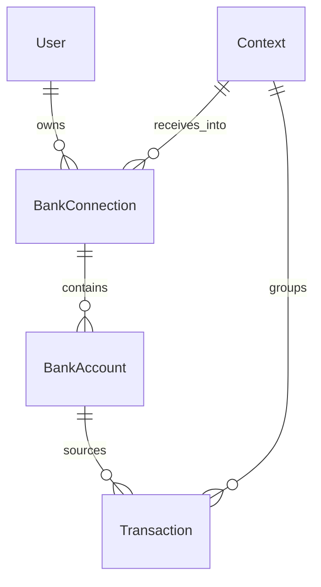
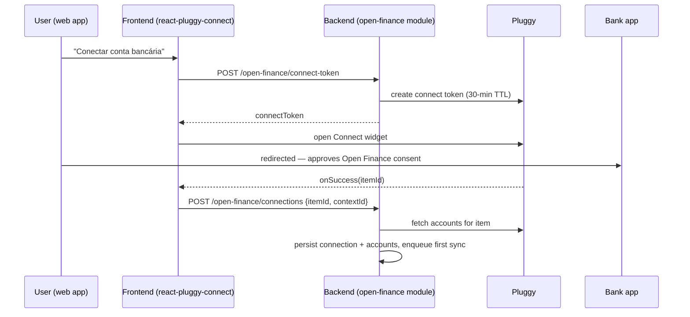

# Open Finance Integration Study
## Automatic Bank Account Sync for Financy (Brazil)

**Version**: 0.1 (study)
**Last Updated**: 2026-08-10
**Status**: Research / pre-implementation
**Goal**: Let users connect their bank accounts so transactions flow into Financy automatically, instead of typing every purchase.

---

## 1. Executive Summary

Open Finance Brasil is the Central Bank (BACEN) regulated system that lets a customer share their financial data (accounts, balances, statements, credit cards, loans, investments) between institutions, under explicit, revocable consent.

**Key conclusion up front**: Financy cannot (and should not try to) connect to banks directly. Direct participation in Open Finance is legally restricted to institutions authorized by BACEN, and carries heavy technical and compliance obligations (participant directory, FAPI security profile, ICP-Brasil certificates, conformance certification, annual funding contribution). The standard path for a non-regulated product like Financy is to integrate through a **licensed data aggregator** that already participates in the regulated ecosystem and exposes the data through a developer-friendly API.

**Recommendation**:
1. **Short term (MVP/beta)**: integrate **Pluggy** — best developer experience in Brazil, official Node/TypeScript SDK and React widget, free sandbox, 14-day full production trial. For a zero-cost beta with power users, the **Meu Pluggy** personal-use path (used by Actual Budget) is a viable stopgap.
2. **Fallback / complement**: OFX/CSV statement import (no regulation, no cost, works today).
3. **Scale**: renegotiate aggregator pricing (Pluggy data plans start around R$ 2.500/month) or evaluate Belvo/others when volume justifies it.

The rest of this document covers how Open Finance works, the regulatory constraints, provider comparison, the proposed technical architecture inside Financy's existing NestJS backend, and a phased rollout plan.

---

## 2. How Open Finance Brasil Works

### 2.1 The ecosystem

- **Regulated by**: BACEN + CMN. Core rule: Resolução Conjunta nº 1/2020, evolving through later resolutions. Governance moved to a definitive structure (Resolução BCB nº 400/2024), funded by mandatory participant contributions (IN BCB nº 485/2024).
- **Participants**: only institutions **authorized to operate by BACEN** (banks, payment institutions, credit fintechs with SCD/SEP licenses, brokers, etc.). Participation is mandatory for the largest institutions (S1/S2 segments) and voluntary for other regulated entities.
- **Roles**: data **transmitters** (hold the customer's account), data **receivers** (get data with consent), and **payment initiators** (Pix initiation — out of scope for us for now).
- **Consent**: the customer authorizes sharing per institution, per data scope, with a validity period. Historically capped at 12 months; Resolução Conjunta nº 7/2023 simplified renewals (one-tap confirmation instead of redoing the whole journey) and allows institutions to offer longer validity. Consent is revocable at any time, on either side.
- **Adoption**: ~28% of the banked population by 2025 (EY) and over 100 million connected accounts by early 2026 — users increasingly know and trust the flow.

### 2.2 Data available with consent (relevant to Financy)

| Data scope | Contents | Financy use |
|---|---|---|
| Registration/identity | Name, CPF, contact | Verify account ownership |
| Accounts (checking/savings) | Balances, statements/transactions | Core: auto-import transactions |
| Credit cards | Limits, invoices, card transactions | Core: auto-import card spend |
| Credit operations | Loans, financing, installments | Debts view (future) |
| Investments (Fase 4A) | Fixed income, funds, treasury | Net worth view (future) |

### 2.3 What direct participation would require (and why we skip it)

To be a direct data receiver, Financy would need to: be (or acquire/partner as) a BACEN-authorized institution; register in the participant directory; implement the FAPI (Financial-grade API) OAuth security profile with ICP-Brasil certificates; pass functional and security conformance certification; and pay the annual governance funding contribution. This is a multi-quarter, high-cost effort that makes no sense before product-market fit.

Regulation explicitly contemplates the alternative: a participating institution can, under a tightly regulated partnership contract (Resolução Conjunta nº 1), serve data to a non-regulated partner — the participant remains liable to BACEN for the partner's data handling. **Data aggregators productize exactly this partnership model**, which is how virtually every Brazilian PFM app (Mobills, Organizze, etc.) connects bank accounts.

---

## 3. Provider Comparison (Aggregators)

| Provider | Model | Pricing signal (2025/26) | Notes for Financy |
|---|---|---|---|
| **Pluggy** | Connect widget + Items API; regulated Open Finance connectors + direct connectors; webhooks; auto-update; categorization/enrichment included | Data product from ~**R$ 2.500/month** minimum (volume included, scales with usage); free sandbox; 14-day full trial without card | Best DX: official `pluggy-sdk` (Node/TS) and `react-pluggy-connect`; React Native widget exists (future mobile). Strong PFM track record |
| **Meu Pluggy** (personal use) | End user creates their own free Meu Pluggy account, connects banks there; our app consumes via MeuPluggy connector with the user's own credentials | **Free, indefinitely** (personal use) | Same approach Actual Budget documents for Brazil. Great for beta/power users; clunky onboarding for mass market (user leaves our app to set it up) |
| **Belvo** | Hosted widget → Link; OFDA (regulated) aggregation; auto-retrieves 12 months of accounts/owners/transactions/bills; webhooks per resource | Sandbox free; production quoted (anecdotally ~R$ 6k/month floor) | LatAm scale (BR/MX/CO), Visa-backed, strong PJ/enterprise focus. Heavier and pricier for our stage |
| **Klavi** | Open Finance data platform | Quoted | Oriented to credit/underwriting use cases, not PFM |
| **Tecnospeed (PlugBank)** | Bank data APIs for software houses | ~R$ 1,5k setup + ~R$ 540/month (anecdotal) | Cheaper floor, weaker PFM/widget DX |
| **Resellers (e.g. "Banco MCP")** | Pluggy under the hood, per-account retail pricing (~R$ 19,90/month/account) | Per-account | Early-stage third party — dependency risk; useful benchmark for our own pricing |
| **OFX/CSV import** (not Open Finance) | User downloads statement from bank app, uploads to Financy | Free | No regulation involved; manual but universal. Good complement regardless of aggregator choice |

**Why Pluggy first**: TypeScript-native SDKs matching our stack, self-service sandbox (no sales call to start), widget handles the entire consent UX including bank app redirects, webhooks + scheduled auto-updates cover sync, and their transaction categorization can seed our own AI categorization. The main cost driver is the monthly minimum — mitigable in beta via trial + Meu Pluggy path, then a startup-tier negotiation.

---

## 4. Integration Architecture (Proposed)

### 4.1 Where the codebase stands today

Survey of the current implementation (August 2026):

- **Backend**: NestJS 10 + TypeORM 0.3 + PostgreSQL, modules `auth`, `users`, `transactions`, `contexts`, `telegram`, `currency` (`backend/src/app.module.ts`). Global JWT guard; API prefix `api/v1`; migrations auto-run in production.
- **Entities (only 5)**: `User`, `Transaction`, `Context`, `ContextMember`, `ChatContext`. **There is no bank/account entity of any kind.**
- **Transactions** (`backend/src/transactions/entities/transaction.entity.ts`): free-string categories + validated `dashboardCategory`; amounts converted to the user's preferred currency on create (keeping `originalAmount/originalCurrency/exchangeRate`); `status` defaults to `pending`; `inputMethod` enum exists (`manual|telegram|voice|ocr|api`) **but Telegram call sites don't set it**, so everything lands as `manual` today — fix this alongside the new value.
- **No idempotency anywhere**: the only unique constraints in the schema are `users.email` and `context_members(contextId, userId)`. `TransactionsService.create` is a blind insert. This is the #1 prerequisite for bank sync.
- **No queues, no cron**: Redis is cache-only (optional); pending Telegram confirmations live in in-process `Map`s. `docs/jobs/job-processing-architecture.md` is the (unimplemented) blueprint for workers.
- **Webhooks**: `POST api/v1/webhooks/telegram` exists but has **no signature verification** — do not copy that pattern for the aggregator webhook.
- **Docs already point here**: `docs/product/roadmap.md` V1.5 "Bank Account Connections" (Plaid/Belvo, balance sync, reconciliation); `docs/modules/integration-modules-specification.md` has an empty `financial_integrations` slot; `docs/security/security-overview.md` plans field-level encryption; `docs/data/canonical-data-model.md` already contemplates an `import` input method.
- **Frontend**: React 18 + MUI. No accounts/connections UI. The Telegram integration card in `frontend/src/pages/SettingsPage.tsx` (status chip + dedicated subpage `/settings/telegram`) is the exact pattern to clone for `/settings/banks`. Feature flags via `REACT_APP_ENABLE_*` are established (`frontend/.env.example`).

### 4.2 New module and entities

Add a self-contained NestJS module `backend/src/open-finance/` (name it after the capability, not the vendor — the provider must be swappable):

```
open-finance/
├── open-finance.module.ts
├── open-finance.controller.ts      # connect-token, list/delete connections, manual sync
├── webhooks.controller.ts          # POST api/v1/webhooks/open-finance (signature-verified)
├── services/
│   ├── provider.adapter.ts         # interface: createConnectToken, getAccounts, getTransactions, deleteItem
│   ├── pluggy.adapter.ts           # implementation using pluggy-sdk
│   ├── sync.service.ts             # orchestrates account+transaction sync, dedupe, mapping
│   └── category-mapping.service.ts # provider category → dashboardCategory
└── entities/
    ├── bank-connection.entity.ts
    └── bank-account.entity.ts
```

**`bank_connections`** — one row per aggregator item/consent:
`id`, `userId` (owner), `contextId` (where transactions land — see decision below), `provider` (`pluggy`), `providerItemId` (unique), `institutionName`, `institutionId`, `status` (`connected | updating | login_error | consent_expired | revoked`), `consentExpiresAt`, `lastSyncedAt`, `errorDetail`, timestamps. Sensitive provider ids/tokens encrypted at rest (see §5).

**`bank_accounts`** — one row per account inside a connection:
`id`, `connectionId` (FK), `providerAccountId` (unique per provider), `type` (`checking | savings | credit_card`), `name`, `maskedNumber`, `currency`, `balance`, `balanceUpdatedAt`, timestamps.

**`transactions` changes (migration)**:
- `accountId uuid NULL` FK → `bank_accounts` (manual/Telegram transactions keep `NULL`);
- `providerTransactionId varchar NULL`;
- **`UNIQUE (accountId, providerTransactionId) WHERE providerTransactionId IS NOT NULL`** — the idempotency backbone;
- new `InputMethod.OPEN_FINANCE = 'open_finance'` (and fix Telegram call sites to pass `TELEGRAM`).



### 4.3 Connect and sync flows

**Connecting (user-facing, ~1 minute):**



**Syncing (webhook-driven, with scheduled fallback):**
1. Pluggy calls `POST api/v1/webhooks/open-finance` (`item/updated`, `transactions/created`, `item/error`...). Verify the webhook signature, return 200 fast, process async.
2. `SyncService` pulls transactions since `lastSyncedAt` (first sync: last 12 months, which is what Open Finance consent grants), upserts accounts/balances, maps and inserts transactions.
3. Add `@nestjs/schedule` for a daily reconciliation sweep (catches missed webhooks, refreshes consent status, flags `consent_expired` connections). If job volume grows, graduate to BullMQ per `docs/jobs/job-processing-architecture.md` — Redis is already in the compose stack.
4. Manual "Sincronizar agora" button → same `SyncService` path.

**Mapping a provider transaction → Financy `Transaction`:**
- `amount` sign → `type` (`expense`/`income`); transfers detected via provider category → `transfer`.
- Respect the existing currency-conversion behavior (`originalAmount/originalCurrency/exchangeRate`) — bank data arrives in BRL account currency, user's preferred currency may differ.
- `status`: insert as `confirmed` (bank data is authoritative; the `pending` state exists for AI-parsed messages awaiting user confirmation).
- `inputMethod: OPEN_FINANCE`, `metadata: { provider, raw category, itemId }`.
- Category: provider category → `category`/`dashboardCategory` via `category-mapping.service.ts`. Note the current keyword auto-categorizer is English-only (`transactions.service.ts:423-474`) — Brazilian statement descriptors ("PIX ENVIADO", "COMPRA CARTAO...") would all fall into `Other`, so the provider's categorization is the better primary signal, with our AI as refinement.

### 4.4 Deduplication and reconciliation

- **Primary key of truth**: the partial unique index on `(accountId, providerTransactionId)` + `INSERT ... ON CONFLICT DO NOTHING` (or TypeORM upsert) makes webhook replays and overlapping fetch windows harmless.
- **Pending→posted**: card/bank transactions can arrive as provisional and later change description/date. Upsert by `providerTransactionId` and update mutable fields instead of inserting twice.
- **Manual duplicates**: a user who typed "mercado 80" via Telegram will also receive the bank version of that purchase. V1: show both, offer a merge suggestion when `(±3 days, same amount, same context)` matches a manual entry; auto-merge is a V2 refinement. (The roadmap's "Automatic transaction reconciliation" line is exactly this.)
- **Balance drift**: store account `balance` from the provider at each sync; never derive it by summing transactions.

### 4.5 Decisions to lock before implementing

1. **Connection ownership**: connections belong to a `User`; the user chooses which `Context` its transactions land in (default: personal). Rationale: consent is personal by regulation, but Financy's read queries filter by `userId` today — shared-context visibility of synced transactions needs the context-isolation gap fixed first (`TransactionsService.findUserTransactions` filters only by `userId`).
2. **Auto-confirm bank transactions** (`status: confirmed`) — yes, per §4.3.
3. **Which scopes**: accounts + credit cards only at first (minimization, §5).
4. **Monetization gate**: bank sync behind the paid plan from day one, or free during beta — decide with Phase 2 pricing (§6).

### 4.6 Prerequisites surfaced by the codebase survey

Ordered; items 1–3 are hard blockers for correctness, 4–5 for security:

1. Idempotency migration on `transactions` (§4.2).
2. Fix `inputMethod` at Telegram call sites so origin data is trustworthy.
3. Introduce `@nestjs/schedule` (no cron/queue infra exists today).
4. Webhook signature verification middleware (the Telegram webhook has none — don't copy it).
5. Field-level encryption for provider tokens/ids (planned in `docs/security/security-overview.md`, unimplemented).
6. Update `.env.example` (already stale) with `PLUGGY_CLIENT_ID`, `PLUGGY_CLIENT_SECRET`, `PLUGGY_WEBHOOK_SECRET`, plus frontend `REACT_APP_ENABLE_OPEN_FINANCE` flag.

---

## 5. Consent, Security and LGPD

- **Consent lives with the aggregator/bank**, but Financy must mirror its state: store consent/item id, scopes, expiry, and surface status ("connected", "needs renewal", "revoked") in the UI and via Telegram notifications.
- **Revocation**: user must be able to disconnect in one click (delete the aggregator item + local connection). On revocation, stop syncing immediately; imported transactions remain (they are the user's records) unless the user also asks for deletion — align with LGPD data-subject rights already documented in `docs/legal/` and `docs/security/`.
- **Minimization**: request only the scopes we use (accounts + credit cards + transactions; skip investments/loans until those features exist).
- **Storage**: never store bank credentials (the aggregator/bank handles auth); store only tokens/ids. Aggregator API keys go in environment secrets, per-connection ids in the database.
- **Positioning for users** (copy suggestion, pt-BR): "O Open Finance é um sistema regulamentado pelo Banco Central que permite compartilhar seus dados financeiros entre instituições com total segurança. Você decide o que compartilhar, com quem e por quanto tempo — e pode cancelar quando quiser."

---

## 6. Rollout Plan

| Phase | Scope | Cost |
|---|---|---|
| **0. Spike (1–2 weeks)** | Pluggy sandbox + trial: connect widget in web app, create items, pull transactions into a dev context, validate dedupe | R$ 0 |
| **1. Private beta** | Meu Pluggy path for ~10–30 power users; OFX/CSV import for everyone; measure retention lift | R$ 0 |
| **2. Paid launch** | Pluggy production plan (negotiate startup tier vs R$ 2.500/month floor); gate bank sync behind Financy's paid plan to cover per-item cost | ~R$ 2,5k/month |
| **3. Scale** | Re-quote Belvo/others with volume; consider investments/loans scopes; mobile widget (React Native) | negotiable |

Open questions to validate in Phase 0:
1. Latency and reliability of transaction webhooks per major bank (Nubank, Itaú, BB, Caixa, Bradesco, Inter).
2. Category quality from Pluggy vs our AI categorization — who wins, or hybrid?
3. Exact per-item economics at our expected connections/user to price the paid plan.

---

## 7. Sources

- Open Finance Brasil — [modelo de participação](https://openfinancebrasil.org.br/modelo-de-participacao/), [regras de custeio](https://openfinancebrasil.org.br/regras-de-custeio/), [onboarding](https://openfinancebrasil.org.br/onboarding/)
- BACEN — [renovação simplificada de consentimento / prazos maiores (RC nº 7/2023)](https://agenciagov.ebc.com.br/noticias/202310/bc-simplifica-renovacao-de-consentimentos-no-open-finance-e-amplia-prazo-de-validade-do-compartilhamento); [fim do limite de 12 meses (Finsiders)](https://finsidersbrasil.com.br/regulamentacao/bc-acaba-com-limite-de-12-meses-para-compartilhamento-de-dados-no-open-finance/); [Celcoin — novos prazos](https://www.celcoin.com.br/news/open-finance-tem-novos-prazos-de-consentimento-e-renovacoes/)
- Pluggy — [docs](https://docs.pluggy.ai/) (item, authentication, webhooks, FAQ), [preços](https://www.pluggy.ai/precos), [Meu Pluggy](https://www.pluggy.ai/meu-pluggy), [pluggy-sdk (npm)](https://www.npmjs.com/package/pluggy-sdk), [react-pluggy-connect (npm)](https://www.npmjs.com/package/react-pluggy-connect), [custo da API (Securo)](https://blog.usesecuro.com/post/pluggy-quanto-custa-usar-api-open-banking), [Open Finance regulado (Finsiders)](https://finsidersbrasil.com.br/negocios-em-fintechs/na-pluggy-chegou-a-hora-de-plugar-o-open-finance-regulado/)
- Belvo — [aggregation Brazil overview](https://developers.belvo.com/products/aggregation_brazil/aggregation-brazil-introduction), [hosted widget (OFDA)](https://developers.belvo.com/products/aggregation_brazil/ofda-widget-introduction), [data retrieval limits](https://developers.belvo.com/products/aggregation_brazil/aggregation-brazil-data-retrieval-limits)
- Actual Budget — [Pluggy.ai bank sync setup](https://actualbudget.org/docs/advanced/bank-sync/pluggyai/)
- Developer market signal — TabNews threads on aggregator pricing for indie PFM apps: [problema](https://www.tabnews.com.br/GuilhermeVieira/estou-desenvolvendo-um-app-de-financas-pessoais-e-nao-consigo-pagar-o-open-finance-pluggy-r2-5k-mes-belvo-r6k-mes-tecnospeed-r1-5k-de-entrada-r540), [solução](https://www.tabnews.com.br/GuilhermeVieira/resolvi-o-problema-do-open-finance-caro-que-postei-aqui-achei-uma-alternativa-e-ja-esta-em-producao)
- Contexto de mercado — [Tecnospeed: guia Open Finance 2026](https://blog.tecnospeed.com.br/open-finance-brasil/), [Celcoin: guia completo](https://www.celcoin.com.br/news/guia-completo-sobre-open-finance/)
