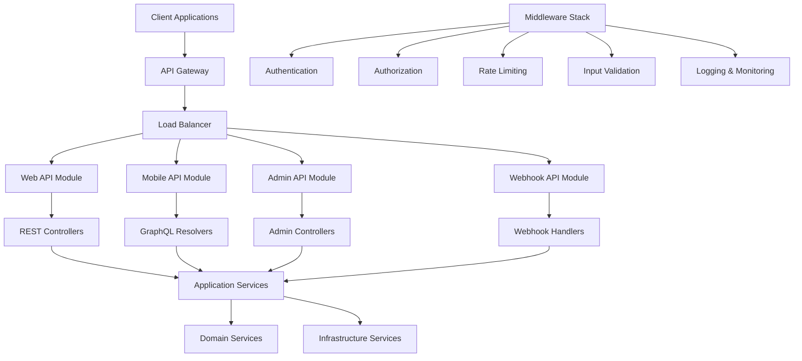

# API Modules Specification
## Financy Platform API Layer Architecture & Implementation

**Version**: 1.0  
**Last Updated**: 2025-10-19  
**Target Audience**: Backend developers, API architects, and frontend integration teams  

---

## Overview

This document provides detailed specifications for all API modules within the Financy platform. Our API architecture follows RESTful principles with GraphQL for mobile optimization, implements comprehensive security measures, and provides excellent developer experience through detailed documentation and consistent patterns.

### API Architecture Principles
1. **RESTful Design**: Consistent resource-based API design with HTTP semantics
2. **GraphQL for Mobile**: Optimized data fetching for mobile applications
3. **API-First Development**: APIs designed before implementation begins
4. **Security by Default**: Authentication, authorization, and input validation on all endpoints
5. **Developer Experience**: Comprehensive documentation, SDKs, and testing tools

---

## API Module Architecture

### API Layer Overview


### API Module Configuration
```typescript
interface APIModuleConfiguration {
  web_api: WebAPIConfiguration;
  mobile_api: MobileAPIConfiguration;
  admin_api: AdminAPIConfiguration;
  webhook_api: WebhookAPIConfiguration;
  shared_infrastructure: SharedInfrastructure;
}

const API_CONFIGURATION: APIModuleConfiguration = {
  web_api: {
    name: 'Web API',
    version: '1.0.0',
    base_path: '/api/v1',
    port: 3000,
    framework: 'NestJS',
    documentation: {
      swagger_enabled: true,
      swagger_path: '/api/docs',
      openapi_version: '3.0.3',
      auto_generate: true
    },
    cors: {
      origins: ['https://app.financy.com', 'https://admin.financy.com'],
      methods: ['GET', 'POST', 'PUT', 'DELETE', 'PATCH'],
      credentials: true,
      max_age: 86400 // 24 hours
    },
    rate_limiting: {
      global_limit: '1000/hour',
      authenticated_limit: '5000/hour',
      per_endpoint_limits: {
        '/auth/login': '10/minute',
        '/transactions': '200/hour',
        '/ai/categorize': '100/hour'
      }
    },
    security: {
      helmet_enabled: true,
      csrf_protection: true,
      xss_protection: true,
      content_security_policy: true
    }
  },
  mobile_api: {
    name: 'Mobile API',
    version: '1.0.0',
    base_path: '/mobile/v1',
    port: 3001,
    framework: 'NestJS + GraphQL',
    graphql: {
      playground_enabled: false, // Only in development
      introspection_enabled: false, // Only in development
      schema_path: '/mobile/v1/graphql',
      subscription_support: true,
      query_complexity_limit: 1000,
      query_depth_limit: 15
    },
    optimization: {
      query_batching: true,
      data_loader_caching: true,
      response_compression: true,
      field_level_caching: true
    },
    offline_support: {
      optimistic_updates: true,
      conflict_resolution: 'last_write_wins',
      sync_strategy: 'incremental'
    }
  },
  admin_api: {
    name: 'Admin API',
    version: '1.0.0',
    base_path: '/admin/v1',
    port: 3002,
    framework: 'NestJS',
    access_control: {
      rbac_enabled: true,
      audit_logging: true,
      ip_whitelist: ['10.0.0.0/8', '172.16.0.0/12', '192.168.0.0/16'],
      mfa_required: true
    },
    features: {
      user_management: true,
      system_monitoring: true,
      configuration_management: true,
      audit_logs: true,
      analytics_dashboard: true
    }
  },
  webhook_api: {
    name: 'Webhook API',
    version: '1.0.0',
    base_path: '/webhooks',
    port: 3003,
    framework: 'NestJS',
    security: {
      signature_verification: true,
      ip_validation: true,
      replay_attack_prevention: true,
      rate_limiting: '1000/minute'
    },
    integrations: [
      {
        name: 'telegram',
        endpoint: '/webhooks/telegram',
        verification_method: 'bot_token',
        max_payload_size: '1MB'
      },
      {
        name: 'whatsapp',
        endpoint: '/webhooks/whatsapp',
        verification_method: 'webhook_secret',
        max_payload_size: '10MB'
      },
      {
        name: 'payment_processor',
        endpoint: '/webhooks/payments',
        verification_method: 'hmac_signature',
        max_payload_size: '100KB'
      }
    ]
  },
  shared_infrastructure: {
    middleware: [
      'cors_middleware',
      'helmet_security_middleware',
      'request_logging_middleware',
      'authentication_middleware',
      'authorization_middleware',
      'rate_limiting_middleware',
      'input_validation_middleware',
      'error_handling_middleware'
    ],
    databases: {
      primary: 'postgresql',
      cache: 'redis',
      search: 'elasticsearch'
    },
    external_services: {
      file_storage: 'aws_s3',
      email_service: 'aws_ses',
      monitoring: 'datadog',
      error_tracking: 'sentry'
    }
  }
};
```

---

## Web API Module

### REST Controller Implementation
```typescript
// web-api/controllers/
@Controller('users')
@ApiTags('Users')
@UseGuards(JwtAuthGuard)
export class UsersController {
  constructor(
    private readonly userService: UserService,
    private readonly logger: Logger
  ) {}

  @Post()
  @ApiOperation({ 
    summary: 'Create a new user',
    description: 'Creates a new user account with the provided information'
  })
  @ApiResponse({ 
    status: 201, 
    description: 'User created successfully',
    type: UserResponseDto
  })
  @ApiResponse({ 
    status: 400, 
    description: 'Invalid input data',
    type: ErrorResponseDto
  })
  @ApiResponse({ 
    status: 409, 
    description: 'User already exists',
    type: ErrorResponseDto
  })
  @UseInterceptors(ValidationInterceptor)
  async createUser(
    @Body() createUserDto: CreateUserDto,
    @Req() request: AuthenticatedRequest
  ): Promise<UserResponseDto> {
    this.logger.log('Creating new user', {
      email: createUserDto.email,
      requestId: request.id,
      userId: request.user?.id
    });

    try {
      const command = new CreateUserCommand(
        new Email(createUserDto.email),
        createUserDto.fullName,
        this.mapToUserPreferences(createUserDto.preferences),
        this.mapToUserProfile(createUserDto.profile),
        createUserDto.password
      );

      const user = await this.userService.createUser(command);
      
      this.logger.log('User created successfully', {
        userId: user.id.value,
        email: user.email.value,
        requestId: request.id
      });

      return this.mapToUserResponseDto(user);
    } catch (error) {
      this.logger.error('Failed to create user', {
        error: error.message,
        email: createUserDto.email,
        requestId: request.id
      });
      
      if (error instanceof UserAlreadyExistsError) {
        throw new ConflictException('User with this email already exists');
      }
      
      throw new BadRequestException('Failed to create user');
    }
  }

  @Get(':id')
  @ApiOperation({ 
    summary: 'Get user by ID',
    description: 'Retrieves user information by user ID'
  })
  @ApiParam({ 
    name: 'id', 
    description: 'User ID',
    type: 'string',
    format: 'uuid'
  })
  @ApiResponse({ 
    status: 200, 
    description: 'User found',
    type: UserResponseDto
  })
  @ApiResponse({ 
    status: 404, 
    description: 'User not found',
    type: ErrorResponseDto
  })
  @UseGuards(ResourceOwnershipGuard)
  async getUserById(
    @Param('id', ParseUUIDPipe) id: string,
    @Req() request: AuthenticatedRequest
  ): Promise<UserResponseDto> {
    this.logger.log('Getting user by ID', {
      userId: id,
      requestId: request.id,
      requestingUserId: request.user.id
    });

    try {
      const userId = new UserId(id);
      const user = await this.userService.getUserById(userId);
      
      return this.mapToUserResponseDto(user);
    } catch (error) {
      if (error instanceof UserNotFoundError) {
        throw new NotFoundException('User not found');
      }
      throw error;
    }
  }

  @Put(':id')
  @ApiOperation({ 
    summary: 'Update user profile',
    description: 'Updates user profile information'
  })
  @ApiResponse({ 
    status: 200, 
    description: 'User updated successfully',
    type: UserResponseDto
  })
  @UseGuards(ResourceOwnershipGuard)
  @UseInterceptors(ValidationInterceptor)
  async updateUser(
    @Param('id', ParseUUIDPipe) id: string,
    @Body() updateUserDto: UpdateUserDto,
    @Req() request: AuthenticatedRequest
  ): Promise<UserResponseDto> {
    this.logger.log('Updating user', {
      userId: id,
      requestId: request.id,
      changes: Object.keys(updateUserDto)
    });

    try {
      const command = new UpdateUserProfileCommand(
        new UserId(id),
        updateUserDto.fullName,
        updateUserDto.email ? new Email(updateUserDto.email) : undefined,
        updateUserDto.preferences ? this.mapToUserPreferences(updateUserDto.preferences) : undefined,
        updateUserDto.profile ? this.mapToUserProfile(updateUserDto.profile) : undefined
      );

      const user = await this.userService.updateUserProfile(command);
      
      this.logger.log('User updated successfully', {
        userId: user.id.value,
        requestId: request.id
      });

      return this.mapToUserResponseDto(user);
    } catch (error) {
      this.logger.error('Failed to update user', {
        error: error.message,
        userId: id,
        requestId: request.id
      });
      
      if (error instanceof UserNotFoundError) {
        throw new NotFoundException('User not found');
      }
      
      if (error instanceof EmailAlreadyTakenError) {
        throw new ConflictException('Email address is already taken');
      }
      
      throw new BadRequestException('Failed to update user');
    }
  }

  @Delete(':id')
  @ApiOperation({ 
    summary: 'Deactivate user account',
    description: 'Deactivates a user account (soft delete)'
  })
  @ApiResponse({ 
    status: 204, 
    description: 'User deactivated successfully'
  })
  @UseGuards(ResourceOwnershipGuard)
  async deactivateUser(
    @Param('id', ParseUUIDPipe) id: string,
    @Req() request: AuthenticatedRequest
  ): Promise<void> {
    this.logger.log('Deactivating user', {
      userId: id,
      requestId: request.id,
      requestingUserId: request.user.id
    });

    try {
      const command = new DeactivateUserCommand(new UserId(id));
      await this.userService.deactivateUser(command);
      
      this.logger.log('User deactivated successfully', {
        userId: id,
        requestId: request.id
      });
    } catch (error) {
      this.logger.error('Failed to deactivate user', {
        error: error.message,
        userId: id,
        requestId: request.id
      });
      
      if (error instanceof UserNotFoundError) {
        throw new NotFoundException('User not found');
      }
      
      throw new BadRequestException('Failed to deactivate user');
    }
  }

  @Get()
  @ApiOperation({ 
    summary: 'Search users',
    description: 'Search users with filtering and pagination'
  })
  @ApiQuery({ 
    name: 'search', 
    required: false, 
    description: 'Search term for name or email'
  })
  @ApiQuery({ 
    name: 'status', 
    required: false, 
    enum: UserStatus,
    description: 'Filter by user status'
  })
  @ApiQuery({ 
    name: 'page', 
    required: false, 
    type: Number,
    description: 'Page number (default: 1)'
  })
  @ApiQuery({ 
    name: 'limit', 
    required: false, 
    type: Number,
    description: 'Items per page (default: 20, max: 100)'
  })
  @UseGuards(AdminGuard)
  async searchUsers(
    @Query() searchParams: UserSearchQueryDto,
    @Req() request: AuthenticatedRequest
  ): Promise<PaginatedResponseDto<UserResponseDto>> {
    this.logger.log('Searching users', {
      searchParams,
      requestId: request.id,
      requestingUserId: request.user.id
    });

    const criteria: UserSearchCriteria = {
      searchTerm: searchParams.search,
      status: searchParams.status,
      createdAfter: searchParams.createdAfter
    };

    const pagination: PaginationOptions = {
      page: searchParams.page || 1,
      limit: Math.min(searchParams.limit || 20, 100)
    };

    const users = await this.userService.searchUsers(criteria);
    const paginatedUsers = this.paginateResults(users, pagination);
    
    return {
      data: paginatedUsers.data.map(user => this.mapToUserResponseDto(user)),
      pagination: {
        page: paginatedUsers.page,
        limit: paginatedUsers.limit,
        total: paginatedUsers.total,
        totalPages: paginatedUsers.totalPages
      }
    };
  }

  private mapToUserResponseDto(user: User): UserResponseDto {
    return {
      id: user.id.value,
      email: user.email.value,
      fullName: user.fullName,
      status: user.status,
      preferences: {
        language: user.preferences.language,
        timezone: user.preferences.timezone,
        defaultCurrency: {
          code: user.preferences.defaultCurrency.code,
          symbol: user.preferences.defaultCurrency.symbol,
          name: user.preferences.defaultCurrency.name
        },
        notifications: {
          email: user.preferences.notifications.email,
          push: user.preferences.notifications.push,
          telegram: user.preferences.notifications.telegram,
          whatsapp: user.preferences.notifications.whatsapp,
          frequency: user.preferences.notifications.frequency
        },
        privacy: {
          dataSharing: user.preferences.privacy.dataSharing,
          analyticsOptIn: user.preferences.privacy.analyticsOptIn,
          marketingOptIn: user.preferences.privacy.marketingOptIn,
          thirdPartyIntegrations: user.preferences.privacy.thirdPartyIntegrations
        }
      },
      profile: user.profile ? {
        dateOfBirth: user.profile.dateOfBirth?.toISOString(),
        phoneNumber: user.profile.phoneNumber,
        address: user.profile.address ? {
          street: user.profile.address.street,
          city: user.profile.address.city,
          state: user.profile.address.state,
          zipCode: user.profile.address.zipCode,
          country: user.profile.address.country
        } : undefined,
        occupation: user.profile.occupation,
        income: user.profile.income ? {
          amount: user.profile.income.amount,
          currency: user.profile.income.currency.code
        } : undefined
      } : undefined,
      createdAt: user.createdAt.toISOString(),
      updatedAt: user.updatedAt.toISOString()
    };
  }

  private mapToUserPreferences(dto: UserPreferencesDto): UserPreferences {
    return new UserPreferences(
      dto.language,
      dto.timezone,
      new Currency(dto.defaultCurrency.code, dto.defaultCurrency.symbol, dto.defaultCurrency.name),
      new NotificationPreferences(
        dto.notifications.email,
        dto.notifications.push,
        dto.notifications.telegram,
        dto.notifications.whatsapp,
        dto.notifications.frequency
      ),
      new PrivacyPreferences(
        dto.privacy.dataSharing,
        dto.privacy.analyticsOptIn,
        dto.privacy.marketingOptIn,
        dto.privacy.thirdPartyIntegrations
      )
    );
  }

  private mapToUserProfile(dto: UserProfileDto): UserProfile {
    return new UserProfile(
      dto.dateOfBirth ? new Date(dto.dateOfBirth) : undefined,
      dto.phoneNumber,
      dto.address ? new Address(
        dto.address.street,
        dto.address.city,
        dto.address.state,
        dto.address.zipCode,
        dto.address.country
      ) : undefined,
      dto.occupation,
      dto.income ? new Money(
        dto.income.amount,
        new Currency(dto.income.currency, '', '')
      ) : undefined
    );
  }

  private paginateResults<T>(items: T[], options: PaginationOptions): PaginatedResult<T> {
    const { page, limit } = options;
    const startIndex = (page - 1) * limit;
    const endIndex = startIndex + limit;
    
    return {
      data: items.slice(startIndex, endIndex),
      page,
      limit,
      total: items.length,
      totalPages: Math.ceil(items.length / limit)
    };
  }
}

@Controller('transactions')
@ApiTags('Transactions')
@UseGuards(JwtAuthGuard)
export class TransactionsController {
  constructor(
    private readonly transactionService: TransactionService,
    private readonly logger: Logger
  ) {}

  @Post()
  @ApiOperation({ 
    summary: 'Create a new transaction',
    description: 'Creates a new financial transaction'
  })
  @ApiResponse({ 
    status: 201, 
    description: 'Transaction created successfully',
    type: TransactionResponseDto
  })
  @UseInterceptors(ValidationInterceptor)
  async createTransaction(
    @Body() createTransactionDto: CreateTransactionDto,
    @Req() request: AuthenticatedRequest
  ): Promise<TransactionResponseDto> {
    this.logger.log('Creating new transaction', {
      amount: createTransactionDto.amount,
      currency: createTransactionDto.currency,
      contextId: createTransactionDto.contextId,
      requestId: request.id,
      userId: request.user.id
    });

    try {
      const command = new CreateTransactionCommand(
        new Money(createTransactionDto.amount, new Currency(createTransactionDto.currency, '', '')),
        createTransactionDto.description,
        new Date(createTransactionDto.date),
        new UserId(request.user.id),
        new ContextId(createTransactionDto.contextId),
        createTransactionDto.category ? new TransactionCategory(
          createTransactionDto.category.id,
          createTransactionDto.category.name
        ) : undefined,
        createTransactionDto.time,
        createTransactionDto.merchantName,
        createTransactionDto.location ? new TransactionLocation(
          createTransactionDto.location.latitude,
          createTransactionDto.location.longitude,
          createTransactionDto.location.address
        ) : undefined,
        new TransactionMetadata(
          InputMethod.MANUAL,
          request.headers['user-agent'],
          createTransactionDto.deviceInfo ? new DeviceInfo(
            createTransactionDto.deviceInfo.platform,
            createTransactionDto.deviceInfo.appVersion
          ) : undefined
        )
      );

      const transaction = await this.transactionService.createTransaction(command);
      
      this.logger.log('Transaction created successfully', {
        transactionId: transaction.id.value,
        amount: transaction.amount.amount,
        requestId: request.id
      });

      return this.mapToTransactionResponseDto(transaction);
    } catch (error) {
      this.logger.error('Failed to create transaction', {
        error: error.message,
        requestId: request.id
      });
      
      throw new BadRequestException('Failed to create transaction');
    }
  }

  @Get()
  @ApiOperation({ 
    summary: 'Get user transactions',
    description: 'Retrieves transactions for the authenticated user with filtering and pagination'
  })
  @ApiQuery({ 
    name: 'contextId', 
    required: false, 
    description: 'Filter by financial context'
  })
  @ApiQuery({ 
    name: 'startDate', 
    required: false, 
    description: 'Filter transactions from date (ISO 8601)'
  })
  @ApiQuery({ 
    name: 'endDate', 
    required: false, 
    description: 'Filter transactions to date (ISO 8601)'
  })
  @ApiQuery({ 
    name: 'category', 
    required: false, 
    description: 'Filter by category ID'
  })
  @ApiQuery({ 
    name: 'minAmount', 
    required: false, 
    type: Number,
    description: 'Minimum transaction amount'
  })
  @ApiQuery({ 
    name: 'maxAmount', 
    required: false, 
    type: Number,
    description: 'Maximum transaction amount'
  })
  async getTransactions(
    @Query() queryParams: TransactionQueryDto,
    @Req() request: AuthenticatedRequest
  ): Promise<PaginatedResponseDto<TransactionResponseDto>> {
    this.logger.log('Getting user transactions', {
      userId: request.user.id,
      queryParams,
      requestId: request.id
    });

    const criteria: TransactionSearchCriteria = {
      userId: new UserId(request.user.id),
      contextId: queryParams.contextId ? new ContextId(queryParams.contextId) : undefined,
      startDate: queryParams.startDate ? new Date(queryParams.startDate) : undefined,
      endDate: queryParams.endDate ? new Date(queryParams.endDate) : undefined,
      categoryId: queryParams.category,
      minAmount: queryParams.minAmount,
      maxAmount: queryParams.maxAmount
    };

    const pagination: PaginationOptions = {
      page: queryParams.page || 1,
      limit: Math.min(queryParams.limit || 20, 100)
    };

    const transactions = await this.transactionService.searchTransactions(criteria);
    const paginatedTransactions = this.paginateResults(transactions, pagination);
    
    return {
      data: paginatedTransactions.data.map(tx => this.mapToTransactionResponseDto(tx)),
      pagination: {
        page: paginatedTransactions.page,
        limit: paginatedTransactions.limit,
        total: paginatedTransactions.total,
        totalPages: paginatedTransactions.totalPages
      }
    };
  }

  @Get(':id')
  @ApiOperation({ 
    summary: 'Get transaction by ID',
    description: 'Retrieves a specific transaction by ID'
  })
  @UseGuards(TransactionOwnershipGuard)
  async getTransactionById(
    @Param('id', ParseUUIDPipe) id: string,
    @Req() request: AuthenticatedRequest
  ): Promise<TransactionResponseDto> {
    this.logger.log('Getting transaction by ID', {
      transactionId: id,
      userId: request.user.id,
      requestId: request.id
    });

    try {
      const transactionId = new TransactionId(id);
      const transaction = await this.transactionService.getTransactionById(transactionId);
      
      return this.mapToTransactionResponseDto(transaction);
    } catch (error) {
      if (error instanceof TransactionNotFoundError) {
        throw new NotFoundException('Transaction not found');
      }
      throw error;
    }
  }

  @Put(':id/categorize')
  @ApiOperation({ 
    summary: 'Categorize transaction',
    description: 'Updates the category of a transaction'
  })
  @UseGuards(TransactionOwnershipGuard)
  async categorizeTransaction(
    @Param('id', ParseUUIDPipe) id: string,
    @Body() categorizeDto: CategorizeTransactionDto,
    @Req() request: AuthenticatedRequest
  ): Promise<TransactionResponseDto> {
    this.logger.log('Categorizing transaction', {
      transactionId: id,
      categoryId: categorizeDto.categoryId,
      requestId: request.id
    });

    try {
      const command = new CategorizeTransactionCommand(
        new TransactionId(id),
        new TransactionCategory(categorizeDto.categoryId, categorizeDto.categoryName),
        categorizeDto.confidence
      );

      const transaction = await this.transactionService.categorizeTransaction(command);
      
      this.logger.log('Transaction categorized successfully', {
        transactionId: transaction.id.value,
        categoryId: transaction.category?.id,
        requestId: request.id
      });

      return this.mapToTransactionResponseDto(transaction);
    } catch (error) {
      this.logger.error('Failed to categorize transaction', {
        error: error.message,
        transactionId: id,
        requestId: request.id
      });
      
      throw new BadRequestException('Failed to categorize transaction');
    }
  }

  private mapToTransactionResponseDto(transaction: Transaction): TransactionResponseDto {
    return {
      id: transaction.id.value,
      amount: transaction.amount.amount,
      currency: transaction.amount.currency.code,
      description: transaction.description,
      category: transaction.category ? {
        id: transaction.category.id,
        name: transaction.category.name,
        parentId: transaction.category.parentId,
        color: transaction.category.color,
        icon: transaction.category.icon
      } : null,
      date: transaction.date.toISOString().split('T')[0],
      time: transaction.time,
      merchantName: transaction.merchantName,
      location: transaction.location ? {
        latitude: transaction.location.latitude,
        longitude: transaction.location.longitude,
        address: transaction.location.address,
        city: transaction.location.city,
        country: transaction.location.country
      } : null,
      splits: transaction.splits.map(split => ({
        amount: split.amount.amount,
        currency: split.amount.currency.code,
        category: {
          id: split.category.id,
          name: split.category.name
        },
        description: split.description,
        participant: split.participant
      })),
      status: transaction.status,
      metadata: {
        inputMethod: transaction.metadata.inputMethod,
        sourceApp: transaction.metadata.sourceApp,
        categoryConfidence: transaction.metadata.categoryConfidence,
        attachments: transaction.metadata.attachments.map(attachment => ({
          id: attachment.id,
          type: attachment.type,
          filename: attachment.filename,
          fileUrl: attachment.fileUrl,
          fileSize: attachment.fileSize,
          uploadedAt: attachment.uploadedAt.toISOString()
        })),
        processingNotes: transaction.metadata.processingNotes,
        tags: transaction.metadata.tags
      },
      userId: transaction.userId.value,
      contextId: transaction.contextId.value,
      createdAt: transaction.createdAt.toISOString(),
      updatedAt: transaction.updatedAt.toISOString()
    };
  }

  private paginateResults<T>(items: T[], options: PaginationOptions): PaginatedResult<T> {
    const { page, limit } = options;
    const startIndex = (page - 1) * limit;
    const endIndex = startIndex + limit;
    
    return {
      data: items.slice(startIndex, endIndex),
      page,
      limit,
      total: items.length,
      totalPages: Math.ceil(items.length / limit)
    };
  }
}
```

---

## Mobile API Module (GraphQL)

### GraphQL Schema Definition
```graphql
# mobile-api/schema.graphql

scalar DateTime
scalar Money
scalar Upload

type Query {
  # User queries
  me: User!
  user(id: ID!): User
  
  # Transaction queries
  transactions(
    contextId: ID
    startDate: DateTime
    endDate: DateTime
    category: ID
    minAmount: Money
    maxAmount: Money
    first: Int = 20
    after: String
  ): TransactionConnection!
  
  transaction(id: ID!): Transaction
  
  # Context queries
  contexts: [Context!]!
  context(id: ID!): Context
  
  # Category queries
  categories: [Category!]!
  categoryTree: [CategoryNode!]!
  
  # Analytics queries
  spendingAnalytics(
    contextId: ID!
    period: AnalyticsPeriod!
  ): SpendingAnalytics!
  
  monthlyTrends(
    contextId: ID!
    months: Int = 12
  ): [MonthlyTrend!]!
  
  categoryBreakdown(
    contextId: ID!
    startDate: DateTime!
    endDate: DateTime!
  ): [CategorySpending!]!
}

type Mutation {
  # Authentication mutations
  login(input: LoginInput!): AuthPayload!
  refreshToken(refreshToken: String!): AuthPayload!
  logout: Boolean!
  
  # User mutations
  updateProfile(input: UpdateProfileInput!): User!
  updatePreferences(input: UpdatePreferencesInput!): User!
  deleteAccount: Boolean!
  
  # Transaction mutations
  createTransaction(input: CreateTransactionInput!): Transaction!
  updateTransaction(id: ID!, input: UpdateTransactionInput!): Transaction!
  categorizeTransaction(id: ID!, input: CategorizeTransactionInput!): Transaction!
  splitTransaction(id: ID!, input: SplitTransactionInput!): Transaction!
  deleteTransaction(id: ID!): Boolean!
  
  # Voice transaction mutations
  processVoiceTransaction(input: VoiceTransactionInput!): VoiceProcessingResult!
  
  # OCR mutations
  processReceipt(input: ReceiptInput!): ReceiptProcessingResult!
  
  # Context mutations
  createContext(input: CreateContextInput!): Context!
  updateContext(id: ID!, input: UpdateContextInput!): Context!
  shareContext(id: ID!, input: ShareContextInput!): Context!
  leaveContext(id: ID!): Boolean!
  
  # Bulk operations
  importTransactions(input: ImportTransactionsInput!): ImportResult!
  bulkCategorize(input: BulkCategorizeInput!): BulkCategorizeResult!
}

type Subscription {
  # Real-time transaction updates
  transactionAdded(contextId: ID!): Transaction!
  transactionUpdated(contextId: ID!): Transaction!
  transactionCategorized(contextId: ID!): Transaction!
  
  # Context updates
  contextUpdated(contextId: ID!): Context!
  contextMemberAdded(contextId: ID!): ContextMember!
  
  # Processing status updates
  voiceProcessingStatus(jobId: ID!): ProcessingStatus!
  receiptProcessingStatus(jobId: ID!): ProcessingStatus!
}

type User {
  id: ID!
  email: String!
  fullName: String!
  status: UserStatus!
  preferences: UserPreferences!
  profile: UserProfile
  contexts: [Context!]!
  createdAt: DateTime!
  updatedAt: DateTime!
}

type UserPreferences {
  language: String!
  timezone: String!
  defaultCurrency: Currency!
  notifications: NotificationPreferences!
  privacy: PrivacyPreferences!
}

type Transaction {
  id: ID!
  amount: Money!
  currency: Currency!
  description: String!
  category: Category
  date: DateTime!
  time: String
  merchantName: String
  location: Location
  splits: [TransactionSplit!]!
  status: TransactionStatus!
  metadata: TransactionMetadata!
  attachments: [Attachment!]!
  context: Context!
  user: User!
  createdAt: DateTime!
  updatedAt: DateTime!
}

type TransactionConnection {
  edges: [TransactionEdge!]!
  pageInfo: PageInfo!
  totalCount: Int!
}

type TransactionEdge {
  node: Transaction!
  cursor: String!
}

type Context {
  id: ID!
  name: String!
  type: ContextType!
  currency: Currency!
  settings: ContextSettings!
  members: [ContextMember!]!
  owner: User!
  transactionCount: Int!
  totalSpent: Money!
  monthlyBudget: Money
  createdAt: DateTime!
  updatedAt: DateTime!
}

type Category {
  id: ID!
  name: String!
  parentId: ID
  parent: Category
  children: [Category!]!
  color: String
  icon: String
  isCustom: Boolean!
  transactionCount: Int!
  totalSpent: Money!
}

type SpendingAnalytics {
  totalSpent: Money!
  transactionCount: Int!
  averageTransaction: Money!
  topCategories: [CategorySpending!]!
  spendingTrend: SpendingTrend!
  budgetComparison: BudgetComparison
  insights: [Insight!]!
}

input CreateTransactionInput {
  amount: Float!
  currency: String!
  description: String!
  contextId: ID!
  date: DateTime!
  time: String
  merchantName: String
  location: LocationInput
  category: CategoryInput
  attachments: [Upload!]
  metadata: TransactionMetadataInput
}

input VoiceTransactionInput {
  audioFile: Upload!
  contextId: ID!
  metadata: VoiceMetadataInput
}

input ReceiptInput {
  imageFile: Upload!
  contextId: ID!
  metadata: ReceiptMetadataInput
}

enum UserStatus {
  ACTIVE
  INACTIVE
  SUSPENDED
  PENDING_VERIFICATION
}

enum TransactionStatus {
  PENDING
  CONFIRMED
  CANCELLED
  FAILED
}

enum ContextType {
  PERSONAL
  FAMILY
  PROJECT
  BUSINESS
}

enum AnalyticsPeriod {
  WEEK
  MONTH
  QUARTER
  YEAR
  CUSTOM
}
```

### GraphQL Resolver Implementation
```typescript
// mobile-api/resolvers/
@Resolver(() => Transaction)
export class TransactionResolver {
  constructor(
    private readonly transactionService: TransactionService,
    private readonly contextService: ContextService,
    private readonly userService: UserService,
    private readonly logger: Logger
  ) {}

  @Query(() => TransactionConnection)
  @UseGuards(GqlAuthGuard)
  async transactions(
    @Args() args: TransactionsArgs,
    @Context() context: GqlContext
  ): Promise<TransactionConnection> {
    this.logger.log('GraphQL: Getting transactions', {
      userId: context.user.id,
      args,
      requestId: context.requestId
    });

    const criteria: TransactionSearchCriteria = {
      userId: new UserId(context.user.id),
      contextId: args.contextId ? new ContextId(args.contextId) : undefined,
      startDate: args.startDate,
      endDate: args.endDate,
      categoryId: args.category,
      minAmount: args.minAmount,
      maxAmount: args.maxAmount
    };

    const paginationArgs = {
      first: args.first || 20,
      after: args.after
    };

    const result = await this.transactionService.getTransactionsPaginated(
      criteria, 
      paginationArgs
    );

    return {
      edges: result.edges.map(edge => ({
        node: edge.node,
        cursor: edge.cursor
      })),
      pageInfo: result.pageInfo,
      totalCount: result.totalCount
    };
  }

  @Query(() => Transaction, { nullable: true })
  @UseGuards(GqlAuthGuard, TransactionOwnershipGuard)
  async transaction(
    @Args('id') id: string,
    @Context() context: GqlContext
  ): Promise<Transaction | null> {
    this.logger.log('GraphQL: Getting transaction by ID', {
      transactionId: id,
      userId: context.user.id,
      requestId: context.requestId
    });

    try {
      const transactionId = new TransactionId(id);
      return await this.transactionService.getTransactionById(transactionId);
    } catch (error) {
      if (error instanceof TransactionNotFoundError) {
        return null;
      }
      throw error;
    }
  }

  @Mutation(() => Transaction)
  @UseGuards(GqlAuthGuard)
  async createTransaction(
    @Args('input') input: CreateTransactionInput,
    @Context() context: GqlContext
  ): Promise<Transaction> {
    this.logger.log('GraphQL: Creating transaction', {
      input: { ...input, attachments: input.attachments?.length || 0 },
      userId: context.user.id,
      requestId: context.requestId
    });

    // Handle file uploads if present
    const attachments: TransactionAttachment[] = [];
    if (input.attachments && input.attachments.length > 0) {
      for (const upload of input.attachments) {
        const file = await upload;
        const attachment = await this.uploadService.uploadTransactionAttachment(file);
        attachments.push(attachment);
      }
    }

    const command = new CreateTransactionCommand(
      new Money(input.amount, new Currency(input.currency, '', '')),
      input.description,
      input.date,
      new UserId(context.user.id),
      new ContextId(input.contextId),
      input.category ? new TransactionCategory(
        input.category.id,
        input.category.name
      ) : undefined,
      input.time,
      input.merchantName,
      input.location ? new TransactionLocation(
        input.location.latitude,
        input.location.longitude,
        input.location.address
      ) : undefined,
      new TransactionMetadata(
        input.metadata?.inputMethod || InputMethod.MANUAL,
        context.userAgent,
        input.metadata?.deviceInfo ? new DeviceInfo(
          input.metadata.deviceInfo.platform,
          input.metadata.deviceInfo.appVersion
        ) : undefined,
        undefined,
        attachments
      )
    );

    const transaction = await this.transactionService.createTransaction(command);
    
    // Publish real-time update
    await this.pubSub.publish('transactionAdded', {
      transactionAdded: transaction,
      contextId: input.contextId
    });

    return transaction;
  }

  @Mutation(() => VoiceProcessingResult)
  @UseGuards(GqlAuthGuard)
  async processVoiceTransaction(
    @Args('input') input: VoiceTransactionInput,
    @Context() context: GqlContext
  ): Promise<VoiceProcessingResult> {
    this.logger.log('GraphQL: Processing voice transaction', {
      contextId: input.contextId,
      userId: context.user.id,
      requestId: context.requestId
    });

    const audioFile = await input.audioFile;
    
    // Validate audio file
    if (!this.isValidAudioFile(audioFile)) {
      throw new UserInputError('Invalid audio file format or size');
    }

    const command = new ProcessVoiceTransactionCommand(
      audioFile,
      new ContextId(input.contextId),
      new UserId(context.user.id),
      input.metadata
    );

    const result = await this.voiceProcessingService.processVoiceTransaction(command);
    
    // Set up real-time status updates
    this.setupProcessingStatusUpdates(result.jobId, context.user.id);

    return result;
  }

  @Subscription(() => Transaction, {
    filter: (payload, variables, context) => {
      return payload.contextId === variables.contextId && 
             this.hasContextAccess(context.user.id, variables.contextId);
    }
  })
  @UseGuards(GqlAuthGuard)
  transactionAdded(
    @Args('contextId') contextId: string,
    @Context() context: GqlContext
  ) {
    return this.pubSub.asyncIterator('transactionAdded');
  }

  @ResolveField(() => Context)
  async context(@Parent() transaction: Transaction): Promise<Context> {
    return this.contextService.getContextById(transaction.contextId);
  }

  @ResolveField(() => User)
  async user(@Parent() transaction: Transaction): Promise<User> {
    return this.userService.getUserById(transaction.userId);
  }

  @ResolveField(() => [Attachment])
  async attachments(@Parent() transaction: Transaction): Promise<Attachment[]> {
    return transaction.metadata.attachments;
  }

  private isValidAudioFile(file: FileUpload): boolean {
    const validMimeTypes = ['audio/wav', 'audio/mp3', 'audio/m4a', 'audio/ogg'];
    const maxSizeBytes = 10 * 1024 * 1024; // 10MB
    
    return validMimeTypes.includes(file.mimetype) && 
           file.size <= maxSizeBytes;
  }

  private async hasContextAccess(userId: string, contextId: string): Promise<boolean> {
    try {
      const context = await this.contextService.getContextById(new ContextId(contextId));
      return context.hasMember(new UserId(userId));
    } catch {
      return false;
    }
  }

  private setupProcessingStatusUpdates(jobId: string, userId: string): void {
    // Set up periodic status updates for long-running processing jobs
    const interval = setInterval(async () => {
      try {
        const status = await this.voiceProcessingService.getJobStatus(jobId);
        
        await this.pubSub.publish('voiceProcessingStatus', {
          voiceProcessingStatus: status,
          jobId
        });

        if (status.isComplete) {
          clearInterval(interval);
        }
      } catch (error) {
        this.logger.error('Failed to get processing status', {
          error: error.message,
          jobId,
          userId
        });
        clearInterval(interval);
      }
    }, 2000); // Check every 2 seconds

    // Clean up after 5 minutes
    setTimeout(() => clearInterval(interval), 300000);
  }
}

@Resolver(() => User)
export class UserResolver {
  constructor(
    private readonly userService: UserService,
    private readonly contextService: ContextService,
    private readonly logger: Logger
  ) {}

  @Query(() => User)
  @UseGuards(GqlAuthGuard)
  async me(@Context() context: GqlContext): Promise<User> {
    return this.userService.getUserById(new UserId(context.user.id));
  }

  @Mutation(() => User)
  @UseGuards(GqlAuthGuard)
  async updateProfile(
    @Args('input') input: UpdateProfileInput,
    @Context() context: GqlContext
  ): Promise<User> {
    this.logger.log('GraphQL: Updating user profile', {
      userId: context.user.id,
      changes: Object.keys(input),
      requestId: context.requestId
    });

    const command = new UpdateUserProfileCommand(
      new UserId(context.user.id),
      input.fullName,
      input.email ? new Email(input.email) : undefined,
      input.preferences ? this.mapToUserPreferences(input.preferences) : undefined,
      input.profile ? this.mapToUserProfile(input.profile) : undefined
    );

    return await this.userService.updateUserProfile(command);
  }

  @ResolveField(() => [Context])
  async contexts(@Parent() user: User): Promise<Context[]> {
    return this.contextService.getContextsByUserId(user.id);
  }

  private mapToUserPreferences(input: UserPreferencesInput): UserPreferences {
    return new UserPreferences(
      input.language,
      input.timezone,
      new Currency(input.defaultCurrency.code, input.defaultCurrency.symbol, input.defaultCurrency.name),
      new NotificationPreferences(
        input.notifications.email,
        input.notifications.push,
        input.notifications.telegram,
        input.notifications.whatsapp,
        input.notifications.frequency
      ),
      new PrivacyPreferences(
        input.privacy.dataSharing,
        input.privacy.analyticsOptIn,
        input.privacy.marketingOptIn,
        input.privacy.thirdPartyIntegrations
      )
    );
  }

  private mapToUserProfile(input: UserProfileInput): UserProfile {
    return new UserProfile(
      input.dateOfBirth ? new Date(input.dateOfBirth) : undefined,
      input.phoneNumber,
      input.address ? new Address(
        input.address.street,
        input.address.city,
        input.address.state,
        input.address.zipCode,
        input.address.country
      ) : undefined,
      input.occupation,
      input.income ? new Money(
        input.income.amount,
        new Currency(input.income.currency, '', '')
      ) : undefined
    );
  }
}
```

This comprehensive API modules specification provides detailed implementation guidance for both REST and GraphQL APIs, including controller implementations, GraphQL schema definitions, resolvers, and proper error handling patterns for the Financy platform.