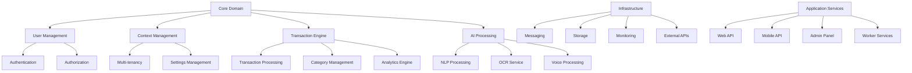

# Core Modules Specification
## Financy Platform Module Architecture & Implementation Details

**Version**: 1.0  
**Last Updated**: 2025-10-19  
**Target Audience**: Software architects, senior developers, and technical leads  

---

## Overview

This document provides detailed specifications for all core modules within the Financy platform. Each module is designed following Domain-Driven Design (DDD) principles with clear boundaries, well-defined interfaces, and specific responsibilities within the overall system architecture.

### Module Architecture Principles
1. **Single Responsibility**: Each module has a clear, focused purpose
2. **Loose Coupling**: Modules interact through well-defined interfaces
3. **High Cohesion**: Related functionality is grouped within modules
4. **Dependency Inversion**: Modules depend on abstractions, not concretions
5. **Event-Driven Communication**: Modules communicate via domain events

---

## Module Overview & Dependencies

### Module Dependency Graph


### Core Module Registry
```typescript
interface ModuleRegistry {
  core_modules: CoreModule[];
  infrastructure_modules: InfrastructureModule[];
  application_modules: ApplicationModule[];
  integration_modules: IntegrationModule[];
}

const FINANCY_MODULES: ModuleRegistry = {
  core_modules: [
    {
      name: 'user_management',
      version: '1.0.0',
      description: 'User lifecycle, authentication, and profile management',
      dependencies: ['core_domain', 'authentication', 'authorization'],
      exports: ['UserService', 'ProfileService', 'UserRepository'],
      domain_events: ['UserCreated', 'UserUpdated', 'UserDeactivated'],
      api_endpoints: ['/users', '/profiles'],
      database_entities: ['User', 'UserProfile', 'UserPreferences']
    },
    {
      name: 'context_management',
      version: '1.0.0',
      description: 'Financial context creation, sharing, and management',
      dependencies: ['core_domain', 'user_management', 'multi_tenancy'],
      exports: ['ContextService', 'ContextRepository', 'ContextMemberService'],
      domain_events: ['ContextCreated', 'ContextShared', 'MemberAdded'],
      api_endpoints: ['/contexts', '/contexts/{id}/members'],
      database_entities: ['Context', 'ContextMember', 'ContextSettings']
    },
    {
      name: 'transaction_engine',
      version: '1.0.0',
      description: 'Core transaction processing, categorization, and management',
      dependencies: ['core_domain', 'context_management', 'ai_processing'],
      exports: ['TransactionService', 'CategoryService', 'TransactionRepository'],
      domain_events: ['TransactionCreated', 'TransactionCategorized', 'TransactionUpdated'],
      api_endpoints: ['/transactions', '/categories'],
      database_entities: ['Transaction', 'Category', 'TransactionSplit']
    },
    {
      name: 'ai_processing',
      version: '1.0.0',
      description: 'AI-powered categorization, insights, and content processing',
      dependencies: ['core_domain', 'nlp_processing', 'ocr_service', 'voice_processing'],
      exports: ['AICategorizationService', 'InsightGenerationService', 'ContentAnalysisService'],
      domain_events: ['TransactionCategorized', 'InsightGenerated', 'ContentProcessed'],
      api_endpoints: ['/ai/categorize', '/ai/insights'],
      database_entities: ['CategoryPrediction', 'InsightResult', 'ProcessingJob']
    },
    {
      name: 'analytics_engine',
      version: '1.0.0',
      description: 'Financial analytics, reporting, and business intelligence',
      dependencies: ['core_domain', 'transaction_engine', 'context_management'],
      exports: ['AnalyticsService', 'ReportingService', 'MetricsService'],
      domain_events: ['ReportGenerated', 'MetricCalculated', 'AnalyticsRequested'],
      api_endpoints: ['/analytics', '/reports'],
      database_entities: ['AnalyticsResult', 'Report', 'MetricDefinition']
    }
  ],
  infrastructure_modules: [
    {
      name: 'messaging',
      version: '1.0.0',
      description: 'Event bus, message queuing, and async communication',
      dependencies: ['core_domain'],
      exports: ['EventBus', 'MessageQueue', 'EventStore'],
      technologies: ['Redis', 'RabbitMQ', 'EventStore'],
      configuration: 'messaging.config.ts'
    },
    {
      name: 'storage',
      version: '1.0.0',
      description: 'Database abstraction, file storage, and caching',
      dependencies: ['core_domain'],
      exports: ['DatabaseConnection', 'FileStorage', 'CacheService'],
      technologies: ['PostgreSQL', 'Redis', 'AWS S3'],
      configuration: 'storage.config.ts'
    },
    {
      name: 'monitoring',
      version: '1.0.0',
      description: 'Logging, metrics, tracing, and health monitoring',
      dependencies: [],
      exports: ['Logger', 'MetricsCollector', 'HealthChecker'],
      technologies: ['DataDog', 'Prometheus', 'OpenTelemetry'],
      configuration: 'monitoring.config.ts'
    }
  ],
  application_modules: [
    {
      name: 'web_api',
      version: '1.0.0',
      description: 'REST API for web applications',
      dependencies: ['user_management', 'context_management', 'transaction_engine'],
      exports: ['ApiControllers', 'ApiMiddleware', 'ApiDocumentation'],
      framework: 'NestJS',
      port: 3000
    },
    {
      name: 'mobile_api',
      version: '1.0.0',
      description: 'Optimized API for mobile applications',
      dependencies: ['user_management', 'context_management', 'transaction_engine'],
      exports: ['MobileControllers', 'MobileMiddleware', 'GraphQLResolvers'],
      framework: 'NestJS + GraphQL',
      port: 3001
    },
    {
      name: 'worker_services',
      version: '1.0.0',
      description: 'Background job processing and scheduled tasks',
      dependencies: ['ai_processing', 'messaging', 'analytics_engine'],
      exports: ['JobProcessors', 'ScheduledTasks', 'WorkerManager'],
      framework: 'Bull Queue + Cron',
      scaling: 'horizontal'
    }
  ],
  integration_modules: [
    {
      name: 'telegram_integration',
      version: '1.0.0',
      description: 'Telegram bot integration for transaction input',
      dependencies: ['transaction_engine', 'user_management'],
      exports: ['TelegramBotService', 'TelegramWebhookHandler'],
      external_api: 'Telegram Bot API',
      webhook_endpoint: '/webhooks/telegram'
    },
    {
      name: 'whatsapp_integration',
      version: '1.0.0',
      description: 'WhatsApp integration for transaction input',
      dependencies: ['transaction_engine', 'user_management'],
      exports: ['WhatsAppService', 'WhatsAppWebhookHandler'],
      external_api: 'WhatsApp Cloud API',
      webhook_endpoint: '/webhooks/whatsapp'
    },
    {
      name: 'external_apis',
      version: '1.0.0',
      description: 'Integration with external services (OpenAI, Google, etc.)',
      dependencies: ['ai_processing'],
      exports: ['OpenAIService', 'GoogleVisionService', 'ExchangeRateService'],
      external_apis: ['OpenAI API', 'Google Cloud Vision', 'Exchange Rate API'],
      rate_limiting: 'adaptive'
    }
  ]
};
```

---

## Core Domain Module

### Domain Model Specification
```typescript
// core-domain/entities/
export abstract class Entity<T> {
  protected readonly _id: T;
  protected readonly _createdAt: Date;
  protected _updatedAt: Date;

  constructor(id: T, createdAt?: Date) {
    this._id = id;
    this._createdAt = createdAt || new Date();
    this._updatedAt = new Date();
  }

  get id(): T {
    return this._id;
  }

  get createdAt(): Date {
    return this._createdAt;
  }

  get updatedAt(): Date {
    return this._updatedAt;
  }

  protected touch(): void {
    this._updatedAt = new Date();
  }

  public equals(other: Entity<T>): boolean {
    return this._id === other._id;
  }
}

export abstract class AggregateRoot<T> extends Entity<T> {
  private _domainEvents: DomainEvent[] = [];

  get domainEvents(): ReadonlyArray<DomainEvent> {
    return this._domainEvents;
  }

  protected addDomainEvent(event: DomainEvent): void {
    this._domainEvents.push(event);
  }

  public clearEvents(): void {
    this._domainEvents = [];
  }
}

// Value Objects
export class Money {
  constructor(
    private readonly _amount: number,
    private readonly _currency: Currency
  ) {
    if (_amount < 0) {
      throw new Error('Amount cannot be negative');
    }
    if (!_currency) {
      throw new Error('Currency is required');
    }
  }

  get amount(): number {
    return this._amount;
  }

  get currency(): Currency {
    return this._currency;
  }

  add(other: Money): Money {
    if (!this._currency.equals(other._currency)) {
      throw new Error('Cannot add money with different currencies');
    }
    return new Money(this._amount + other._amount, this._currency);
  }

  subtract(other: Money): Money {
    if (!this._currency.equals(other._currency)) {
      throw new Error('Cannot subtract money with different currencies');
    }
    return new Money(this._amount - other._amount, this._currency);
  }

  multiply(factor: number): Money {
    return new Money(this._amount * factor, this._currency);
  }

  equals(other: Money): boolean {
    return this._amount === other._amount && this._currency.equals(other._currency);
  }

  toString(): string {
    return `${this._currency.symbol}${this._amount.toFixed(2)}`;
  }
}

export class Currency {
  constructor(
    private readonly _code: string,
    private readonly _symbol: string,
    private readonly _name: string
  ) {
    if (!_code || _code.length !== 3) {
      throw new Error('Currency code must be 3 characters');
    }
  }

  get code(): string {
    return this._code;
  }

  get symbol(): string {
    return this._symbol;
  }

  get name(): string {
    return this._name;
  }

  equals(other: Currency): boolean {
    return this._code === other._code;
  }

  static BRL = new Currency('BRL', 'R$', 'Brazilian Real');
  static USD = new Currency('USD', '$', 'US Dollar');
  static EUR = new Currency('EUR', '€', 'Euro');
}

// Domain Events
export abstract class DomainEvent {
  readonly occurredOn: Date;
  readonly eventVersion: number;

  constructor(eventVersion: number = 1) {
    this.occurredOn = new Date();
    this.eventVersion = eventVersion;
  }

  abstract get eventName(): string;
}

export interface DomainEventHandler<T extends DomainEvent> {
  handle(event: T): Promise<void> | void;
}

export interface EventBus {
  publish(event: DomainEvent): Promise<void>;
  publishAll(events: DomainEvent[]): Promise<void>;
  subscribe<T extends DomainEvent>(
    eventType: new (...args: any[]) => T,
    handler: DomainEventHandler<T>
  ): void;
}
```

### Repository Pattern Implementation
```typescript
// core-domain/repositories/
export interface Repository<T, ID> {
  findById(id: ID): Promise<T | null>;
  save(entity: T): Promise<T>;
  delete(id: ID): Promise<void>;
  exists(id: ID): Promise<boolean>;
}

export interface SpecificationRepository<T, ID> extends Repository<T, ID> {
  findBySpecification(spec: Specification<T>): Promise<T[]>;
  findOneBySpecification(spec: Specification<T>): Promise<T | null>;
  countBySpecification(spec: Specification<T>): Promise<number>;
}

export abstract class Specification<T> {
  abstract isSatisfiedBy(entity: T): boolean;
  
  and(other: Specification<T>): Specification<T> {
    return new AndSpecification(this, other);
  }
  
  or(other: Specification<T>): Specification<T> {
    return new OrSpecification(this, other);
  }
  
  not(): Specification<T> {
    return new NotSpecification(this);
  }
}

class AndSpecification<T> extends Specification<T> {
  constructor(
    private left: Specification<T>,
    private right: Specification<T>
  ) {
    super();
  }

  isSatisfiedBy(entity: T): boolean {
    return this.left.isSatisfiedBy(entity) && this.right.isSatisfiedBy(entity);
  }
}

class OrSpecification<T> extends Specification<T> {
  constructor(
    private left: Specification<T>,
    private right: Specification<T>
  ) {
    super();
  }

  isSatisfiedBy(entity: T): boolean {
    return this.left.isSatisfiedBy(entity) || this.right.isSatisfiedBy(entity);
  }
}

class NotSpecification<T> extends Specification<T> {
  constructor(private spec: Specification<T>) {
    super();
  }

  isSatisfiedBy(entity: T): boolean {
    return !this.spec.isSatisfiedBy(entity);
  }
}
```

---

## User Management Module

### User Aggregate Implementation
```typescript
// user-management/domain/
export class UserId {
  constructor(private readonly _value: string) {
    if (!_value || _value.trim().length === 0) {
      throw new Error('User ID cannot be empty');
    }
  }

  get value(): string {
    return this._value;
  }

  equals(other: UserId): boolean {
    return this._value === other._value;
  }

  toString(): string {
    return this._value;
  }
}

export class User extends AggregateRoot<UserId> {
  private _email: Email;
  private _fullName: string;
  private _status: UserStatus;
  private _preferences: UserPreferences;
  private _profile: UserProfile;

  constructor(
    id: UserId,
    email: Email,
    fullName: string,
    preferences: UserPreferences,
    profile: UserProfile,
    status: UserStatus = UserStatus.ACTIVE,
    createdAt?: Date
  ) {
    super(id, createdAt);
    this._email = email;
    this._fullName = fullName;
    this._status = status;
    this._preferences = preferences;
    this._profile = profile;

    if (!createdAt) {
      this.addDomainEvent(new UserCreatedEvent(this));
    }
  }

  get email(): Email {
    return this._email;
  }

  get fullName(): string {
    return this._fullName;
  }

  get status(): UserStatus {
    return this._status;
  }

  get preferences(): UserPreferences {
    return this._preferences;
  }

  get profile(): UserProfile {
    return this._profile;
  }

  updateEmail(newEmail: Email): void {
    if (!this._email.equals(newEmail)) {
      const oldEmail = this._email;
      this._email = newEmail;
      this.touch();
      this.addDomainEvent(new UserEmailUpdatedEvent(this, oldEmail, newEmail));
    }
  }

  updateFullName(newFullName: string): void {
    if (this._fullName !== newFullName) {
      this._fullName = newFullName;
      this.touch();
      this.addDomainEvent(new UserProfileUpdatedEvent(this));
    }
  }

  updatePreferences(newPreferences: UserPreferences): void {
    this._preferences = newPreferences;
    this.touch();
    this.addDomainEvent(new UserPreferencesUpdatedEvent(this));
  }

  deactivate(): void {
    if (this._status !== UserStatus.INACTIVE) {
      this._status = UserStatus.INACTIVE;
      this.touch();
      this.addDomainEvent(new UserDeactivatedEvent(this));
    }
  }

  activate(): void {
    if (this._status !== UserStatus.ACTIVE) {
      this._status = UserStatus.ACTIVE;
      this.touch();
      this.addDomainEvent(new UserActivatedEvent(this));
    }
  }

  isActive(): boolean {
    return this._status === UserStatus.ACTIVE;
  }
}

export class Email {
  private readonly _value: string;

  constructor(value: string) {
    if (!this.isValidEmail(value)) {
      throw new Error('Invalid email format');
    }
    this._value = value.toLowerCase();
  }

  get value(): string {
    return this._value;
  }

  equals(other: Email): boolean {
    return this._value === other._value;
  }

  toString(): string {
    return this._value;
  }

  private isValidEmail(email: string): boolean {
    const emailRegex = /^[^\s@]+@[^\s@]+\.[^\s@]+$/;
    return emailRegex.test(email);
  }
}

export enum UserStatus {
  ACTIVE = 'active',
  INACTIVE = 'inactive',
  SUSPENDED = 'suspended',
  PENDING_VERIFICATION = 'pending_verification'
}

export class UserPreferences {
  constructor(
    public readonly language: string,
    public readonly timezone: string,
    public readonly defaultCurrency: Currency,
    public readonly notifications: NotificationPreferences,
    public readonly privacy: PrivacyPreferences
  ) {}
}

export class NotificationPreferences {
  constructor(
    public readonly email: boolean,
    public readonly push: boolean,
    public readonly telegram: boolean,
    public readonly whatsapp: boolean,
    public readonly frequency: NotificationFrequency
  ) {}
}

export enum NotificationFrequency {
  IMMEDIATE = 'immediate',
  DAILY = 'daily',
  WEEKLY = 'weekly',
  MONTHLY = 'monthly'
}

export class PrivacyPreferences {
  constructor(
    public readonly dataSharing: boolean,
    public readonly analyticsOptIn: boolean,
    public readonly marketingOptIn: boolean,
    public readonly thirdPartyIntegrations: boolean
  ) {}
}

export class UserProfile {
  constructor(
    public readonly dateOfBirth?: Date,
    public readonly phoneNumber?: string,
    public readonly address?: Address,
    public readonly occupation?: string,
    public readonly income?: Money
  ) {}
}

export class Address {
  constructor(
    public readonly street: string,
    public readonly city: string,
    public readonly state: string,
    public readonly zipCode: string,
    public readonly country: string
  ) {}
}

// Domain Events
export class UserCreatedEvent extends DomainEvent {
  constructor(public readonly user: User) {
    super();
  }

  get eventName(): string {
    return 'UserCreated';
  }
}

export class UserEmailUpdatedEvent extends DomainEvent {
  constructor(
    public readonly user: User,
    public readonly oldEmail: Email,
    public readonly newEmail: Email
  ) {
    super();
  }

  get eventName(): string {
    return 'UserEmailUpdated';
  }
}

export class UserDeactivatedEvent extends DomainEvent {
  constructor(public readonly user: User) {
    super();
  }

  get eventName(): string {
    return 'UserDeactivated';
  }
}
```

### User Service Implementation
```typescript
// user-management/application/
export interface UserRepository extends SpecificationRepository<User, UserId> {
  findByEmail(email: Email): Promise<User | null>;
  findByStatus(status: UserStatus): Promise<User[]>;
}

export class UserService {
  constructor(
    private readonly userRepository: UserRepository,
    private readonly eventBus: EventBus,
    private readonly passwordService: PasswordService,
    private readonly emailService: EmailService
  ) {}

  async createUser(command: CreateUserCommand): Promise<User> {
    // Check if user already exists
    const existingUser = await this.userRepository.findByEmail(command.email);
    if (existingUser) {
      throw new UserAlreadyExistsError(command.email);
    }

    // Create user
    const userId = new UserId(generateUUID());
    const user = new User(
      userId,
      command.email,
      command.fullName,
      command.preferences,
      command.profile
    );

    // Save user
    await this.userRepository.save(user);

    // Publish events
    await this.eventBus.publishAll(user.domainEvents);
    user.clearEvents();

    // Send welcome email
    await this.emailService.sendWelcomeEmail(user);

    return user;
  }

  async updateUserProfile(command: UpdateUserProfileCommand): Promise<User> {
    const user = await this.userRepository.findById(command.userId);
    if (!user) {
      throw new UserNotFoundError(command.userId);
    }

    // Update profile
    if (command.fullName) {
      user.updateFullName(command.fullName);
    }

    if (command.email) {
      // Check if new email is already taken
      const existingUser = await this.userRepository.findByEmail(command.email);
      if (existingUser && !existingUser.id.equals(user.id)) {
        throw new EmailAlreadyTakenError(command.email);
      }
      user.updateEmail(command.email);
    }

    if (command.preferences) {
      user.updatePreferences(command.preferences);
    }

    // Save changes
    await this.userRepository.save(user);

    // Publish events
    await this.eventBus.publishAll(user.domainEvents);
    user.clearEvents();

    return user;
  }

  async deactivateUser(command: DeactivateUserCommand): Promise<void> {
    const user = await this.userRepository.findById(command.userId);
    if (!user) {
      throw new UserNotFoundError(command.userId);
    }

    user.deactivate();
    await this.userRepository.save(user);

    // Publish events
    await this.eventBus.publishAll(user.domainEvents);
    user.clearEvents();
  }

  async getUserById(userId: UserId): Promise<User> {
    const user = await this.userRepository.findById(userId);
    if (!user) {
      throw new UserNotFoundError(userId);
    }
    return user;
  }

  async getUserByEmail(email: Email): Promise<User> {
    const user = await this.userRepository.findByEmail(email);
    if (!user) {
      throw new UserNotFoundError(email);
    }
    return user;
  }

  async searchUsers(criteria: UserSearchCriteria): Promise<User[]> {
    const specification = this.buildUserSpecification(criteria);
    return await this.userRepository.findBySpecification(specification);
  }

  private buildUserSpecification(criteria: UserSearchCriteria): Specification<User> {
    let spec: Specification<User> = new TrueSpecification<User>();

    if (criteria.status) {
      spec = spec.and(new UserStatusSpecification(criteria.status));
    }

    if (criteria.createdAfter) {
      spec = spec.and(new UserCreatedAfterSpecification(criteria.createdAfter));
    }

    if (criteria.searchTerm) {
      spec = spec.and(new UserSearchTermSpecification(criteria.searchTerm));
    }

    return spec;
  }
}

// Specifications
export class UserStatusSpecification extends Specification<User> {
  constructor(private readonly status: UserStatus) {
    super();
  }

  isSatisfiedBy(user: User): boolean {
    return user.status === this.status;
  }
}

export class UserCreatedAfterSpecification extends Specification<User> {
  constructor(private readonly date: Date) {
    super();
  }

  isSatisfiedBy(user: User): boolean {
    return user.createdAt >= this.date;
  }
}

export class UserSearchTermSpecification extends Specification<User> {
  constructor(private readonly searchTerm: string) {
    super();
  }

  isSatisfiedBy(user: User): boolean {
    const term = this.searchTerm.toLowerCase();
    return (
      user.fullName.toLowerCase().includes(term) ||
      user.email.value.toLowerCase().includes(term)
    );
  }
}

// Commands
export class CreateUserCommand {
  constructor(
    public readonly email: Email,
    public readonly fullName: string,
    public readonly preferences: UserPreferences,
    public readonly profile: UserProfile,
    public readonly password: string
  ) {}
}

export class UpdateUserProfileCommand {
  constructor(
    public readonly userId: UserId,
    public readonly fullName?: string,
    public readonly email?: Email,
    public readonly preferences?: UserPreferences,
    public readonly profile?: UserProfile
  ) {}
}

export class DeactivateUserCommand {
  constructor(public readonly userId: UserId) {}
}

// Errors
export class UserAlreadyExistsError extends Error {
  constructor(email: Email) {
    super(`User with email ${email.value} already exists`);
  }
}

export class UserNotFoundError extends Error {
  constructor(identifier: UserId | Email) {
    super(`User with identifier ${identifier.toString()} not found`);
  }
}

export class EmailAlreadyTakenError extends Error {
  constructor(email: Email) {
    super(`Email ${email.value} is already taken`);
  }
}
```

---

## Transaction Engine Module

### Transaction Aggregate Implementation
```typescript
// transaction-engine/domain/
export class TransactionId {
  constructor(private readonly _value: string) {
    if (!_value || _value.trim().length === 0) {
      throw new Error('Transaction ID cannot be empty');
    }
  }

  get value(): string {
    return this._value;
  }

  equals(other: TransactionId): boolean {
    return this._value === other._value;
  }

  toString(): string {
    return this._value;
  }
}

export class Transaction extends AggregateRoot<TransactionId> {
  private _amount: Money;
  private _description: string;
  private _category: TransactionCategory | null;
  private _date: Date;
  private _time?: string;
  private _merchantName?: string;
  private _location?: TransactionLocation;
  private _splits: TransactionSplit[];
  private _status: TransactionStatus;
  private _metadata: TransactionMetadata;
  private _userId: UserId;
  private _contextId: ContextId;

  constructor(
    id: TransactionId,
    amount: Money,
    description: string,
    date: Date,
    userId: UserId,
    contextId: ContextId,
    category?: TransactionCategory,
    time?: string,
    merchantName?: string,
    location?: TransactionLocation,
    metadata?: TransactionMetadata,
    status: TransactionStatus = TransactionStatus.PENDING,
    createdAt?: Date
  ) {
    super(id, createdAt);
    this._amount = amount;
    this._description = description;
    this._category = category || null;
    this._date = date;
    this._time = time;
    this._merchantName = merchantName;
    this._location = location;
    this._splits = [];
    this._status = status;
    this._metadata = metadata || new TransactionMetadata();
    this._userId = userId;
    this._contextId = contextId;

    if (!createdAt) {
      this.addDomainEvent(new TransactionCreatedEvent(this));
    }
  }

  get amount(): Money {
    return this._amount;
  }

  get description(): string {
    return this._description;
  }

  get category(): TransactionCategory | null {
    return this._category;
  }

  get date(): Date {
    return this._date;
  }

  get time(): string | undefined {
    return this._time;
  }

  get merchantName(): string | undefined {
    return this._merchantName;
  }

  get location(): TransactionLocation | undefined {
    return this._location;
  }

  get splits(): ReadonlyArray<TransactionSplit> {
    return this._splits;
  }

  get status(): TransactionStatus {
    return this._status;
  }

  get metadata(): TransactionMetadata {
    return this._metadata;
  }

  get userId(): UserId {
    return this._userId;
  }

  get contextId(): ContextId {
    return this._contextId;
  }

  categorize(category: TransactionCategory, confidence?: number): void {
    const oldCategory = this._category;
    this._category = category;
    
    if (confidence !== undefined) {
      this._metadata = this._metadata.withCategoryConfidence(confidence);
    }
    
    this.touch();
    this.addDomainEvent(new TransactionCategorizedEvent(this, oldCategory, category));
  }

  updateAmount(newAmount: Money): void {
    if (!this._amount.equals(newAmount)) {
      const oldAmount = this._amount;
      this._amount = newAmount;
      this.touch();
      this.addDomainEvent(new TransactionAmountUpdatedEvent(this, oldAmount, newAmount));
    }
  }

  updateDescription(newDescription: string): void {
    if (this._description !== newDescription) {
      this._description = newDescription;
      this.touch();
      this.addDomainEvent(new TransactionUpdatedEvent(this));
    }
  }

  split(splits: TransactionSplit[]): void {
    this.validateSplits(splits);
    this._splits = [...splits];
    this.touch();
    this.addDomainEvent(new TransactionSplitEvent(this, splits));
  }

  confirm(): void {
    if (this._status !== TransactionStatus.CONFIRMED) {
      this._status = TransactionStatus.CONFIRMED;
      this.touch();
      this.addDomainEvent(new TransactionConfirmedEvent(this));
    }
  }

  cancel(): void {
    if (this._status !== TransactionStatus.CANCELLED) {
      this._status = TransactionStatus.CANCELLED;
      this.touch();
      this.addDomainEvent(new TransactionCancelledEvent(this));
    }
  }

  addAttachment(attachment: TransactionAttachment): void {
    this._metadata = this._metadata.addAttachment(attachment);
    this.touch();
    this.addDomainEvent(new TransactionAttachmentAddedEvent(this, attachment));
  }

  private validateSplits(splits: TransactionSplit[]): void {
    if (splits.length === 0) {
      throw new Error('At least one split is required');
    }

    const totalSplitAmount = splits.reduce(
      (total, split) => total.add(split.amount),
      new Money(0, this._amount.currency)
    );

    if (!totalSplitAmount.equals(this._amount)) {
      throw new Error('Split amounts must equal transaction amount');
    }
  }

  isSplit(): boolean {
    return this._splits.length > 0;
  }

  isConfirmed(): boolean {
    return this._status === TransactionStatus.CONFIRMED;
  }

  isPending(): boolean {
    return this._status === TransactionStatus.PENDING;
  }
}

export enum TransactionStatus {
  PENDING = 'pending',
  CONFIRMED = 'confirmed',
  CANCELLED = 'cancelled',
  FAILED = 'failed'
}

export class TransactionCategory {
  constructor(
    public readonly id: string,
    public readonly name: string,
    public readonly parentId?: string,
    public readonly color?: string,
    public readonly icon?: string
  ) {}

  equals(other: TransactionCategory): boolean {
    return this.id === other.id;
  }
}

export class TransactionLocation {
  constructor(
    public readonly latitude: number,
    public readonly longitude: number,
    public readonly address?: string,
    public readonly city?: string,
    public readonly country?: string
  ) {}
}

export class TransactionSplit {
  constructor(
    public readonly amount: Money,
    public readonly category: TransactionCategory,
    public readonly description?: string,
    public readonly participant?: string
  ) {}
}

export class TransactionMetadata {
  constructor(
    public readonly inputMethod: InputMethod = InputMethod.MANUAL,
    public readonly sourceApp?: string,
    public readonly deviceInfo?: DeviceInfo,
    public readonly categoryConfidence?: number,
    public readonly attachments: TransactionAttachment[] = [],
    public readonly processingNotes: string[] = [],
    public readonly tags: string[] = []
  ) {}

  withCategoryConfidence(confidence: number): TransactionMetadata {
    return new TransactionMetadata(
      this.inputMethod,
      this.sourceApp,
      this.deviceInfo,
      confidence,
      this.attachments,
      this.processingNotes,
      this.tags
    );
  }

  addAttachment(attachment: TransactionAttachment): TransactionMetadata {
    return new TransactionMetadata(
      this.inputMethod,
      this.sourceApp,
      this.deviceInfo,
      this.categoryConfidence,
      [...this.attachments, attachment],
      this.processingNotes,
      this.tags
    );
  }

  addProcessingNote(note: string): TransactionMetadata {
    return new TransactionMetadata(
      this.inputMethod,
      this.sourceApp,
      this.deviceInfo,
      this.categoryConfidence,
      this.attachments,
      [...this.processingNotes, note],
      this.tags
    );
  }
}

export enum InputMethod {
  MANUAL = 'manual',
  VOICE = 'voice',
  OCR = 'ocr',
  API = 'api',
  TELEGRAM = 'telegram',
  WHATSAPP = 'whatsapp',
  CSV_IMPORT = 'csv_import'
}

export class DeviceInfo {
  constructor(
    public readonly platform: string,
    public readonly appVersion: string,
    public readonly osVersion?: string,
    public readonly deviceModel?: string
  ) {}
}

export class TransactionAttachment {
  constructor(
    public readonly id: string,
    public readonly type: AttachmentType,
    public readonly filename: string,
    public readonly fileUrl: string,
    public readonly fileSize: number,
    public readonly uploadedAt: Date
  ) {}
}

export enum AttachmentType {
  RECEIPT = 'receipt',
  INVOICE = 'invoice',
  PHOTO = 'photo',
  DOCUMENT = 'document',
  AUDIO = 'audio'
}

// Domain Events
export class TransactionCreatedEvent extends DomainEvent {
  constructor(public readonly transaction: Transaction) {
    super();
  }

  get eventName(): string {
    return 'TransactionCreated';
  }
}

export class TransactionCategorizedEvent extends DomainEvent {
  constructor(
    public readonly transaction: Transaction,
    public readonly oldCategory: TransactionCategory | null,
    public readonly newCategory: TransactionCategory
  ) {
    super();
  }

  get eventName(): string {
    return 'TransactionCategorized';
  }
}

export class TransactionSplitEvent extends DomainEvent {
  constructor(
    public readonly transaction: Transaction,
    public readonly splits: TransactionSplit[]
  ) {
    super();
  }

  get eventName(): string {
    return 'TransactionSplit';
  }
}
```

This comprehensive core modules specification provides detailed implementation guidance for the Financy platform's key modules, including domain models, services, repositories, and event handling patterns.