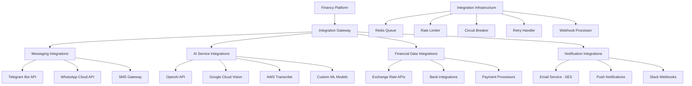

# Integration Modules Specification
## Financy Platform External Integration Architecture & Implementation

**Version**: 1.0  
**Last Updated**: 2025-10-19  
**Target Audience**: Integration engineers, backend developers, and API specialists  

---

## Overview

This document provides detailed specifications for all external integration modules within the Financy platform. These modules handle communication with third-party services, messaging platforms, AI services, and external APIs while maintaining security, reliability, and optimal performance.

### Integration Architecture Principles
1. **Resilience First**: Circuit breakers, retries, and graceful degradation
2. **Security by Default**: API key management, request signing, and data encryption
3. **Rate Limit Awareness**: Intelligent request throttling and queue management
4. **Event-Driven**: Webhook handling and real-time event processing
5. **Monitoring & Observability**: Comprehensive logging and metrics collection

---

## Integration Architecture Overview

### Integration Layer Diagram


### Integration Module Registry
```typescript
interface IntegrationModuleRegistry {
  messaging_integrations: MessagingIntegration[];
  ai_service_integrations: AIServiceIntegration[];
  financial_integrations: FinancialIntegration[];
  notification_integrations: NotificationIntegration[];
  infrastructure: IntegrationInfrastructure;
}

const INTEGRATION_MODULES: IntegrationModuleRegistry = {
  messaging_integrations: [
    {
      name: 'telegram_bot',
      version: '1.0.0',
      description: 'Telegram Bot API integration for transaction input',
      api_endpoint: 'https://api.telegram.org',
      webhook_endpoint: '/webhooks/telegram',
      authentication: 'bot_token',
      rate_limits: {
        messages_per_second: 30,
        messages_per_minute: 20,
        burst_limit: 1
      },
      supported_features: [
        'text_messages',
        'voice_messages',
        'photo_uploads',
        'document_uploads',
        'inline_keyboards',
        'command_handling'
      ],
      security: {
        webhook_verification: true,
        ip_whitelist: ['149.154.160.0/20', '91.108.4.0/22'],
        request_signing: false,
        ssl_required: true
      }
    },
    {
      name: 'whatsapp_cloud',
      version: '1.0.0',
      description: 'WhatsApp Cloud API integration for transaction input',
      api_endpoint: 'https://graph.facebook.com/v18.0',
      webhook_endpoint: '/webhooks/whatsapp',
      authentication: 'bearer_token',
      rate_limits: {
        messages_per_second: 50,
        requests_per_hour: 250000,
        burst_limit: 100
      },
      supported_features: [
        'text_messages',
        'audio_messages',
        'image_uploads',
        'document_uploads',
        'interactive_buttons',
        'message_templates'
      ],
      security: {
        webhook_verification: true,
        verify_token: 'required',
        request_signing: true,
        ssl_required: true
      }
    }
  ],
  ai_service_integrations: [
    {
      name: 'openai_api',
      version: '1.0.0',
      description: 'OpenAI API integration for NLP and audio processing',
      api_endpoint: 'https://api.openai.com/v1',
      authentication: 'api_key',
      rate_limits: {
        requests_per_minute: 3000,
        tokens_per_minute: 250000,
        requests_per_day: 200000
      },
      supported_models: {
        chat: 'gpt-4-turbo-preview',
        embeddings: 'text-embedding-3-large',
        audio_transcription: 'whisper-1',
        audio_translation: 'whisper-1'
      },
      pricing_awareness: true,
      timeout_config: {
        connection_timeout: 10000,
        read_timeout: 60000,
        retry_timeout: 5000
      }
    },
    {
      name: 'google_cloud_vision',
      version: '1.0.0',
      description: 'Google Cloud Vision API for OCR and image analysis',
      api_endpoint: 'https://vision.googleapis.com/v1',
      authentication: 'service_account',
      rate_limits: {
        requests_per_minute: 1800,
        requests_per_100s: 1800,
        images_per_request: 16
      },
      supported_features: [
        'text_detection',
        'document_text_detection',
        'object_localization',
        'logo_detection',
        'safe_search_detection'
      ],
      quota_management: true
    }
  ],
  financial_integrations: [
    {
      name: 'exchange_rate_api',
      version: '1.0.0',
      description: 'Real-time currency exchange rates',
      api_endpoint: 'https://api.exchangerate-api.com/v4',
      authentication: 'api_key',
      rate_limits: {
        requests_per_month: 100000,
        requests_per_minute: 10
      },
      supported_currencies: 168,
      update_frequency: 'hourly',
      fallback_providers: ['fixer.io', 'currencylayer.com'],
      caching_strategy: {
        cache_duration: 3600, // 1 hour
        stale_while_revalidate: 1800 // 30 minutes
      }
    }
  ],
  notification_integrations: [
    {
      name: 'aws_ses',
      version: '1.0.0',
      description: 'Amazon SES for email delivery',
      api_endpoint: 'https://email.us-east-1.amazonaws.com',
      authentication: 'aws_signature_v4',
      rate_limits: {
        sending_rate: 14, // emails per second
        daily_quota: 200000
      },
      features: [
        'transactional_emails',
        'bounce_handling',
        'complaint_handling',
        'delivery_tracking',
        'template_support'
      ],
      compliance: ['gdpr', 'can_spam', 'dkim_signing']
    },
    {
      name: 'push_notifications',
      version: '1.0.0',
      description: 'Firebase Cloud Messaging for push notifications',
      api_endpoint: 'https://fcm.googleapis.com/v1',
      authentication: 'service_account',
      rate_limits: {
        requests_per_minute: 600000,
        message_rate: 2500000 // per minute
      },
      platforms: ['ios', 'android', 'web'],
      features: [
        'topic_messaging',
        'device_group_messaging',
        'message_targeting',
        'analytics_integration'
      ]
    }
  ],
  infrastructure: {
    circuit_breaker: {
      failure_threshold: 5,
      recovery_timeout: 60000,
      half_open_max_calls: 3
    },
    retry_policy: {
      max_attempts: 3,
      initial_delay: 1000,
      max_delay: 30000,
      backoff_multiplier: 2.0,
      jitter: true
    },
    rate_limiting: {
      strategy: 'sliding_window',
      storage: 'redis',
      key_generator: 'service_endpoint_user'
    },
    monitoring: {
      metrics_collection: 'prometheus',
      distributed_tracing: 'jaeger',
      log_aggregation: 'datadog'
    }
  }
};
```

---

## Messaging Platform Integrations

### Telegram Bot Integration
```typescript
// integrations/messaging/telegram/
export class TelegramBotService {
  private readonly httpClient: AxiosInstance;
  private readonly circuitBreaker: CircuitBreaker;
  private readonly rateLimiter: RateLimiter;
  private readonly eventBus: EventBus;

  constructor(
    private readonly config: TelegramConfig,
    private readonly logger: Logger,
    private readonly transactionService: TransactionService,
    private readonly userService: UserService
  ) {
    this.httpClient = this.createHttpClient();
    this.circuitBreaker = new CircuitBreaker(this.makeApiCall.bind(this), {
      threshold: 5,
      timeout: 10000,
      resetTimeout: 60000
    });
    this.rateLimiter = new RateLimiter({
      tokensPerInterval: 30,
      interval: 'second'
    });
  }

  private createHttpClient(): AxiosInstance {
    const client = axios.create({
      baseURL: `https://api.telegram.org/bot${this.config.botToken}`,
      timeout: 10000,
      headers: {
        'Content-Type': 'application/json'
      }
    });

    // Request interceptor for rate limiting
    client.interceptors.request.use(async (config) => {
      await this.rateLimiter.waitForToken();
      return config;
    });

    // Response interceptor for logging and error handling
    client.interceptors.response.use(
      (response) => {
        this.logger.debug('Telegram API response', {
          method: response.config.method,
          url: response.config.url,
          status: response.status,
          responseSize: JSON.stringify(response.data).length
        });
        return response;
      },
      (error) => {
        this.logger.error('Telegram API error', {
          method: error.config?.method,
          url: error.config?.url,
          status: error.response?.status,
          error: error.message,
          retryCount: error.config?.__retryCount || 0
        });
        return Promise.reject(error);
      }
    );

    return client;
  }

  async handleWebhook(update: TelegramUpdate): Promise<void> {
    this.logger.log('Processing Telegram webhook', {
      updateId: update.update_id,
      messageType: this.getMessageType(update),
      userId: update.message?.from?.id || update.callback_query?.from?.id
    });

    try {
      if (update.message) {
        await this.handleMessage(update.message);
      } else if (update.callback_query) {
        await this.handleCallbackQuery(update.callback_query);
      } else if (update.inline_query) {
        await this.handleInlineQuery(update.inline_query);
      }
    } catch (error) {
      this.logger.error('Failed to process Telegram webhook', {
        error: error.message,
        updateId: update.update_id,
        stack: error.stack
      });
      
      // Send error message to user if possible
      if (update.message?.chat?.id) {
        await this.sendErrorMessage(update.message.chat.id, error);
      }
    }
  }

  private async handleMessage(message: TelegramMessage): Promise<void> {
    const chatId = message.chat.id;
    const userId = message.from.id.toString();

    // Check if user exists in our system
    const user = await this.findOrCreateUser(message.from);

    if (message.text?.startsWith('/')) {
      await this.handleCommand(message, user);
    } else if (message.voice) {
      await this.handleVoiceMessage(message, user);
    } else if (message.photo) {
      await this.handlePhotoMessage(message, user);
    } else if (message.document) {
      await this.handleDocumentMessage(message, user);
    } else if (message.text) {
      await this.handleTextMessage(message, user);
    }
  }

  private async handleCommand(message: TelegramMessage, user: User): Promise<void> {
    const command = message.text!.split(' ')[0].substring(1); // Remove '/'
    const args = message.text!.split(' ').slice(1);

    switch (command) {
      case 'start':
        await this.handleStartCommand(message, user);
        break;
      case 'help':
        await this.handleHelpCommand(message);
        break;
      case 'add':
        await this.handleAddTransactionCommand(message, user, args);
        break;
      case 'balance':
        await this.handleBalanceCommand(message, user);
        break;
      case 'stats':
        await this.handleStatsCommand(message, user);
        break;
      case 'settings':
        await this.handleSettingsCommand(message, user);
        break;
      default:
        await this.sendMessage(message.chat.id, 
          '❓ Unknown command. Type /help to see available commands.');
    }
  }

  private async handleVoiceMessage(message: TelegramMessage, user: User): Promise<void> {
    const chatId = message.chat.id;
    
    try {
      // Send processing message
      const processingMessage = await this.sendMessage(chatId, 
        '🎤 Processing your voice message...');

      // Download voice file
      const voiceFile = await this.downloadFile(message.voice!.file_id);
      
      // Process voice transaction
      const command = new ProcessVoiceTransactionCommand(
        voiceFile,
        user.getDefaultContextId(), // Implement this method
        user.id,
        {
          platform: 'telegram',
          messageId: message.message_id.toString(),
          duration: message.voice!.duration
        }
      );

      const result = await this.transactionService.processVoiceTransaction(command);

      // Update processing message with result
      await this.editMessage(
        chatId,
        processingMessage.message_id,
        this.formatVoiceProcessingResult(result)
      );

      // If transaction was created, show confirmation with inline keyboard
      if (result.transaction) {
        await this.sendTransactionConfirmation(chatId, result.transaction);
      }

    } catch (error) {
      this.logger.error('Failed to process voice message', {
        error: error.message,
        userId: user.id.value,
        chatId
      });

      await this.sendMessage(chatId, 
        '❌ Sorry, I couldn\'t process your voice message. Please try again or type your transaction manually.');
    }
  }

  private async handlePhotoMessage(message: TelegramMessage, user: User): Promise<void> {
    const chatId = message.chat.id;
    
    try {
      // Send processing message
      const processingMessage = await this.sendMessage(chatId, 
        '📷 Processing your receipt...');

      // Get the highest resolution photo
      const photo = message.photo![message.photo!.length - 1];
      const imageFile = await this.downloadFile(photo.file_id);

      // Process receipt
      const command = new ProcessReceiptCommand(
        imageFile,
        user.getDefaultContextId(),
        user.id,
        {
          platform: 'telegram',
          messageId: message.message_id.toString(),
          caption: message.caption
        }
      );

      const result = await this.transactionService.processReceipt(command);

      // Update processing message with result
      await this.editMessage(
        chatId,
        processingMessage.message_id,
        this.formatReceiptProcessingResult(result)
      );

      // Show extracted transactions for confirmation
      if (result.transactions.length > 0) {
        for (const transaction of result.transactions) {
          await this.sendTransactionConfirmation(chatId, transaction);
        }
      }

    } catch (error) {
      this.logger.error('Failed to process photo message', {
        error: error.message,
        userId: user.id.value,
        chatId
      });

      await this.sendMessage(chatId, 
        '❌ Sorry, I couldn\'t process your receipt. Please make sure the image is clear and try again.');
    }
  }

  private async handleTextMessage(message: TelegramMessage, user: User): Promise<void> {
    const chatId = message.chat.id;
    const text = message.text!;

    try {
      // Use NLP to extract transaction information
      const nlpResult = await this.transactionService.parseTransactionText(text);

      if (nlpResult.confidence > 0.7) {
        // High confidence - create transaction directly
        const command = new CreateTransactionCommand(
          nlpResult.amount,
          nlpResult.description,
          nlpResult.date || new Date(),
          user.id,
          user.getDefaultContextId(),
          nlpResult.category,
          undefined, // time
          nlpResult.merchant,
          undefined, // location
          new TransactionMetadata(
            InputMethod.TELEGRAM,
            'telegram',
            undefined,
            nlpResult.confidence
          )
        );

        const transaction = await this.transactionService.createTransaction(command);
        await this.sendTransactionConfirmation(chatId, transaction);
      } else if (nlpResult.confidence > 0.4) {
        // Medium confidence - ask for confirmation
        await this.sendTransactionConfirmationRequest(chatId, nlpResult);
      } else {
        // Low confidence - ask for clarification
        await this.sendMessage(chatId, 
          `❓ I'm not sure I understood your transaction. Could you please provide more details like:\n\n` +
          `💰 Amount: How much did you spend?\n` +
          `📝 Description: What was it for?\n` +
          `🏪 Merchant: Where did you buy it?\n\n` +
          `Example: "Spent $25.50 on groceries at Walmart"`);
      }

    } catch (error) {
      this.logger.error('Failed to process text message', {
        error: error.message,
        text,
        userId: user.id.value,
        chatId
      });

      await this.sendMessage(chatId, 
        '❌ Sorry, I had trouble understanding your message. Please try again or use /help for available commands.');
    }
  }

  private async sendTransactionConfirmation(
    chatId: number, 
    transaction: Transaction
  ): Promise<void> {
    const message = this.formatTransactionMessage(transaction);
    const keyboard = this.createTransactionKeyboard(transaction);

    await this.sendMessage(chatId, message, {
      reply_markup: keyboard,
      parse_mode: 'Markdown'
    });
  }

  private formatTransactionMessage(transaction: Transaction): string {
    const amount = `${transaction.amount.currency.symbol}${transaction.amount.amount.toFixed(2)}`;
    const category = transaction.category?.name || 'Uncategorized';
    const date = transaction.date.toLocaleDateString();

    return `💳 *Transaction Created*\n\n` +
           `💰 Amount: *${amount}*\n` +
           `📝 Description: ${transaction.description}\n` +
           `🏷️ Category: ${category}\n` +
           `📅 Date: ${date}\n` +
           `${transaction.merchantName ? `🏪 Merchant: ${transaction.merchantName}\n` : ''}` +
           `\nIs this correct?`;
  }

  private createTransactionKeyboard(transaction: Transaction): InlineKeyboardMarkup {
    return {
      inline_keyboard: [
        [
          {
            text: '✅ Confirm',
            callback_data: `confirm_transaction:${transaction.id.value}`
          },
          {
            text: '✏️ Edit',
            callback_data: `edit_transaction:${transaction.id.value}`
          }
        ],
        [
          {
            text: '🗑️ Delete',
            callback_data: `delete_transaction:${transaction.id.value}`
          },
          {
            text: '🏷️ Change Category',
            callback_data: `change_category:${transaction.id.value}`
          }
        ]
      ]
    };
  }

  private async makeApiCall(method: string, data?: any): Promise<any> {
    const response = await this.httpClient.post(`/${method}`, data);
    
    if (!response.data.ok) {
      throw new TelegramApiError(
        `Telegram API error: ${response.data.description}`,
        response.data.error_code
      );
    }
    
    return response.data.result;
  }

  async sendMessage(
    chatId: number, 
    text: string, 
    options?: SendMessageOptions
  ): Promise<TelegramMessage> {
    return await this.circuitBreaker.fire('sendMessage', {
      chat_id: chatId,
      text,
      ...options
    });
  }

  async editMessage(
    chatId: number,
    messageId: number,
    text: string,
    options?: EditMessageOptions
  ): Promise<TelegramMessage> {
    return await this.circuitBreaker.fire('editMessageText', {
      chat_id: chatId,
      message_id: messageId,
      text,
      ...options
    });
  }

  private async downloadFile(fileId: string): Promise<Buffer> {
    try {
      // Get file info from Telegram
      const fileInfo = await this.circuitBreaker.fire('getFile', { file_id: fileId });
      
      // Download file
      const fileUrl = `https://api.telegram.org/file/bot${this.config.botToken}/${fileInfo.file_path}`;
      const response = await axios.get(fileUrl, { responseType: 'arraybuffer' });
      
      return Buffer.from(response.data);
    } catch (error) {
      this.logger.error('Failed to download file from Telegram', {
        error: error.message,
        fileId
      });
      throw new TelegramFileDownloadError('Failed to download file', fileId);
    }
  }

  private async findOrCreateUser(telegramUser: TelegramUser): Promise<User> {
    try {
      // Try to find existing user by Telegram ID
      return await this.userService.getUserByTelegramId(telegramUser.id.toString());
    } catch (error) {
      if (error instanceof UserNotFoundError) {
        // Create new user
        const createUserCommand = new CreateUserCommand(
          new Email(`${telegramUser.id}@telegram.temp`), // Temporary email
          telegramUser.first_name + (telegramUser.last_name ? ` ${telegramUser.last_name}` : ''),
          new UserPreferences(
            telegramUser.language_code || 'en',
            'UTC',
            Currency.USD,
            new NotificationPreferences(false, false, true, false, NotificationFrequency.IMMEDIATE),
            new PrivacyPreferences(false, false, false, true)
          ),
          new UserProfile(),
          'telegram_auto_generated'
        );

        const user = await this.userService.createUser(createUserCommand);
        
        // Link Telegram account
        await this.userService.linkTelegramAccount(user.id, {
          telegramId: telegramUser.id.toString(),
          username: telegramUser.username,
          firstName: telegramUser.first_name,
          lastName: telegramUser.last_name,
          languageCode: telegramUser.language_code
        });

        return user;
      }
      throw error;
    }
  }

  private getMessageType(update: TelegramUpdate): string {
    if (update.message?.text) return 'text';
    if (update.message?.voice) return 'voice';
    if (update.message?.photo) return 'photo';
    if (update.message?.document) return 'document';
    if (update.callback_query) return 'callback_query';
    if (update.inline_query) return 'inline_query';
    return 'unknown';
  }
}

// Webhook handler
@Controller('webhooks/telegram')
export class TelegramWebhookController {
  constructor(
    private readonly telegramBotService: TelegramBotService,
    private readonly logger: Logger
  ) {}

  @Post()
  @UseGuards(TelegramWebhookGuard)
  async handleWebhook(@Body() update: TelegramUpdate): Promise<void> {
    this.logger.log('Received Telegram webhook', {
      updateId: update.update_id,
      messageType: update.message ? 'message' : update.callback_query ? 'callback' : 'other'
    });

    // Process webhook asynchronously
    setImmediate(() => {
      this.telegramBotService.handleWebhook(update).catch(error => {
        this.logger.error('Failed to process Telegram webhook', {
          error: error.message,
          updateId: update.update_id
        });
      });
    });
  }
}

// Webhook verification guard
@Injectable()
export class TelegramWebhookGuard implements CanActivate {
  constructor(
    private readonly config: TelegramConfig,
    private readonly logger: Logger
  ) {}

  canActivate(context: ExecutionContext): boolean {
    const request = context.switchToHttp().getRequest();
    
    // Verify webhook secret token if configured
    if (this.config.webhookSecret) {
      const providedToken = request.headers['x-telegram-bot-api-secret-token'];
      if (providedToken !== this.config.webhookSecret) {
        this.logger.warn('Invalid Telegram webhook secret token', {
          providedToken,
          ip: request.ip
        });
        return false;
      }
    }

    // Verify IP address is from Telegram
    const clientIp = request.ip;
    if (!this.isTelegramIP(clientIp)) {
      this.logger.warn('Webhook request from non-Telegram IP', {
        ip: clientIp
      });
      return false;
    }

    return true;
  }

  private isTelegramIP(ip: string): boolean {
    const telegramCIDRs = [
      '149.154.160.0/20',
      '91.108.4.0/22'
    ];

    return telegramCIDRs.some(cidr => {
      // Simple CIDR check - in production, use a proper IP library
      return ip.startsWith(cidr.split('/')[0].split('.').slice(0, 2).join('.'));
    });
  }
}

// Types
interface TelegramUpdate {
  update_id: number;
  message?: TelegramMessage;
  callback_query?: TelegramCallbackQuery;
  inline_query?: TelegramInlineQuery;
}

interface TelegramMessage {
  message_id: number;
  from: TelegramUser;
  chat: TelegramChat;
  date: number;
  text?: string;
  voice?: TelegramVoice;
  photo?: TelegramPhotoSize[];
  document?: TelegramDocument;
  caption?: string;
}

interface TelegramUser {
  id: number;
  is_bot: boolean;
  first_name: string;
  last_name?: string;
  username?: string;
  language_code?: string;
}

interface TelegramChat {
  id: number;
  type: string;
  title?: string;
  username?: string;
  first_name?: string;
  last_name?: string;
}

interface TelegramVoice {
  file_id: string;
  file_unique_id: string;
  duration: number;
  mime_type?: string;
  file_size?: number;
}

interface TelegramPhotoSize {
  file_id: string;
  file_unique_id: string;
  width: number;
  height: number;
  file_size?: number;
}

interface SendMessageOptions {
  parse_mode?: 'Markdown' | 'HTML';
  reply_markup?: InlineKeyboardMarkup | ReplyKeyboardMarkup;
  disable_web_page_preview?: boolean;
  disable_notification?: boolean;
}

interface InlineKeyboardMarkup {
  inline_keyboard: InlineKeyboardButton[][];
}

interface InlineKeyboardButton {
  text: string;
  callback_data?: string;
  url?: string;
}

class TelegramApiError extends Error {
  constructor(
    message: string,
    public readonly errorCode: number
  ) {
    super(message);
    this.name = 'TelegramApiError';
  }
}

class TelegramFileDownloadError extends Error {
  constructor(
    message: string,
    public readonly fileId: string
  ) {
    super(message);
    this.name = 'TelegramFileDownloadError';
  }
}
```

---

## AI Service Integrations

### OpenAI API Integration
```typescript
// integrations/ai/openai/
export class OpenAIService {
  private readonly httpClient: AxiosInstance;
  private readonly circuitBreaker: CircuitBreaker;
  private readonly rateLimiter: RateLimiter;
  private readonly tokenManager: TokenManager;
  private readonly costTracker: CostTracker;

  constructor(
    private readonly config: OpenAIConfig,
    private readonly logger: Logger
  ) {
    this.httpClient = this.createHttpClient();
    this.circuitBreaker = new CircuitBreaker(this.makeApiCall.bind(this), {
      threshold: 5,
      timeout: 60000,
      resetTimeout: 120000
    });
    this.rateLimiter = new RateLimiter({
      tokensPerInterval: 3000,
      interval: 'minute'
    });
    this.tokenManager = new TokenManager();
    this.costTracker = new CostTracker();
  }

  private createHttpClient(): AxiosInstance {
    const client = axios.create({
      baseURL: 'https://api.openai.com/v1',
      timeout: 60000,
      headers: {
        'Authorization': `Bearer ${this.config.apiKey}`,
        'Content-Type': 'application/json',
        'User-Agent': 'Financy/1.0.0'
      }
    });

    // Request interceptor for rate limiting and token estimation
    client.interceptors.request.use(async (config) => {
      await this.rateLimiter.waitForToken();

      // Estimate tokens for rate limiting
      if (config.data) {
        const estimatedTokens = this.tokenManager.estimateTokens(config.data);
        await this.tokenManager.reserveTokens(estimatedTokens);
      }

      return config;
    });

    // Response interceptor for cost tracking and error handling
    client.interceptors.response.use(
      (response) => {
        // Track API usage and costs
        if (response.data.usage) {
          this.costTracker.trackUsage(response.data.usage, response.config.url);
        }

        this.logger.debug('OpenAI API response', {
          method: response.config.method,
          url: response.config.url,
          status: response.status,
          tokens: response.data.usage?.total_tokens || 0,
          model: response.data.model
        });

        return response;
      },
      (error) => {
        this.logger.error('OpenAI API error', {
          method: error.config?.method,
          url: error.config?.url,
          status: error.response?.status,
          error: error.response?.data?.error || error.message,
          retryCount: error.config?.__retryCount || 0
        });

        // Handle specific OpenAI errors
        if (error.response?.status === 429) {
          // Rate limit exceeded - implement exponential backoff
          const retryAfter = error.response.headers['retry-after'];
          if (retryAfter) {
            this.rateLimiter.setDelay(parseInt(retryAfter) * 1000);
          }
        }

        return Promise.reject(error);
      }
    );

    return client;
  }

  async categorizeTransaction(
    description: string,
    amount: number,
    merchantName?: string,
    previousCategories?: CategoryContext[]
  ): Promise<CategorizationResult> {
    this.logger.log('Categorizing transaction with OpenAI', {
      description,
      amount,
      merchantName,
      hasContext: !!previousCategories?.length
    });

    try {
      const prompt = this.buildCategorizationPrompt(
        description, 
        amount, 
        merchantName, 
        previousCategories
      );

      const response = await this.circuitBreaker.fire('/chat/completions', {
        model: this.config.models.chat,
        messages: [
          {
            role: 'system',
            content: this.getCategorizationSystemPrompt()
          },
          {
            role: 'user',
            content: prompt
          }
        ],
        temperature: 0.1,
        max_tokens: 200,
        top_p: 1,
        frequency_penalty: 0,
        presence_penalty: 0
      });

      const result = this.parseCategorizationResponse(response.choices[0].message.content);
      
      this.logger.log('Transaction categorization completed', {
        description,
        predictedCategory: result.category,
        confidence: result.confidence,
        tokens: response.usage.total_tokens
      });

      return result;
    } catch (error) {
      this.logger.error('Failed to categorize transaction', {
        error: error.message,
        description,
        merchantName
      });
      
      // Return fallback categorization
      return {
        category: 'uncategorized',
        confidence: 0.0,
        reasoning: 'Categorization service unavailable',
        alternativeCategories: []
      };
    }
  }

  async transcribeAudio(
    audioBuffer: Buffer,
    language?: string
  ): Promise<TranscriptionResult> {
    this.logger.log('Transcribing audio with Whisper', {
      audioSize: audioBuffer.length,
      language
    });

    try {
      // Prepare form data
      const formData = new FormData();
      formData.append('file', audioBuffer, {
        filename: 'audio.wav',
        contentType: 'audio/wav'
      });
      formData.append('model', this.config.models.whisper);
      formData.append('response_format', 'verbose_json');
      formData.append('timestamp_granularities[]', 'word');
      
      if (language) {
        formData.append('language', language);
      }

      const response = await this.circuitBreaker.fire('/audio/transcriptions', formData, {
        headers: {
          ...formData.getHeaders(),
          'Authorization': `Bearer ${this.config.apiKey}`
        }
      });

      const result: TranscriptionResult = {
        text: response.text,
        language: response.language,
        duration: response.duration,
        segments: response.segments || [],
        words: response.words || [],
        confidence: this.calculateAverageConfidence(response.words)
      };

      this.logger.log('Audio transcription completed', {
        textLength: result.text.length,
        language: result.language,
        duration: result.duration,
        confidence: result.confidence
      });

      return result;
    } catch (error) {
      this.logger.error('Failed to transcribe audio', {
        error: error.message,
        audioSize: audioBuffer.length
      });
      
      throw new AudioTranscriptionError('Failed to transcribe audio', error);
    }
  }

  async generateInsights(
    transactions: TransactionSummary[],
    timeframe: string,
    userContext?: UserInsightContext
  ): Promise<InsightResult[]> {
    this.logger.log('Generating financial insights', {
      transactionCount: transactions.length,
      timeframe,
      hasUserContext: !!userContext
    });

    try {
      const prompt = this.buildInsightsPrompt(transactions, timeframe, userContext);

      const response = await this.circuitBreaker.fire('/chat/completions', {
        model: this.config.models.chat,
        messages: [
          {
            role: 'system',
            content: this.getInsightsSystemPrompt()
          },
          {
            role: 'user',
            content: prompt
          }
        ],
        temperature: 0.3,
        max_tokens: 1000,
        top_p: 0.9
      });

      const insights = this.parseInsightsResponse(response.choices[0].message.content);
      
      this.logger.log('Financial insights generated', {
        insightCount: insights.length,
        tokens: response.usage.total_tokens
      });

      return insights;
    } catch (error) {
      this.logger.error('Failed to generate insights', {
        error: error.message,
        transactionCount: transactions.length
      });
      
      return [];
    }
  }

  private buildCategorizationPrompt(
    description: string,
    amount: number,
    merchantName?: string,
    previousCategories?: CategoryContext[]
  ): string {
    let prompt = `Categorize this financial transaction:\n\n`;
    prompt += `Description: "${description}"\n`;
    prompt += `Amount: $${amount.toFixed(2)}\n`;
    
    if (merchantName) {
      prompt += `Merchant: "${merchantName}"\n`;
    }

    if (previousCategories && previousCategories.length > 0) {
      prompt += `\nPrevious similar transactions were categorized as:\n`;
      previousCategories.forEach(ctx => {
        prompt += `- "${ctx.description}" → ${ctx.category} (confidence: ${ctx.confidence})\n`;
      });
    }

    prompt += `\nPlease categorize this transaction and provide your confidence level (0.0-1.0).`;
    prompt += `\nRespond in JSON format with: category, confidence, reasoning, and alternative_categories.`;

    return prompt;
  }

  private getCategorizationSystemPrompt(): string {
    return `You are a financial transaction categorization expert. Your job is to categorize financial transactions into appropriate categories based on the description, amount, and merchant information.

Available categories:
- Food & Dining (restaurants, groceries, food delivery)
- Transportation (gas, public transit, rideshare, parking)
- Shopping (clothing, electronics, general retail)
- Entertainment (movies, games, subscriptions)
- Bills & Utilities (rent, electricity, internet, phone)
- Healthcare (medical, pharmacy, insurance)
- Education (tuition, books, courses)
- Travel (flights, hotels, vacation expenses)
- Personal Care (beauty, fitness, wellness)
- Gifts & Donations (charity, gifts for others)
- Business (business meals, supplies, services)
- Investments (stocks, crypto, retirement)
- Fees & Charges (bank fees, penalties, service charges)
- Income (salary, freelance, bonuses)
- Transfers (between accounts, to/from savings)

Guidelines:
1. Be specific but not overly granular
2. Consider the amount for context (e.g., high amounts for rent/mortgage)
3. Use merchant names as strong indicators
4. Provide confidence based on clarity of the transaction
5. Suggest alternative categories when uncertain
6. Always respond in valid JSON format`;
  }

  private parseCategorizationResponse(response: string): CategorizationResult {
    try {
      const parsed = JSON.parse(response);
      return {
        category: parsed.category || 'uncategorized',
        confidence: Math.max(0, Math.min(1, parsed.confidence || 0)),
        reasoning: parsed.reasoning || '',
        alternativeCategories: parsed.alternative_categories || []
      };
    } catch (error) {
      this.logger.error('Failed to parse categorization response', {
        error: error.message,
        response
      });
      
      return {
        category: 'uncategorized',
        confidence: 0.0,
        reasoning: 'Failed to parse AI response',
        alternativeCategories: []
      };
    }
  }

  private calculateAverageConfidence(words: any[]): number {
    if (!words || words.length === 0) return 0.8; // Default confidence
    
    const totalConfidence = words.reduce((sum, word) => sum + (word.confidence || 0.8), 0);
    return totalConfidence / words.length;
  }

  private async makeApiCall(endpoint: string, data: any, options?: any): Promise<any> {
    const config = {
      method: 'POST',
      url: endpoint,
      data,
      ...options
    };

    const response = await this.httpClient.request(config);
    return response.data;
  }

  // Cost tracking and monitoring
  async getUsageStats(period: 'day' | 'week' | 'month'): Promise<UsageStats> {
    return this.costTracker.getStats(period);
  }

  async estimateCost(operation: 'categorization' | 'transcription' | 'insights', tokens: number): Promise<number> {
    return this.costTracker.estimateCost(operation, tokens);
  }
}

// Supporting classes
class TokenManager {
  private reservedTokens = 0;
  private maxTokensPerMinute = 250000;

  estimateTokens(data: any): number {
    // Simple token estimation - in production, use tiktoken library
    const text = JSON.stringify(data);
    return Math.ceil(text.length / 4); // Rough estimate: 4 chars per token
  }

  async reserveTokens(tokens: number): Promise<void> {
    if (this.reservedTokens + tokens > this.maxTokensPerMinute) {
      // Wait for token bucket to refill
      await this.waitForTokens(tokens);
    }
    this.reservedTokens += tokens;
  }

  private async waitForTokens(tokens: number): Promise<void> {
    const waitTime = Math.ceil((tokens / this.maxTokensPerMinute) * 60000);
    await new Promise(resolve => setTimeout(resolve, waitTime));
  }
}

class CostTracker {
  private usage: Map<string, UsageRecord[]> = new Map();

  trackUsage(usage: any, endpoint: string): void {
    const record: UsageRecord = {
      timestamp: new Date(),
      endpoint,
      promptTokens: usage.prompt_tokens || 0,
      completionTokens: usage.completion_tokens || 0,
      totalTokens: usage.total_tokens || 0,
      cost: this.calculateCost(usage, endpoint)
    };

    if (!this.usage.has(endpoint)) {
      this.usage.set(endpoint, []);
    }
    this.usage.get(endpoint)!.push(record);
  }

  private calculateCost(usage: any, endpoint: string): number {
    const prices = {
      '/chat/completions': {
        prompt: 0.01 / 1000, // $0.01 per 1K tokens
        completion: 0.03 / 1000 // $0.03 per 1K tokens
      },
      '/audio/transcriptions': {
        perMinute: 0.006 // $0.006 per minute
      }
    };

    if (endpoint === '/chat/completions') {
      return (usage.prompt_tokens * prices[endpoint].prompt) + 
             (usage.completion_tokens * prices[endpoint].completion);
    } else if (endpoint === '/audio/transcriptions') {
      const duration = usage.duration || 0;
      return (duration / 60) * prices[endpoint].perMinute;
    }

    return 0;
  }

  getStats(period: 'day' | 'week' | 'month'): UsageStats {
    const now = new Date();
    const periodMs = {
      day: 24 * 60 * 60 * 1000,
      week: 7 * 24 * 60 * 60 * 1000,
      month: 30 * 24 * 60 * 60 * 1000
    }[period];

    const cutoff = new Date(now.getTime() - periodMs);
    let totalTokens = 0;
    let totalCost = 0;
    let requestCount = 0;

    for (const records of this.usage.values()) {
      for (const record of records) {
        if (record.timestamp >= cutoff) {
          totalTokens += record.totalTokens;
          totalCost += record.cost;
          requestCount++;
        }
      }
    }

    return {
      period,
      requestCount,
      totalTokens,
      totalCost,
      averageCostPerRequest: requestCount > 0 ? totalCost / requestCount : 0
    };
  }

  estimateCost(operation: string, tokens: number): number {
    const estimates = {
      categorization: 0.0005, // $0.0005 per categorization
      transcription: 0.006, // $0.006 per minute
      insights: 0.002 // $0.002 per insight generation
    };

    return estimates[operation] || 0;
  }
}

// Types
interface CategorizationResult {
  category: string;
  confidence: number;
  reasoning: string;
  alternativeCategories: string[];
}

interface TranscriptionResult {
  text: string;
  language: string;
  duration: number;
  segments: TranscriptionSegment[];
  words: TranscriptionWord[];
  confidence: number;
}

interface TranscriptionSegment {
  id: number;
  start: number;
  end: number;
  text: string;
}

interface TranscriptionWord {
  word: string;
  start: number;
  end: number;
  confidence: number;
}

interface UsageRecord {
  timestamp: Date;
  endpoint: string;
  promptTokens: number;
  completionTokens: number;
  totalTokens: number;
  cost: number;
}

interface UsageStats {
  period: string;
  requestCount: number;
  totalTokens: number;
  totalCost: number;
  averageCostPerRequest: number;
}

class AudioTranscriptionError extends Error {
  constructor(message: string, public readonly cause: Error) {
    super(message);
    this.name = 'AudioTranscriptionError';
  }
}
```

This comprehensive integration modules specification provides detailed implementation guidance for external service integrations including messaging platforms (Telegram, WhatsApp), AI services (OpenAI), and supporting infrastructure for resilient, secure, and well-monitored integrations.