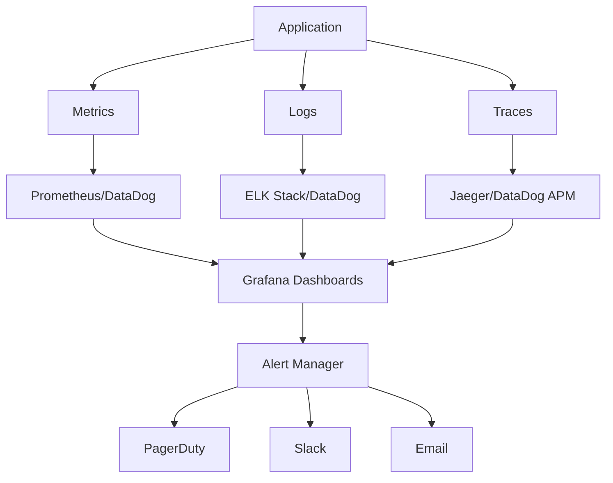

# Monitoring & Alerting Strategy
## Financy Observability & Incident Response Framework

**Version**: 1.0  
**Last Updated**: 2025-10-19  
**Target Audience**: SRE, DevOps engineers, and technical operations teams  

---

## Overview

This document defines the comprehensive monitoring, alerting, and observability strategy for the Financy platform. Our approach ensures proactive detection of issues, rapid incident response, and continuous optimization of system performance and reliability.

### Monitoring Objectives
1. **Proactive Issue Detection**: Identify problems before they impact users
2. **Comprehensive Observability**: Full visibility across all system components
3. **Intelligent Alerting**: Reduce noise while ensuring critical issues are escalated
4. **Performance Optimization**: Continuous monitoring for optimization opportunities
5. **Business Metrics Tracking**: Monitor key business and financial metrics

---

## Observability Architecture

### Three Pillars of Observability


### Monitoring Stack
```typescript
interface MonitoringStack {
  metrics: MetricsConfiguration;
  logging: LoggingConfiguration;
  tracing: TracingConfiguration;
  alerting: AlertingConfiguration;
  dashboards: DashboardConfiguration;
  incident_management: IncidentManagementConfiguration;
}

const MONITORING_CONFIG: MonitoringStack = {
  metrics: {
    collection: {
      primary: 'datadog',
      backup: 'prometheus',
      custom_metrics: 'statsd',
      business_metrics: 'custom_api'
    },
    retention: {
      high_resolution: '7d', // 1-minute resolution
      medium_resolution: '30d', // 5-minute resolution
      low_resolution: '365d' // 1-hour resolution
    },
    aggregation: {
      real_time: '1m',
      short_term: '5m',
      medium_term: '1h',
      long_term: '1d'
    }
  },
  logging: {
    centralized: {
      platform: 'datadog_logs',
      backup: 'elasticsearch',
      ingestion_rate: '10GB/day',
      retention: '90d'
    },
    structured_logging: {
      format: 'json',
      correlation_id: 'trace_id',
      sampling_rate: 1.0
    },
    log_levels: {
      production: 'info',
      staging: 'debug',
      development: 'debug'
    }
  },
  tracing: {
    distributed_tracing: {
      platform: 'datadog_apm',
      sampling_rate: 0.1, // 10% of requests
      trace_retention: '15d'
    },
    performance_monitoring: {
      apdex_threshold: 500, // ms
      error_rate_threshold: 1, // %
      throughput_monitoring: true
    }
  },
  alerting: {
    escalation_tiers: ['slack', 'pagerduty', 'phone'],
    alert_routing: 'service_based',
    noise_reduction: {
      alert_grouping: true,
      intelligent_correlation: true,
      anomaly_detection: true
    }
  },
  dashboards: {
    real_time: 'grafana',
    business_intelligence: 'custom_dashboards',
    executive_summary: 'tableau',
    mobile_dashboards: 'datadog_mobile'
  },
  incident_management: {
    platform: 'pagerduty',
    escalation_policy: 'follow_the_sun',
    postmortem_process: 'automated_templates',
    chaos_engineering: 'gremlin'
  }
};
```

---

## Metrics & KPIs

### System Health Metrics
```typescript
interface SystemHealthMetrics {
  infrastructure: InfrastructureMetrics;
  application: ApplicationMetrics;
  business: BusinessMetrics;
  security: SecurityMetrics;
  user_experience: UserExperienceMetrics;
}

const SYSTEM_METRICS: SystemHealthMetrics = {
  infrastructure: {
    compute: {
      cpu_utilization: {
        warning_threshold: 70,
        critical_threshold: 85,
        evaluation_period: '5m'
      },
      memory_utilization: {
        warning_threshold: 80,
        critical_threshold: 90,
        evaluation_period: '5m'
      },
      disk_utilization: {
        warning_threshold: 80,
        critical_threshold: 90,
        evaluation_period: '10m'
      },
      network_throughput: {
        warning_threshold: '800Mbps',
        critical_threshold: '950Mbps',
        evaluation_period: '5m'
      }
    },
    kubernetes: {
      pod_restarts: {
        warning_threshold: 5,
        critical_threshold: 10,
        evaluation_period: '10m'
      },
      pod_cpu_throttling: {
        warning_threshold: 10, // %
        critical_threshold: 25,
        evaluation_period: '5m'
      },
      node_readiness: {
        warning_threshold: 95, // % of nodes ready
        critical_threshold: 90,
        evaluation_period: '2m'
      },
      persistent_volume_usage: {
        warning_threshold: 80,
        critical_threshold: 90,
        evaluation_period: '5m'
      }
    },
    database: {
      connection_pool_usage: {
        warning_threshold: 70,
        critical_threshold: 85,
        evaluation_period: '5m'
      },
      query_execution_time: {
        warning_threshold: 1000, // ms
        critical_threshold: 5000,
        evaluation_period: '5m'
      },
      replication_lag: {
        warning_threshold: 5, // seconds
        critical_threshold: 30,
        evaluation_period: '2m'
      },
      deadlock_count: {
        warning_threshold: 1,
        critical_threshold: 5,
        evaluation_period: '10m'
      }
    }
  },
  application: {
    performance: {
      response_time: {
        p95_warning: 500, // ms
        p95_critical: 1000,
        p99_warning: 1000,
        p99_critical: 2000,
        evaluation_period: '5m'
      },
      throughput: {
        requests_per_second: {
          min_threshold: 100,
          max_threshold: 10000,
          evaluation_period: '5m'
        }
      },
      error_rate: {
        warning_threshold: 1, // %
        critical_threshold: 5,
        evaluation_period: '5m'
      },
      availability: {
        warning_threshold: 99.5, // %
        critical_threshold: 99.0,
        evaluation_period: '5m'
      }
    },
    functional: {
      authentication_success_rate: {
        warning_threshold: 98, // %
        critical_threshold: 95,
        evaluation_period: '5m'
      },
      transaction_processing_rate: {
        warning_threshold: 99, // %
        critical_threshold: 97,
        evaluation_period: '10m'
      },
      ai_categorization_accuracy: {
        warning_threshold: 85, // %
        critical_threshold: 80,
        evaluation_period: '1h'
      },
      notification_delivery_rate: {
        warning_threshold: 95, // %
        critical_threshold: 90,
        evaluation_period: '10m'
      }
    }
  },
  business: {
    user_engagement: {
      daily_active_users: {
        target: 1000,
        warning_threshold: -10, // % deviation
        evaluation_period: '1d'
      },
      session_duration: {
        target: 300, // seconds
        warning_threshold: -20, // % deviation
        evaluation_period: '1h'
      },
      feature_adoption_rate: {
        voice_transactions: 15, // %
        ai_categorization: 80,
        multi_currency: 25
      }
    },
    financial: {
      transaction_volume: {
        daily_target: 10000,
        warning_threshold: -15, // % deviation
        evaluation_period: '1d'
      },
      revenue_per_user: {
        monthly_target: 29.99, // USD
        warning_threshold: -10, // % deviation
        evaluation_period: '1d'
      },
      churn_rate: {
        monthly_threshold: 5, // %
        warning_threshold: 7,
        evaluation_period: '1d'
      }
    }
  },
  security: {
    authentication: {
      failed_login_attempts: {
        warning_threshold: 100,
        critical_threshold: 1000,
        evaluation_period: '5m'
      },
      password_reset_requests: {
        warning_threshold: 50,
        critical_threshold: 200,
        evaluation_period: '5m'
      }
    },
    api_security: {
      rate_limit_violations: {
        warning_threshold: 100,
        critical_threshold: 1000,
        evaluation_period: '5m'
      },
      suspicious_request_patterns: {
        warning_threshold: 10,
        critical_threshold: 50,
        evaluation_period: '5m'
      }
    }
  },
  user_experience: {
    core_web_vitals: {
      largest_contentful_paint: {
        good_threshold: 2500, // ms
        needs_improvement_threshold: 4000
      },
      first_input_delay: {
        good_threshold: 100, // ms
        needs_improvement_threshold: 300
      },
      cumulative_layout_shift: {
        good_threshold: 0.1,
        needs_improvement_threshold: 0.25
      }
    },
    mobile_performance: {
      app_startup_time: {
        target: 3000, // ms
        warning_threshold: 5000,
        critical_threshold: 8000
      },
      crash_rate: {
        warning_threshold: 0.1, // %
        critical_threshold: 1.0
      }
    }
  }
};
```

### Custom Application Metrics
```typescript
// Metrics collection implementation
class FinancyMetricsCollector {
  private metricsClient: StatsD;
  private datadogClient: DogStatsD;
  
  constructor() {
    this.metricsClient = new StatsD({
      host: process.env.STATSD_HOST,
      port: parseInt(process.env.STATSD_PORT || '8125')
    });
    
    this.datadogClient = new DogStatsD({
      hostname: process.env.DD_AGENT_HOST,
      port: parseInt(process.env.DD_DOGSTATSD_PORT || '8125')
    });
  }
  
  // Business metrics
  recordTransactionCreated(transaction: Transaction): void {
    this.metricsClient.increment('transaction.created.count', 1, {
      currency: transaction.currency_code,
      amount_range: this.getAmountRange(transaction.amount),
      category: transaction.category?.name || 'uncategorized',
      input_method: transaction.input_method
    });
    
    this.metricsClient.histogram('transaction.amount', transaction.amount, {
      currency: transaction.currency_code
    });
  }
  
  recordUserAuthentication(success: boolean, method: string): void {
    this.metricsClient.increment('auth.attempt.count', 1, {
      success: success.toString(),
      method
    });
    
    if (!success) {
      this.metricsClient.increment('auth.failure.count', 1, {
        method
      });
    }
  }
  
  recordAICategorizationResult(
    confidence: number, 
    category: string, 
    processingTime: number
  ): void {
    this.metricsClient.histogram('ai.categorization.confidence', confidence, {
      category
    });
    
    this.metricsClient.timing('ai.categorization.processing_time', processingTime, {
      category
    });
    
    this.metricsClient.increment('ai.categorization.count', 1, {
      category,
      confidence_level: confidence > 0.8 ? 'high' : confidence > 0.5 ? 'medium' : 'low'
    });
  }
  
  recordAPIRequest(
    endpoint: string, 
    method: string, 
    statusCode: number, 
    responseTime: number
  ): void {
    this.metricsClient.timing('api.request.duration', responseTime, {
      endpoint: this.sanitizeEndpoint(endpoint),
      method,
      status_code: statusCode.toString()
    });
    
    this.metricsClient.increment('api.request.count', 1, {
      endpoint: this.sanitizeEndpoint(endpoint),
      method,
      status_code: statusCode.toString()
    });
    
    if (statusCode >= 400) {
      this.metricsClient.increment('api.error.count', 1, {
        endpoint: this.sanitizeEndpoint(endpoint),
        method,
        status_code: statusCode.toString()
      });
    }
  }
  
  recordDatabaseQuery(
    query_type: string, 
    table: string, 
    duration: number, 
    rows_affected?: number
  ): void {
    this.metricsClient.timing('database.query.duration', duration, {
      query_type,
      table
    });
    
    if (rows_affected !== undefined) {
      this.metricsClient.histogram('database.query.rows_affected', rows_affected, {
        query_type,
        table
      });
    }
  }
  
  recordCacheOperation(
    operation: 'get' | 'set' | 'delete', 
    hit: boolean, 
    duration: number
  ): void {
    this.metricsClient.timing('cache.operation.duration', duration, {
      operation
    });
    
    this.metricsClient.increment('cache.operation.count', 1, {
      operation,
      result: hit ? 'hit' : 'miss'
    });
  }
  
  recordExternalServiceCall(
    service: string, 
    operation: string, 
    success: boolean, 
    duration: number
  ): void {
    this.metricsClient.timing('external_service.call.duration', duration, {
      service,
      operation
    });
    
    this.metricsClient.increment('external_service.call.count', 1, {
      service,
      operation,
      success: success.toString()
    });
    
    if (!success) {
      this.metricsClient.increment('external_service.error.count', 1, {
        service,
        operation
      });
    }
  }
  
  // Helper methods
  private getAmountRange(amount: number): string {
    if (amount < 10) return '0-10';
    if (amount < 50) return '10-50';
    if (amount < 100) return '50-100';
    if (amount < 500) return '100-500';
    if (amount < 1000) return '500-1000';
    return '1000+';
  }
  
  private sanitizeEndpoint(endpoint: string): string {
    // Replace dynamic segments with placeholders
    return endpoint
      .replace(/\/\d+/g, '/:id')
      .replace(/\/[a-f0-9-]{36}/g, '/:uuid')
      .replace(/\/\w{8,}/g, '/:token');
  }
}
```

---

## Alerting Configuration

### Alert Rules and Escalation
```yaml
# alerting/rules.yml
groups:
  - name: critical_infrastructure
    rules:
      - alert: HighCPUUsage
        expr: cpu_usage_percent > 85
        for: 5m
        labels:
          severity: critical
          team: infrastructure
        annotations:
          summary: "High CPU usage detected on {{ $labels.instance }}"
          description: "CPU usage is above 85% for more than 5 minutes"
          runbook_url: "https://docs.financy.com/runbooks/high-cpu"
      
      - alert: DatabaseConnectionPoolExhausted
        expr: database_connection_pool_usage > 90
        for: 2m
        labels:
          severity: critical
          team: backend
        annotations:
          summary: "Database connection pool nearly exhausted"
          description: "Connection pool usage is {{ $value }}%"
          runbook_url: "https://docs.financy.com/runbooks/db-connections"
      
      - alert: HighErrorRate
        expr: rate(api_errors_total[5m]) > 0.05
        for: 5m
        labels:
          severity: critical
          team: backend
        annotations:
          summary: "High API error rate detected"
          description: "Error rate is {{ $value | humanizePercentage }}"
          runbook_url: "https://docs.financy.com/runbooks/high-error-rate"

  - name: business_metrics
    rules:
      - alert: TransactionProcessingDown
        expr: rate(transactions_processed_total[10m]) == 0
        for: 5m
        labels:
          severity: critical
          team: product
        annotations:
          summary: "Transaction processing has stopped"
          description: "No transactions processed in the last 10 minutes"
          runbook_url: "https://docs.financy.com/runbooks/transaction-processing"
      
      - alert: AICategorializationLowAccuracy
        expr: ai_categorization_accuracy < 0.8
        for: 1h
        labels:
          severity: warning
          team: ml
        annotations:
          summary: "AI categorization accuracy below threshold"
          description: "Accuracy is {{ $value | humanizePercentage }}"
          runbook_url: "https://docs.financy.com/runbooks/ai-accuracy"

  - name: security_alerts
    rules:
      - alert: HighFailedLoginAttempts
        expr: rate(auth_failures_total[5m]) > 10
        for: 2m
        labels:
          severity: warning
          team: security
        annotations:
          summary: "High number of failed login attempts"
          description: "{{ $value }} failed attempts per second"
          runbook_url: "https://docs.financy.com/runbooks/auth-failures"
      
      - alert: SuspiciousAPIActivity
        expr: rate(api_rate_limit_violations_total[5m]) > 100
        for: 5m
        labels:
          severity: critical
          team: security
        annotations:
          summary: "Suspicious API activity detected"
          description: "High rate of rate limit violations"
          runbook_url: "https://docs.financy.com/runbooks/suspicious-activity"
```

### PagerDuty Integration
```typescript
interface PagerDutyConfiguration {
  escalation_policies: EscalationPolicy[];
  services: ServiceConfiguration[];
  schedules: ScheduleConfiguration[];
  notification_rules: NotificationRule[];
}

const PAGERDUTY_CONFIG: PagerDutyConfiguration = {
  escalation_policies: [
    {
      name: 'Critical Infrastructure',
      escalation_rules: [
        {
          escalation_delay_in_minutes: 0,
          targets: [
            { type: 'schedule', id: 'sre-primary' }
          ]
        },
        {
          escalation_delay_in_minutes: 15,
          targets: [
            { type: 'schedule', id: 'sre-secondary' },
            { type: 'user', id: 'tech-lead' }
          ]
        },
        {
          escalation_delay_in_minutes: 30,
          targets: [
            { type: 'user', id: 'engineering-manager' }
          ]
        }
      ]
    },
    {
      name: 'Application Issues',
      escalation_rules: [
        {
          escalation_delay_in_minutes: 0,
          targets: [
            { type: 'schedule', id: 'backend-on-call' }
          ]
        },
        {
          escalation_delay_in_minutes: 20,
          targets: [
            { type: 'schedule', id: 'sre-primary' },
            { type: 'user', id: 'backend-lead' }
          ]
        }
      ]
    },
    {
      name: 'Security Incidents',
      escalation_rules: [
        {
          escalation_delay_in_minutes: 0,
          targets: [
            { type: 'user', id: 'security-lead' },
            { type: 'schedule', id: 'sre-primary' }
          ]
        },
        {
          escalation_delay_in_minutes: 10,
          targets: [
            { type: 'user', id: 'cto' },
            { type: 'user', id: 'engineering-manager' }
          ]
        }
      ]
    }
  ],
  services: [
    {
      name: 'Financy API',
      escalation_policy: 'Application Issues',
      alert_creation: 'create_alerts_and_incidents',
      alert_grouping: 'intelligent',
      alert_grouping_timeout: 300
    },
    {
      name: 'Infrastructure',
      escalation_policy: 'Critical Infrastructure',
      alert_creation: 'create_alerts_and_incidents',
      alert_grouping: 'intelligent',
      alert_grouping_timeout: 180
    },
    {
      name: 'Security',
      escalation_policy: 'Security Incidents',
      alert_creation: 'create_alerts_and_incidents',
      alert_grouping: 'time',
      alert_grouping_timeout: 60
    }
  ],
  schedules: [
    {
      name: 'SRE Primary',
      time_zone: 'UTC',
      schedule_layers: [
        {
          rotation_virtual_start: '2025-01-01T00:00:00Z',
          rotation_turn_length_seconds: 604800, // 1 week
          users: ['sre-1', 'sre-2', 'sre-3']
        }
      ]
    },
    {
      name: 'Backend On-Call',
      time_zone: 'UTC',
      schedule_layers: [
        {
          rotation_virtual_start: '2025-01-01T00:00:00Z',
          rotation_turn_length_seconds: 604800, // 1 week
          users: ['backend-dev-1', 'backend-dev-2', 'backend-dev-3']
        }
      ]
    }
  ],
  notification_rules: [
    {
      urgency: 'high',
      contact_method: 'push_notification',
      start_delay_in_minutes: 0
    },
    {
      urgency: 'high',
      contact_method: 'sms',
      start_delay_in_minutes: 5
    },
    {
      urgency: 'high',
      contact_method: 'phone_call',
      start_delay_in_minutes: 10
    },
    {
      urgency: 'low',
      contact_method: 'email',
      start_delay_in_minutes: 0
    }
  ]
};
```

---

## Dashboards & Visualization

### Grafana Dashboard Configuration
```typescript
interface DashboardConfiguration {
  operational_dashboards: OperationalDashboard[];
  business_dashboards: BusinessDashboard[];
  executive_dashboards: ExecutiveDashboard[];
  custom_dashboards: CustomDashboard[];
}

const DASHBOARD_CONFIG: DashboardConfiguration = {
  operational_dashboards: [
    {
      name: 'System Overview',
      panels: [
        {
          title: 'Request Rate',
          type: 'stat',
          targets: ['rate(api_requests_total[5m])'],
          thresholds: { red: 0, yellow: 100, green: 1000 }
        },
        {
          title: 'Error Rate',
          type: 'stat',
          targets: ['rate(api_errors_total[5m]) / rate(api_requests_total[5m])'],
          thresholds: { green: 0.01, yellow: 0.05, red: 0.1 }
        },
        {
          title: 'Response Time (P95)',
          type: 'stat',
          targets: ['histogram_quantile(0.95, api_request_duration_seconds_bucket)'],
          thresholds: { green: 0.5, yellow: 1.0, red: 2.0 }
        },
        {
          title: 'Active Users',
          type: 'stat',
          targets: ['active_users_count'],
          thresholds: { red: 0, yellow: 100, green: 1000 }
        },
        {
          title: 'Database Connections',
          type: 'gauge',
          targets: ['database_connections_active / database_connections_max'],
          thresholds: { green: 0.7, yellow: 0.8, red: 0.9 }
        },
        {
          title: 'Memory Usage',
          type: 'timeseries',
          targets: ['node_memory_usage_percent'],
          legend: true
        }
      ],
      refresh: '30s',
      time_range: 'now-1h'
    },
    {
      name: 'Application Performance',
      panels: [
        {
          title: 'Transaction Processing Rate',
          type: 'timeseries',
          targets: ['rate(transactions_processed_total[5m])'],
          legend: true
        },
        {
          title: 'AI Categorization Performance',
          type: 'timeseries',
          targets: [
            'ai_categorization_accuracy',
            'histogram_quantile(0.95, ai_categorization_duration_seconds_bucket)'
          ],
          legend: true
        },
        {
          title: 'External Service Response Times',
          type: 'heatmap',
          targets: ['external_service_duration_seconds_bucket'],
          legend: false
        },
        {
          title: 'Queue Depths',
          type: 'timeseries',
          targets: [
            'job_queue_size{queue="high"}',
            'job_queue_size{queue="normal"}',
            'job_queue_size{queue="low"}'
          ],
          legend: true
        }
      ],
      refresh: '1m',
      time_range: 'now-4h'
    }
  ],
  business_dashboards: [
    {
      name: 'Financial Metrics',
      panels: [
        {
          title: 'Daily Transaction Volume',
          type: 'stat',
          targets: ['sum(increase(transactions_created_total[24h]))'],
          thresholds: { red: 1000, yellow: 5000, green: 10000 }
        },
        {
          title: 'Revenue per User (Daily)',
          type: 'stat',
          targets: ['revenue_per_user_daily'],
          thresholds: { red: 0.5, yellow: 1.0, green: 2.0 }
        },
        {
          title: 'Feature Adoption',
          type: 'piechart',
          targets: [
            'feature_usage_count{feature="voice_transactions"}',
            'feature_usage_count{feature="ai_categorization"}',
            'feature_usage_count{feature="multi_currency"}'
          ],
          legend: true
        },
        {
          title: 'User Engagement Trends',
          type: 'timeseries',
          targets: [
            'daily_active_users',
            'avg(session_duration_seconds)',
            'user_retention_rate'
          ],
          legend: true
        }
      ],
      refresh: '5m',
      time_range: 'now-7d'
    }
  ],
  executive_dashboards: [
    {
      name: 'Executive Summary',
      panels: [
        {
          title: 'System Availability',
          type: 'stat',
          targets: ['avg(up)'],
          thresholds: { red: 0.99, yellow: 0.995, green: 0.999 }
        },
        {
          title: 'Customer Satisfaction',
          type: 'stat',
          targets: ['customer_satisfaction_score'],
          thresholds: { red: 3.0, yellow: 4.0, green: 4.5 }
        },
        {
          title: 'Monthly Revenue',
          type: 'stat',
          targets: ['sum(increase(revenue_total[30d]))'],
          unit: 'currency'
        },
        {
          title: 'Cost per Transaction',
          type: 'stat',
          targets: ['infrastructure_cost_total / transactions_processed_total'],
          unit: 'currency'
        }
      ],
      refresh: '1h',
      time_range: 'now-30d'
    }
  ]
};
```

### Real-time Monitoring Setup
```typescript
class RealTimeMonitoring {
  private websocketServer: WebSocketServer;
  private metricsStream: MetricsStream;
  private alertStream: AlertStream;
  
  constructor() {
    this.websocketServer = new WebSocketServer({ port: 8080 });
    this.setupMetricsStreaming();
    this.setupAlertStreaming();
  }
  
  private setupMetricsStreaming(): void {
    this.metricsStream = new MetricsStream({
      interval: 1000, // 1 second
      metrics: [
        'api.request.rate',
        'api.error.rate',
        'api.response.time.p95',
        'system.cpu.usage',
        'system.memory.usage',
        'database.connections.active'
      ]
    });
    
    this.metricsStream.on('data', (metrics) => {
      this.broadcast('metrics', metrics);
    });
  }
  
  private setupAlertStreaming(): void {
    this.alertStream = new AlertStream({
      sources: ['pagerduty', 'grafana', 'datadog']
    });
    
    this.alertStream.on('alert', (alert) => {
      this.broadcast('alert', {
        id: alert.id,
        severity: alert.severity,
        summary: alert.summary,
        timestamp: alert.timestamp,
        service: alert.service
      });
    });
  }
  
  private broadcast(type: string, data: any): void {
    const message = JSON.stringify({ type, data });
    
    this.websocketServer.clients.forEach((client) => {
      if (client.readyState === WebSocket.OPEN) {
        client.send(message);
      }
    });
  }
}
```

This comprehensive monitoring and alerting strategy ensures complete observability of the Financy platform with intelligent alerting, detailed dashboards, and proactive incident response capabilities.