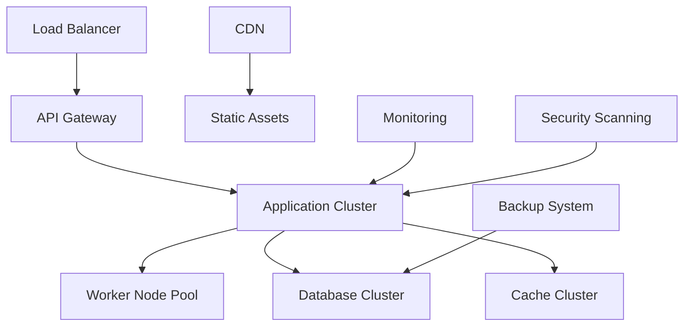

# Production Deployment Guide
## Financy Production Environment & Deployment Procedures

**Version**: 1.0  
**Last Updated**: 2025-10-19  
**Target Audience**: DevOps engineers, platform engineers, and technical leads  

---

## Overview

This document provides comprehensive procedures for deploying and managing the Financy platform in production environments. It covers deployment strategies, infrastructure provisioning, configuration management, and operational procedures to ensure reliable and secure production deployments.

### Deployment Objectives
1. **Zero-Downtime Deployments**: Seamless application updates without service interruption
2. **Rollback Capability**: Quick recovery from deployment issues
3. **Infrastructure as Code**: Reproducible and version-controlled infrastructure
4. **Security First**: Secure deployment practices and compliance
5. **Observability**: Complete monitoring and logging throughout deployment lifecycle

---

## Production Architecture

### Infrastructure Overview


### Environment Configuration
```typescript
interface ProductionEnvironment {
  regions: ProductionRegion[];
  networking: NetworkConfiguration;
  compute: ComputeConfiguration;
  database: DatabaseConfiguration;
  monitoring: MonitoringConfiguration;
  security: SecurityConfiguration;
  backup: BackupConfiguration;
}

const PRODUCTION_CONFIG: ProductionEnvironment = {
  regions: [
    {
      region: 'us-east-1',
      role: 'primary',
      availability_zones: ['us-east-1a', 'us-east-1b', 'us-east-1c'],
      compute_nodes: 6,
      database_instances: 3
    },
    {
      region: 'us-west-2',
      role: 'disaster_recovery',
      availability_zones: ['us-west-2a', 'us-west-2b'],
      compute_nodes: 3,
      database_instances: 2
    }
  ],
  networking: {
    vpc_cidr: '10.0.0.0/16',
    private_subnets: ['10.0.1.0/24', '10.0.2.0/24', '10.0.3.0/24'],
    public_subnets: ['10.0.101.0/24', '10.0.102.0/24', '10.0.103.0/24'],
    nat_gateways: 3,
    load_balancer_type: 'application',
    ssl_termination: 'load_balancer'
  },
  compute: {
    orchestration: 'kubernetes',
    node_groups: [
      {
        name: 'api-nodes',
        instance_type: 't3.large',
        min_size: 3,
        max_size: 10,
        desired_capacity: 6
      },
      {
        name: 'worker-nodes',
        instance_type: 'c5.xlarge',
        min_size: 2,
        max_size: 8,
        desired_capacity: 4
      }
    ],
    auto_scaling: {
      cpu_threshold: 70,
      memory_threshold: 80,
      scale_up_cooldown: 300,
      scale_down_cooldown: 600
    }
  },
  database: {
    engine: 'postgresql',
    version: '15.4',
    instance_class: 'db.r5.xlarge',
    multi_az: true,
    backup_retention: 30,
    encryption: true,
    performance_insights: true
  },
  monitoring: {
    metrics_retention: 365, // days
    log_retention: 90, // days
    alerting: true,
    distributed_tracing: true,
    apm_enabled: true
  },
  security: {
    encryption_at_rest: true,
    encryption_in_transit: true,
    secrets_management: 'aws_secrets_manager',
    vulnerability_scanning: true,
    compliance_monitoring: true
  },
  backup: {
    database_backup_schedule: '0 2 * * *', // Daily at 2 AM
    application_data_backup: '0 1 * * 0', // Weekly on Sunday at 1 AM
    cross_region_replication: true,
    backup_retention: 365 // days
  }
};
```

---

## Deployment Pipeline

### CI/CD Pipeline Architecture
```yaml
# .github/workflows/production-deploy.yml
name: Production Deployment

on:
  push:
    branches: [main]
    tags: ['v*']

env:
  AWS_REGION: us-east-1
  EKS_CLUSTER_NAME: financy-production
  ECR_REGISTRY: 123456789012.dkr.ecr.us-east-1.amazonaws.com

jobs:
  pre-deployment-checks:
    runs-on: ubuntu-latest
    outputs:
      deployment-strategy: ${{ steps.strategy.outputs.strategy }}
      canary-percentage: ${{ steps.strategy.outputs.canary-percentage }}
    steps:
      - uses: actions/checkout@v4
        with:
          fetch-depth: 0
      
      - name: Analyze changes
        id: changes
        run: |
          CHANGED_FILES=$(git diff --name-only HEAD~1 HEAD)
          echo "changed-files=$CHANGED_FILES" >> $GITHUB_OUTPUT
      
      - name: Determine deployment strategy
        id: strategy
        run: |
          if [[ "${{ steps.changes.outputs.changed-files }}" =~ "database/migrations" ]]; then
            echo "strategy=blue-green" >> $GITHUB_OUTPUT
            echo "canary-percentage=0" >> $GITHUB_OUTPUT
          elif [[ "${{ steps.changes.outputs.changed-files }}" =~ "src/critical" ]]; then
            echo "strategy=canary" >> $GITHUB_OUTPUT
            echo "canary-percentage=10" >> $GITHUB_OUTPUT
          else
            echo "strategy=rolling" >> $GITHUB_OUTPUT
            echo "canary-percentage=0" >> $GITHUB_OUTPUT
          fi
      
      - name: Security scan
        run: |
          npm audit --audit-level moderate
          npm run security:scan
      
      - name: Performance regression test
        run: npm run test:performance:regression

  build-and-push:
    runs-on: ubuntu-latest
    needs: pre-deployment-checks
    outputs:
      image-tag: ${{ steps.build.outputs.image-tag }}
    steps:
      - uses: actions/checkout@v4
      
      - name: Configure AWS credentials
        uses: aws-actions/configure-aws-credentials@v4
        with:
          aws-access-key-id: ${{ secrets.AWS_ACCESS_KEY_ID }}
          aws-secret-access-key: ${{ secrets.AWS_SECRET_ACCESS_KEY }}
          aws-region: ${{ env.AWS_REGION }}
      
      - name: Login to ECR
        run: aws ecr get-login-password --region $AWS_REGION | docker login --username AWS --password-stdin $ECR_REGISTRY
      
      - name: Build and tag image
        id: build
        run: |
          IMAGE_TAG=$(echo $GITHUB_SHA | cut -c1-8)
          docker build -t $ECR_REGISTRY/financy-api:$IMAGE_TAG .
          docker build -t $ECR_REGISTRY/financy-api:latest .
          echo "image-tag=$IMAGE_TAG" >> $GITHUB_OUTPUT
      
      - name: Security scan image
        run: |
          trivy image --exit-code 1 --severity HIGH,CRITICAL $ECR_REGISTRY/financy-api:${{ steps.build.outputs.image-tag }}
      
      - name: Push image
        run: |
          docker push $ECR_REGISTRY/financy-api:${{ steps.build.outputs.image-tag }}
          docker push $ECR_REGISTRY/financy-api:latest

  database-migration:
    runs-on: ubuntu-latest
    needs: [pre-deployment-checks, build-and-push]
    if: contains(needs.pre-deployment-checks.outputs.changed-files, 'database/migrations')
    steps:
      - uses: actions/checkout@v4
      
      - name: Configure AWS credentials
        uses: aws-actions/configure-aws-credentials@v4
        with:
          aws-access-key-id: ${{ secrets.AWS_ACCESS_KEY_ID }}
          aws-secret-access-key: ${{ secrets.AWS_SECRET_ACCESS_KEY }}
          aws-region: ${{ env.AWS_REGION }}
      
      - name: Setup kubectl
        run: |
          aws eks update-kubeconfig --region $AWS_REGION --name $EKS_CLUSTER_NAME
      
      - name: Create database backup
        run: |
          kubectl apply -f k8s/backup-job.yaml
          kubectl wait --for=condition=complete job/pre-migration-backup --timeout=600s
      
      - name: Run database migrations
        run: |
          kubectl apply -f k8s/migration-job.yaml
          kubectl wait --for=condition=complete job/database-migration --timeout=1200s
      
      - name: Verify migration
        run: |
          kubectl apply -f k8s/migration-verify-job.yaml
          kubectl wait --for=condition=complete job/migration-verification --timeout=300s

  deploy-application:
    runs-on: ubuntu-latest
    needs: [pre-deployment-checks, build-and-push, database-migration]
    if: always() && (needs.database-migration.result == 'success' || needs.database-migration.result == 'skipped')
    steps:
      - uses: actions/checkout@v4
      
      - name: Configure AWS credentials
        uses: aws-actions/configure-aws-credentials@v4
        with:
          aws-access-key-id: ${{ secrets.AWS_ACCESS_KEY_ID }}
          aws-secret-access-key: ${{ secrets.AWS_SECRET_ACCESS_KEY }}
          aws-region: ${{ env.AWS_REGION }}
      
      - name: Setup kubectl
        run: |
          aws eks update-kubeconfig --region $AWS_REGION --name $EKS_CLUSTER_NAME
      
      - name: Update deployment manifests
        run: |
          sed -i 's|IMAGE_TAG|${{ needs.build-and-push.outputs.image-tag }}|g' k8s/deployment.yaml
          sed -i 's|DEPLOYMENT_STRATEGY|${{ needs.pre-deployment-checks.outputs.deployment-strategy }}|g' k8s/deployment.yaml
      
      - name: Deploy with Argo Rollouts
        run: |
          kubectl apply -f k8s/rollout.yaml
          kubectl argo rollouts set image financy-api financy-api=$ECR_REGISTRY/financy-api:${{ needs.build-and-push.outputs.image-tag }}
      
      - name: Monitor deployment
        run: |
          kubectl argo rollouts status financy-api --watch --timeout=600s
      
      - name: Run smoke tests
        run: |
          kubectl apply -f k8s/smoke-test-job.yaml
          kubectl wait --for=condition=complete job/smoke-tests --timeout=300s

  post-deployment-verification:
    runs-on: ubuntu-latest
    needs: [deploy-application]
    steps:
      - uses: actions/checkout@v4
      
      - name: Health check
        run: |
          for i in {1..10}; do
            if curl -f https://api.financy.com/health; then
              echo "Health check passed"
              break
            fi
            sleep 30
          done
      
      - name: Performance test
        run: |
          kubectl apply -f k8s/performance-test-job.yaml
          kubectl wait --for=condition=complete job/performance-test --timeout=600s
      
      - name: Security validation
        run: |
          kubectl apply -f k8s/security-test-job.yaml
          kubectl wait --for=condition=complete job/security-validation --timeout=300s
      
      - name: Update monitoring dashboards
        run: |
          curl -X POST "${{ secrets.GRAFANA_API_URL }}/api/dashboards/db" \
            -H "Authorization: Bearer ${{ secrets.GRAFANA_API_KEY }}" \
            -H "Content-Type: application/json" \
            -d @monitoring/grafana-dashboard.json

  rollback-procedure:
    runs-on: ubuntu-latest
    needs: [deploy-application, post-deployment-verification]
    if: failure()
    steps:
      - name: Configure AWS credentials
        uses: aws-actions/configure-aws-credentials@v4
        with:
          aws-access-key-id: ${{ secrets.AWS_ACCESS_KEY_ID }}
          aws-secret-access-key: ${{ secrets.AWS_SECRET_ACCESS_KEY }}
          aws-region: ${{ env.AWS_REGION }}
      
      - name: Setup kubectl
        run: |
          aws eks update-kubeconfig --region $AWS_REGION --name $EKS_CLUSTER_NAME
      
      - name: Rollback deployment
        run: |
          kubectl argo rollouts abort financy-api
          kubectl argo rollouts undo financy-api
      
      - name: Verify rollback
        run: |
          kubectl argo rollouts status financy-api --watch --timeout=300s
      
      - name: Notify team
        run: |
          curl -X POST ${{ secrets.SLACK_WEBHOOK_URL }} \
            -H 'Content-type: application/json' \
            -d '{"text":"🚨 Production deployment failed and was rolled back. Please check the logs."}'
```

### Deployment Strategies

#### 1. Rolling Deployment
```yaml
# k8s/rollout-rolling.yaml
apiVersion: argoproj.io/v1alpha1
kind: Rollout
metadata:
  name: financy-api
  namespace: production
spec:
  replicas: 6
  strategy:
    type: RollingUpdate
    rollingUpdate:
      maxSurge: 2
      maxUnavailable: 1
  selector:
    matchLabels:
      app: financy-api
  template:
    metadata:
      labels:
        app: financy-api
    spec:
      containers:
      - name: financy-api
        image: ECR_REGISTRY/financy-api:IMAGE_TAG
        ports:
        - containerPort: 3000
        env:
        - name: NODE_ENV
          value: production
        - name: DATABASE_URL
          valueFrom:
            secretKeyRef:
              name: database-credentials
              key: url
        resources:
          requests:
            memory: "512Mi"
            cpu: "250m"
          limits:
            memory: "1Gi"
            cpu: "500m"
        livenessProbe:
          httpGet:
            path: /health
            port: 3000
          initialDelaySeconds: 30
          periodSeconds: 10
        readinessProbe:
          httpGet:
            path: /ready
            port: 3000
          initialDelaySeconds: 5
          periodSeconds: 5
```

#### 2. Canary Deployment
```yaml
# k8s/rollout-canary.yaml
apiVersion: argoproj.io/v1alpha1
kind: Rollout
metadata:
  name: financy-api
  namespace: production
spec:
  replicas: 6
  strategy:
    canary:
      maxSurge: "25%"
      maxUnavailable: 0
      steps:
      - setWeight: 10
      - pause: 
          duration: 10m
      - analysis:
          templates:
          - templateName: success-rate
          args:
          - name: service-name
            value: financy-api
      - setWeight: 25
      - pause:
          duration: 10m
      - analysis:
          templates:
          - templateName: success-rate
          - templateName: latency
      - setWeight: 50
      - pause:
          duration: 10m
      - analysis:
          templates:
          - templateName: success-rate
          - templateName: latency
          - templateName: error-rate
      - setWeight: 75
      - pause:
          duration: 5m
      - analysis:
          templates:
          - templateName: success-rate
          - templateName: latency
          - templateName: error-rate
      trafficRouting:
        istio:
          virtualService:
            name: financy-api-vs
            routes:
            - primary
      analysisRunMetadata:
        annotations:
          notifications.argoproj.io/subscribe.on-analysis-run-failed.slack: deployment-alerts
        labels:
          env: production
  selector:
    matchLabels:
      app: financy-api
  template:
    metadata:
      labels:
        app: financy-api
    spec:
      containers:
      - name: financy-api
        image: ECR_REGISTRY/financy-api:IMAGE_TAG
        # ... container configuration similar to rolling deployment
```

#### 3. Blue-Green Deployment
```yaml
# k8s/rollout-blue-green.yaml
apiVersion: argoproj.io/v1alpha1
kind: Rollout
metadata:
  name: financy-api
  namespace: production
spec:
  replicas: 6
  strategy:
    blueGreen:
      activeService: financy-api-active
      previewService: financy-api-preview
      autoPromotionEnabled: false
      scaleDownDelaySeconds: 30
      prePromotionAnalysis:
        templates:
        - templateName: success-rate
        - templateName: latency
        args:
        - name: service-name
          value: financy-api-preview
      postPromotionAnalysis:
        templates:
        - templateName: success-rate
        - templateName: latency
        args:
        - name: service-name
          value: financy-api-active
  selector:
    matchLabels:
      app: financy-api
  template:
    metadata:
      labels:
        app: financy-api
    spec:
      containers:
      - name: financy-api
        image: ECR_REGISTRY/financy-api:IMAGE_TAG
        # ... container configuration
```

---

## Infrastructure as Code

### Terraform Configuration
```hcl
# infrastructure/terraform/production/main.tf
terraform {
  required_version = ">= 1.0"
  required_providers {
    aws = {
      source  = "hashicorp/aws"
      version = "~> 5.0"
    }
    kubernetes = {
      source  = "hashicorp/kubernetes"
      version = "~> 2.20"
    }
    helm = {
      source  = "hashicorp/helm"
      version = "~> 2.10"
    }
  }
  
  backend "s3" {
    bucket         = "financy-terraform-state"
    key            = "production/terraform.tfstate"
    region         = "us-east-1"
    encrypt        = true
    dynamodb_table = "financy-terraform-locks"
  }
}

provider "aws" {
  region = var.aws_region
  
  default_tags {
    tags = {
      Environment = "production"
      Project     = "financy"
      ManagedBy   = "terraform"
    }
  }
}

# VPC and Networking
module "vpc" {
  source = "terraform-aws-modules/vpc/aws"
  
  name = "financy-production-vpc"
  cidr = "10.0.0.0/16"
  
  azs             = ["us-east-1a", "us-east-1b", "us-east-1c"]
  private_subnets = ["10.0.1.0/24", "10.0.2.0/24", "10.0.3.0/24"]
  public_subnets  = ["10.0.101.0/24", "10.0.102.0/24", "10.0.103.0/24"]
  
  enable_nat_gateway = true
  enable_vpn_gateway = false
  enable_dns_hostnames = true
  enable_dns_support = true
  
  tags = {
    "kubernetes.io/cluster/financy-production" = "shared"
  }
  
  public_subnet_tags = {
    "kubernetes.io/cluster/financy-production" = "shared"
    "kubernetes.io/role/elb" = "1"
  }
  
  private_subnet_tags = {
    "kubernetes.io/cluster/financy-production" = "shared"
    "kubernetes.io/role/internal-elb" = "1"
  }
}

# EKS Cluster
module "eks" {
  source = "terraform-aws-modules/eks/aws"
  
  cluster_name    = "financy-production"
  cluster_version = "1.28"
  
  vpc_id     = module.vpc.vpc_id
  subnet_ids = module.vpc.private_subnets
  
  cluster_endpoint_private_access = true
  cluster_endpoint_public_access  = true
  cluster_endpoint_public_access_cidrs = ["0.0.0.0/0"]
  
  cluster_addons = {
    coredns = {
      resolve_conflicts = "OVERWRITE"
    }
    kube-proxy = {}
    vpc-cni = {
      resolve_conflicts = "OVERWRITE"
    }
    aws-ebs-csi-driver = {
      resolve_conflicts = "OVERWRITE"
    }
  }
  
  eks_managed_node_groups = {
    api_nodes = {
      min_size     = 3
      max_size     = 10
      desired_size = 6
      
      instance_types = ["t3.large"]
      capacity_type  = "ON_DEMAND"
      
      k8s_labels = {
        role = "api"
      }
      
      taints = {
        dedicated = {
          key    = "api"
          value  = "true"
          effect = "NO_SCHEDULE"
        }
      }
    }
    
    worker_nodes = {
      min_size     = 2
      max_size     = 8
      desired_size = 4
      
      instance_types = ["c5.xlarge"]
      capacity_type  = "ON_DEMAND"
      
      k8s_labels = {
        role = "worker"
      }
      
      taints = {
        dedicated = {
          key    = "worker"
          value  = "true"
          effect = "NO_SCHEDULE"
        }
      }
    }
  }
}

# RDS Database Cluster
module "database" {
  source = "terraform-aws-modules/rds-aurora/aws"
  
  name           = "financy-production-db"
  engine         = "aurora-postgresql"
  engine_version = "15.4"
  instance_class = "db.r5.xlarge"
  instances = {
    writer = {}
    reader1 = {}
    reader2 = {}
  }
  
  vpc_id  = module.vpc.vpc_id
  subnets = module.vpc.private_subnets
  
  storage_encrypted   = true
  apply_immediately   = true
  monitoring_interval = 10
  
  enabled_cloudwatch_logs_exports = ["postgresql"]
  
  backup_retention_period = 30
  preferred_backup_window = "02:00-03:00"
  preferred_maintenance_window = "sun:03:00-sun:04:00"
  
  deletion_protection = true
  skip_final_snapshot = false
  
  database_name   = "financy"
  master_username = "financy_admin"
  manage_master_user_password = true
  
  performance_insights_enabled = true
  performance_insights_retention_period = 7
}

# ElastiCache Redis Cluster
resource "aws_elasticache_replication_group" "redis" {
  replication_group_id       = "financy-production-redis"
  description                = "Redis cluster for Financy production"
  
  node_type                  = "cache.r6g.large"
  port                       = 6379
  parameter_group_name       = "default.redis7"
  
  num_cache_clusters         = 3
  automatic_failover_enabled = true
  multi_az_enabled          = true
  
  subnet_group_name = aws_elasticache_subnet_group.redis.name
  security_group_ids = [aws_security_group.redis.id]
  
  at_rest_encryption_enabled = true
  transit_encryption_enabled = true
  auth_token                 = var.redis_auth_token
  
  backup_retention_limit = 7
  backup_window         = "03:00-05:00"
  maintenance_window    = "sun:05:00-sun:07:00"
  
  log_delivery_configuration {
    destination      = aws_cloudwatch_log_group.redis.name
    destination_type = "cloudwatch-logs"
    log_format       = "text"
    log_type         = "slow-log"
  }
}

# Application Load Balancer
module "alb" {
  source = "terraform-aws-modules/alb/aws"
  
  name = "financy-production-alb"
  
  load_balancer_type = "application"
  
  vpc_id          = module.vpc.vpc_id
  subnets         = module.vpc.public_subnets
  security_groups = [aws_security_group.alb.id]
  
  access_logs = {
    bucket  = module.s3_bucket.s3_bucket_id
    prefix  = "alb-logs"
    enabled = true
  }
  
  target_groups = [
    {
      name_prefix      = "fg-api"
      backend_protocol = "HTTP"
      backend_port     = 80
      target_type      = "ip"
      
      health_check = {
        enabled             = true
        healthy_threshold   = 2
        interval            = 30
        matcher             = "200"
        path                = "/health"
        port                = "traffic-port"
        protocol            = "HTTP"
        timeout             = 5
        unhealthy_threshold = 2
      }
    }
  ]
  
  https_listeners = [
    {
      port               = 443
      protocol           = "HTTPS"
      certificate_arn    = module.acm.acm_certificate_arn
      target_group_index = 0
    }
  ]
  
  http_tcp_listeners = [
    {
      port        = 80
      protocol    = "HTTP"
      action_type = "redirect"
      redirect = {
        port        = "443"
        protocol    = "HTTPS"
        status_code = "HTTP_301"
      }
    }
  ]
}

# WAF v2
resource "aws_wafv2_web_acl" "main" {
  name  = "financy-production-waf"
  scope = "REGIONAL"
  
  default_action {
    allow {}
  }
  
  rule {
    name     = "RateLimitRule"
    priority = 1
    
    action {
      block {}
    }
    
    statement {
      rate_based_statement {
        limit              = 10000
        aggregate_key_type = "IP"
        
        scope_down_statement {
          geo_match_statement {
            country_codes = ["US", "CA", "BR", "MX"]
          }
        }
      }
    }
    
    visibility_config {
      cloudwatch_metrics_enabled = true
      metric_name                = "RateLimitRule"
      sampled_requests_enabled   = true
    }
  }
  
  rule {
    name     = "AWSManagedRulesCommonRuleSet"
    priority = 2
    
    override_action {
      none {}
    }
    
    statement {
      managed_rule_group_statement {
        name        = "AWSManagedRulesCommonRuleSet"
        vendor_name = "AWS"
      }
    }
    
    visibility_config {
      cloudwatch_metrics_enabled = true
      metric_name                = "CommonRuleSetMetric"
      sampled_requests_enabled   = true
    }
  }
}

# CloudWatch Log Groups
resource "aws_cloudwatch_log_group" "application" {
  name              = "/aws/eks/financy-production/application"
  retention_in_days = 90
  
  tags = {
    Environment = "production"
    Application = "financy"
  }
}

resource "aws_cloudwatch_log_group" "redis" {
  name              = "/aws/elasticache/financy-production-redis"
  retention_in_days = 30
}

# Secrets Manager
resource "aws_secretsmanager_secret" "application_secrets" {
  name = "financy/production/application"
  
  replica {
    region = "us-west-2"
  }
}

resource "aws_secretsmanager_secret_version" "application_secrets" {
  secret_id = aws_secretsmanager_secret.application_secrets.id
  secret_string = jsonencode({
    jwt_secret                = var.jwt_secret
    jwt_refresh_secret       = var.jwt_refresh_secret
    openai_api_key          = var.openai_api_key
    google_cloud_vision_key = var.google_cloud_vision_key
    telegram_bot_token      = var.telegram_bot_token
    whatsapp_api_token      = var.whatsapp_api_token
    smtp_password           = var.smtp_password
  })
}
```

---

## Configuration Management

### Environment Configuration
```typescript
interface ProductionConfiguration {
  application: ApplicationConfig;
  database: DatabaseConfig;
  redis: RedisConfig;
  external_services: ExternalServicesConfig;
  monitoring: MonitoringConfig;
  security: SecurityConfig;
}

const PRODUCTION_CONFIG: ProductionConfiguration = {
  application: {
    port: 3000,
    node_env: 'production',
    log_level: 'info',
    cluster_mode: true,
    worker_processes: 'auto', // Based on CPU cores
    max_old_space_size: 4096, // MB
    garbage_collection: {
      enabled: true,
      max_heap_size: '3584m', // 3.5GB
      heap_ratio: 0.85
    },
    request_limits: {
      body_size: '10mb',
      parameter_limit: 1000,
      timeout: 30000 // 30 seconds
    },
    cors: {
      origin: ['https://app.financy.com', 'https://admin.financy.com'],
      credentials: true,
      methods: ['GET', 'POST', 'PUT', 'DELETE', 'PATCH'],
      allowed_headers: ['Content-Type', 'Authorization', 'X-Request-ID']
    }
  },
  database: {
    host: 'financy-production-db.cluster-xyz.us-east-1.rds.amazonaws.com',
    port: 5432,
    database: 'financy',
    username: 'financy_admin',
    password: '${DATABASE_PASSWORD}', // From Secrets Manager
    pool: {
      min: 10,
      max: 30,
      acquire_timeout: 30000,
      idle_timeout: 10000,
      evict_timeout: 60000
    },
    ssl: {
      require: true,
      ca: '${RDS_CA_CERTIFICATE}'
    },
    query_timeout: 30000,
    statement_timeout: 60000,
    readonly_replicas: [
      'financy-production-db.cluster-ro-xyz.us-east-1.rds.amazonaws.com'
    ]
  },
  redis: {
    host: 'financy-production-redis.abc123.cache.amazonaws.com',
    port: 6379,
    password: '${REDIS_AUTH_TOKEN}',
    tls: {
      enabled: true,
      server_name: 'financy-production-redis.abc123.cache.amazonaws.com'
    },
    cluster: {
      enabled: true,
      max_redirections: 3
    },
    pool: {
      min: 5,
      max: 20
    },
    retry: {
      attempts: 3,
      delay: 100,
      backoff: 'exponential'
    }
  },
  external_services: {
    openai: {
      api_key: '${OPENAI_API_KEY}',
      base_url: 'https://api.openai.com/v1',
      timeout: 30000,
      max_retries: 3,
      models: {
        chat: 'gpt-4-turbo-preview',
        embedding: 'text-embedding-3-large',
        whisper: 'whisper-1'
      }
    },
    google_cloud: {
      project_id: 'financy-production',
      credentials: '${GOOGLE_CLOUD_CREDENTIALS}',
      vision_api: {
        endpoint: 'https://vision.googleapis.com',
        timeout: 20000,
        max_results: 10
      }
    },
    telegram: {
      bot_token: '${TELEGRAM_BOT_TOKEN}',
      webhook_url: 'https://api.financy.com/webhooks/telegram',
      webhook_secret: '${TELEGRAM_WEBHOOK_SECRET}'
    },
    whatsapp: {
      api_token: '${WHATSAPP_API_TOKEN}',
      business_account_id: '${WHATSAPP_BUSINESS_ACCOUNT_ID}',
      webhook_verify_token: '${WHATSAPP_WEBHOOK_VERIFY_TOKEN}'
    },
    email: {
      smtp_host: 'email-smtp.us-east-1.amazonaws.com',
      smtp_port: 587,
      smtp_user: '${SMTP_USER}',
      smtp_password: '${SMTP_PASSWORD}',
      from_email: 'noreply@financy.com',
      from_name: 'Financy'
    }
  },
  monitoring: {
    datadog: {
      api_key: '${DATADOG_API_KEY}',
      app_key: '${DATADOG_APP_KEY}',
      service_name: 'financy-api',
      environment: 'production',
      version: '${APP_VERSION}'
    },
    sentry: {
      dsn: '${SENTRY_DSN}',
      environment: 'production',
      release: '${APP_VERSION}',
      sample_rate: 0.1, // Sample 10% of transactions
      traces_sample_rate: 0.01 // Sample 1% of traces
    },
    prometheus: {
      enabled: true,
      port: 9090,
      path: '/metrics'
    }
  },
  security: {
    jwt: {
      secret: '${JWT_SECRET}',
      refresh_secret: '${JWT_REFRESH_SECRET}',
      access_token_expiry: '15m',
      refresh_token_expiry: '7d',
      issuer: 'financy.com',
      audience: 'financy-api'
    },
    encryption: {
      algorithm: 'aes-256-gcm',
      key: '${ENCRYPTION_KEY}',
      key_rotation_interval: '90d'
    },
    rate_limiting: {
      auth_attempts: {
        max: 5,
        window: 300000, // 5 minutes
        block_duration: 900000 // 15 minutes
      },
      api_requests: {
        max: 1000,
        window: 3600000, // 1 hour
        skip_successful: false
      },
      file_uploads: {
        max: 10,
        window: 600000, // 10 minutes
        max_file_size: '10mb'
      }
    },
    content_security: {
      helmet_enabled: true,
      xss_protection: true,
      content_type_nosniff: true,
      referrer_policy: 'strict-origin-when-cross-origin',
      permissions_policy: 'geolocation=(), microphone=(), camera=()'
    }
  }
};
```

### Kubernetes ConfigMaps and Secrets
```yaml
# k8s/configmap.yaml
apiVersion: v1
kind: ConfigMap
metadata:
  name: financy-api-config
  namespace: production
data:
  NODE_ENV: "production"
  LOG_LEVEL: "info"
  PORT: "3000"
  
  # Database configuration
  DATABASE_HOST: "financy-production-db.cluster-xyz.us-east-1.rds.amazonaws.com"
  DATABASE_PORT: "5432"
  DATABASE_NAME: "financy"
  DATABASE_POOL_MIN: "10"
  DATABASE_POOL_MAX: "30"
  
  # Redis configuration
  REDIS_HOST: "financy-production-redis.abc123.cache.amazonaws.com"
  REDIS_PORT: "6379"
  REDIS_TLS_ENABLED: "true"
  
  # Application configuration
  CORS_ORIGIN: "https://app.financy.com,https://admin.financy.com"
  REQUEST_TIMEOUT: "30000"
  BODY_SIZE_LIMIT: "10mb"
  
  # Monitoring
  DATADOG_SERVICE_NAME: "financy-api"
  DATADOG_ENVIRONMENT: "production"
  PROMETHEUS_ENABLED: "true"
  PROMETHEUS_PORT: "9090"
  
  # Feature flags
  AI_CATEGORIZATION_ENABLED: "true"
  VOICE_PROCESSING_ENABLED: "true"
  REAL_TIME_NOTIFICATIONS_ENABLED: "true"

---
apiVersion: v1
kind: Secret
metadata:
  name: financy-api-secrets
  namespace: production
type: Opaque
data:
  # Database credentials (base64 encoded)
  DATABASE_PASSWORD: <base64-encoded-password>
  
  # Redis credentials
  REDIS_AUTH_TOKEN: <base64-encoded-token>
  
  # JWT secrets
  JWT_SECRET: <base64-encoded-secret>
  JWT_REFRESH_SECRET: <base64-encoded-refresh-secret>
  
  # External service API keys
  OPENAI_API_KEY: <base64-encoded-key>
  GOOGLE_CLOUD_CREDENTIALS: <base64-encoded-json>
  TELEGRAM_BOT_TOKEN: <base64-encoded-token>
  WHATSAPP_API_TOKEN: <base64-encoded-token>
  
  # Monitoring keys
  DATADOG_API_KEY: <base64-encoded-key>
  SENTRY_DSN: <base64-encoded-dsn>
  
  # Email credentials
  SMTP_PASSWORD: <base64-encoded-password>
  
  # Encryption keys
  ENCRYPTION_KEY: <base64-encoded-key>
```

This comprehensive production deployment guide ensures reliable, secure, and scalable deployment of the Financy platform with proper monitoring, rollback capabilities, and infrastructure as code practices.