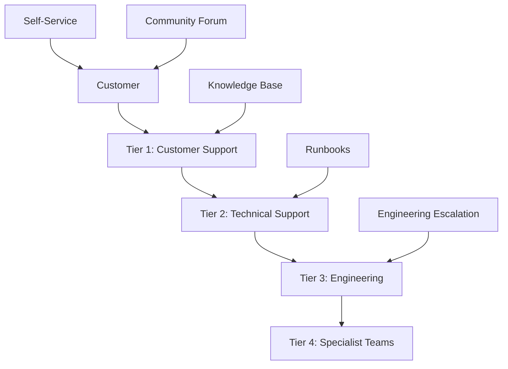

# Support Procedures & Incident Response
## Financy Customer Support & Technical Operations Guide

**Version**: 1.0  
**Last Updated**: 2025-10-19  
**Target Audience**: Support team, SRE, DevOps engineers, and technical leads  

---

## Overview

This document establishes comprehensive support procedures and incident response protocols for the Financy platform. It covers customer support workflows, technical troubleshooting procedures, incident management processes, and escalation protocols to ensure rapid resolution of issues and high customer satisfaction.

### Support Objectives
1. **Rapid Issue Resolution**: Minimize time to resolution for customer issues
2. **Proactive Problem Detection**: Identify and resolve issues before customer impact
3. **Knowledge Management**: Maintain comprehensive documentation and runbooks
4. **Continuous Improvement**: Learn from incidents to prevent recurrence
5. **Customer Communication**: Keep customers informed throughout issue resolution

---

## Support Organization

### Support Tiers & Responsibilities


### Support Team Structure
```typescript
interface SupportOrganization {
  tiers: SupportTier[];
  escalation_matrix: EscalationMatrix;
  sla_targets: SLATargets;
  communication_channels: CommunicationChannel[];
  knowledge_management: KnowledgeManagement;
}

const SUPPORT_STRUCTURE: SupportOrganization = {
  tiers: [
    {
      tier: 1,
      name: 'Customer Support',
      responsibilities: [
        'Initial customer contact handling',
        'Basic troubleshooting and FAQ responses',
        'Account management and billing inquiries',
        'Feature usage guidance',
        'Incident triage and categorization'
      ],
      skills_required: [
        'Customer service excellence',
        'Basic Financy platform knowledge',
        'Communication skills',
        'Ticket management systems'
      ],
      escalation_triggers: [
        'Technical issues beyond basic troubleshooting',
        'Data integrity concerns',
        'Security-related inquiries',
        'Feature requests requiring technical assessment',
        'Issues affecting multiple users'
      ],
      response_sla: {
        critical: '15 minutes',
        high: '2 hours',
        medium: '8 hours',
        low: '24 hours'
      }
    },
    {
      tier: 2,
      name: 'Technical Support',
      responsibilities: [
        'Advanced technical troubleshooting',
        'Database query assistance',
        'API integration support',
        'Performance issue investigation',
        'Configuration and setup guidance'
      ],
      skills_required: [
        'Deep Financy platform knowledge',
        'Database and API expertise',
        'Log analysis and debugging',
        'System administration',
        'DevOps tools familiarity'
      ],
      escalation_triggers: [
        'Code-level issues requiring development',
        'Infrastructure problems',
        'Complex data migrations',
        'Security vulnerabilities',
        'Architecture-level concerns'
      ],
      response_sla: {
        critical: '30 minutes',
        high: '4 hours',
        medium: '12 hours',
        low: '48 hours'
      }
    },
    {
      tier: 3,
      name: 'Engineering',
      responsibilities: [
        'Code-level issue resolution',
        'Bug fixes and patches',
        'Performance optimization',
        'Architecture troubleshooting',
        'Security incident response'
      ],
      skills_required: [
        'Software development expertise',
        'System architecture knowledge',
        'DevOps and infrastructure',
        'Security best practices',
        'Database optimization'
      ],
      escalation_triggers: [
        'Critical system outages',
        'Security breaches',
        'Data corruption incidents',
        'Complex architectural changes',
        'Third-party service failures'
      ],
      response_sla: {
        critical: '1 hour',
        high: '8 hours',
        medium: '24 hours',
        low: '72 hours'
      }
    },
    {
      tier: 4,
      name: 'Specialist Teams',
      responsibilities: [
        'AI/ML model troubleshooting',
        'Infrastructure architecture',
        'Security incident response',
        'Data science and analytics',
        'Business intelligence support'
      ],
      skills_required: [
        'Domain-specific expertise',
        'Advanced technical knowledge',
        'Research and development',
        'Cross-team collaboration',
        'Strategic problem solving'
      ],
      escalation_triggers: [
        'AI model accuracy issues',
        'Large-scale infrastructure changes',
        'Advanced security threats',
        'Complex data analysis requirements',
        'Strategic technical decisions'
      ],
      response_sla: {
        critical: '2 hours',
        high: '12 hours',
        medium: '48 hours',
        low: '1 week'
      }
    }
  ],
  escalation_matrix: {
    automatic_escalation: {
      time_based: {
        tier_1_to_2: '4 hours',
        tier_2_to_3: '8 hours',
        tier_3_to_4: '24 hours'
      },
      severity_based: {
        critical: 'immediate_to_tier_3',
        high: 'immediate_to_tier_2',
        security: 'immediate_to_security_team'
      }
    },
    manual_escalation: {
      criteria: [
        'Customer request for escalation',
        'Complex technical requirements',
        'Cross-team coordination needed',
        'Management visibility required'
      ]
    }
  },
  sla_targets: {
    response_time: {
      critical: '15 minutes',
      high: '2 hours',
      medium: '8 hours',
      low: '24 hours'
    },
    resolution_time: {
      critical: '4 hours',
      high: '24 hours',
      medium: '72 hours',
      low: '1 week'
    },
    customer_satisfaction: {
      target_score: 4.5,
      minimum_score: 4.0,
      survey_response_rate: 30
    }
  },
  communication_channels: [
    {
      channel: 'in_app_chat',
      availability: '24/7',
      response_time: '5 minutes',
      languages: ['english', 'portuguese', 'spanish']
    },
    {
      channel: 'email_support',
      availability: '24/7',
      response_time: '2 hours',
      languages: ['english', 'portuguese', 'spanish']
    },
    {
      channel: 'phone_support',
      availability: 'business_hours',
      response_time: 'immediate',
      languages: ['english', 'portuguese']
    },
    {
      channel: 'video_call',
      availability: 'by_appointment',
      response_time: '24 hours',
      languages: ['english', 'portuguese']
    }
  ],
  knowledge_management: {
    knowledge_base: 'zendesk',
    runbook_system: 'gitbook',
    internal_wiki: 'notion',
    video_library: 'loom',
    training_platform: 'teachable'
  }
};
```

---

## Incident Classification & Response

### Incident Severity Levels
```typescript
interface IncidentClassification {
  severity_levels: SeverityLevel[];
  impact_assessment: ImpactCriteria;
  response_procedures: ResponseProcedure[];
  communication_templates: CommunicationTemplate[];
}

const INCIDENT_CLASSIFICATION: IncidentClassification = {
  severity_levels: [
    {
      level: 'Critical (P1)',
      definition: 'Complete service outage or critical security breach',
      examples: [
        'Complete platform unavailability',
        'Data breach or security compromise',
        'Complete loss of transaction processing',
        'Critical financial data corruption',
        'Payment processing failure'
      ],
      response_time: '15 minutes',
      escalation: 'immediate_executive_notification',
      communication: 'immediate_customer_notification',
      resolution_target: '4 hours',
      response_team: ['incident_commander', 'sre_team', 'engineering_lead', 'security_team']
    },
    {
      level: 'High (P2)',
      definition: 'Significant service degradation affecting multiple users',
      examples: [
        'Performance degradation > 50%',
        'Key feature unavailability',
        'Authentication system issues',
        'AI categorization complete failure',
        'Mobile app crashes > 5% users'
      ],
      response_time: '1 hour',
      escalation: 'engineering_team_notification',
      communication: 'status_page_update',
      resolution_target: '24 hours',
      response_team: ['technical_lead', 'sre_engineer', 'product_manager']
    },
    {
      level: 'Medium (P3)',
      definition: 'Minor service issues affecting limited users',
      examples: [
        'Individual user account issues',
        'Specific feature malfunctions',
        'Performance issues affecting < 10% users',
        'Non-critical integrations failing',
        'Cosmetic UI/UX issues'
      ],
      response_time: '4 hours',
      escalation: 'support_team_notification',
      communication: 'individual_customer_notification',
      resolution_target: '72 hours',
      response_team: ['support_engineer', 'qa_engineer']
    },
    {
      level: 'Low (P4)',
      definition: 'Minor issues with minimal impact',
      examples: [
        'Documentation updates needed',
        'Feature enhancement requests',
        'Minor UI inconsistencies',
        'Non-urgent configuration changes',
        'General inquiries'
      ],
      response_time: '24 hours',
      escalation: 'standard_queue_processing',
      communication: 'standard_support_response',
      resolution_target: '1 week',
      response_team: ['support_agent', 'documentation_team']
    }
  ],
  impact_assessment: {
    user_impact: {
      all_users: 'p1_or_p2',
      multiple_users: 'p2_or_p3',
      single_user: 'p3_or_p4',
      no_users: 'p4'
    },
    business_impact: {
      revenue_affecting: 'p1',
      feature_unavailable: 'p2',
      minor_degradation: 'p3',
      no_business_impact: 'p4'
    },
    security_impact: {
      data_breach: 'p1',
      potential_vulnerability: 'p2',
      security_concern: 'p3',
      no_security_impact: 'p4'
    }
  },
  response_procedures: [
    {
      severity: 'p1',
      immediate_actions: [
        'Activate incident response team',
        'Create incident room (Slack/Teams)',
        'Notify executives and stakeholders',
        'Post initial status page update',
        'Begin investigation and mitigation'
      ],
      ongoing_actions: [
        'Regular status updates every 30 minutes',
        'Coordinate with external vendors if needed',
        'Document all actions taken',
        'Prepare customer communications',
        'Monitor system metrics continuously'
      ],
      resolution_actions: [
        'Verify full service restoration',
        'Post final status page update',
        'Send customer communication',
        'Schedule post-incident review',
        'Update documentation and runbooks'
      ]
    },
    {
      severity: 'p2',
      immediate_actions: [
        'Assign incident owner',
        'Create incident tracking ticket',
        'Notify relevant teams',
        'Assess impact and scope',
        'Begin troubleshooting'
      ],
      ongoing_actions: [
        'Status updates every 2 hours',
        'Coordinate team efforts',
        'Document investigation findings',
        'Communicate with affected customers',
        'Monitor for escalation needs'
      ],
      resolution_actions: [
        'Verify issue resolution',
        'Update affected customers',
        'Document lessons learned',
        'Update monitoring and alerts',
        'Close incident ticket'
      ]
    }
  ],
  communication_templates: [
    {
      template_name: 'initial_incident_notification',
      severity: 'p1',
      content: `
        Subject: [INCIDENT] Financy Service Disruption - Investigation Underway
        
        Dear Financy Users,
        
        We are currently investigating reports of service disruption affecting our platform. 
        Our engineering team has been notified and is working to resolve this issue as quickly as possible.
        
        Current Status: Investigation in progress
        Affected Services: [LIST AFFECTED SERVICES]
        Estimated Resolution: Under investigation
        
        We will provide updates every 30 minutes until this issue is resolved.
        
        We sincerely apologize for any inconvenience this may cause.
        
        The Financy Team
        Status Page: https://status.financy.com
      `
    },
    {
      template_name: 'resolution_notification',
      severity: 'p1',
      content: `
        Subject: [RESOLVED] Financy Service Disruption - Services Restored
        
        Dear Financy Users,
        
        We are pleased to report that the service disruption affecting our platform has been resolved.
        All services are now operating normally.
        
        Incident Summary:
        - Start Time: [INCIDENT_START_TIME]
        - Resolution Time: [INCIDENT_END_TIME]
        - Duration: [INCIDENT_DURATION]
        - Root Cause: [BRIEF_ROOT_CAUSE]
        
        Actions Taken:
        - [LIST_ACTIONS_TAKEN]
        
        We sincerely apologize for the disruption and any inconvenience it may have caused.
        We are conducting a thorough post-incident review to prevent similar issues in the future.
        
        If you continue to experience any issues, please contact our support team.
        
        The Financy Team
        Support: support@financy.com
      `
    }
  ]
};
```

### Incident Response Workflow
```typescript
class IncidentResponseWorkflow {
  private incidentManager: IncidentManager;
  private communicationManager: CommunicationManager;
  private escalationManager: EscalationManager;
  
  constructor() {
    this.incidentManager = new IncidentManager();
    this.communicationManager = new CommunicationManager();
    this.escalationManager = new EscalationManager();
  }
  
  async handleIncident(incident: IncidentReport): Promise<IncidentResponse> {
    // Step 1: Initial Assessment and Classification
    const classification = await this.classifyIncident(incident);
    const incidentTicket = await this.createIncidentTicket(incident, classification);
    
    // Step 2: Immediate Response
    await this.executeImmediateResponse(incidentTicket);
    
    // Step 3: Investigation and Mitigation
    const investigationResult = await this.conductInvestigation(incidentTicket);
    
    // Step 4: Resolution and Communication
    const resolution = await this.resolveIncident(incidentTicket, investigationResult);
    
    // Step 5: Post-Incident Activities
    await this.postIncidentActivities(incidentTicket, resolution);
    
    return {
      incident_id: incidentTicket.id,
      classification,
      resolution,
      timeline: incidentTicket.timeline
    };
  }
  
  private async classifyIncident(incident: IncidentReport): Promise<IncidentClassification> {
    const severity = this.determineSeverity(incident);
    const impact = this.assessImpact(incident);
    const urgency = this.calculateUrgency(severity, impact);
    
    return {
      severity,
      impact,
      urgency,
      category: this.categorizeIncident(incident),
      priority: this.calculatePriority(severity, urgency)
    };
  }
  
  private async executeImmediateResponse(incident: IncidentTicket): Promise<void> {
    const severity = incident.classification.severity;
    
    // Activate appropriate response team
    const responseTeam = await this.escalationManager.activateResponseTeam(severity);
    
    // Create communication channels
    if (severity === 'p1' || severity === 'p2') {
      await this.communicationManager.createIncidentRoom(incident.id);
    }
    
    // Send initial notifications
    await this.sendInitialNotifications(incident, responseTeam);
    
    // Begin investigation
    await this.startInvestigation(incident);
    
    // Update status page if needed
    if (severity === 'p1' || severity === 'p2') {
      await this.updateStatusPage(incident);
    }
  }
  
  private async conductInvestigation(incident: IncidentTicket): Promise<InvestigationResult> {
    const investigation = new IncidentInvestigation(incident);
    
    // Gather initial evidence
    const evidence = await investigation.gatherEvidence({
      logs: await this.collectRelevantLogs(incident),
      metrics: await this.collectRelevantMetrics(incident),
      traces: await this.collectRelevantTraces(incident),
      external_status: await this.checkExternalServices(incident)
    });
    
    // Analyze evidence and determine root cause
    const analysis = await investigation.analyzeEvidence(evidence);
    
    // Implement mitigation steps
    const mitigation = await investigation.implementMitigation(analysis);
    
    return {
      root_cause: analysis.root_cause,
      contributing_factors: analysis.contributing_factors,
      mitigation_steps: mitigation.steps,
      effectiveness: mitigation.effectiveness
    };
  }
  
  private async resolveIncident(
    incident: IncidentTicket, 
    investigation: InvestigationResult
  ): Promise<IncidentResolution> {
    // Verify resolution
    const verificationResult = await this.verifyResolution(incident);
    
    if (!verificationResult.resolved) {
      // Continue investigation if not resolved
      return await this.continueInvestigation(incident, investigation);
    }
    
    // Update incident status
    await this.incidentManager.updateStatus(incident.id, 'resolved');
    
    // Send resolution communications
    await this.sendResolutionNotifications(incident, investigation);
    
    // Update status page
    await this.updateStatusPageResolved(incident);
    
    return {
      resolution_time: new Date(),
      resolution_summary: investigation.root_cause.summary,
      actions_taken: investigation.mitigation_steps,
      verification_status: verificationResult
    };
  }
  
  private async postIncidentActivities(
    incident: IncidentTicket, 
    resolution: IncidentResolution
  ): Promise<void> {
    // Schedule post-incident review
    if (incident.classification.severity === 'p1' || incident.classification.severity === 'p2') {
      await this.schedulePostIncidentReview(incident, resolution);
    }
    
    // Update documentation and runbooks
    await this.updateDocumentation(incident, resolution);
    
    // Create follow-up tasks
    await this.createFollowUpTasks(incident, resolution);
    
    // Update monitoring and alerting
    await this.updateMonitoringAndAlerting(incident, resolution);
    
    // Send internal summary
    await this.sendInternalSummary(incident, resolution);
  }
}
```

---

## Support Procedures

### Customer Issue Resolution
```typescript
interface SupportProcedure {
  issue_type: string;
  troubleshooting_steps: TroubleshootingStep[];
  escalation_criteria: EscalationCriteria;
  resolution_documentation: DocumentationRequirements;
}

const SUPPORT_PROCEDURES: SupportProcedure[] = [
  {
    issue_type: 'authentication_problems',
    troubleshooting_steps: [
      {
        step: 1,
        action: 'Verify user credentials',
        commands: [
          'Check user account status in admin panel',
          'Verify email address is confirmed',
          'Check for account locks or suspensions'
        ],
        expected_outcome: 'User account status is confirmed',
        next_steps: {
          success: 'proceed_to_step_2',
          failure: 'escalate_to_tier_2'
        }
      },
      {
        step: 2,
        action: 'Reset password if needed',
        commands: [
          'Initiate password reset flow',
          'Verify email delivery',
          'Confirm password reset completion'
        ],
        expected_outcome: 'User successfully resets password',
        next_steps: {
          success: 'test_login',
          failure: 'check_email_delivery'
        }
      },
      {
        step: 3,
        action: 'Check for browser/app issues',
        commands: [
          'Verify browser compatibility',
          'Clear browser cache and cookies',
          'Test in incognito/private mode',
          'Try different browser or device'
        ],
        expected_outcome: 'Login works in alternative environment',
        next_steps: {
          success: 'provide_browser_guidance',
          failure: 'escalate_to_tier_2'
        }
      }
    ],
    escalation_criteria: {
      automatic: [
        'User account shows no issues but login still fails',
        'Multiple users reporting same issue',
        'Authentication service errors in logs'
      ],
      manual: [
        'Customer requests escalation',
        'Issue persists after basic troubleshooting'
      ]
    },
    resolution_documentation: {
      required_fields: [
        'root_cause_identified',
        'steps_taken',
        'resolution_applied',
        'customer_satisfaction',
        'follow_up_required'
      ],
      templates: 'authentication_resolution_template'
    }
  },
  {
    issue_type: 'transaction_processing_errors',
    troubleshooting_steps: [
      {
        step: 1,
        action: 'Verify transaction details',
        commands: [
          'Check transaction ID in database',
          'Verify transaction status and error codes',
          'Review transaction processing logs'
        ],
        expected_outcome: 'Transaction record located with status details',
        next_steps: {
          success: 'analyze_error_details',
          failure: 'request_additional_transaction_info'
        }
      },
      {
        step: 2,
        action: 'Analyze error patterns',
        commands: [
          'Check for similar recent errors',
          'Review AI categorization logs if applicable',
          'Verify external service status'
        ],
        expected_outcome: 'Error pattern or cause identified',
        next_steps: {
          success: 'apply_appropriate_fix',
          failure: 'escalate_to_engineering'
        }
      },
      {
        step: 3,
        action: 'Reprocess or correct transaction',
        commands: [
          'Retry transaction processing if transient error',
          'Correct data issues if found',
          'Manual categorization if AI failed'
        ],
        expected_outcome: 'Transaction successfully processed',
        next_steps: {
          success: 'verify_customer_satisfaction',
          failure: 'escalate_to_engineering'
        }
      }
    ],
    escalation_criteria: {
      automatic: [
        'System-wide transaction processing issues',
        'Data integrity concerns',
        'External service failures'
      ],
      manual: [
        'Complex transaction scenarios',
        'Bulk transaction issues',
        'Customer data privacy concerns'
      ]
    },
    resolution_documentation: {
      required_fields: [
        'transaction_id',
        'error_analysis',
        'resolution_steps',
        'data_integrity_verified',
        'customer_notification_sent'
      ],
      templates: 'transaction_resolution_template'
    }
  }
];
```

### Knowledge Base Management
```typescript
interface KnowledgeManagement {
  knowledge_base: KnowledgeBaseStructure;
  content_management: ContentManagementProcess;
  search_optimization: SearchOptimization;
  user_feedback: UserFeedbackSystem;
}

const KNOWLEDGE_MANAGEMENT: KnowledgeManagement = {
  knowledge_base: {
    categories: [
      {
        name: 'Getting Started',
        articles: [
          'Account Setup and Verification',
          'First Transaction Entry',
          'Mobile App Installation',
          'Understanding Financial Contexts',
          'Basic Navigation Guide'
        ],
        target_audience: 'new_users',
        maintenance_frequency: 'monthly'
      },
      {
        name: 'Features and Functionality',
        articles: [
          'Voice Transaction Processing',
          'AI-Powered Categorization',
          'Multi-Currency Support',
          'Receipt OCR and Scanning',
          'Shared Financial Contexts',
          'Export and Reporting',
          'API Integration Guide'
        ],
        target_audience: 'all_users',
        maintenance_frequency: 'bi_weekly'
      },
      {
        name: 'Troubleshooting',
        articles: [
          'Login and Authentication Issues',
          'Transaction Processing Errors',
          'Mobile App Performance',
          'Data Sync Problems',
          'Integration Troubleshooting',
          'Browser Compatibility'
        ],
        target_audience: 'support_team',
        maintenance_frequency: 'weekly'
      },
      {
        name: 'Technical Documentation',
        articles: [
          'API Reference and Examples',
          'Webhook Configuration',
          'Security Best Practices',
          'Data Export Formats',
          'Third-party Integrations'
        ],
        target_audience: 'developers',
        maintenance_frequency: 'with_each_release'
      }
    ],
    search_functionality: {
      full_text_search: true,
      categorized_browsing: true,
      tag_based_filtering: true,
      popularity_ranking: true,
      multilingual_support: ['english', 'portuguese', 'spanish']
    }
  },
  content_management: {
    creation_process: {
      author_guidelines: 'clear_concise_actionable',
      review_process: 'peer_review_plus_expert_approval',
      approval_workflow: 'author_reviewer_approver',
      publication_schedule: 'immediate_for_critical_bi_weekly_for_regular'
    },
    maintenance_process: {
      regular_reviews: 'quarterly',
      accuracy_verification: 'with_each_product_update',
      user_feedback_integration: 'monthly',
      obsolete_content_removal: 'quarterly'
    },
    quality_standards: {
      readability_score: 'grade_8_level',
      completeness_checklist: 'problem_solution_verification',
      accuracy_verification: 'technical_review_required',
      user_testing: 'sample_customers_test_procedures'
    }
  },
  search_optimization: {
    seo_keywords: [
      'financy help', 'transaction processing', 'voice transactions',
      'financial tracking', 'ai categorization', 'multi currency',
      'receipt scanning', 'financial contexts', 'export data'
    ],
    search_analytics: {
      track_queries: true,
      identify_gaps: true,
      optimize_results: true,
      user_behavior_analysis: true
    },
    auto_suggestions: {
      query_completion: true,
      related_articles: true,
      popular_searches: true,
      contextual_help: true
    }
  },
  user_feedback: {
    feedback_collection: {
      article_rating: 'five_star_system',
      helpfulness_voting: 'helpful_not_helpful',
      comment_system: 'moderated_comments',
      improvement_suggestions: 'structured_feedback_form'
    },
    feedback_processing: {
      response_time: '48_hours',
      action_tracking: 'feedback_to_improvement_pipeline',
      acknowledgment_system: 'thank_you_notifications',
      impact_measurement: 'before_after_metrics'
    }
  }
};
```

---

## Escalation Procedures

### Technical Escalation Matrix
```typescript
interface EscalationMatrix {
  escalation_paths: EscalationPath[];
  decision_criteria: DecisionCriteria[];
  communication_protocols: CommunicationProtocol[];
  response_expectations: ResponseExpectation[];
}

const ESCALATION_MATRIX: EscalationMatrix = {
  escalation_paths: [
    {
      from: 'tier_1_support',
      to: 'tier_2_technical',
      triggers: [
        'Technical complexity beyond basic troubleshooting',
        'Database or API-related issues',
        'Multiple users affected',
        'Performance-related concerns',
        'Integration problems'
      ],
      handoff_requirements: [
        'Detailed issue description',
        'Customer impact assessment',
        'Troubleshooting steps already taken',
        'Customer communication log',
        'Relevant system information'
      ],
      sla_impact: 'escalation_sla_applies'
    },
    {
      from: 'tier_2_technical',
      to: 'tier_3_engineering',
      triggers: [
        'Code-level investigation required',
        'System architecture issues',
        'Security concerns',
        'Data integrity problems',
        'Performance optimization needed'
      ],
      handoff_requirements: [
        'Technical analysis summary',
        'Log files and error traces',
        'Reproduction steps',
        'Impact scope assessment',
        'Proposed investigation approach'
      ],
      sla_impact: 'engineering_sla_applies'
    },
    {
      from: 'tier_3_engineering',
      to: 'specialist_teams',
      triggers: [
        'AI/ML model issues',
        'Infrastructure architecture changes',
        'Advanced security incidents',
        'Complex data analysis requirements',
        'Cross-system integration problems'
      ],
      handoff_requirements: [
        'Comprehensive technical analysis',
        'Code investigation results',
        'System impact assessment',
        'Resource requirements',
        'Timeline expectations'
      ],
      sla_impact: 'specialist_sla_applies'
    }
  ],
  decision_criteria: [
    {
      criterion: 'customer_impact',
      levels: {
        single_user: 'standard_escalation_path',
        multiple_users: 'expedited_escalation',
        all_users: 'emergency_escalation'
      }
    },
    {
      criterion: 'business_impact',
      levels: {
        low: 'standard_process',
        medium: 'management_notification',
        high: 'executive_escalation',
        critical: 'ceo_notification'
      }
    },
    {
      criterion: 'technical_complexity',
      levels: {
        configuration: 'tier_2_sufficient',
        integration: 'tier_3_required',
        architecture: 'specialist_required',
        research: 'extended_timeline'
      }
    }
  ],
  communication_protocols: [
    {
      escalation_level: 'tier_1_to_tier_2',
      communication_method: 'ticket_system_with_slack_notification',
      information_required: [
        'Customer details and contact information',
        'Issue summary and category',
        'Impact assessment',
        'Actions taken so far',
        'Customer communication history'
      ],
      response_expectation: '1_hour_acknowledgment'
    },
    {
      escalation_level: 'tier_2_to_tier_3',
      communication_method: 'slack_channel_plus_jira_ticket',
      information_required: [
        'Technical investigation summary',
        'System logs and metrics',
        'Reproduction instructions',
        'Customer business impact',
        'Recommended next steps'
      ],
      response_expectation: '2_hour_acknowledgment'
    },
    {
      escalation_level: 'emergency_escalation',
      communication_method: 'phone_call_plus_slack_plus_email',
      information_required: [
        'Incident severity and scope',
        'Customer impact details',
        'Business continuity concerns',
        'Immediate actions needed',
        'Communication requirements'
      ],
      response_expectation: '15_minute_acknowledgment'
    }
  ],
  response_expectations: [
    {
      escalation_target: 'tier_2_technical',
      acknowledgment_time: '1 hour',
      initial_assessment_time: '2 hours',
      progress_update_frequency: '4 hours',
      escalation_decision_time: '8 hours'
    },
    {
      escalation_target: 'tier_3_engineering',
      acknowledgment_time: '2 hours',
      initial_assessment_time: '4 hours',
      progress_update_frequency: '8 hours',
      escalation_decision_time: '24 hours'
    },
    {
      escalation_target: 'specialist_teams',
      acknowledgment_time: '4 hours',
      initial_assessment_time: '8 hours',
      progress_update_frequency: '24 hours',
      escalation_decision_time: '72 hours'
    }
  ]
};
```

### Customer Communication Management
```typescript
class CustomerCommunicationManager {
  private communicationChannels: CommunicationChannel[];
  private templates: MessageTemplate[];
  private escalationNotifier: EscalationNotifier;
  
  constructor() {
    this.setupCommunicationChannels();
    this.loadMessageTemplates();
    this.escalationNotifier = new EscalationNotifier();
  }
  
  async sendInitialResponse(
    customer: Customer, 
    ticket: SupportTicket
  ): Promise<CommunicationRecord> {
    const template = this.getTemplate('initial_response', ticket.severity);
    const message = this.personalizeMessage(template, customer, ticket);
    
    const communication = await this.sendMessage(
      customer.preferred_channel,
      message,
      {
        ticket_id: ticket.id,
        priority: ticket.severity,
        expected_response_time: this.calculateResponseTime(ticket.severity)
      }
    );
    
    await this.logCommunication(ticket.id, communication);
    return communication;
  }
  
  async sendProgressUpdate(
    ticket: SupportTicket,
    progress: ProgressUpdate
  ): Promise<CommunicationRecord> {
    const template = this.getTemplate('progress_update', ticket.severity);
    const message = this.personalizeMessage(template, ticket.customer, {
      ...ticket,
      progress_details: progress.details,
      next_steps: progress.next_steps,
      estimated_resolution: progress.estimated_resolution
    });
    
    const communication = await this.sendMessage(
      ticket.customer.preferred_channel,
      message,
      {
        ticket_id: ticket.id,
        update_type: 'progress',
        timestamp: new Date()
      }
    );
    
    await this.logCommunication(ticket.id, communication);
    return communication;
  }
  
  async sendEscalationNotification(
    ticket: SupportTicket,
    escalation: EscalationDetails
  ): Promise<CommunicationRecord> {
    const template = this.getTemplate('escalation_notification', ticket.severity);
    const message = this.personalizeMessage(template, ticket.customer, {
      ...ticket,
      escalation_reason: escalation.reason,
      new_team: escalation.target_team,
      expected_expertise: escalation.expertise_level,
      updated_timeline: escalation.updated_sla
    });
    
    const communication = await this.sendMessage(
      ticket.customer.preferred_channel,
      message,
      {
        ticket_id: ticket.id,
        update_type: 'escalation',
        escalation_level: escalation.level
      }
    );
    
    // Also notify internal teams
    await this.escalationNotifier.notifyInternalTeams(escalation);
    
    await this.logCommunication(ticket.id, communication);
    return communication;
  }
  
  async sendResolutionNotification(
    ticket: SupportTicket,
    resolution: TicketResolution
  ): Promise<CommunicationRecord> {
    const template = this.getTemplate('resolution_notification', ticket.severity);
    const message = this.personalizeMessage(template, ticket.customer, {
      ...ticket,
      resolution_summary: resolution.summary,
      actions_taken: resolution.actions,
      prevention_measures: resolution.prevention_steps,
      follow_up_required: resolution.follow_up_needed
    });
    
    const communication = await this.sendMessage(
      ticket.customer.preferred_channel,
      message,
      {
        ticket_id: ticket.id,
        update_type: 'resolution',
        satisfaction_survey_link: this.generateSurveyLink(ticket.id)
      }
    );
    
    // Schedule follow-up if needed
    if (resolution.follow_up_needed) {
      await this.scheduleFollowUp(ticket, resolution.follow_up_schedule);
    }
    
    await this.logCommunication(ticket.id, communication);
    return communication;
  }
  
  private calculateResponseTime(severity: string): string {
    const slaTargets = {
      'critical': '15 minutes',
      'high': '2 hours',
      'medium': '8 hours',
      'low': '24 hours'
    };
    
    return slaTargets[severity] || '24 hours';
  }
  
  private personalizeMessage(
    template: MessageTemplate,
    customer: Customer,
    context: any
  ): string {
    let message = template.content;
    
    // Replace customer placeholders
    message = message.replace(/\{customer_name\}/g, customer.name);
    message = message.replace(/\{customer_email\}/g, customer.email);
    
    // Replace context placeholders
    Object.keys(context).forEach(key => {
      const placeholder = `{${key}}`;
      const value = context[key];
      message = message.replace(new RegExp(placeholder, 'g'), value);
    });
    
    return message;
  }
}
```

This comprehensive support procedures and incident response guide ensures efficient handling of customer issues and technical incidents with clear escalation paths, communication protocols, and resolution tracking.