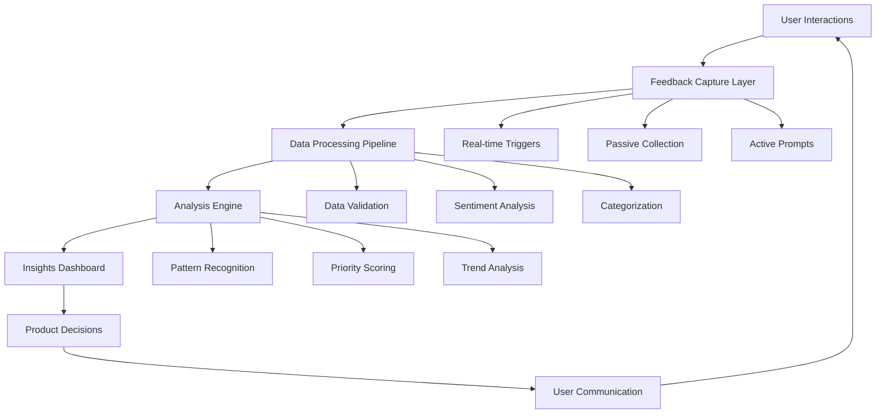

# Feedback Instrumentation System
## In-App Feedback Collection & Analysis Framework

**Version**: 1.0  
**Last Updated**: 2025-10-19  
**Target Audience**: Product team, engineering team, and UX researchers  

---

## Overview

This document specifies the comprehensive feedback instrumentation system for the Financy platform, designed to collect, analyze, and act upon user feedback throughout the beta testing period and beyond. The system provides multiple feedback channels, automated collection mechanisms, and sophisticated analysis tools to ensure continuous product improvement based on real user insights.

### Instrumentation Objectives
1. **Continuous Feedback Collection**: Capture user sentiment and suggestions in real-time
2. **Context-Aware Insights**: Understand feedback within specific user workflows and scenarios
3. **Actionable Data**: Transform raw feedback into prioritized product improvements
4. **User Engagement**: Maintain high participation through non-intrusive feedback mechanisms
5. **Closed-Loop Feedback**: Communicate back to users how their feedback influenced product decisions

---

## Feedback Collection Architecture

### System Architecture Overview


### Technical Infrastructure
**Data Collection Stack**:
- **Frontend**: React/React Native with custom feedback components
- **Backend**: Node.js/NestJS with real-time event processing
- **Database**: PostgreSQL for structured feedback, Redis for real-time data
- **Analytics**: Mixpanel/Amplitude for behavioral analytics
- **ML/AI**: OpenAI API for sentiment analysis and categorization

**Integration Points**:
- **Telegram Bot**: Feedback collection within messaging interface
- **Mobile Apps**: Native feedback UI components
- **Web Dashboard**: Integrated feedback widgets and surveys
- **Admin Panel**: Feedback management and response tools

---

## Feedback Collection Methods

### 1. Contextual Micro-Feedback
**Implementation**: Real-time, context-aware feedback collection during user interactions

#### Transaction Entry Feedback
```typescript
interface TransactionFeedback {
  transaction_id: string;
  user_id: string;
  context_id: string;
  feedback_type: 'accuracy' | 'ease_of_use' | 'speed' | 'general';
  rating: 1 | 2 | 3 | 4 | 5;
  comment?: string;
  auto_categorization_correct: boolean;
  ocr_accuracy_rating?: 1 | 2 | 3 | 4 | 5;
  voice_recognition_correct?: boolean;
  timestamp: Date;
  session_id: string;
}
```

**Trigger Points**:
- After successful transaction entry
- After auto-categorization suggestion
- After OCR processing completion
- After voice input processing
- On transaction edit/correction

**UI Implementation**:
```typescript
// React component for transaction feedback
const TransactionFeedback: React.FC<Props> = ({ transactionId, onSubmit }) => {
  return (
    <FeedbackModal>
      <Question>
        How accurate was the auto-categorization?
        <StarRating onChange={handleRating} />
      </Question>
      <Question>
        Was anything confusing about this process?
        <TextInput placeholder="Optional: Tell us more..." />
      </Question>
      <SubmitButton>Send Feedback</SubmitButton>
      <SkipButton>Skip for now</SkipButton>
    </FeedbackModal>
  );
};
```

#### Feature Usage Feedback
```typescript
interface FeatureFeedback {
  feature_name: string;
  user_id: string;
  usage_context: 'first_time' | 'regular_use' | 'error_recovery';
  satisfaction_score: 1 | 2 | 3 | 4 | 5;
  difficulty_rating: 'very_easy' | 'easy' | 'moderate' | 'difficult' | 'very_difficult';
  completion_status: 'completed' | 'abandoned' | 'needs_help';
  pain_points: string[];
  suggestions: string;
  timestamp: Date;
}
```

### 2. Intelligent Feedback Prompts
**Implementation**: AI-driven prompts based on user behavior patterns

#### Prompt Trigger Logic
```typescript
class FeedbackPromptEngine {
  shouldPromptFeedback(user: User, session: Session): boolean {
    const criteria = [
      this.isNewFeatureUser(user),
      this.hasCompletedSignificantAction(session),
      this.hasExperiencedError(session),
      this.isLowEngagementUser(user),
      this.hasReachedMilestone(user)
    ];
    
    return this.evaluatePromptCriteria(criteria);
  }
  
  getPromptType(context: UserContext): PromptType {
    if (context.errorOccurred) return 'error_recovery_feedback';
    if (context.newFeatureUsed) return 'feature_discovery_feedback';
    if (context.milestoneReached) return 'journey_feedback';
    return 'general_satisfaction';
  }
}
```

#### Smart Timing Algorithm
```typescript
interface PromptTiming {
  min_session_duration: number; // 120 seconds
  max_prompts_per_day: number; // 2
  cooldown_period: number; // 24 hours
  completion_delay: number; // 3 seconds after action
  user_preference_respected: boolean;
}

class TimingOptimizer {
  calculateOptimalPromptTime(user: User, action: UserAction): Date | null {
    if (this.isPromptFatigueRisk(user)) return null;
    if (this.isInQuietHours(user.timezone)) return null;
    
    return new Date(Date.now() + this.calculateDelay(action));
  }
}
```

### 3. Passive Behavioral Analytics
**Implementation**: Background collection of user interaction patterns

#### Interaction Tracking Schema
```typescript
interface UserInteraction {
  user_id: string;
  session_id: string;
  action_type: 'click' | 'swipe' | 'voice_input' | 'text_input' | 'navigation';
  element_id: string;
  page_url: string;
  timestamp: Date;
  context_data: {
    feature_name: string;
    workflow_step: number;
    error_state: boolean;
    response_time: number;
  };
}
```

#### Frustration Detection Algorithm
```typescript
class FrustrationDetector {
  detectFrustrationSignals(interactions: UserInteraction[]): FrustrationSignal[] {
    const signals = [
      this.detectRapidClicking(interactions),
      this.detectBackAndForth(interactions),
      this.detectLongPauses(interactions),
      this.detectErrorPatterns(interactions),
      this.detectAbandonmentPatterns(interactions)
    ];
    
    return signals.filter(signal => signal.confidence > 0.7);
  }
}
```

### 4. Structured Survey System
**Implementation**: Targeted surveys based on user segments and behaviors

#### Survey Trigger Framework
```typescript
interface SurveyTrigger {
  trigger_id: string;
  name: string;
  conditions: SurveyCondition[];
  target_audience: UserSegment;
  frequency: 'once' | 'weekly' | 'monthly' | 'event_based';
  priority: 'high' | 'medium' | 'low';
}

interface WeeklySatisfactionSurvey extends SurveyTrigger {
  questions: [
    {
      type: 'nps',
      text: 'How likely are you to recommend Financy to a friend?',
      scale: [0, 10]
    },
    {
      type: 'rating',
      text: 'How satisfied are you with the transaction categorization?',
      scale: [1, 5]
    },
    {
      type: 'multiple_choice',
      text: 'Which feature do you find most valuable?',
      options: ['Auto-categorization', 'Voice input', 'OCR scanning', 'Multi-context', 'Dashboard']
    },
    {
      type: 'open_text',
      text: 'What is the biggest pain point in your current workflow?'
    }
  ];
}
```

### 5. Bug & Issue Reporting
**Implementation**: Integrated bug reporting with automatic diagnostics

#### Bug Report Data Schema
```typescript
interface BugReport {
  report_id: string;
  user_id: string;
  severity: 'critical' | 'high' | 'medium' | 'low';
  category: 'ui_bug' | 'data_error' | 'performance' | 'integration' | 'security';
  title: string;
  description: string;
  steps_to_reproduce: string[];
  expected_behavior: string;
  actual_behavior: string;
  user_agent: string;
  device_info: DeviceInfo;
  session_data: SessionData;
  automatic_diagnostics: DiagnosticData;
  attachments: string[]; // Screenshot/video URLs
  timestamp: Date;
}

interface DiagnosticData {
  app_version: string;
  platform: string;
  network_status: 'online' | 'offline' | 'poor';
  memory_usage: number;
  last_actions: UserAction[];
  error_logs: ErrorLog[];
  performance_metrics: PerformanceMetrics;
}
```

#### Automatic Diagnostic Collection
```typescript
class DiagnosticCollector {
  async collectAutomaticDiagnostics(): Promise<DiagnosticData> {
    return {
      app_version: await this.getAppVersion(),
      platform: this.getPlatformInfo(),
      network_status: await this.getNetworkStatus(),
      memory_usage: await this.getMemoryUsage(),
      last_actions: this.getRecentActions(50),
      error_logs: this.getRecentErrors(10),
      performance_metrics: await this.getPerformanceMetrics()
    };
  }
}
```

---

## Feedback Analysis Engine

### 1. Sentiment Analysis Pipeline
**Implementation**: AI-powered sentiment classification and emotion detection

#### Sentiment Analysis Configuration
```typescript
interface SentimentAnalysisConfig {
  provider: 'openai' | 'azure_cognitive' | 'aws_comprehend';
  language_support: ['pt-BR', 'en-US', 'es-ES'];
  confidence_threshold: 0.7;
  emotion_detection: boolean;
  topic_extraction: boolean;
}

class SentimentAnalyzer {
  async analyzeFeedback(text: string): Promise<SentimentResult> {
    const prompt = `
      Analyze the following user feedback for a financial management app:
      "${text}"
      
      Provide analysis in JSON format:
      {
        "sentiment": "positive|neutral|negative",
        "confidence": 0.95,
        "emotions": ["satisfaction", "frustration"],
        "topics": ["categorization", "user_interface"],
        "urgency": "low|medium|high",
        "actionable": true|false
      }
    `;
    
    return await this.callAIService(prompt);
  }
}
```

### 2. Pattern Recognition System
**Implementation**: Machine learning models to identify trends and patterns

#### Feedback Pattern Detection
```typescript
interface FeedbackPattern {
  pattern_id: string;
  pattern_type: 'recurring_issue' | 'feature_request' | 'usability_problem' | 'positive_trend';
  description: string;
  frequency: number;
  affected_users: string[];
  impact_score: number;
  first_detected: Date;
  last_occurrence: Date;
  related_features: string[];
  suggested_actions: string[];
}

class PatternDetector {
  detectPatterns(feedback: Feedback[]): FeedbackPattern[] {
    return [
      ...this.detectRecurringIssues(feedback),
      ...this.detectFeatureRequestClusters(feedback),
      ...this.detectUsabilityProblems(feedback),
      ...this.detectPositiveTrends(feedback)
    ];
  }
  
  private detectRecurringIssues(feedback: Feedback[]): FeedbackPattern[] {
    const groupedByTopic = this.groupByTopic(feedback);
    const patterns = [];
    
    for (const [topic, items] of groupedByTopic) {
      if (items.length >= 3 && this.hasNegativeSentiment(items)) {
        patterns.push(this.createRecurringIssuePattern(topic, items));
      }
    }
    
    return patterns;
  }
}
```

### 3. Priority Scoring Algorithm
**Implementation**: Multi-factor scoring system for feedback prioritization

#### Priority Score Calculation
```typescript
interface PriorityFactors {
  user_impact: number; // 0.4 weight
  frequency: number; // 0.3 weight
  business_value: number; // 0.2 weight
  technical_complexity: number; // 0.1 weight (inverse)
}

class PriorityScorer {
  calculatePriorityScore(feedback: Feedback): number {
    const factors = {
      user_impact: this.calculateUserImpact(feedback),
      frequency: this.calculateFrequency(feedback),
      business_value: this.calculateBusinessValue(feedback),
      technical_complexity: this.estimateTechnicalComplexity(feedback)
    };
    
    return (
      factors.user_impact * 0.4 +
      factors.frequency * 0.3 +
      factors.business_value * 0.2 +
      (1 - factors.technical_complexity) * 0.1
    );
  }
  
  private calculateUserImpact(feedback: Feedback): number {
    const severityWeight = {
      'critical': 1.0,
      'high': 0.8,
      'medium': 0.5,
      'low': 0.2
    };
    
    const affectedUsersRatio = feedback.affected_users.length / this.totalActiveUsers;
    return severityWeight[feedback.severity] * affectedUsersRatio;
  }
}
```

### 4. Trend Analysis Dashboard
**Implementation**: Real-time analytics dashboard for product teams

#### Dashboard Metrics Configuration
```typescript
interface DashboardMetrics {
  real_time_sentiment: {
    positive_percentage: number;
    negative_percentage: number;
    neutral_percentage: number;
    trend_direction: 'improving' | 'declining' | 'stable';
  };
  
  top_feedback_themes: {
    theme: string;
    frequency: number;
    sentiment: 'positive' | 'negative' | 'neutral';
    change_from_last_week: number;
  }[];
  
  feature_satisfaction: {
    feature_name: string;
    satisfaction_score: number;
    usage_rate: number;
    feedback_volume: number;
  }[];
  
  critical_issues: {
    issue_id: string;
    title: string;
    affected_users: number;
    severity: string;
    days_open: number;
  }[];
}
```

---

## Feedback Response & Closure System

### 1. Automated Acknowledgment
**Implementation**: Immediate response system for all feedback submissions

#### Auto-Response Templates
```typescript
interface ResponseTemplate {
  trigger_condition: string;
  template_type: 'acknowledgment' | 'clarification' | 'resolution' | 'follow_up';
  language: string;
  template: string;
  personalization_fields: string[];
}

const RESPONSE_TEMPLATES = {
  bug_report_acknowledgment: {
    template: `Hi {{user_name}}, 
    
    Thank you for reporting this issue with {{feature_name}}. We've received your feedback (ID: {{ticket_id}}) and our team is investigating.
    
    We'll keep you updated on our progress and notify you when this is resolved.
    
    Best regards,
    The Financy Team`,
    personalization_fields: ['user_name', 'feature_name', 'ticket_id']
  },
  
  feature_request_acknowledgment: {
    template: `Hello {{user_name}},
    
    Thanks for suggesting {{feature_suggestion}}! We really appreciate users who take time to help us improve Financy.
    
    Your request has been added to our product backlog for evaluation. We'll notify you if this feature is planned for development.
    
    Keep the great ideas coming!
    
    The Financy Team`,
    personalization_fields: ['user_name', 'feature_suggestion']
  }
};
```

### 2. Issue Tracking Integration
**Implementation**: Seamless integration with product management tools

#### Feedback-to-Issue Workflow
```typescript
class FeedbackProcessor {
  async processFeedback(feedback: Feedback): Promise<void> {
    // Step 1: Analyze and categorize
    const analysis = await this.analyzeFeedback(feedback);
    
    // Step 2: Determine action required
    const action = this.determineAction(analysis);
    
    // Step 3: Create tracking ticket if needed
    if (action.requires_tracking) {
      const ticket = await this.createTicket(feedback, analysis);
      await this.linkFeedbackToTicket(feedback.id, ticket.id);
    }
    
    // Step 4: Send acknowledgment
    await this.sendAcknowledgment(feedback, action);
    
    // Step 5: Notify relevant teams
    await this.notifyTeams(feedback, analysis, action);
  }
  
  private determineAction(analysis: FeedbackAnalysis): FeedbackAction {
    if (analysis.severity === 'critical') {
      return { type: 'immediate_escalation', requires_tracking: true };
    }
    
    if (analysis.type === 'bug_report') {
      return { type: 'create_bug_ticket', requires_tracking: true };
    }
    
    if (analysis.type === 'feature_request' && analysis.impact_score > 0.7) {
      return { type: 'add_to_backlog', requires_tracking: true };
    }
    
    return { type: 'log_and_acknowledge', requires_tracking: false };
  }
}
```

### 3. User Communication Loop
**Implementation**: Keeping users informed about feedback status and resolution

#### Status Update System
```typescript
interface FeedbackStatus {
  feedback_id: string;
  status: 'received' | 'in_review' | 'in_development' | 'testing' | 'resolved' | 'declined';
  status_message: string;
  estimated_resolution: Date;
  priority: 'low' | 'medium' | 'high' | 'critical';
  assigned_team: string;
  last_updated: Date;
}

class FeedbackCommunicator {
  async notifyStatusChange(feedbackId: string, newStatus: FeedbackStatus): Promise<void> {
    const user = await this.getUserForFeedback(feedbackId);
    const notification = this.generateStatusNotification(newStatus);
    
    // Send via user's preferred channel
    const channels = user.notification_preferences;
    
    if (channels.includes('in_app')) {
      await this.sendInAppNotification(user.id, notification);
    }
    
    if (channels.includes('email') && newStatus.status === 'resolved') {
      await this.sendEmailUpdate(user.email, notification);
    }
    
    if (channels.includes('telegram') && user.telegram_id) {
      await this.sendTelegramMessage(user.telegram_id, notification);
    }
  }
}
```

---

## Implementation Roadmap

### Phase 1: Core Infrastructure (Weeks 1-2)
**Objectives**: Establish basic feedback collection and storage
- [ ] Set up feedback database schema
- [ ] Implement basic feedback collection APIs
- [ ] Create simple feedback UI components
- [ ] Establish data validation and sanitization
- [ ] Set up basic analytics tracking

**Deliverables**:
- Feedback collection API endpoints
- Database schema and migrations
- Basic React/React Native feedback components
- Data validation middleware
- Initial analytics dashboard

### Phase 2: Intelligent Collection (Weeks 3-4)
**Objectives**: Add smart prompting and contextual feedback
- [ ] Implement contextual feedback triggers
- [ ] Develop smart timing algorithms
- [ ] Create frustration detection system
- [ ] Build survey framework
- [ ] Add automatic diagnostic collection

**Deliverables**:
- Contextual feedback trigger system
- Smart prompting engine
- Survey management interface
- Behavioral analytics tracking
- Diagnostic data collection

### Phase 3: Analysis & Intelligence (Weeks 5-6)
**Objectives**: Build feedback analysis and pattern recognition
- [ ] Integrate sentiment analysis
- [ ] Develop pattern detection algorithms
- [ ] Create priority scoring system
- [ ] Build trend analysis capabilities
- [ ] Implement automated categorization

**Deliverables**:
- Sentiment analysis pipeline
- Pattern recognition system
- Priority scoring algorithm
- Trend analysis dashboard
- Automated categorization engine

### Phase 4: Response & Closure (Weeks 7-8)
**Objectives**: Complete the feedback loop with user communication
- [ ] Build automated response system
- [ ] Integrate with issue tracking
- [ ] Create status update mechanisms
- [ ] Develop user communication templates
- [ ] Implement feedback closure workflows

**Deliverables**:
- Automated response system
- Issue tracking integration
- Status update notifications
- Communication templates
- Feedback closure workflows

### Phase 5: Optimization & Scale (Weeks 9-10)
**Objectives**: Optimize performance and prepare for scale
- [ ] Performance optimization
- [ ] Scale testing and optimization
- [ ] Advanced analytics and reporting
- [ ] Machine learning model training
- [ ] Documentation and training materials

**Deliverables**:
- Performance-optimized system
- Scalability testing results
- Advanced analytics dashboard
- Trained ML models
- Complete documentation

---

## Monitoring & Quality Assurance

### System Performance Metrics
| Metric | Target | Monitoring Method |
|--------|--------|-------------------|
| **Feedback Collection Latency** | <100ms | Real-time monitoring |
| **Analysis Processing Time** | <5 seconds | Queue monitoring |
| **Response Generation Time** | <2 seconds | API monitoring |
| **System Uptime** | 99.9% | Infrastructure monitoring |
| **Data Accuracy** | 99.5% | Validation monitoring |

### Feedback Quality Metrics
| Metric | Target | Measurement Method |
|--------|--------|-------------------|
| **Response Rate** | 25%+ | Prompt analytics |
| **Completion Rate** | 80%+ | Survey analytics |
| **Satisfaction with Feedback Process** | 4.0+/5.0 | Meta-feedback surveys |
| **Time to Acknowledgment** | <5 minutes | Automated tracking |
| **Resolution Communication** | 95%+ | Communication tracking |

### Data Privacy & Security
**Privacy Compliance**:
- LGPD/GDPR compliance for feedback data
- Anonymization options for sensitive feedback
- Data retention policies and automated deletion
- User consent management for feedback collection
- Opt-out mechanisms for all feedback channels

**Security Measures**:
- Encrypted feedback data storage
- Secure API endpoints with authentication
- Rate limiting on feedback submission
- Input validation and sanitization
- Regular security audits and penetration testing

This comprehensive feedback instrumentation system ensures continuous product improvement through systematic collection, analysis, and response to user feedback throughout the beta testing period and beyond.