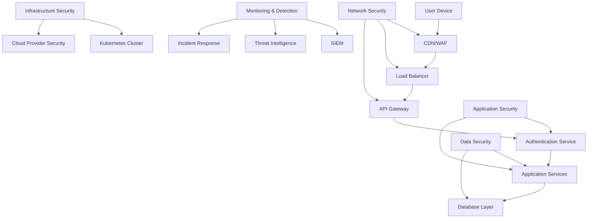
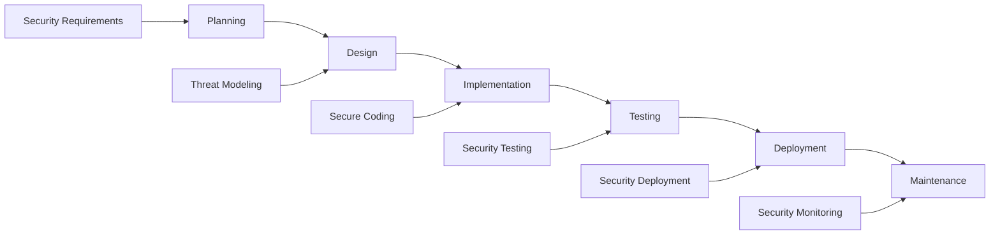

# Security Overview
## Financy Security Architecture & Strategy

**Version**: 1.0  
**Last Updated**: 2025-10-19  
**Classification**: Internal  
**Owner**: Security Team  

---

## Executive Summary

Financy implements a comprehensive security-first approach to protect sensitive financial data and ensure user privacy. Our security architecture follows industry best practices, regulatory compliance requirements, and defense-in-depth principles.

### Security Pillars
1. **Data Protection**: End-to-end encryption, secure storage, and privacy-by-design
2. **Access Control**: Multi-factor authentication, role-based permissions, and zero-trust principles
3. **Threat Detection**: Real-time monitoring, anomaly detection, and incident response
4. **Compliance**: LGPD, PCI DSS, SOC 2, and international privacy standards
5. **Operational Security**: Secure development lifecycle, infrastructure hardening, and business continuity

---

## Threat Model

### Assets Classification
```typescript
interface AssetClassification {
  asset_type: 'data' | 'system' | 'process' | 'people';
  sensitivity_level: 'public' | 'internal' | 'confidential' | 'restricted';
  regulatory_scope: string[];
  business_impact: 'low' | 'medium' | 'high' | 'critical';
}

const CRITICAL_ASSETS: AssetClassification[] = [
  {
    asset_type: 'data',
    sensitivity_level: 'restricted',
    regulatory_scope: ['LGPD', 'PCI_DSS'],
    business_impact: 'critical'
  },
  // User financial transaction data
  {
    asset_type: 'data',
    sensitivity_level: 'restricted', 
    regulatory_scope: ['LGPD', 'BACEN'],
    business_impact: 'critical'
  },
  // User authentication credentials
  {
    asset_type: 'data',
    sensitivity_level: 'restricted',
    regulatory_scope: ['LGPD'],
    business_impact: 'critical'
  }
];
```

### Threat Actors & Attack Vectors
1. **External Attackers**
   - Financial criminals seeking transaction data
   - Nation-state actors targeting financial infrastructure
   - Cybercriminals conducting ransomware attacks
   - Script kiddies attempting automated attacks

2. **Internal Threats**
   - Malicious insiders with privileged access
   - Compromised employee credentials
   - Unintentional data exposure by staff

3. **Supply Chain Attacks**
   - Compromised third-party integrations
   - Malicious packages in dependencies
   - Cloud provider security incidents

### Risk Assessment Matrix
| Threat | Likelihood | Impact | Risk Level | Mitigation Priority |
|--------|------------|--------|------------|-------------------|
| Data breach via API vulnerability | Medium | Critical | High | P0 |
| Credential stuffing attacks | High | High | High | P0 |
| Insider data theft | Low | Critical | Medium | P1 |
| DDoS attacks | Medium | Medium | Medium | P1 |
| Supply chain compromise | Low | High | Medium | P1 |

---

## Security Architecture

### Defense in Depth Strategy


### Security Controls Framework
1. **Preventive Controls**
   - Multi-factor authentication (MFA)
   - Role-based access control (RBAC)
   - Input validation and sanitization
   - Network segmentation
   - Encryption at rest and in transit

2. **Detective Controls**
   - Security Information and Event Management (SIEM)
   - Intrusion detection systems (IDS)
   - Behavioral analytics
   - Vulnerability scanning
   - Security metrics and KPIs

3. **Corrective Controls**
   - Incident response procedures
   - Automated threat remediation
   - Backup and recovery systems
   - Business continuity planning
   - Forensic capabilities

---

## Identity & Access Management

### Authentication Architecture
```typescript
interface AuthenticationFlow {
  primary_method: 'password' | 'biometric' | 'sso';
  mfa_required: boolean;
  mfa_methods: string[];
  session_management: SessionConfig;
  risk_assessment: RiskFactors;
}

const AUTHENTICATION_POLICY: AuthenticationFlow = {
  primary_method: 'password',
  mfa_required: true,
  mfa_methods: ['totp', 'sms', 'push_notification', 'biometric'],
  session_management: {
    max_session_duration: '8h',
    idle_timeout: '30m',
    concurrent_sessions_limit: 5,
    device_binding: true
  },
  risk_assessment: {
    geo_location: true,
    device_fingerprinting: true,
    behavioral_analysis: true,
    threat_intelligence: true
  }
};
```

### Authorization Model
```typescript
interface Permission {
  resource: string;
  action: string;
  context_filters?: Record<string, any>;
  conditions?: PermissionCondition[];
}

interface Role {
  name: string;
  description: string;
  permissions: Permission[];
  inheritance: string[];
  constraints: RoleConstraint[];
}

const RBAC_ROLES: Role[] = [
  {
    name: 'context_owner',
    description: 'Full control over financial context',
    permissions: [
      { resource: 'context', action: '*' },
      { resource: 'transaction', action: '*', context_filters: { owner: true } },
      { resource: 'member', action: '*', context_filters: { owner: true } }
    ],
    inheritance: [],
    constraints: [
      { type: 'context_limit', value: 10 },
      { type: 'member_limit', value: 50 }
    ]
  },
  {
    name: 'context_admin',
    description: 'Administrative access to context',
    permissions: [
      { resource: 'transaction', action: ['read', 'create', 'update'] },
      { resource: 'member', action: ['read', 'invite'] },
      { resource: 'context', action: ['read', 'update'] }
    ],
    inheritance: ['context_member'],
    constraints: []
  },
  {
    name: 'context_member',
    description: 'Standard member access',
    permissions: [
      { resource: 'transaction', action: ['read', 'create'] },
      { resource: 'context', action: ['read'] }
    ],
    inheritance: [],
    constraints: []
  }
];
```

### Zero Trust Implementation
1. **Never Trust, Always Verify**
   - Continuous authentication and authorization
   - Device compliance verification
   - Network micro-segmentation
   - Least privilege access

2. **Verify Explicitly**
   - Identity verification at every access point
   - Device health assessment
   - Location and behavioral validation
   - Risk-based access decisions

3. **Assume Breach**
   - Continuous monitoring and detection
   - Lateral movement prevention
   - Data loss prevention (DLP)
   - Incident response automation

---

## Data Protection

### Encryption Strategy
```typescript
interface EncryptionConfig {
  algorithm: string;
  key_size: number;
  key_management: KeyManagementConfig;
  rotation_policy: RotationPolicy;
}

const ENCRYPTION_STANDARDS = {
  data_at_rest: {
    algorithm: 'AES-256-GCM',
    key_size: 256,
    key_management: {
      provider: 'AWS_KMS',
      hsm_backed: true,
      multi_region: true
    },
    rotation_policy: {
      automatic: true,
      frequency: '365d',
      notification: true
    }
  },
  data_in_transit: {
    algorithm: 'TLS_1.3',
    cipher_suites: [
      'TLS_AES_256_GCM_SHA384',
      'TLS_CHACHA20_POLY1305_SHA256'
    ],
    certificate_pinning: true,
    hsts_enabled: true
  },
  application_level: {
    algorithm: 'AES-256-GCM',
    field_level_encryption: [
      'user.email',
      'user.phone_number',
      'transaction.merchant_name',
      'transaction.description'
    ],
    key_derivation: 'PBKDF2_SHA256'
  }
};
```

### Data Classification & Handling
```typescript
interface DataClassification {
  level: 'public' | 'internal' | 'confidential' | 'restricted';
  retention_period: string;
  encryption_required: boolean;
  access_logging: boolean;
  geographic_restrictions: string[];
  disposal_method: string;
}

const DATA_CLASSIFICATION_POLICY: Record<string, DataClassification> = {
  'user_pii': {
    level: 'restricted',
    retention_period: '7y', // LGPD compliance
    encryption_required: true,
    access_logging: true,
    geographic_restrictions: ['BR', 'US', 'EU'],
    disposal_method: 'crypto_shredding'
  },
  'financial_transactions': {
    level: 'restricted',
    retention_period: '10y', // Financial regulation compliance
    encryption_required: true,
    access_logging: true,
    geographic_restrictions: ['BR'],
    disposal_method: 'secure_deletion'
  },
  'system_logs': {
    level: 'internal',
    retention_period: '2y',
    encryption_required: true,
    access_logging: false,
    geographic_restrictions: [],
    disposal_method: 'standard_deletion'
  }
};
```

### Privacy by Design
1. **Data Minimization**
   - Collect only necessary data
   - Purpose limitation enforcement
   - Automated data lifecycle management
   - Regular data audits

2. **User Control**
   - Granular privacy settings
   - Data portability (LGPD Article 18)
   - Right to erasure implementation
   - Consent management platform

3. **Transparency**
   - Clear privacy notices
   - Data processing activity records
   - Regular privacy impact assessments
   - User-friendly privacy dashboard

---

## Application Security

### Secure Development Lifecycle (SDLC)


### Security Testing Strategy
1. **Static Application Security Testing (SAST)**
   - Code vulnerability scanning
   - Dependency vulnerability assessment
   - Infrastructure as Code (IaC) scanning
   - Security linting and rules

2. **Dynamic Application Security Testing (DAST)**
   - Runtime vulnerability assessment
   - API security testing
   - Penetration testing
   - Fuzzing and stress testing

3. **Interactive Application Security Testing (IAST)**
   - Real-time vulnerability detection
   - Behavioral analysis during testing
   - False positive reduction
   - Performance impact monitoring

### API Security Framework
```typescript
interface APISecurityConfig {
  authentication: AuthMethod[];
  rate_limiting: RateLimitConfig;
  input_validation: ValidationConfig;
  output_filtering: FilterConfig;
  monitoring: MonitoringConfig;
}

const API_SECURITY_STANDARDS: APISecurityConfig = {
  authentication: [
    { method: 'jwt', required: true },
    { method: 'api_key', required: false },
    { method: 'oauth2', required: false }
  ],
  rate_limiting: {
    global: { requests: 10000, window: '1h' },
    per_user: { requests: 1000, window: '1h' },
    per_endpoint: {
      '/auth/login': { requests: 10, window: '1m' },
      '/transactions': { requests: 100, window: '1m' }
    }
  },
  input_validation: {
    schema_validation: true,
    sanitization: true,
    size_limits: true,
    content_type_validation: true
  },
  output_filtering: {
    sensitive_data_redaction: true,
    error_message_sanitization: true,
    response_headers_filtering: true
  },
  monitoring: {
    request_logging: true,
    performance_metrics: true,
    security_events: true,
    anomaly_detection: true
  }
};
```

---

## Infrastructure Security

### Container Security
```yaml
# Security context for Kubernetes pods
apiVersion: v1
kind: SecurityPolicy
metadata:
  name: financy-security-policy
spec:
  runAsNonRoot: true
  runAsUser: 10001
  runAsGroup: 10001
  fsGroup: 10001
  seccompProfile:
    type: RuntimeDefault
  capabilities:
    drop:
      - ALL
  readOnlyRootFilesystem: true
  allowPrivilegeEscalation: false
  resources:
    limits:
      memory: "512Mi"
      cpu: "500m"
    requests:
      memory: "256Mi"
      cpu: "250m"
```

### Network Security
```typescript
interface NetworkSecurityConfig {
  segmentation: NetworkSegment[];
  firewall_rules: FirewallRule[];
  monitoring: NetworkMonitoring;
}

const NETWORK_SECURITY: NetworkSecurityConfig = {
  segmentation: [
    {
      name: 'dmz',
      purpose: 'External-facing services',
      allowed_traffic: ['https', 'http'],
      isolation_level: 'high'
    },
    {
      name: 'application',
      purpose: 'Application services',
      allowed_traffic: ['app_ports'],
      isolation_level: 'medium'
    },
    {
      name: 'database',
      purpose: 'Data storage',
      allowed_traffic: ['postgres', 'redis'],
      isolation_level: 'maximum'
    }
  ],
  firewall_rules: [
    {
      source: 'internet',
      destination: 'dmz',
      ports: [443, 80],
      protocol: 'tcp',
      action: 'allow'
    },
    {
      source: 'dmz',
      destination: 'application',
      ports: [8080],
      protocol: 'tcp',
      action: 'allow'
    }
  ],
  monitoring: {
    intrusion_detection: true,
    traffic_analysis: true,
    geo_blocking: ['CN', 'RU', 'KP'],
    ddos_protection: true
  }
};
```

### Cloud Security Configuration
```typescript
interface CloudSecurityConfig {
  aws: AWSSecurityConfig;
  kubernetes: K8sSecurityConfig;
  monitoring: CloudMonitoring;
}

const CLOUD_SECURITY: CloudSecurityConfig = {
  aws: {
    account_security: {
      cloudtrail_enabled: true,
      config_enabled: true,
      guardduty_enabled: true,
      security_hub_enabled: true
    },
    vpc_security: {
      flow_logs_enabled: true,
      nat_gateway_required: true,
      private_subnets_only: true,
      nacl_restrictions: true
    },
    iam_security: {
      mfa_required: true,
      password_policy: 'strict',
      access_analyzer: true,
      unused_access_removal: '90d'
    }
  },
  kubernetes: {
    rbac_enabled: true,
    network_policies: true,
    pod_security_standards: 'restricted',
    admission_controllers: [
      'PodSecurityPolicy',
      'ImagePolicyWebhook',
      'OPA'
    ]
  },
  monitoring: {
    security_events: true,
    compliance_monitoring: true,
    cost_anomaly_detection: true,
    resource_configuration_drift: true
  }
};
```

This security overview establishes the foundation for comprehensive security documentation, covering threat modeling, architecture, and key security controls for the Financy platform.