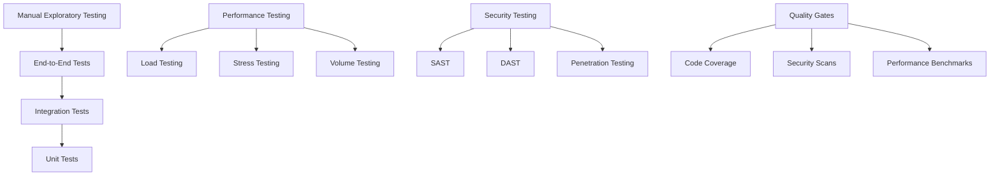

# Testing Strategy
## Financy Comprehensive Quality Assurance Framework

**Version**: 1.0  
**Last Updated**: 2025-10-19  
**Scope**: Complete testing strategy, methodologies, and quality assurance processes  

---

## Overview

Financy's testing strategy ensures high-quality, reliable, and secure financial software through comprehensive testing at all levels. Our approach emphasizes automated testing, continuous integration, and risk-based testing for financial data accuracy and user trust.

### Testing Principles
1. **Test-Driven Development (TDD)**: Write tests before implementation
2. **Shift-Left Testing**: Early defect detection and prevention
3. **Risk-Based Testing**: Focus on high-impact financial operations
4. **Automation-First**: Maximize automated test coverage
5. **Continuous Testing**: Integrated into CI/CD pipelines
6. **Data Accuracy**: Rigorous validation of financial calculations
7. **Security Testing**: Comprehensive security validation at all layers

---

## Testing Pyramid & Strategy

### Testing Levels Architecture


### Testing Pyramid Distribution
```typescript
interface TestingPyramid {
  test_level: TestLevel;
  percentage_of_total: number;
  execution_frequency: ExecutionFrequency;
  automation_level: number; // 0-100%
  ownership: TestOwnership;
  tools: string[];
  coverage_target: number; // 0-100%
}

type TestLevel = 'unit' | 'integration' | 'api' | 'ui' | 'e2e' | 'manual';
type ExecutionFrequency = 'every_commit' | 'every_merge' | 'daily' | 'weekly' | 'release';
type TestOwnership = 'developers' | 'qa_engineers' | 'sre_team' | 'security_team';

const TESTING_PYRAMID: TestingPyramid[] = [
  {
    test_level: 'unit',
    percentage_of_total: 70,
    execution_frequency: 'every_commit',
    automation_level: 100,
    ownership: 'developers',
    tools: ['Jest', 'Vitest', 'JUnit', 'pytest'],
    coverage_target: 90
  },
  {
    test_level: 'integration',
    percentage_of_total: 20,
    execution_frequency: 'every_commit',
    automation_level: 100,
    ownership: 'developers',
    tools: ['Testcontainers', 'Docker Compose', 'Supertest'],
    coverage_target: 80
  },
  {
    test_level: 'api',
    percentage_of_total: 5,
    execution_frequency: 'every_merge',
    automation_level: 100,
    ownership: 'qa_engineers',
    tools: ['Postman', 'Newman', 'REST Assured', 'Karate'],
    coverage_target: 95
  },
  {
    test_level: 'ui',
    percentage_of_total: 3,
    execution_frequency: 'daily',
    automation_level: 90,
    ownership: 'qa_engineers',
    tools: ['Playwright', 'Cypress', 'Selenium'],
    coverage_target: 70
  },
  {
    test_level: 'e2e',
    percentage_of_total: 1.5,
    execution_frequency: 'weekly',
    automation_level: 80,
    ownership: 'qa_engineers',
    tools: ['Playwright', 'Cucumber', 'TestCafe'],
    coverage_target: 60
  },
  {
    test_level: 'manual',
    percentage_of_total: 0.5,
    execution_frequency: 'release',
    automation_level: 0,
    ownership: 'qa_engineers',
    tools: ['Manual Testing', 'Exploratory Testing'],
    coverage_target: 100
  }
];
```

### Financial Domain Testing Requirements
```typescript
interface FinancialTestingRequirements {
  calculation_accuracy: AccuracyRequirement;
  currency_handling: CurrencyTestRequirement;
  transaction_integrity: IntegrityRequirement;
  regulatory_compliance: ComplianceTestRequirement;
  data_privacy: PrivacyTestRequirement;
}

const FINANCIAL_TESTING_REQUIREMENTS: FinancialTestingRequirements = {
  calculation_accuracy: {
    decimal_precision: 4, // 4 decimal places for currencies
    rounding_strategy: 'bankers_rounding',
    tolerance: 0.0001,
    validation_methods: ['property_based_testing', 'equivalence_partitioning'],
    test_data_sets: ['edge_cases', 'boundary_values', 'currency_conversions']
  },
  currency_handling: {
    supported_currencies: ['BRL', 'USD', 'EUR', 'GBP'],
    conversion_accuracy: 0.01, // 1 cent tolerance
    exchange_rate_validation: true,
    multi_currency_scenarios: true,
    currency_display_formats: ['pt-BR', 'en-US', 'en-GB']
  },
  transaction_integrity: {
    acid_compliance: true,
    double_entry_validation: true,
    balance_reconciliation: true,
    audit_trail_completeness: true,
    rollback_scenarios: true
  },
  regulatory_compliance: {
    lgpd_data_handling: true,
    gdpr_compliance: true,
    financial_record_retention: true,
    audit_log_integrity: true,
    data_anonymization: true
  },
  data_privacy: {
    pii_encryption_validation: true,
    access_control_testing: true,
    data_masking_verification: true,
    consent_management_testing: true,
    data_deletion_verification: true
  }
};
```

---

## Unit Testing Framework

### Unit Test Structure & Standards
```typescript
interface UnitTestStandards {
  naming_convention: NamingConvention;
  test_structure: TestStructure;
  assertion_patterns: AssertionPattern[];
  mocking_strategy: MockingStrategy;
  data_generation: DataGenerationStrategy;
}

const UNIT_TEST_STANDARDS: UnitTestStandards = {
  naming_convention: {
    test_file_suffix: '.test.ts',
    test_function_pattern: 'should_{expected_behavior}_when_{condition}',
    describe_block_pattern: '{ClassName}_{MethodName}',
    example: 'should_calculate_correct_total_when_multiple_transactions_provided'
  },
  test_structure: {
    pattern: 'AAA', // Arrange, Act, Assert
    setup_method: 'beforeEach',
    teardown_method: 'afterEach',
    test_isolation: true,
    shared_fixtures: false
  },
  assertion_patterns: [
    {
      type: 'equality',
      usage: 'exact_value_comparison',
      example: 'expect(result).toBe(expectedValue)'
    },
    {
      type: 'approximation',
      usage: 'financial_calculations',
      example: 'expect(result).toBeCloseTo(expectedValue, 4)'
    },
    {
      type: 'shape_matching',
      usage: 'object_validation',
      example: 'expect(result).toMatchObject(expectedShape)'
    }
  ],
  mocking_strategy: {
    external_services: 'always_mock',
    database_calls: 'mock_with_testcontainers',
    time_dependencies: 'inject_clock',
    random_values: 'deterministic_seeds'
  },
  data_generation: {
    strategy: 'property_based_testing',
    libraries: ['fast-check', 'faker.js'],
    financial_data_generators: ['currency_amounts', 'transaction_dates', 'exchange_rates']
  }
};
```

### Financial Calculation Testing
```typescript
// Example: Currency conversion unit tests
describe('CurrencyConversionService_convertAmount', () => {
  let currencyService: CurrencyConversionService;
  let mockExchangeRateProvider: jest.Mocked<ExchangeRateProvider>;
  
  beforeEach(() => {
    mockExchangeRateProvider = createMockExchangeRateProvider();
    currencyService = new CurrencyConversionService(mockExchangeRateProvider);
  });
  
  describe('when_converting_between_different_currencies', () => {
    it('should_return_accurate_converted_amount_with_proper_rounding', async () => {
      // Arrange
      const amount = 100.00;
      const fromCurrency = 'USD';
      const toCurrency = 'BRL';
      const exchangeRate = 5.1234;
      const expectedAmount = 512.34; // Rounded to 2 decimal places
      
      mockExchangeRateProvider.getRate.mockResolvedValue({
        from: fromCurrency,
        to: toCurrency,
        rate: exchangeRate,
        timestamp: new Date()
      });
      
      // Act
      const result = await currencyService.convertAmount(amount, fromCurrency, toCurrency);
      
      // Assert
      expect(result.convertedAmount).toBeCloseTo(expectedAmount, 2);
      expect(result.exchangeRate).toBe(exchangeRate);
      expect(result.originalAmount).toBe(amount);
      expect(mockExchangeRateProvider.getRate).toHaveBeenCalledWith(fromCurrency, toCurrency);
    });
    
    it('should_handle_precision_correctly_for_high_value_transactions', async () => {
      // Arrange
      const amount = 999999.99;
      const fromCurrency = 'BRL';
      const toCurrency = 'USD';
      const exchangeRate = 0.19876;
      
      mockExchangeRateProvider.getRate.mockResolvedValue({
        from: fromCurrency,
        to: toCurrency,
        rate: exchangeRate,
        timestamp: new Date()
      });
      
      // Act
      const result = await currencyService.convertAmount(amount, fromCurrency, toCurrency);
      
      // Assert
      expect(result.convertedAmount).toBeDefined();
      expect(result.convertedAmount).toBeGreaterThan(0);
      expect(Number.isFinite(result.convertedAmount)).toBe(true);
      // Verify no precision loss in calculation
      expect(result.convertedAmount).toBeCloseTo(amount * exchangeRate, 4);
    });
  });
  
  describe('when_converting_same_currency', () => {
    it('should_return_original_amount_without_calling_exchange_rate_provider', async () => {
      // Arrange
      const amount = 150.75;
      const currency = 'BRL';
      
      // Act
      const result = await currencyService.convertAmount(amount, currency, currency);
      
      // Assert
      expect(result.convertedAmount).toBe(amount);
      expect(result.exchangeRate).toBe(1.0);
      expect(mockExchangeRateProvider.getRate).not.toHaveBeenCalled();
    });
  });
  
  describe('when_exchange_rate_provider_fails', () => {
    it('should_throw_descriptive_error_with_retry_suggestion', async () => {
      // Arrange
      const amount = 100.00;
      const fromCurrency = 'USD';
      const toCurrency = 'BRL';
      
      mockExchangeRateProvider.getRate.mockRejectedValue(
        new Error('Exchange rate service unavailable')
      );
      
      // Act & Assert
      await expect(
        currencyService.convertAmount(amount, fromCurrency, toCurrency)
      ).rejects.toThrow('Failed to convert currency: Exchange rate service unavailable');
    });
  });
});

// Property-based testing example for financial calculations
describe('TransactionCalculationService_property_based_tests', () => {
  it('should_maintain_total_balance_across_all_operations', () => {
    fc.assert(fc.property(
      fc.array(fc.record({
        amount: fc.float({ min: -10000, max: 10000, noNaN: true }),
        type: fc.constantFrom('income', 'expense'),
        currency: fc.constantFrom('BRL', 'USD', 'EUR')
      }), { minLength: 1, maxLength: 100 }),
      (transactions) => {
        // Arrange
        const calculator = new TransactionCalculationService();
        
        // Act
        const total = calculator.calculateTotal(transactions);
        const manualTotal = transactions.reduce((sum, tx) => {
          return sum + (tx.type === 'income' ? tx.amount : -tx.amount);
        }, 0);
        
        // Assert
        expect(total).toBeCloseTo(manualTotal, 4);
      }
    ));
  });
  
  it('should_handle_currency_conversion_commutativity', () => {
    fc.assert(fc.property(
      fc.float({ min: 1, max: 10000, noNaN: true }),
      fc.float({ min: 0.01, max: 100, noNaN: true }),
      (amount, exchangeRate) => {
        // Arrange
        const converter = new CurrencyConversionService();
        
        // Act
        const converted = converter.convertWithRate(amount, exchangeRate);
        const convertedBack = converter.convertWithRate(converted, 1 / exchangeRate);
        
        // Assert - Should return to original amount (within tolerance)
        expect(convertedBack).toBeCloseTo(amount, 2);
      }
    ));
  });
});
```

### AI/ML Model Testing
```typescript
describe('AITransactionCategorizationService', () => {
  let aiService: AITransactionCategorizationService;
  let mockModelProvider: jest.Mocked<ModelProvider>;
  
  beforeEach(() => {
    mockModelProvider = createMockModelProvider();
    aiService = new AITransactionCategorizationService(mockModelProvider);
  });
  
  describe('when_categorizing_transaction_description', () => {
    it('should_return_high_confidence_for_clear_patterns', async () => {
      // Arrange
      const transactionDescription = 'UBER *TRIP 123 SAO PAULO BR';
      const expectedCategory = 'transport';
      const minimumConfidence = 0.8;
      
      mockModelProvider.predict.mockResolvedValue({
        prediction: expectedCategory,
        confidence: 0.92,
        alternatives: [
          { category: 'food', confidence: 0.05 },
          { category: 'entertainment', confidence: 0.03 }
        ]
      });
      
      // Act
      const result = await aiService.categorizeTransaction(transactionDescription);
      
      // Assert
      expect(result.category).toBe(expectedCategory);
      expect(result.confidence).toBeGreaterThanOrEqual(minimumConfidence);
      expect(result.alternatives).toBeDefined();
    });
    
    it('should_handle_ambiguous_descriptions_gracefully', async () => {
      // Arrange
      const ambiguousDescription = 'PAYMENT 123';
      
      mockModelProvider.predict.mockResolvedValue({
        prediction: 'other',
        confidence: 0.3,
        alternatives: [
          { category: 'bills', confidence: 0.25 },
          { category: 'transfer', confidence: 0.2 }
        ]
      });
      
      // Act
      const result = await aiService.categorizeTransaction(ambiguousDescription);
      
      // Assert
      expect(result.confidence).toBeLessThan(0.5);
      expect(result.requiresManualReview).toBe(true);
      expect(result.alternatives.length).toBeGreaterThan(0);
    });
    
    it('should_apply_user_context_for_improved_accuracy', async () => {
      // Arrange
      const description = 'COFFEE SHOP DOWNTOWN';
      const userContext = {
        recentCategories: ['food', 'coffee'],
        spendingPatterns: { coffee: 0.8, food: 0.6 },
        timeOfDay: '08:00'
      };
      
      mockModelProvider.predict.mockResolvedValue({
        prediction: 'food',
        confidence: 0.85,
        alternatives: []
      });
      
      // Act
      const result = await aiService.categorizeTransaction(description, userContext);
      
      // Assert
      expect(result.category).toBe('food');
      expect(mockModelProvider.predict).toHaveBeenCalledWith(
        description,
        expect.objectContaining(userContext)
      );
    });
  });
  
  describe('when_model_provider_is_unavailable', () => {
    it('should_fallback_to_rule_based_categorization', async () => {
      // Arrange
      const description = 'GROCERY STORE RECEIPT';
      
      mockModelProvider.predict.mockRejectedValue(new Error('Model service unavailable'));
      
      // Act
      const result = await aiService.categorizeTransaction(description);
      
      // Assert
      expect(result.category).toBe('groceries'); // Rule-based fallback
      expect(result.confidence).toBeLessThan(0.7); // Lower confidence for fallback
      expect(result.source).toBe('rule_based_fallback');
    });
  });
});
```

---

## Integration Testing Strategy

### Database Integration Tests
```typescript
describe('TransactionRepository_Integration', () => {
  let repository: TransactionRepository;
  let database: TestDatabase;
  let testUser: User;
  let testContext: Context;
  
  beforeAll(async () => {
    // Setup test database with Testcontainers
    database = await TestDatabase.create({
      image: 'postgres:15',
      environment: {
        POSTGRES_DB: 'financy_test',
        POSTGRES_USER: 'test',
        POSTGRES_PASSWORD: 'test'
      }
    });
    
    repository = new TransactionRepository(database.getConnection());
  });
  
  beforeEach(async () => {
    // Clean database and setup test data
    await database.clean();
    testUser = await database.createTestUser();
    testContext = await database.createTestContext(testUser.id);
  });
  
  afterAll(async () => {
    await database.stop();
  });
  
  describe('when_creating_transaction', () => {
    it('should_persist_transaction_with_all_attributes', async () => {
      // Arrange
      const transactionData: CreateTransactionDto = {
        amount: 45.50,
        currency_code: 'BRL',
        description: 'Coffee shop purchase',
        merchant_name: 'Café Central',
        category_id: 'cat_food_001',
        transaction_date: new Date('2025-10-19'),
        user_id: testUser.id,
        context_id: testContext.id
      };
      
      // Act
      const createdTransaction = await repository.create(transactionData);
      
      // Assert
      expect(createdTransaction.id).toBeDefined();
      expect(createdTransaction.amount).toBe(transactionData.amount);
      expect(createdTransaction.currency_code).toBe(transactionData.currency_code);
      expect(createdTransaction.description).toBe(transactionData.description);
      expect(createdTransaction.created_at).toBeDefined();
      expect(createdTransaction.updated_at).toBeDefined();
      
      // Verify in database
      const fromDb = await repository.findById(createdTransaction.id);
      expect(fromDb).toBeDefined();
      expect(fromDb.amount).toBe(transactionData.amount);
    });
    
    it('should_enforce_foreign_key_constraints', async () => {
      // Arrange
      const invalidTransactionData: CreateTransactionDto = {
        amount: 100.00,
        currency_code: 'BRL',
        description: 'Test transaction',
        user_id: 'invalid_user_id',
        context_id: testContext.id
      };
      
      // Act & Assert
      await expect(repository.create(invalidTransactionData))
        .rejects
        .toThrow('Foreign key constraint violation');
    });
    
    it('should_handle_concurrent_transactions_correctly', async () => {
      // Arrange
      const transactionPromises = Array.from({ length: 10 }, (_, index) => {
        return repository.create({
          amount: 10.00 + index,
          currency_code: 'BRL',
          description: `Transaction ${index}`,
          user_id: testUser.id,
          context_id: testContext.id
        });
      });
      
      // Act
      const results = await Promise.all(transactionPromises);
      
      // Assert
      expect(results).toHaveLength(10);
      expect(new Set(results.map(t => t.id)).size).toBe(10); // All unique IDs
      
      // Verify all transactions exist in database
      const allTransactions = await repository.findByContext(testContext.id);
      expect(allTransactions).toHaveLength(10);
    });
  });
  
  describe('when_querying_transactions', () => {
    beforeEach(async () => {
      // Create test transactions
      await database.seedTransactions(testContext.id, 50);
    });
    
    it('should_filter_by_date_range_correctly', async () => {
      // Arrange
      const startDate = new Date('2025-10-01');
      const endDate = new Date('2025-10-31');
      
      // Act
      const transactions = await repository.findByDateRange(
        testContext.id,
        startDate,
        endDate
      );
      
      // Assert
      expect(transactions.length).toBeGreaterThan(0);
      transactions.forEach(transaction => {
        expect(transaction.transaction_date >= startDate).toBe(true);
        expect(transaction.transaction_date <= endDate).toBe(true);
      });
    });
    
    it('should_paginate_large_result_sets', async () => {
      // Arrange
      const pageSize = 10;
      const pageNumber = 2;
      
      // Act
      const page = await repository.findPaginated(testContext.id, {
        page: pageNumber,
        limit: pageSize,
        sort: 'transaction_date',
        order: 'DESC'
      });
      
      // Assert
      expect(page.data).toHaveLength(pageSize);
      expect(page.meta.page).toBe(pageNumber);
      expect(page.meta.limit).toBe(pageSize);
      expect(page.meta.totalCount).toBeGreaterThan(pageSize);
      expect(page.meta.hasNextPage).toBeDefined();
    });
  });
  
  describe('when_updating_transaction', () => {
    it('should_maintain_audit_trail', async () => {
      // Arrange
      const originalTransaction = await repository.create({
        amount: 50.00,
        currency_code: 'BRL',
        description: 'Original description',
        user_id: testUser.id,
        context_id: testContext.id
      });
      
      const updateData = {
        amount: 55.00,
        description: 'Updated description'
      };
      
      // Act
      const updatedTransaction = await repository.update(originalTransaction.id, updateData);
      
      // Assert
      expect(updatedTransaction.amount).toBe(updateData.amount);
      expect(updatedTransaction.description).toBe(updateData.description);
      expect(updatedTransaction.updated_at).not.toBe(originalTransaction.updated_at);
      
      // Check audit trail
      const auditEntries = await repository.getAuditTrail(originalTransaction.id);
      expect(auditEntries).toHaveLength(2); // Create + Update
      expect(auditEntries[1].action).toBe('UPDATE');
      expect(auditEntries[1].changes).toMatchObject(updateData);
    });
  });
});
```

### API Integration Tests
```typescript
describe('TransactionAPI_Integration', () => {
  let app: TestApplication;
  let authToken: string;
  let testUser: User;
  let testContext: Context;
  
  beforeAll(async () => {
    app = await TestApplication.create();
    await app.start();
  });
  
  afterAll(async () => {
    await app.stop();
  });
  
  beforeEach(async () => {
    testUser = await app.createTestUser();
    testContext = await app.createTestContext(testUser.id);
    authToken = await app.generateAuthToken(testUser.id);
  });
  
  describe('POST /api/v1/contexts/:contextId/transactions', () => {
    it('should_create_transaction_and_return_201', async () => {
      // Arrange
      const transactionData = {
        amount: 75.50,
        currency_code: 'BRL',
        description: 'API test transaction',
        merchant_name: 'Test Merchant',
        category_id: 'cat_test_001',
        transaction_date: '2025-10-19'
      };
      
      // Act
      const response = await app.request()
        .post(`/api/v1/contexts/${testContext.id}/transactions`)
        .set('Authorization', `Bearer ${authToken}`)
        .send(transactionData);
      
      // Assert
      expect(response.status).toBe(201);
      expect(response.body.success).toBe(true);
      expect(response.body.data.id).toBeDefined();
      expect(response.body.data.amount).toBe(transactionData.amount);
      expect(response.body.data.currency_code).toBe(transactionData.currency_code);
      expect(response.body.data.status).toBe('confirmed');
    });
    
    it('should_validate_request_data_and_return_400_for_invalid_input', async () => {
      // Arrange
      const invalidData = {
        amount: 'invalid_amount',
        currency_code: 'INVALID',
        description: '' // Empty description
      };
      
      // Act
      const response = await app.request()
        .post(`/api/v1/contexts/${testContext.id}/transactions`)
        .set('Authorization', `Bearer ${authToken}`)
        .send(invalidData);
      
      // Assert
      expect(response.status).toBe(400);
      expect(response.body.success).toBe(false);
      expect(response.body.error.code).toBe('VALIDATION_ERROR');
      expect(response.body.error.details).toHaveProperty('amount');
      expect(response.body.error.details).toHaveProperty('currency_code');
      expect(response.body.error.details).toHaveProperty('description');
    });
    
    it('should_require_authentication_and_return_401', async () => {
      // Arrange
      const transactionData = {
        amount: 50.00,
        currency_code: 'BRL',
        description: 'Unauthorized test'
      };
      
      // Act
      const response = await app.request()
        .post(`/api/v1/contexts/${testContext.id}/transactions`)
        .send(transactionData);
      
      // Assert
      expect(response.status).toBe(401);
      expect(response.body.success).toBe(false);
      expect(response.body.error.code).toBe('AUTHENTICATION_REQUIRED');
    });
    
    it('should_enforce_context_access_permissions_and_return_403', async () => {
      // Arrange
      const otherUser = await app.createTestUser();
      const otherUserToken = await app.generateAuthToken(otherUser.id);
      
      const transactionData = {
        amount: 100.00,
        currency_code: 'BRL',
        description: 'Unauthorized context access'
      };
      
      // Act
      const response = await app.request()
        .post(`/api/v1/contexts/${testContext.id}/transactions`)
        .set('Authorization', `Bearer ${otherUserToken}`)
        .send(transactionData);
      
      // Assert
      expect(response.status).toBe(403);
      expect(response.body.success).toBe(false);
      expect(response.body.error.code).toBe('CONTEXT_ACCESS_DENIED');
    });
  });
  
  describe('GET /api/v1/contexts/:contextId/transactions', () => {
    beforeEach(async () => {
      // Seed test transactions
      await app.seedTransactions(testContext.id, 25);
    });
    
    it('should_return_paginated_transactions_with_metadata', async () => {
      // Act
      const response = await app.request()
        .get(`/api/v1/contexts/${testContext.id}/transactions`)
        .set('Authorization', `Bearer ${authToken}`)
        .query({ page: 1, limit: 10 });
      
      // Assert
      expect(response.status).toBe(200);
      expect(response.body.success).toBe(true);
      expect(response.body.data).toHaveLength(10);
      expect(response.body.pagination).toMatchObject({
        page: 1,
        limit: 10,
        totalCount: 25,
        totalPages: 3,
        hasNextPage: true,
        hasPreviousPage: false
      });
    });
    
    it('should_filter_by_date_range_correctly', async () => {
      // Arrange
      const startDate = '2025-10-01';
      const endDate = '2025-10-31';
      
      // Act
      const response = await app.request()
        .get(`/api/v1/contexts/${testContext.id}/transactions`)
        .set('Authorization', `Bearer ${authToken}`)
        .query({ startDate, endDate });
      
      // Assert
      expect(response.status).toBe(200);
      expect(response.body.success).toBe(true);
      response.body.data.forEach(transaction => {
        const transactionDate = new Date(transaction.transaction_date);
        expect(transactionDate >= new Date(startDate)).toBe(true);
        expect(transactionDate <= new Date(endDate)).toBe(true);
      });
    });
    
    it('should_respect_rate_limiting', async () => {
      // Arrange - Make multiple rapid requests
      const requests = Array.from({ length: 101 }, () =>
        app.request()
          .get(`/api/v1/contexts/${testContext.id}/transactions`)
          .set('Authorization', `Bearer ${authToken}`)
      );
      
      // Act
      const responses = await Promise.allSettled(requests);
      
      // Assert
      const rateLimitedResponses = responses.filter(
        result => result.status === 'fulfilled' && result.value.status === 429
      );
      
      expect(rateLimitedResponses.length).toBeGreaterThan(0);
    });
  });
});
```

This comprehensive testing strategy provides Financy with robust quality assurance processes, ensuring financial accuracy, security, and reliability through automated testing at all levels.