# User Flows
## Financy Core User Journey Flows

**Version**: 1.0  
**Last Updated**: 2025-10-18  
**Scope**: Complete user flows for all core features and user scenarios  

---

## Flow Categories

### Primary Flows
1. **Expense Addition Flows** - Core transaction creation workflows
2. **Context Management Flows** - Creating and managing financial contexts
3. **Collaboration Flows** - Shared context and family management
4. **Analysis Flows** - Dashboard usage and financial insights

### Secondary Flows
5. **Subscription Management Flows** - Recurring payment tracking
6. **Settlement Flows** - Shared expense reconciliation
7. **Error Recovery Flows** - Handling system and user errors
8. **Administrative Flows** - Settings, export, and account management

---

## 1. Expense Addition Flows

### Flow 1.1: Quick Text Expense Entry

**Trigger**: User wants to record a simple expense via messaging
**Primary Actor**: Any authenticated user
**Context**: Any active financial context

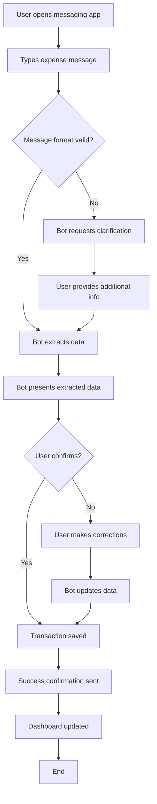

**Happy Path Steps**:
1. User types: "Almoço R$45 no restaurante japonês"
2. Bot responds: "✓ Entendi: R$45,00 em Alimentação. Confirma?"
3. User confirms with "sim" or ✓ reaction
4. Bot confirms: "Salvo! Seu gasto em Alimentação hoje: R$78,00"

**Alternative Paths**:
- **Ambiguous Amount**: "Gastei quarenta e cinco reais no almoço"
- **Missing Category**: "R$45 ontem" → Bot asks "Em que categoria?"
- **Multiple Items**: "R$45 almoço + R$8 café" → Bot creates two transactions

**Error Scenarios**:
- Invalid amount format → "Não consegui entender o valor. Pode repetir?"
- No amount mentioned → "Qual foi o valor gasto?"
- Unrecognized context → Bot asks for context clarification

---

### Flow 1.2: Voice Message Expense Entry

**Trigger**: User records voice message with expense information
**Primary Actor**: Any authenticated user
**Context**: Mobile usage scenario

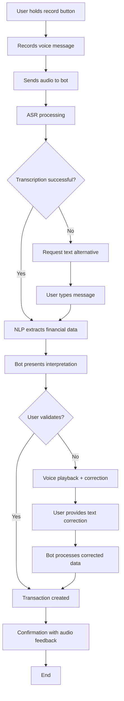

**Voice Message Examples**:
- "Acabei de pagar setenta reais na farmácia para os remédios da Maria"
- "Gasolina hoje foi noventa e cinco reais no posto da esquina"
- "Conta do cartão veio duzentos e trinta, vence dia quinze"

**Voice-Specific Considerations**:
- Background noise handling
- Multiple speakers/interruptions
- Regional accent adaptation
- Confidence scoring for transcription

---

### Flow 1.3: Receipt Photo Processing

**Trigger**: User photographs receipt or bill for expense recording
**Primary Actor**: Any authenticated user
**Context**: Post-purchase receipt capture

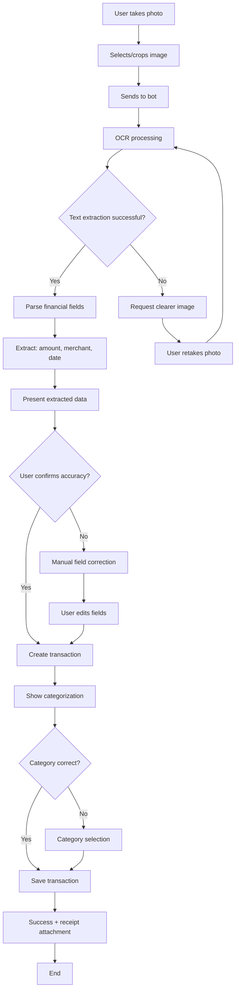

**OCR Field Extraction Priority**:
1. **Total Amount** (highest confidence required)
2. **Merchant Name** (for categorization)
3. **Date/Time** (transaction timestamp)
4. **Payment Method** (credit/debit card, cash)
5. **Line Items** (detailed breakdown if available)

**Photo Quality Requirements**:
- Minimum resolution for text recognition
- Lighting conditions guidance
- Receipt orientation detection
- Multi-receipt handling

---

### Flow 1.4: Installment Purchase Entry

**Trigger**: User makes purchase with installment payments
**Primary Actor**: Any authenticated user
**Context**: Credit card purchase or financing

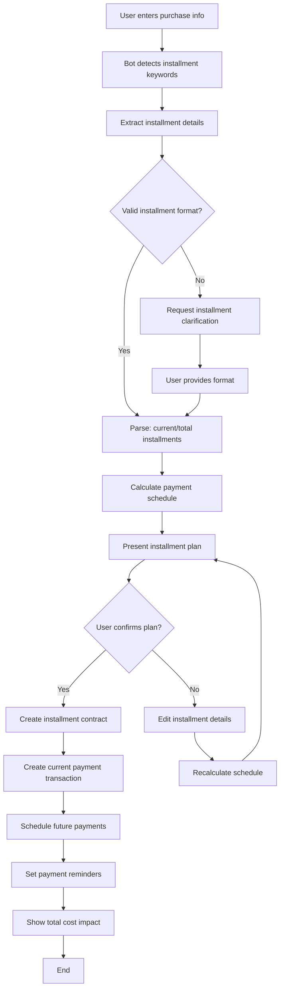

**Installment Input Examples**:
- "iPhone 12x de R$450, primeira parcela hoje"
- "Geladeira parcelada 10x R$180 (3/10)"
- "Cartão: R$1200 parcelei em 6x"

**Installment Management Features**:
- Payment schedule display
- Early payoff calculation
- Interest rate tracking
- Payment completion monitoring

---

## 2. Context Management Flows

### Flow 2.1: Shared Context Creation

**Trigger**: User wants to create shared financial space
**Primary Actor**: Context creator (owner)
**Context**: Multi-person expense management need

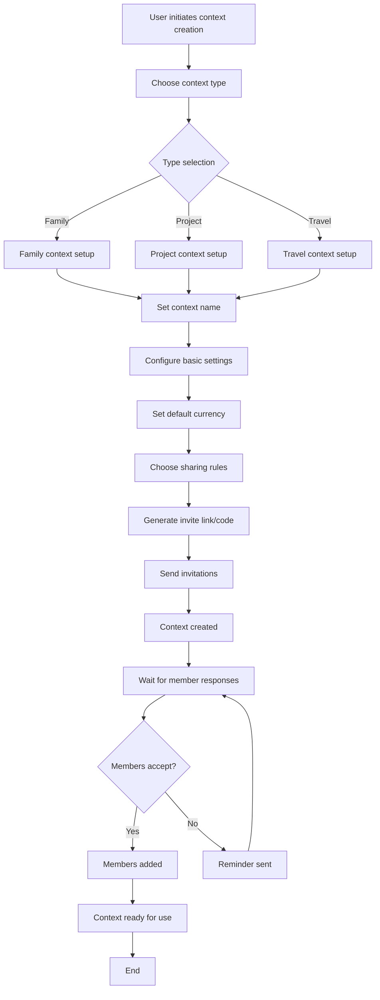

**Context Types & Settings**:

#### Family Context
- **Purpose**: Ongoing household expense management
- **Duration**: Permanent until explicitly closed
- **Default Categories**: Household bills, groceries, family activities
- **Sharing Rules**: Equal access, budget transparency

#### Project Context  
- **Purpose**: Specific project or event expense tracking
- **Duration**: Project lifecycle (with auto-archive option)
- **Default Categories**: Project-specific expense types
- **Sharing Rules**: Contribution-based access

#### Travel Context
- **Purpose**: Trip expense tracking and splitting
- **Duration**: Trip duration + settlement period
- **Default Categories**: Transportation, accommodation, food, activities
- **Sharing Rules**: Daily expense splitting, currency conversion

---

### Flow 2.2: Context Invitation & Joining

**Trigger**: User receives invitation to join shared context
**Primary Actor**: Invited user
**Context**: Collaboration invitation response

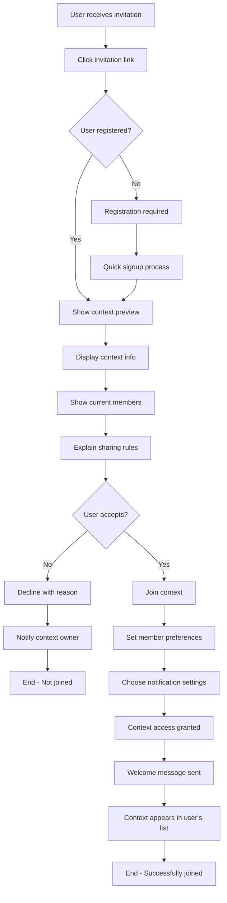

**Invitation Methods**:
- **Direct Link**: WhatsApp/Telegram shareable link
- **QR Code**: In-person invitation scanning
- **Phone Number**: Direct invitation to contact
- **Email**: Formal invitation with context details

**Joining Considerations**:
- Privacy implications explanation
- Data sharing boundaries
- Role assignments (viewer, contributor, admin)
- Notification preferences setup

---

## 3. Collaboration Flows

### Flow 3.1: Shared Expense Entry & Splitting

**Trigger**: User adds expense in shared context requiring split
**Primary Actor**: Context member
**Context**: Shared financial context

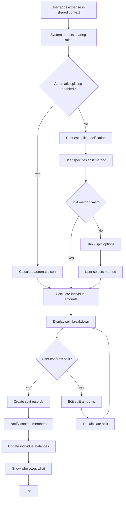

**Split Methods**:
- **Equal Split**: Total amount divided equally among all members
- **Proportional Split**: Based on pre-configured income ratios
- **Custom Split**: Manual amount specification per person
- **Percentage Split**: Percentage-based allocation
- **Exclude Members**: Some members don't participate in specific expense

**Split Notification Examples**:
- "João adicionou: Jantar R$120 (R$40 para cada)"
- "Maria pagou mercado R$180 - sua parte: R$60"
- "Conta dividida: João R$45, Ana R$30, Carlos R$45"

---

### Flow 3.2: Expense Settlement Process

**Trigger**: Context members need to settle shared expense balances
**Primary Actor**: Any context member
**Context**: Accumulated shared expenses requiring settlement

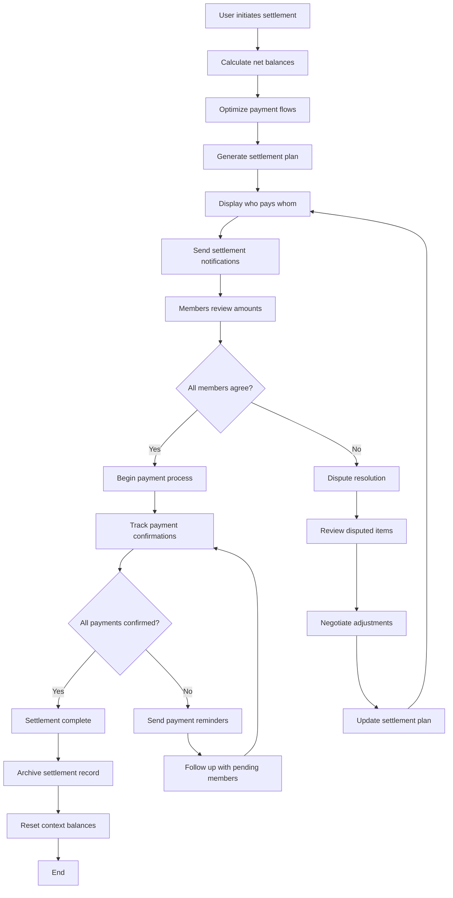

**Settlement Optimization**:
- **Minimize Transactions**: Reduce number of payments needed
- **Net Balance Calculation**: Who owes money vs who is owed
- **Payment Method Integration**: PIX, bank transfer, cash tracking
- **Partial Payment Support**: Incremental settlement over time

**Settlement Example**:
```
Before Settlement:
- João paid: R$300, owes: R$150 → João should receive R$150
- Ana paid: R$100, owes: R$200 → Ana owes R$100  
- Carlos paid: R$200, owes: R$250 → Carlos owes R$50

Optimized Settlement:
- Ana pays R$100 to João
- Carlos pays R$50 to João
- Zero additional transactions needed
```

---

## 4. Analysis & Dashboard Flows

### Flow 4.1: Monthly Financial Review

**Trigger**: User wants to understand monthly spending patterns
**Primary Actor**: Any authenticated user
**Context**: Personal or shared financial analysis

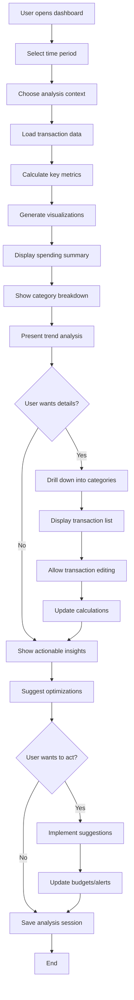

**Key Monthly Metrics**:
- **Income vs Expenses**: Net cash flow for the month
- **Category Spending**: Breakdown by expense categories  
- **Budget Progress**: Actual vs planned spending
- **Trend Comparison**: Month-over-month changes
- **Unusual Patterns**: Anomaly detection and alerts

**Actionable Insights Examples**:
- "Você gastou 40% mais em alimentação este mês"
- "3 assinaturas não foram usadas este mês: Netflix, Spotify, Gym"
- "Seus gastos com transporte aumentaram desde que mudou de trabalho"

---

### Flow 4.2: Budget Setup & Monitoring

**Trigger**: User wants to establish spending budgets
**Primary Actor**: Any authenticated user
**Context**: Financial planning and control

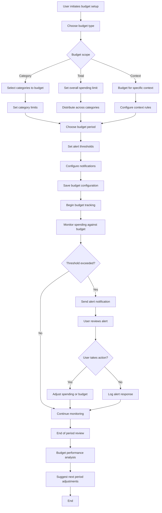

**Budget Types**:
- **Category Budget**: Individual limits per expense category
- **Total Monthly Budget**: Overall spending ceiling
- **Context Budget**: Shared context spending limits
- **Goal-Based Budget**: Saving towards specific objectives

**Alert Threshold Options**:
- **50% spent**: Early warning notification
- **75% spent**: Caution alert with spending pace
- **90% spent**: Urgent warning with projection
- **100% exceeded**: Budget breach notification

---

## 5. Subscription Management Flows

### Flow 5.1: Subscription Detection & Setup

**Trigger**: System identifies recurring payment pattern
**Primary Actor**: System (automated) with user confirmation
**Context**: Recurring expense pattern recognition

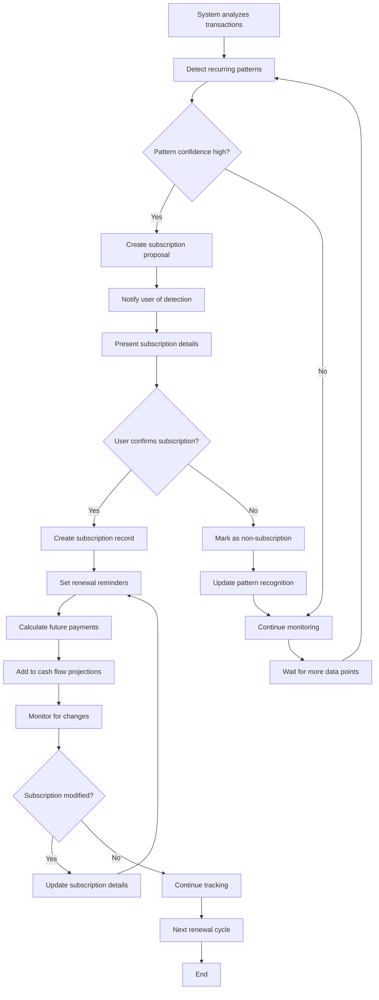

**Subscription Detection Criteria**:
- **Recurring Amount**: Same or similar amount charged repeatedly
- **Regular Interval**: Monthly, yearly, or other consistent timing
- **Merchant Consistency**: Same or related merchant name
- **Payment Method**: Same payment method used
- **Confidence Threshold**: Statistical confidence in pattern

**Subscription Types Detected**:
- **Entertainment**: Netflix, Spotify, YouTube Premium
- **Software**: Adobe, Microsoft 365, app subscriptions
- **Utilities**: Phone, internet, insurance payments
- **Fitness**: Gym memberships, fitness apps
- **Other Services**: Any recurring service charges

---

### Flow 5.2: Subscription Management & Optimization

**Trigger**: User wants to review and optimize subscriptions
**Primary Actor**: Any authenticated user
**Context**: Subscription portfolio management

```mermaid
flowchart TD
    A[User opens subscription dashboard] --> B[Display all active subscriptions]
    B --> C[Show usage data if available]
    C --> D[Calculate total monthly cost]
    D --> E[Highlight unused/underused services]
    E --> F[Present optimization suggestions]
    F --> G{User wants to optimize?}
    G -->|Yes| H[Review each subscription]
    G -->|No| I[Save current state]
    H --> J[Check usage patterns]
    J --> K{Subscription underused?}
    K -->|Yes| L[Suggest cancellation/downgrade]
    K -->|No| M[Continue to next subscription]
    L --> N{User agrees to cancel?}
    N -->|Yes| O[Initiate cancellation process]
    N -->|No| P[Mark as "keep despite low usage"]
    O --> Q[Set cancellation reminder]
    Q --> R[Update cash flow projections]
    R --> M
    P --> M
    M --> S{More subscriptions?}
    S -->|Yes| H
    S -->|No| T[Calculate optimization savings]
    T --> I
    I --> U[Update subscription tracking]
    U --> V[End]
```

**Optimization Suggestions**:
- **Unused Services**: Cancelled or paused subscriptions with no recent usage
- **Duplicate Services**: Multiple subscriptions in same category
- **Plan Downgrades**: Lower-tier plans for light usage
- **Annual vs Monthly**: Cost savings from annual billing
- **Family Plans**: Consolidation opportunities for households

---

## 6. Error Recovery Flows

### Flow 6.1: Message Parsing Error Recovery

**Trigger**: Bot cannot understand user's financial message
**Primary Actor**: User with system assistance
**Context**: Message processing failure

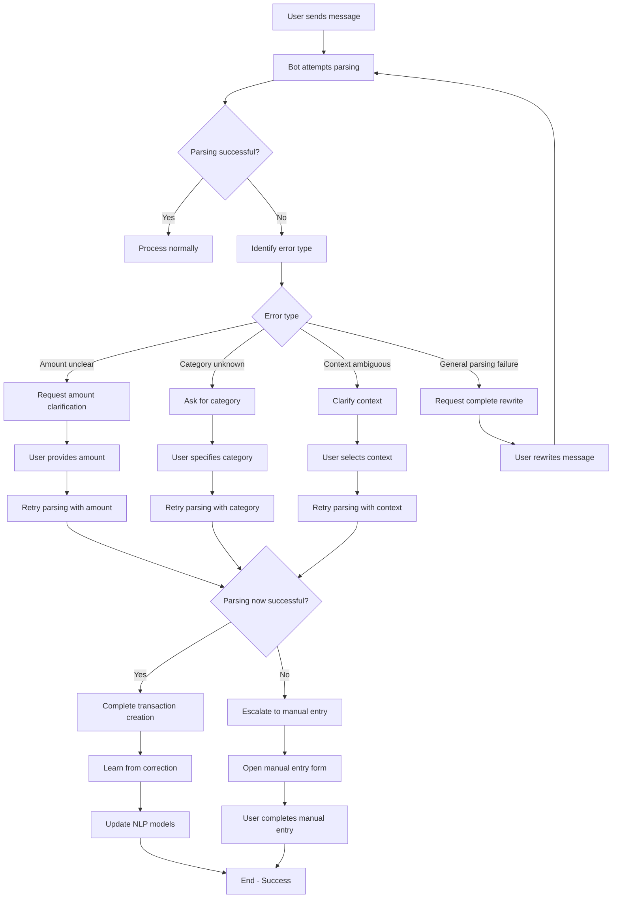

**Error Recovery Strategies**:
- **Guided Clarification**: Ask specific questions about unclear elements
- **Example Provision**: Show correctly formatted message examples
- **Manual Fallback**: Structured form entry when parsing fails
- **Learning Integration**: Use corrections to improve future parsing

**Common Error Patterns**:
- **Ambiguous Amounts**: "gastei uns cinquenta reais" → "Foram exatamente R$50?"
- **Missing Categories**: "paguei a conta" → "Qual tipo de conta? (luz, água, cartão)"
- **Complex Transactions**: Multiple items in single message → break down individually

---

### Flow 6.2: Data Synchronization Error Recovery

**Trigger**: Dashboard shows outdated data or sync conflicts
**Primary Actor**: System with user notification
**Context**: Data consistency issues

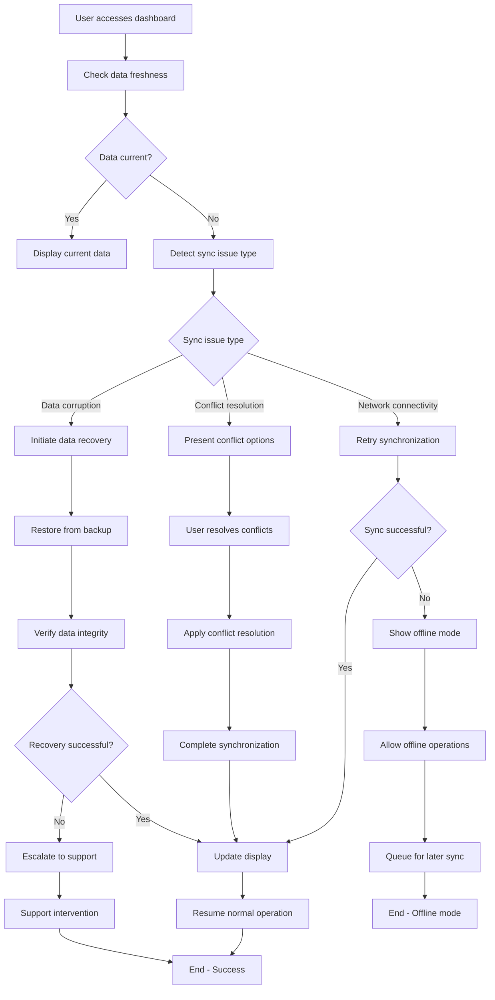

**Synchronization Scenarios**:
- **Offline Usage**: User adds expenses while offline, sync on reconnection
- **Multi-Device Conflicts**: Same user editing from different devices simultaneously
- **Context Conflicts**: Multiple users editing shared context data
- **System Maintenance**: Planned downtime with graceful degradation

---

## Flow Performance Requirements

### Response Time Targets
- **Message Processing**: <3 seconds from input to confirmation
- **Dashboard Loading**: <2 seconds for initial display
- **Context Switching**: <1 second for context change
- **Search Results**: <1 second for query results
- **Data Export**: <10 seconds for monthly data export

### User Experience Standards
- **Progress Indicators**: Show processing status for operations >2 seconds
- **Optimistic Updates**: Show changes immediately with background confirmation
- **Error Recovery**: Maximum 2 steps to recover from any error
- **Accessibility**: All flows keyboard navigable with screen reader support

### Success Metrics
- **Flow Completion Rate**: >95% for core flows
- **Error Recovery Rate**: >90% successful recovery from errors
- **User Satisfaction**: >4.5/5 for flow usability
- **Time to Value**: <5 minutes from signup to first successful transaction